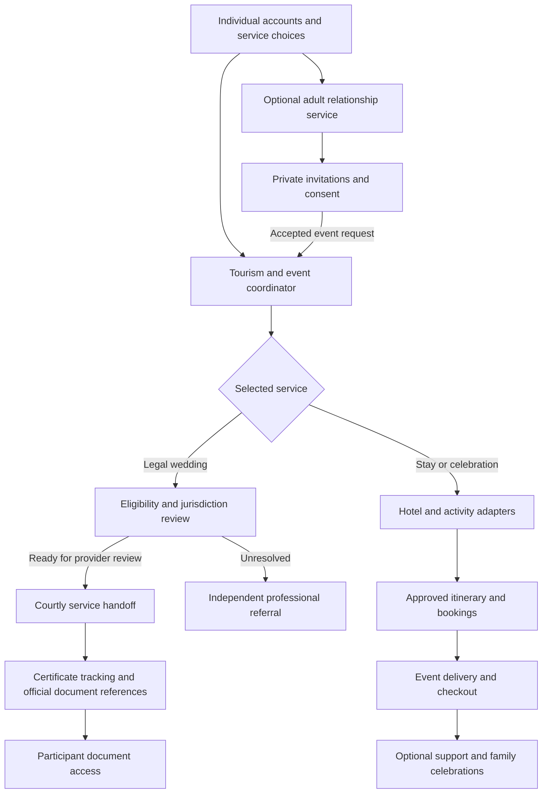
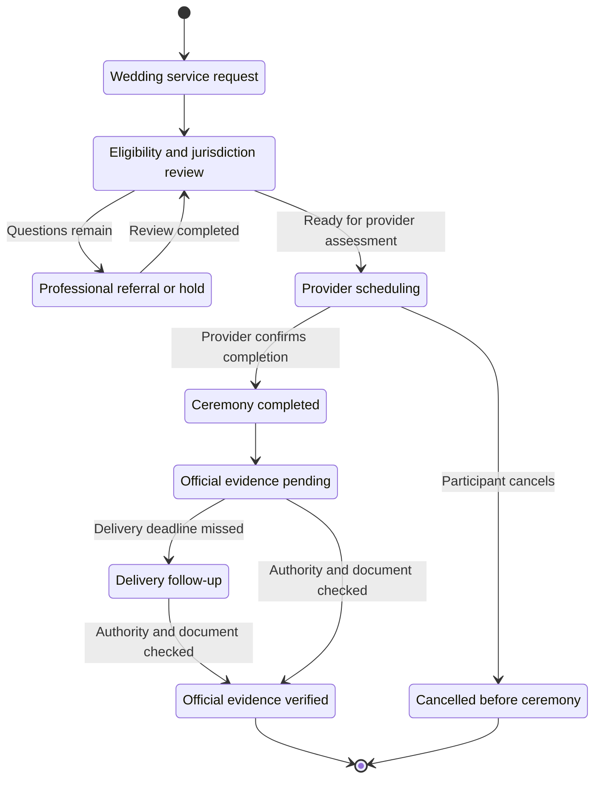

# JFXAI4MAD — Remote Wedding Tourism, Consensual Polyamory and Family Celebrations

**Expanded project concept and requirements baseline · 12 September 2026**  
**Repository:** `robotics-intelligent-systems/jfxai4mad`  
**Status:** Proposed extension, ready for product and architecture review. Provider integrations and commercial partnerships have not been implemented or established by this document.

## 1. Consolidated project description

JFXAI4MAD is an open-source platform connecting travel, culture, community discovery, social intelligence and professional collaboration. This expansion adds an optional personal-services domain for remote wedding coordination, wedding tourism, consensual polyamorous relationships, voluntarily shared accommodation and family celebrations.

The proposed service helps adults organize the experience they choose: a legal wedding for an eligible couple, a symbolic commitment ceremony, a private social gathering, a cultural or sporting itinerary, or a celebration welcoming a child. Shared accommodation is an individual choice within that itinerary. Relationship preferences, legal marital status and travel reservations are managed independently.

Courtly is a candidate external provider for remote wedding arrangements. Marriott properties and other suitable hotels are candidate accommodation and event venues. JFXAI4MAD coordinates availability, participant choices, documents and service follow-up; the relevant providers and public authorities remain responsible for their respective services and decisions.

The expansion includes **Marriage Certificate in 24 Hours**, an optional service for coordinating delivery of the official digital certified copy after the online ceremony, under the scope and provider conditions described in Section 3.

“Express marriage” describes streamlined administration and scheduling. It does not create a temporary marriage that expires after a hotel stay. The proposed next-day service is checkout, document follow-up and optional support, with any family-law process handled separately.

The objective concerning women in vulnerable circumstances is to improve access to independent information, private assistance and freedom to leave. Whether the service achieves that objective must be evaluated; marriage, polyamory and hotel accommodation do not themselves establish a protective outcome.

## 2. Integration with the actual repository

This consolidation uses `main` at commit `1d43f85e9f96c4cfd79c657d74649ea15f33de94`. The current README emphasizes professional marketing, university partnerships, volunteering and venture formation, alongside optional independent relationship services. Its tourism diagram provides the existing tourism/social, AI/RAG, consent and data architecture. [Repository README](https://github.com/robotics-intelligent-systems/jfxai4mad/blob/1d43f85e9f96c4cfd79c657d74649ea15f33de94/README.md), [tourism and social architecture](https://github.com/robotics-intelligent-systems/jfxai4mad/blob/1d43f85e9f96c4cfd79c657d74649ea15f33de94/MBSE/CAS/drawio/ai_tourism_social_architecture.drawio).

| Existing project domain | Expansion | Integration boundary |
|---|---|---|
| Tourism, hotels, activities and routes | Wedding trips, shared stays, receptions and cultural/sporting itineraries | Accommodation and activities remain independently bookable |
| Optional matchmaking and communities | Adult opt-in relationship preferences, including consensual polyamory | Personal enrollment and private data permissions |
| Experience and trust layer | Separate decisions about introductions, rooms, events, photography and document sharing | Consent is specific and withdrawable |
| AI orchestration, RAG and human review | Multilingual travel concierge, provider information and cited procedural guidance | Legal determinations go to qualified professionals or authorities |
| JFXAI4CRM, JFXAI4OHS and JFXBSC | Supplier management, tourism procurement and aggregate service metrics | Professional systems receive no intimate profiles |
| University, volunteer, venture and LinkedIn channels | Tourism-technology and hospitality partnerships | Participation in professional opportunities remains independent of personal relationships |

The extension belongs in the personal and tourism domains. The professional marketing infrastructure retains the purpose restrictions already documented by the project.

## 3. Verified capabilities and the legal correction

The following facts were checked against provider pages and official Utah sources. They are a reference baseline for product design, not an assessment of a particular couple's legal position.

| Topic | Verified baseline | Consequence for the concept |
|---|---|---|
| Remote wedding services | Courtly offers online wedding coordination and marriage documentation through Utah County. [Courtly](https://www.courtly.com/) | Model Courtly as a service provider, not as the civil registry |
| Digital certificate within 24 hours | Courtly's help center states that the digital certified copy is received within 24 hours after the online ceremony. [Courtly document timeline](https://help.courtly.com/en/articles/6890584-do-you-offer-rush-processing) | Show the post-ceremony clock, document format and confirmed package conditions |
| Marriage from another location | Utah County permits remote appearance and has no citizenship or residency requirement for issuing the license. The authorized officiant's physical presence in Utah establishes the location needed for the ceremony. [Utah County application information](https://clerk.utahcounty.gov/marriage-license/apply) | Participants may join from suitable accommodation, subject to provider arrangements and legal review where relevant |
| Ceremony participation | The county's remote ceremony uses video, a digital license and two adult witnesses; participants need to see and hear one another. [Utah County ceremonies](https://clerk.utahcounty.gov/marriage-license/ceremonies) | Confirm the selected officiant's arrangements, IDs, witnesses, time zones and connectivity |
| Foreign recognition | Utah County explicitly cautions that a remote marriage may be invalid in the parties' country of residence. [Official legal notice](https://clerk.utahcounty.gov/marriage-license/apply) | Assess recognition, registration and document requirements for the intended jurisdictions; an apostille is not a blanket recognition guarantee |
| Courtly divorce service | Courtly advertises filing in three days and a decree in 30–90 days. Its page describes uncontested cases and says it currently does not support couples with children. These are provider statements, not guaranteed court deadlines. [Courtly online divorce](https://www.courtly.com/online-divorce) | A booking cannot include a guaranteed next-day dissolution; cases involving children need a different professional pathway |
| Utah divorce process | The courts describe a general three-month county residency rule, other qualification routes, a 30-day waiting period that may be waived for extraordinary circumstances, and a decree signed by a judge. [Utah State Courts: divorce](https://www.utcourts.gov/en/self-help/case-categories/family/divorce.html) | Establish the competent forum and case eligibility; a Utah wedding alone is not sufficient information to determine the divorce route |
| Separation | Separate maintenance can address support, housing, property and children without filing for divorce. It does not dissolve the marriage. [Utah State Courts: separate maintenance](https://www.utcourts.gov/en/self-help/case-categories/family/divorce/separate-maintenance.html) | Keep separation support distinct from termination of legal marital status |
| Further legal marriage | Utah treats a marriage as void when a party is married to someone else or the divorce decree is not final. [Utah State Courts: marriage](https://www.utcourts.gov/en/self-help/case-categories/family/marriage.html) | A separation document or pending filing must not be used as clearance for another legal wedding |
| Hotel services | Marriott presents wedding venues, accommodation, receptions and event-planning services. [Marriott weddings](https://www.marriott.com/es/meeting-event-hotels/weddings.mi) | Treat each property as a potential supplier; confirm the specific event, occupancy, cancellation and venue conditions |

**There is no verified basis for offering a “separation certificate the next day” that authorizes another marriage.** JFXAI4MAD may issue a receipt showing that a stay or event ended, labeled **“Travel-service closure — no change to civil status.”** It must never present that receipt as an official family-law document.

### Marriage Certificate in 24 Hours

**Proposed service presentation:** “Marriage Certificate in 24 Hours — digital certified copy after your online ceremony, subject to the selected provider's confirmed conditions.” Participants can combine this service with a hotel stay, a private reception or cultural and sporting activities.

Courtly publishes the post-ceremony digital delivery timeframe in its help center. Its pricing page separately advertises expedited ceremonies within 24 hours of license approval. These are two successive stages with different starting points; they do not establish a single 24-hour period from initial booking to certificate delivery. [Courtly help center](https://help.courtly.com/en/articles/6890584-do-you-offer-rush-processing), [Courtly packages](https://www.courtly.com/pricing).

| Stage or document | Timing and scope |
|---|---|
| Expedited ceremony | The provider's advertised ceremony clock starts with approval of the marriage license; confirm receipt and package terms |
| Digital certified marriage certificate | The proposed service tracks the published delivery window from completion of the online ceremony |
| Paper certified copy | Separate fulfillment and shipping timeline, confirmed for the delivery address |
| Apostille, authentication and foreign registration | Separate services and jurisdiction-specific review; excluded from the digital certificate window |

Utah County explains that the digital certificate is emailed automatically after the officiant submits the ceremony information. Paper dispatch follows separately. This establishes the official submission dependency; JFXAI4MAD cannot issue the document itself. [Utah County certificate process](https://clerk.utahcounty.gov/marriage-license). Apostille requests have a separate process through the competent authentication authority. [Utah County ordering guide](https://clerk.utahcounty.gov/marriage-license/ordering-guide).

**Proposed operational controls:** before booking, record the applicable provider terms and delivery contact. Track ceremony completion, officiant submission, document receipt and participant access as separate timestamps. Record the 24-hour deadline in UTC and show the participant's local time. If delivery is late or evidence is missing, retain a pending or delayed status and open a follow-up task; expiration of the timer cannot mark a certificate as issued. Reception bookings and checkout remain independent of document delivery. A digital certificate does not expire after 24 hours; that figure describes the delivery window.

## 4. Relationship model: polyamory and voluntary partner choice

The personal domain can support monogamous and consensually non-monogamous adults, including people who identify as polyamorous. Preferences are self-declared and optional. Polyamory describes relationships; it does not create additional civil marriages or establish uniform rights across countries.

“Alternative partners” is implemented as voluntary introductions and relationship choices. Every invitation requires individual acceptance. The service must not allocate people as inventory, promise access to a partner or treat hotel payment as agreement to intimacy.

Participants can state expectations concerning exclusivity, communication, privacy and participation. These discussions may help coordination, but an application record cannot substitute for ongoing consent or waive legal rights. Withdrawal ends the person's participation in the relevant service or sharing arrangement without requiring permission from another participant.

The platform offers clearly labeled symbolic ceremonies for adults who want a celebration without requesting a civil marriage. Local rules and venue conditions still need review. Civil weddings remain a separate, eligibility-dependent service for each applying couple.

## 5. Service catalog

The packages below are proposed JFXAI4MAD products, not confirmed Courtly or Marriott offers.

| Package | Included coordination | Participant choices |
|---|---|---|
| Remote Wedding Stay | Provider referral, ceremony scheduling, document checklist, accommodation and private video space; optional Marriage Certificate in 24 Hours coordination under Section 3 | Same room, separate rooms or different locations; optional digital-document follow-up |
| Destination Wedding Weekend | Remote or locally arranged legal ceremony, reception, local guides and cultural visits | Guests and activities chosen independently |
| Consensual Relationship Retreat | Adult opt-in social introductions, communication workshops, dining and recreation | Private relationship preferences; no mandatory partner changes |
| Symbolic Commitment Celebration | Non-civil ceremony, chosen-family invitations, venue and optional photography | Clear description of the ceremony's symbolic nature |
| Cultural Wedding Journey | Heritage visits, museum tours, music, dance and local cuisine | Accessibility, language, pace and budget preferences |
| Active Celebration | Guided walks, recreational cycling, adapted games and friendly sports events | Activities selected by participants and suitable local providers |
| Welcome-to-Family Gathering | Birth or adoption celebration, family lunch, storytelling and accessible recreation | Timing, guest list and publicity controlled by the family |
| Independent Assistance | Private contact with a support coordinator, room-change help and professional referrals | Available regardless of relationship decisions or event attendance |

Welcome-to-family events can include children and guardians. They use a family-oriented event flow; children are excluded from dating profiles and adult relationship discovery. Invitations need no fertility history or proof of conception. Participation, publicity and physical activity remain optional.

## 6. Journey from planning to next-day follow-up

| Stage | Service activity | Recorded outcome |
|---|---|---|
| Before travel | Each adult creates an account and chooses travel and optional personal services | Separate permissions and contact preferences |
| Before a legal wedding | Review existing marital status, destination/residence questions and provider eligibility; refer unresolved matters | Review reference with jurisdiction, scope and date |
| Before booking | Obtain property-specific quote, occupancy and event terms; confirm cancellation options | Participant-approved booking proposal |
| Arrival | Check in, confirm individual room choice and test the ceremony connection | Accommodation confirmation and technical readiness |
| Ceremony day | Conduct the scheduled ceremony; record completion time, officiant submission and the applicable digital-certificate deadline | Ceremony confirmed; documentation pending until actual receipt |
| Within 24 hours after the ceremony | Follow up on the digital certified copy under the confirmed provider conditions; verify its provenance and provide restricted participant access | Digital document received, or delay recorded for follow-up |
| Celebration | Run the approved private reception or selected cultural/sporting itinerary | Event attendance and optional feedback |
| Next day | Checkout or extend the stay, review digital-document delivery and separate paper/apostille orders, offer confidential assistance | Travel-service closure or continued booking, with document tasks remaining open as needed |
| Later, when requested | Coordinate separation/divorce information and an appropriate professional referral | Legal case tracked separately from tourism services |
| Family milestone | Organize an optional birth/adoption or chosen-family gathering | New event booking, without a reproductive obligation |

A video call from accommodation requires a private space, reliable internet, a camera/microphone and a backup connection plan. This is an operational inference from the remote ceremony format, not a special legal status provided by a hotel. Shared lodging is not a requirement for the service.

## 7. Expanded functional architecture

| Module | Responsibility | Information boundary |
|---|---|---|
| Identity and consent | Account access, adult-service eligibility and granular permissions | Store verification results where sufficient; minimize retained identity documents |
| Relationship preferences | Optional preferences and private invitations | Access limited to the individual and selected participants |
| Tourism coordinator | Stay, transport, accessibility, agenda and cancellation handling | Only service information necessary for the booking |
| Wedding case manager | Provider referral, certificate delivery tracking, delay follow-up and document provenance | Restricted case records; provider timing separated from verified document receipt |
| Provider adapters | Courtly, accommodation, venues, guides and sports organizers | Provider-specific sharing permission and reference IDs |
| Family-event manager | Invitations, catering, accessibility and optional media permissions | No child profiles in matchmaking or advertising exports |
| Support case manager | Private requests, independent assistance and referrals | Separate access from partners, group organizers and marketing staff |
| Local/private RAG assistant | Source-backed explanations, translation and itinerary drafts | Public knowledge index separated from restricted case documents |
| Professional integrations | JFXAI4CRM supplier relationships, JFXAI4OHS procurement and JFXBSC metrics | Supplier facts and suitably aggregated outcomes |

### Provider integration maturity

Public service pages were verified. This review did not establish an authorized booking API, webhook contract or commercial relationship for Courtly or Marriott.

The MVP therefore uses official-site handoff, participant-directed document submission and staff reconciliation of booking references. Automated adapters can be introduced when the provider supplies documented access and the commercial/data terms are agreed. The platform must distinguish a submitted request, provider confirmation and an authority-issued document.

Provider timeouts and cancellations create explicit follow-up tasks. Each payment and booking action requires participant approval. Payment processing must identify the merchant responsible for each service, its fees and its refund policy.

## 8. Independent states and document provenance

| Record | Example values | Authority |
|---|---|---|
| `relationship_preference` | Undisclosed, monogamy, consensual non-monogamy, polyamory | Optional self-description |
| `relationship_participation` | Invited, accepted, declined, withdrawn | Each participant's current choice |
| `marital_status_assertion` | Unknown, unmarried, married, divorced, widowed | Claim plus source and verification status |
| `legal_proceeding_status` | None, separation requested, separation ordered, divorce pending, final decree recorded | Appropriate authority and qualified case review |
| `wedding_case_status` | Draft, review pending, ready for provider review, scheduled, ceremony completed, documents pending, documents verified, cancelled | Case workflow; not a substitute for legal status |
| `certificate_delivery_status` | Awaiting ceremony, awaiting officiant submission, awaiting digital copy, received, delayed | Recorded provider events and actual document receipt; deadline alone cannot establish issuance |
| `stay_status` | Proposed, booked, checked in, checked out, cancelled | Accommodation provider |
| `event_status` | Proposed, approved, delivered, cancelled | Organizer and participant confirmations |

Civil-status evidence and proceedings should be jurisdiction-scoped. Conflicting claims, translations or foreign-recognition questions remain unresolved until reviewed; they are not collapsed into a universal “eligible to marry” flag.

Checkout does not advance this wedding-case state machine. A change to relationship preferences does not alter civil-status evidence. Recording a decree requires its issuer, case reference, effective/final status, verification provenance and relevant jurisdictional review. The same-day end of a booking cannot populate those fields.

An official marriage certificate, an official family-law order and a tourism receipt have distinct document types and access rules. JFXAI4MAD may store or reference genuine documents; it does not generate substitutes with official-looking titles or seals.

## 9. Support for women in vulnerable circumstances

The proposed safeguards respond to the stated protection objective and are product requirements to be evaluated with independent support organizations.

1. **Independent access:** each person controls their account, documents, payment choices and contact channel. A group payer or partner cannot administer another adult's consent.
2. **Independent advice:** provide private access to qualified local family-law, financial and support services when requested. Explain fees and any referral interests.
3. **Freedom to leave:** offer a documented route for room changes, transport and confidential assistance. Publish actual staffing hours and escalation arrangements.
4. **No conditional support:** assistance, employment, education and volunteering opportunities must not depend on marriage, sexual availability, pregnancy or maintaining a relationship.
5. **Limited disclosure:** support requests and precise location must not be disclosed automatically to partners, hosts or sponsors. Confirm the safe channel before contact.
6. **Consent in context:** room sharing, photographs, introductions and event attendance require separate choices. An earlier agreement does not authorize later intimacy or override withdrawal.
7. **Accountability:** measure requested assistance, response times, barriers to exit and participant-reported autonomy. Investigate adverse outcomes and unintended disclosure.

Financial hardship, migration status and housing need must not be used as romantic recommendation scores. A self-requested support service can receive the minimum information needed to help, under its own permissions.

## 10. Private celebrations, culture, sports and births

Private-event coordination includes an agreed guest list, venue approval, capacity, accessibility, transport, catering, photography choices and a named event contact. A guest-room reservation does not establish permission to host a party; a suitable venue and its conditions must be confirmed.

Suggested activities include a local-history walk, museum visit, cooking workshop, music performance, dance class, recreational sports day or an accessible family picnic. These are itinerary concepts, not assertions of availability at any particular Marriott property. Local suppliers confirm feasibility, weather alternatives, equipment and participant suitability.

For celebrations welcoming children, families choose the timing and format. A naming gathering, family meal, cultural storytelling session or later family sports day can be offered without requiring the child or parent to attend every activity. The system does not require birth certificates, expose children's locations publicly or turn births into a sales target.

Parentage, support and custody questions go to the appropriate professionals. The platform records no presumed waiver of those matters through checkout, private relationship agreements or event cancellation.

## 11. AI and local RAG behavior

Build on the repository's private/local LLM, Qdrant, PostgreSQL and event-driven integration approach. These remain candidate technologies; each module needs its own dependency and deployment decision.

The concierge can draft multilingual itineraries, explain provider steps with links, flag incomplete checklists and summarize participant-authorized documents for review. The knowledge registry records jurisdiction, source URL, publication/effective date when available, retrieval date and reviewer.

Procedural answers must expose their sources and distinguish provider estimates from official decisions. Conflicting or stale legal information creates a review task. The assistant must not promise a date for divorce, infer legal capacity, issue certificates or infer pregnancy, orientation, vulnerability or willingness from photos and professional profiles.

Consent enforcement and booking authorization belong in deterministic application controls. Private case records must not enter a public RAG collection, cross-tenant search, model-training dataset or professional marketing audience.

## 12. High-level requirements and acceptance evidence

All requirements below are **proposed**. Owners are accountable roles to be assigned during implementation.

| ID | Requirement | Owner | Acceptance evidence |
|---|---|---|---|
| R-01 | The platform shall present legal wedding, symbolic ceremony, tourism and relationship services as distinct choices. | Product | A user can book travel without personal-service enrollment |
| R-02 | Adult relationship services shall accept only users aged 18 or above who meet any higher applicable age requirement. | Trust | Age-boundary tests and review of exception handling |
| R-03 | Every introduction and shared-room arrangement shall require the affected adults' separate acceptance. | Experience | Group-payer acceptance cannot substitute for another participant |
| R-04 | Withdrawal shall revoke the affected service permissions without another participant's approval. | Trust | Revocation tests cover invites, sharing and organizer access |
| R-05 | Wedding readiness shall reference the applicable jurisdiction and a reviewed eligibility record. | Case operations | An unresolved current marriage or legal question produces a review hold |
| R-06 | The system shall prevent trip closure and separation receipts from changing civil-status evidence. | Engineering | Checkout and uploaded tourism receipts cannot establish divorce |
| R-07 | Provider filing estimates and authority-issued outcomes shall use separate fields. | Provider operations | Filing confirmation cannot be displayed as a final decree |
| R-08 | The system shall collect property approval for the specified accommodation and event use. | Hospitality | Event confirmation includes the actual property and agreed conditions |
| R-09 | Courtly and hotel adapters shall show their supported integration method and confirmation source. | Integration | A handoff-only adapter cannot claim an API booking succeeded |
| R-10 | Assistance requests shall be confidential from partners, sponsors and group organizers by default. | Support | Role and notification tests demonstrate restricted access |
| R-11 | Professional marketing exports shall exclude personal relationship and support-case data. | Privacy | Cross-domain export tests reject sensitive payloads |
| R-12 | Family celebrations shall keep children out of adult discovery and personal-profile recommendations. | Family services | Event invitation tests cannot create a child dating profile |
| R-13 | The RAG assistant shall cite reviewed procedural sources and escalate uncertainty. | AI operations | Evaluation cases include disputed recognition and instant-divorce claims |
| R-14 | Participant documents shall have issuer, type, jurisdiction, provenance and restricted access metadata. | Case operations | Document-type and authorization validation |
| R-15 | Assistance and economic benefits shall remain independent of romantic and reproductive decisions. | Governance | Workflow and commercial-terms review |
| R-16 | Confirmed bookings shall expose fees, responsible providers, cancellation terms and participant authorization. | Commerce | Approval and reconciliation records match each charged service |
| R-17 | The 24-hour certificate service shall identify the digital document, post-ceremony start time, provider terms, deadline and actual receipt; paper and apostille tasks shall remain separate. | Wedding case operations | A missing certificate at the deadline produces a delay task, never an issued-document status; scheduling and delivery clocks remain distinct |

## 13. Business model and outcome measurement

Revenue can come from disclosed coordination fees, event planning, hospitality referrals under agreed terms, local activity bookings and hospitality software subscriptions. Sponsored community events may subsidize access through transparent criteria administered independently of personal relationship choices.

The commercial model rewards delivered travel and event services. It does not price access to women or other participants, reward partner turnover, or pay commissions for pregnancy, childbirth or divorce. Discounts and supplier arrangements require actual contracts; none are assumed here.

| Objective | Proposed measure | Interpretation |
|---|---|---|
| Tourism participation | Completed stays, event attendance and selected local activities | Measures services used, not the value of a relationship |
| Local economic benefit | Verified local supplier spending and paid supplier engagements | Establish a baseline before claiming impact |
| Service quality | Booking accuracy, document-follow-up errors and refund handling | Separate provider delays from internal failures |
| Participant autonomy | Optional private feedback, access to assistance and successful withdrawal | Do not rank individuals by vulnerability |
| Privacy | Unauthorized access and disclosure incidents | Aggregate reports with small-group suppression |
| Family-event quality | Organizer satisfaction and accessibility feedback | Birth counts are not acquisition or conversion targets |

“Protects vulnerable women” remains an impact hypothesis until there is credible evidence. Early reporting should describe implemented assistance, observed outcomes and limitations.

## 14. MBSE, simulation and staged delivery

| Stage | Deliverable | Exit criterion |
|---|---|---|
| Concept baseline | This consolidation, service catalog, role assignments and jurisdiction/provider questions | Business owner and relevant professional reviewers agree the scope |
| Process models | Models of consent, wedding cases, booking, support and family events | Independent legal, relationship and travel states remain consistent |
| Simulation | Synthetic participant journeys and mocked provider events | No false legal clearance, involuntary room assignment or sensitive export |
| Concierge MVP | Official-site handoff, human follow-up and one confirmed hospitality/event pilot | Provider terms, independent support route and refund processes are usable |
| Authorized integrations | Documented adapters, minimal data exchange and reconciliation | Provider access and end-to-end confirmation are demonstrated |
| Expansion | More destinations, activities and optional relationship communities | Local feasibility and observed service outcomes support expansion |

Required simulation cases include: withdrawal after payment; refusal to share a room; lost video connection; provider cancellation; a divorce filing mistaken for a decree; unknown foreign recognition; a divorce inquiry involving children; a sponsor seeking intimate records; an adult-event invitation copied to a child account; a next-day checkout incorrectly triggering marital-status change; digital delivery delayed beyond the recorded deadline; and a paper or apostille order incorrectly marked complete when the digital certificate arrives.

Use synthetic records for simulation. Each case links its requirement ID, expected state, actual result and review decision. These checks validate the proposed software workflow, not a marriage or the legal effect of a document.

## 15. Decisions needed before a pilot

- Choose the destination and property, event format, intended user residences and the jurisdictions where documents will be used.
- Obtain the provider's current eligibility, document, cancellation and integration conditions, including the digital certificate delivery window and separate ceremony, shipping and apostille terms.
- Appoint independent family-law and support contacts, with actual service hours and funding.
- Agree venue occupancy, shared-room choices, transport and emergency arrangements.
- Set data retention, restricted access, participant complaint handling and family-event privacy rules.
- Confirm commercial fees, any referral relationships and the method for evaluating participant autonomy and local tourism outcomes.

Suggested repository location: `docs/concepts/wedding-tourism-consensual-relationships.md`, linked from the tourism and optional personal-services sections of `README.md`.

**Publication-ready positioning:** JFXAI4MAD coordinates remote wedding experiences, voluntary relationship communities, hospitality and cultural or sporting celebrations through open architecture, individual choice and independent support. It welcomes family milestones while keeping civil procedures, personal relationships and tourism services clear to every participant.
