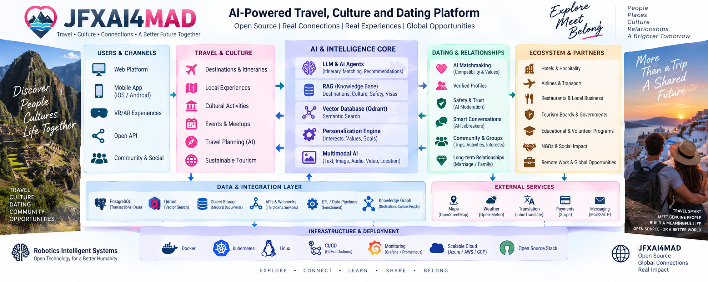

<p align="center">
  
</p>

<p align="center">
  <em>
    Open-source architecture for AI-powered travel, culture, matchmaking,
    community experiences, personalization, data integration and global connections.
  </em>
</p>


## AI-Powered Mobile Dating, Social Intelligence & Relationship Business Intelligence Platform

[](https://github.com/robotics-intelligent-systems/jfxai4mad)
[](https://github.com/robotics-intelligent-systems/jfxai4mad)
[](https://github.com/robotics-intelligent-systems/jfxai4mad)
[](https://github.com/robotics-intelligent-systems/jfxai4mad)
[](README.md)

> Unified architecture, open-source software dependency compendium, matchmaking intelligence and business intelligence framework for JFXAI4MAD.

---

# Table of Contents

1. [Overview](#1-overview)
2. [Project Context](#2-project-context)
3. [Objectives](#3-objectives)
4. [Functional Scope](#4-functional-scope)
5. [Conceptual Architecture](#5-conceptual-architecture)
6. [Marriage-Oriented Activity Intelligence](#6-marriage-oriented-activity-intelligence)
7. [Top 50 Activities](#7-top-50-activities)
8. [Relationship Development Funnel](#8-relationship-development-funnel)
9. [Business Intelligence Architecture](#9-business-intelligence-architecture)
10. [AI and Matchmaking Intelligence](#10-ai-and-matchmaking-intelligence)
11. [Open-Source Software Dependency Compendium](#11-open-source-software-dependency-compendium)
12. [Dependency Classification](#12-dependency-classification)
13. [Dependency Specification Template](#13-dependency-specification-template)
14. [Recommended Technology Stack](#14-recommended-technology-stack)
15. [Data Model](#15-data-model)
16. [Data Engineering Pipeline](#16-data-engineering-pipeline)
17. [BI KPIs](#17-bi-kpis)
18. [Repository Structure](#18-repository-structure)
19. [Installation Guide](#19-installation-guide)
20. [Security and Privacy](#20-security-and-privacy)
21. [Responsible AI](#21-responsible-ai)
22. [Development Roadmap](#22-development-roadmap)
23. [Contribution](#23-contribution)
24. [Governance](#24-governance)
25. [License](#25-license)

---

# 1. Overview

JFXAI4MAD is an open-source research and development platform for building AI-assisted mobile and web applications focused on:

* Dating and matchmaking
* Social networking
* Community discovery
* Activity recommendation
* Tourism and shared experiences
* Sports and recreational communities
* Cultural interaction
* AI-assisted compatibility analysis
* Business intelligence
* Relationship-oriented activity intelligence
* Open-source AI experimentation
* Engineering and systems modeling

The repository currently combines dating applications, matchmaking projects, social-networking platforms, AI/ML technologies, vector similarity search, graph analysis, reinforcement learning and MBSE/CAD/CAM/CAS engineering resources.

The purpose of this unified architecture is to transform that collection into a structured **open-source technology ecosystem**.

---

# 2. Project Context

JFXAI4MAD explores the intersection of:

```text
                 ┌─────────────────────────────┐
                 │       JFXAI4MAD             │
                 │ AI Social & Relationship    │
                 │ Intelligence Platform       │
                 └──────────────┬──────────────┘
                                │
       ┌────────────────────────┼────────────────────────┐
       │                        │                        │
       ▼                        ▼                        ▼
 Dating &                 Activity &               Business
 Matchmaking              Experience              Intelligence
       │                        │                        │
       ▼                        ▼                        ▼
 AI / NLP                 Tourism / Sports        Analytics / BI
       │                  Culture / Wellness          │
       ▼                        │                        ▼
 Compatibility                  └──────────────► Recommendations
       │
       ▼
 Long-Term Relationships
       │
       ▼
 Marriage / Family Planning
```

The marriage-oriented component is explicitly treated as **decision-support intelligence**, not as an automated mechanism for determining who should marry.

---

# 3. Objectives

## 3.1 Technical Objectives

* Build an open-source AI matchmaking ecosystem.
* Consolidate reusable open-source projects.
* Establish a documented dependency catalog.
* Provide reproducible development environments.
* Support modular AI/ML experimentation.
* Integrate NLP, embeddings and vector search.
* Support graph-based social analysis.
* Provide BI and analytics capabilities.
* Support mobile, web and API architectures.
* Enable future microservice and Kubernetes deployments.

## 3.2 Business Intelligence Objectives

The BI layer should identify:

* Activities with high social interaction.
* Activities producing recurring participation.
* Communities with strong engagement.
* Shared interests between users.
* Activity compatibility patterns.
* Event participation patterns.
* Relationship-development indicators.
* User satisfaction.
* Long-term relationship preferences.
* Aggregated conversion funnels.

The system must not claim that an activity causes marriage or guarantees family formation.

---

# 4. Functional Scope

| Domain             | Capability                             |
| ------------------ | -------------------------------------- |
| Dating             | Profiles, discovery, matching          |
| Matchmaking        | Compatibility and recommendation       |
| Social             | Communities and interactions           |
| Activities         | Sports, culture, tourism and wellness  |
| Tourism            | Cruises, resorts, trips and excursions |
| AI                 | NLP, embeddings, classification        |
| Recommendation     | Activity and user recommendations      |
| BI                 | KPIs, dashboards and analytics         |
| Graph Intelligence | Social network analysis                |
| Search             | Semantic/vector search                 |
| Engineering        | MBSE, CAD, CAM, CAS                    |
| DevOps             | Containers, CI/CD and deployment       |
| Privacy            | Consent, minimization and user control |

---

# 5. Conceptual Architecture

```text
┌──────────────────────────────────────────────────────────────┐
│                       USER EXPERIENCE                         │
│ Mobile App │ Web App │ Community Portal │ Admin Portal       │
└─────────────────────────────┬────────────────────────────────┘
                              │
                              ▼
┌──────────────────────────────────────────────────────────────┐
│                         API LAYER                             │
│ REST │ GraphQL │ WebSocket │ MCP │ Authentication             │
└─────────────────────────────┬────────────────────────────────┘
                              │
              ┌───────────────┼────────────────┐
              ▼               ▼                ▼
       Matchmaking       Activity Engine      Social Engine
              │               │                │
              └───────────────┼────────────────┘
                              ▼
┌──────────────────────────────────────────────────────────────┐
│                    AI / ML INTELLIGENCE                       │
│ NLP │ Embeddings │ Ranking │ Recommendation │ Graph AI       │
│ Classification │ Similarity │ Reinforcement Learning          │
└─────────────────────────────┬────────────────────────────────┘
                              │
                              ▼
┌──────────────────────────────────────────────────────────────┐
│                  BUSINESS INTELLIGENCE                        │
│ ETL/ELT │ Data Warehouse │ Analytics │ KPIs │ Dashboards     │
└─────────────────────────────┬────────────────────────────────┘
                              │
                              ▼
┌──────────────────────────────────────────────────────────────┐
│                         DATA LAYER                             │
│ PostgreSQL │ Object Storage │ Vector DB │ Graph Data         │
└──────────────────────────────────────────────────────────────┘
```

---

# 6. Marriage-Oriented Activity Intelligence

## 6.1 Business Concept

The platform can use Business Intelligence to understand which activities provide environments where adults can:

* Meet repeatedly.
* Share interests.
* Cooperate.
* Communicate.
* Develop friendships.
* Discover compatibility.
* Participate in shared experiences.
* Decide voluntarily whether to develop a relationship.

The platform does **not** assign people to marriage or predict that two people must marry.

---

## 6.2 Activity Intelligence Dimensions

Each activity can be evaluated using:

```text
Social Interaction
       +
Recurring Participation
       +
Shared Interests
       +
Cooperation
       +
Conversation
       +
Extended Experiences
       +
Lifestyle Compatibility
       +
Voluntary Participation
       =
Activity Intelligence Score
```

---

# 7. Top 50 Activities

| Rank | Activity                         | Primary Intelligence Signal          |
| ---: | -------------------------------- | ------------------------------------ |
|    1 | Salsa / Bachata                  | High partner interaction             |
|    2 | Organized Adult Camping          | Cooperation and extended interaction |
|    3 | Themed Cruises                   | Extended social environment          |
|    4 | Group Hiking / Trekking          | Conversation and teamwork            |
|    5 | Group Beach / Resort Trips       | Shared recreation                    |
|    6 | Ballroom Dancing                 | Partner interaction                  |
|    7 | Recreational Volleyball          | Teamwork                             |
|    8 | Cooking Classes                  | Cooperation and conversation         |
|    9 | Rural / Agritourism Trips        | Shared lifestyle interests           |
|   10 | Cultural Exchange Programs       | International interaction            |
|   11 | Language Exchange                | Recurring conversation               |
|   12 | Cycling Clubs                    | Recurring community                  |
|   13 | Yoga Retreats                    | Wellness and social interaction      |
|   14 | Surf Camps                       | Sport and travel                     |
|   15 | Diving Clubs / Trips             | Shared experiences                   |
|   16 | Climbing Groups                  | Trust and cooperation                |
|   17 | Martial Arts Clubs               | Discipline and community             |
|   18 | Running Clubs                    | Recurring participation              |
|   19 | Theater Groups                   | Long-term teamwork                   |
|   20 | Art Workshops                    | Conversation                         |
|   21 | Choirs                           | Collective participation             |
|   22 | Amateur Music Groups             | Shared projects                      |
|   23 | Beach Volleyball                 | Social sport                         |
|   24 | Tennis Clubs                     | Repeated interaction                 |
|   25 | Badminton Clubs                  | One-to-one interaction               |
|   26 | Table Tennis Clubs               | Informal competition                 |
|   27 | Amateur Football                 | Team community                       |
|   28 | Recreational Basketball          | Teamwork                             |
|   29 | Kayaking Groups                  | Cooperative experiences              |
|   30 | Adventure Trips                  | Shared experiences                   |
|   31 | Glamping Weekends                | Extended interaction                 |
|   32 | Gastronomic Tours                | Conversation                         |
|   33 | Community Gardening              | Cooperation                          |
|   34 | Organic Farming                  | Lifestyle compatibility              |
|   35 | Book Clubs                       | Values and interests                 |
|   36 | Board-Game Clubs                 | Small-group interaction              |
|   37 | Chess Clubs                      | Intellectual interaction             |
|   38 | Photography Clubs                | Creative activities                  |
|   39 | International Cuisine            | Cultural interaction                 |
|   40 | Tango                            | Partner interaction                  |
|   41 | Merengue / Latin Dance           | Recurring interaction                |
|   42 | Ceramics                         | Small-group interaction              |
|   43 | Pilates                          | Recurring wellness                   |
|   44 | Ecotourism Groups                | Shared environmental interests       |
|   45 | Archery Clubs                    | Recurring community                  |
|   46 | Skating Clubs                    | Recreational interaction             |
|   47 | Cultural Festivals               | Large social network                 |
|   48 | Museum / Cultural Groups         | Shared culture                       |
|   49 | Wellness Weekends                | Wellness and interaction             |
|   50 | Professional / Academic Seminars | Professional compatibility           |

---

# 8. Relationship Development Funnel

The platform can model the relationship-development lifecycle as:

```text
Activity Discovery
        ↓
Activity Search
        ↓
Activity Recommendation
        ↓
Participation
        ↓
Social Interaction
        ↓
Repeated Interaction
        ↓
Friendship
        ↓
Mutual Compatibility
        ↓
Serious Relationship
        ↓
Marriage
        ↓
Mutually Desired Family Planning
```

Every transition must remain controlled by the participants.

The system should optimize for **compatibility and user satisfaction**, not for maximizing marriage conversion.

---

# 9. Business Intelligence Architecture

```text
DATA SOURCES
     │
     ├── User Profiles
     ├── Activities
     ├── Events
     ├── Matches
     ├── Interactions
     ├── Travel
     ├── Sports
     └── Cultural Activities
             │
             ▼
       DATA INGESTION
             │
             ▼
       DATA VALIDATION
             │
             ▼
       DATA LAKE / STORAGE
             │
             ▼
       DATA WAREHOUSE
             │
             ▼
    ┌────────┼────────┐
    ▼        ▼        ▼
 Descriptive Predictive Prescriptive
 Analytics   Analytics  Analytics
    │        │        │
    └────────┼────────┘
             ▼
       BI DASHBOARDS
             │
             ▼
       AI RECOMMENDATIONS
```

---

# 10. AI and Matchmaking Intelligence

## 10.1 AI Components

The AI subsystem may include:

* NLP
* Text embeddings
* Semantic similarity
* User clustering
* Recommendation systems
* Graph analysis
* Classification
* Ranking
* Reinforcement learning
* Conversational AI
* AI assistants
* Activity recommendation

## 10.2 Compatibility Model

An example conceptual model:

```text
Compatibility Score =
    25% Shared Interests
  + 20% Lifestyle Compatibility
  + 15% Relationship Goals
  + 15% Communication Compatibility
  + 10% Activity Compatibility
  + 10% Geographic / Travel Compatibility
  +  5% Social Interaction Patterns
```

Weights should be configurable and validated empirically.

They should not be presented as scientifically established predictors of marriage success.

---

# 11. Open-Source Software Dependency Compendium

This section converts the repository's heterogeneous collection into a structured software catalog.

The repository currently references dating applications, matchmaking systems, social networks, AI assistants, NLP/ML techniques, FAISS, NetworkX, Gymnasium and engineering resources.

---

## 11.1 Dating and Matchmaking

| Software / Project    | Role                          | Category   | Integration |
| --------------------- | ----------------------------- | ---------- | ----------- |
| OpenCupid             | Community matchmaking         | Dating     | High        |
| Cupid2.0              | Dating platform               | Dating     | Reference   |
| Cupid AI              | AI conversation assistance    | AI/Dating  | High        |
| Cupid Code            | AI dating application         | Dating/AI  | Reference   |
| OKCupidjs             | Dating automation             | Automation | Research    |
| AutoMatch for OkCupid | Matchmaking automation        | Automation | Research    |
| Brave Date            | Dating platform               | Dating     | Reference   |
| pH7Builder            | Open-source dating/social CMS | Dating     | High        |
| Humbble               | Open-source dating            | Dating     | Reference   |
| Alovoa                | Open-source dating platform   | Dating     | High        |
| OpenMeet              | Open-source dating            | Dating     | Reference   |

---

## 11.2 Social Networking

| Software                          | Role                                 |
| --------------------------------- | ------------------------------------ |
| Open Source Social Network (OSSN) | Social networking                    |
| Cafe                              | Professional networking              |
| OpenMeet                          | Social/dating community              |
| bit platform                      | Application platform                 |
| LinkedIn MCP Server               | Professional/social data integration |

---

## 11.3 AI / Machine Learning

| Software              | Role                          |
| --------------------- | ----------------------------- |
| Python                | Primary AI language           |
| scikit-learn          | Classical ML                  |
| PyTorch               | Deep learning                 |
| Transformers          | NLP and foundation models     |
| Sentence Transformers | Semantic embeddings           |
| Gymnasium             | Reinforcement learning        |
| LangChain             | LLM application orchestration |
| MCP                   | AI tool integration           |
| Unsupervised ML       | User/profile clustering       |
| NLP                   | Text and profile intelligence |

---

## 11.4 Vector Search

| Software              | Role                           |
| --------------------- | ------------------------------ |
| FAISS                 | Dense-vector similarity search |
| Qdrant                | Vector database                |
| PostgreSQL + pgvector | Relational/vector storage      |
| Sentence Transformers | Embedding generation           |

---

## 11.5 Graph Intelligence

| Software                       | Role                     |
| ------------------------------ | ------------------------ |
| NetworkX                       | Graph analysis           |
| PostgreSQL                     | Relationship persistence |
| Graph database layer           | Optional social graph    |
| Community detection algorithms | User/community analysis  |

---

## 11.6 Data Engineering and BI

| Software                | Role                         |
| ----------------------- | ---------------------------- |
| Apache NiFi             | Data ingestion               |
| Airbyte                 | Data integration             |
| Apache Beam             | Distributed pipelines        |
| Apache DolphinScheduler | Workflow orchestration       |
| PostgreSQL              | Operational database         |
| DuckDB                  | Analytical SQL engine        |
| MinIO                   | S3-compatible object storage |
| Delta Lake              | Data lakehouse               |
| Apache Paimon           | Lakehouse/table storage      |
| Apache Superset         | BI dashboards                |
| Metabase                | Self-service BI              |
| Grafana                 | Operational analytics        |

---

## 11.7 Tourism and Experience Management

| Software / Project        | Role                |
| ------------------------- | ------------------- |
| CruiseLink                | Cruise management   |
| Cruise Booking System     | Travel booking      |
| Yacht Club Booking System | Yacht experiences   |
| Submarine Tours           | Tourism experiences |

These components can provide an experimental domain for analyzing shared travel experiences and activity-based social interaction. The current repository describes CruiseLink, cruise booking, yacht booking and submarine-tour resources.

---

## 11.8 Fitness and Wellness

| Software             | Role                    |
| -------------------- | ----------------------- |
| GYM One              | Gym management          |
| Yoga activity models | Wellness intelligence   |
| Running clubs        | Sports communities      |
| Fitness communities  | Activity recommendation |

---

## 11.9 Engineering / MBSE / CAD / CAM / CAS

The repository also organizes engineering resources around:

```text
MBSE
 ├── CAD
 ├── CAM
 └── CAS
```

The current repository explicitly contains MBSE/CAS/drawio material and describes CAD, CAM and CAS engineering domains.

These resources should remain isolated from the production dating stack unless required by a specific research project.

---

# 12. Dependency Classification

Each dependency should be assigned one of the following classifications:

| Classification | Meaning                     |
| -------------- | --------------------------- |
| Core           | Required for the platform   |
| Runtime        | Required during execution   |
| Build          | Required to compile/package |
| Development    | Developer tooling           |
| Test           | Testing only                |
| Optional       | Feature-specific            |
| Research       | Experimental                |
| Integration    | External integration        |
| Reference      | Studied but not integrated  |
| Deprecated     | Historical or obsolete      |

---

# 13. Dependency Specification Template

Every dependency should eventually have a record using the following template:

```yaml
name:
category:
dependency_type:
purpose:

repository:
official_website:

license:
license_compatibility:

programming_language:
version_tested:

installation:
runtime_requirements:

integration:
api:
database:
protocols:

security_considerations:

data_considerations:

performance_considerations:

compatibility:

status:
owner:

documentation:
```

---

## 13.1 Example

```yaml
name: FAISS

category: Vector Search
dependency_type: Core

purpose:
  Efficient similarity search and clustering of dense vectors.

repository:
  https://github.com/facebookresearch/faiss

license:
  MIT

programming_language:
  C++ / Python

version_tested:
  TBD

installation:
  pip install faiss-cpu

runtime_requirements:
  Python-compatible environment

integration:
  embeddings:
    - Sentence Transformers
  storage:
    - PostgreSQL
    - Qdrant
    - Object Storage

security_considerations:
  No direct user authentication responsibility.

data_considerations:
  Vector representations may encode sensitive information.

performance_considerations:
  Suitable for large-scale similarity search.

status:
  Candidate Core Dependency
```

---

# 14. Recommended Technology Stack

## 14.1 Frontend

```text
Mobile
 ├── React Native / Flutter
 └── Native Android/iOS where required

Web
 ├── React
 ├── Next.js
 └── Progressive Web App
```

## 14.2 Backend

```text
API
 ├── Python FastAPI
 ├── Node.js
 └── Scala services where required

Architecture
 ├── REST
 ├── GraphQL
 ├── WebSocket
 └── MCP
```

## 14.3 AI

```text
Python
 ├── PyTorch
 ├── scikit-learn
 ├── Transformers
 ├── Sentence Transformers
 ├── FAISS
 ├── NetworkX
 └── Gymnasium
```

## 14.4 Data

```text
Operational
    PostgreSQL

Vector
    Qdrant / pgvector / FAISS

Analytical
    DuckDB

Object Storage
    MinIO

Lakehouse
    Delta Lake / Apache Paimon
```

## 14.5 BI

```text
Apache Superset
Metabase
Grafana
```

---

# 15. Data Model

## User

```text
User
 ├── Profile
 ├── Preferences
 ├── Interests
 ├── Relationship Goals
 ├── Activities
 ├── Events
 ├── Interactions
 └── Matches
```

## Activity

```text
Activity
 ├── Category
 ├── Location
 ├── Duration
 ├── Social Intensity
 ├── Recurrence
 ├── Cooperation Level
 ├── Conversation Potential
 └── Compatibility Signals
```

## Event

```text
Event
 ├── Activity
 ├── Organizer
 ├── Location
 ├── Participants
 ├── Date
 └── Interaction Metrics
```

## Interaction

```text
Interaction
 ├── User A
 ├── User B
 ├── Activity
 ├── Event
 ├── Timestamp
 ├── Interaction Type
 └── Consent Context
```

## Relationship Outcome

```text
RelationshipOutcome
 ├── Friendship
 ├── Dating
 ├── Serious Relationship
 ├── Marriage
 └── Family Planning
```

These outcomes must be voluntarily self-reported or explicitly consented to; they should not be inferred as facts from private behavior.

---

# 16. Data Engineering Pipeline

```text
                    SOURCE SYSTEMS
                          │
          ┌───────────────┼────────────────┐
          ▼               ▼                ▼
       Dating          Activities       Tourism
          │               │                │
          └───────────────┼────────────────┘
                          ▼
                    INGESTION
                          │
                    Apache NiFi
                    Airbyte / Beam
                          │
                          ▼
                    DATA QUALITY
                          │
                          ▼
                    DATA STORAGE
             ┌────────────┼────────────┐
             ▼            ▼            ▼
        PostgreSQL      MinIO        Vector DB
             │            │            │
             └────────────┼────────────┘
                          ▼
                    ANALYTICS
                          │
              ┌───────────┼───────────┐
              ▼           ▼           ▼
        Descriptive   Predictive   Prescriptive
              │           │           │
              └───────────┼───────────┘
                          ▼
                    BI DASHBOARDS
                          │
                          ▼
                RECOMMENDATION ENGINE
```

---

# 17. BI KPIs

## Activity KPIs

* Activity participation rate
* Repeat participation rate
* Event attendance
* Social interaction rate
* Conversation rate
* Community retention
* Activity satisfaction
* Activity recommendation acceptance

## Matchmaking KPIs

* Match acceptance
* Mutual interest
* Conversation initiation
* Conversation continuation
* Repeat interaction
* User-reported compatibility
* Relationship progression

## Long-Term Relationship KPIs

Only when voluntarily provided:

* Serious relationship formation
* Engagement
* Marriage
* Family-planning intention

The platform should report these as **aggregated and privacy-preserving indicators**, not as individual-level predictions.

---

# 18. Repository Structure

```text
jfxai4mad/
│
├── README.md
├── LICENSE
├── CONTRIBUTING.md
├── CODE_OF_CONDUCT.md
│
├── docs/
│   ├── architecture/
│   │   ├── system-architecture.md
│   │   ├── ai-architecture.md
│   │   └── data-architecture.md
│   │
│   ├── dependencies/
│   │   ├── software-compendium.md
│   │   ├── dependency-template.md
│   │   ├── dependency-matrix.csv
│   │   └── licenses.md
│   │
│   ├── business-intelligence/
│   │   ├── activity-intelligence.md
│   │   ├── matchmaking-bi.md
│   │   ├── kpis.md
│   │   └── dashboards.md
│   │
│   ├── matchmaking/
│   │   ├── compatibility-model.md
│   │   ├── recommendation.md
│   │   └── graph-intelligence.md
│   │
│   └── engineering/
│       ├── mbse/
│       ├── cad/
│       ├── cam/
│       └── cas/
│
├── src/
│   ├── ai/
│   ├── matchmaking/
│   ├── recommendation/
│   ├── social/
│   ├── activities/
│   ├── business-intelligence/
│   ├── data-engineering/
│   └── api/
│
├── data/
│   ├── schemas/
│   ├── samples/
│   └── dictionaries/
│
├── models/
│   ├── embeddings/
│   ├── recommendation/
│   ├── clustering/
│   └── graph/
│
├── dashboards/
│   ├── superset/
│   ├── metabase/
│   └── grafana/
│
├── infrastructure/
│   ├── docker/
│   ├── kubernetes/
│   └── terraform/
│
├── tests/
│
└── MBSE/
    └── CAS/
        └── drawio/
```

---

# 19. Installation Guide

## 19.1 Prerequisites

Recommended development environment:

```text
Linux / macOS / Windows WSL2

Git
Python 3.x
Node.js LTS
Docker
Docker Compose
PostgreSQL
```

Optional:

```text
Kubernetes
Helm
Terraform
MinIO
Qdrant
Apache Superset
Grafana
```

---

## 19.2 Clone Repository

```bash
git clone https://github.com/robotics-intelligent-systems/jfxai4mad.git

cd jfxai4mad
```

---

## 19.3 Python Environment

```bash
python -m venv .venv

source .venv/bin/activate

pip install -r requirements.txt
```

Windows:

```powershell
.venv\Scripts\activate
```

---

## 19.4 Docker

```bash
docker compose up -d
```

Recommended initial services:

```text
PostgreSQL
Qdrant
MinIO
API
AI Service
BI Service
```

---

# 20. Security and Privacy

JFXAI4MAD processes potentially sensitive personal and relationship-related information.

Security principles:

* Data minimization
* Explicit consent
* Encryption in transit
* Encryption at rest
* Authentication
* Authorization
* Audit logging
* Secure API design
* Secret management
* Data retention policies
* User deletion mechanisms
* Privacy-preserving analytics

The platform should never expose private relationship information to third parties without appropriate authorization.

---

# 21. Responsible AI

The platform must follow these principles:

### Human Decision Authority

AI recommendations support decisions; they do not make relationship decisions for users.

### No Marriage Determinism

The system must never state:

```text
"User A should marry User B."
```

Instead:

```text
"User A and User B appear to share several declared interests
and preferences. They may choose whether to interact."
```

### Consent

Every interaction must remain voluntary.

### Explainability

Recommendations should provide understandable reasons where practical:

```text
Recommended because:

✓ Shared hiking interest
✓ Similar travel preferences
✓ Similar relationship goals
✓ Both interested in recurring group activities
```

### Bias Monitoring

Monitor:

* Gender bias
* Geographic bias
* Cultural bias
* Socioeconomic bias
* Age-related bias
* Recommendation feedback loops

---

# 22. Development Roadmap

## Phase 1 — Repository Foundation

```text
✓ Dependency catalog
✓ Architecture documentation
✓ Repository organization
✓ Development standards
```

## Phase 2 — Core Platform

```text
Profile management
Activity catalog
Event management
Authentication
Social interaction
```

## Phase 3 — AI

```text
Embeddings
Semantic search
Profile clustering
Compatibility scoring
Activity recommendation
```

## Phase 4 — Business Intelligence

```text
ETL/ELT
Data warehouse
KPIs
Dashboards
Activity intelligence
Matchmaking analytics
```

## Phase 5 — Advanced Intelligence

```text
Graph AI
Recommendation optimization
Reinforcement learning
Conversational AI
MCP integrations
```

## Phase 6 — Cloud / Production

```text
Docker
Kubernetes
CI/CD
Observability
Security
Scalability
```

---

# 23. Contribution

Contributors should follow the repository contribution process based on the documentation structure used by the reference repository template. The reference template emphasizes documentation, installation guidance, contribution, code of conduct, authorship and licensing.

Recommended workflow:

```text
Fork
  ↓
Create Branch
  ↓
Implement
  ↓
Unit Tests
  ↓
Security Review
  ↓
Documentation
  ↓
Pull Request
  ↓
Code Review
  ↓
Merge
```

All new dependencies should include:

* Name
* Repository
* License
* Version
* Purpose
* Installation method
* Runtime requirements
* Integration method
* Security considerations
* Data considerations
* Compatibility
* Maintenance status

---

# 24. Governance

The project should maintain a dependency governance process.

## Dependency Lifecycle

```text
Candidate
   ↓
Technical Evaluation
   ↓
License Evaluation
   ↓
Security Evaluation
   ↓
Performance Evaluation
   ↓
Integration Test
   ↓
Approved
   ↓
Production / Research
   ↓
Periodic Review
   ↓
Upgrade / Replace / Deprecate
```

## Dependency Matrix

A future machine-readable dependency matrix should contain:

```text
Name
Version
Category
License
Repository
Official Website
Programming Language
Runtime
Integration
Security Status
Maintenance Status
Production Status
Last Review
```

---

# 25. License

Each third-party dependency must retain its original license and attribution.

The JFXAI4MAD repository should maintain a dedicated:

```text
docs/dependencies/licenses.md
```

file documenting third-party software licenses and compatibility.

No dependency should be included in the production distribution without a license review.

---

# Final Architecture Vision

JFXAI4MAD can evolve from a collection of open-source dating, social, AI, tourism and engineering projects into a unified:

```text
              JFXAI4MAD
                  │
       ┌──────────┴──────────┐
       │                     │
   SOCIAL AI             BUSINESS AI
       │                     │
       ▼                     ▼
 Matchmaking            Activity Intelligence
       │                     │
       ▼                     ▼
 Compatibility           Analytics
       │                     │
       └──────────┬──────────┘
                  ▼
          Recommendation
                  │
                  ▼
        Shared Activities
                  │
                  ▼
         Social Interaction
                  │
                  ▼
          Mutual Compatibility
                  │
                  ▼
        Long-Term Relationships
                  │
                  ▼
       Voluntary Marriage / Family
```

The strategic objective is therefore not simply to create another dating application. It is to establish an **open-source AI social intelligence platform** capable of connecting people with compatible communities, activities, experiences and potential long-term relationships while preserving individual autonomy, privacy, consent and human decision-making.

---

## References

* JFXAI4MAD repository: `robotics-intelligent-systems/jfxai4mad`.
* Repository documentation template: `sdk2035/Plantilla-de-repositorio`, based on the referenced BID documentation structure.

