# JFXAI4MAD — University Partnership, Volunteer Community, Venture Formation & Optional Family-Formation Architecture

> **Project context:** AI-Powered Mobile Dating, Social Intelligence & Relationship Business Intelligence Platform  
> **Geographic focus:** Northern Argentina, with emphasis on national universities and postgraduate/continuing-education ecosystems in provinces such as Salta, Jujuy, Tucumán, Santiago del Estero, Catamarca, Chaco, Corrientes, Formosa, and Misiones.  
> **Purpose:** Extend the JFXAI4MAD shared-interest and relationship-development model with a legally and ethically separated **education + technology-transfer + venture-formation layer**.
>
> **Core boundary:** Universities, postgraduate programs, scholarships, volunteer opportunities, employment, investment, housing, academic evaluation, and research access must **never be conditioned on dating, marriage, sexual relationships, pregnancy, or parenthood**. Any personal relationship must arise independently between consenting adults and outside academic or supervisory authority.

---

# 1. Source Alignment

JFXAI4MAD already defines an open-source ecosystem around:

- dating and matchmaking;
- social networking;
- community discovery;
- activity recommendation;
- tourism and shared experiences;
- sports and recreation;
- cultural interaction;
- AI-assisted compatibility analysis;
- business intelligence;
- relationship-oriented activity intelligence;
- open-source AI experimentation;
- engineering and systems modelling.

Its existing relationship-development model is:

```text
Activity Discovery
        ↓
Activity Recommendation
        ↓
Participation
        ↓
Social Interaction
        ↓
Repeated Interaction
        ↓
Friendship
        ↓
Mutual Compatibility
        ↓
Serious Relationship
        ↓
Marriage
        ↓
Mutually Desired Family Planning
```

Every transition remains voluntary.

This document adds a parallel institutional path:

```text
Education
   +
Volunteer Service
   +
Open-Source Collaboration
   +
Technology Transfer
        ↓
Professional Relationships
        ↓
Research / Startup / Cooperative Teams
        ↓
Venture Formation
```

The **professional/venture path** and the **personal relationship path** may intersect socially, but they must remain institutionally independent.

---

# 2. Recommended Combined Architecture

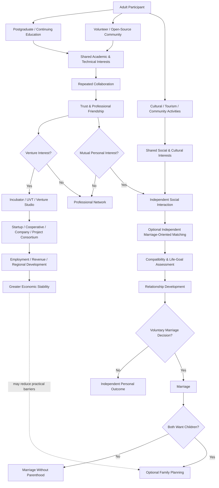

The final dotted relationship is deliberately indirect:

> Economic stability may reduce practical barriers to family formation, but the platform must not claim that investment, education, employment, or entrepreneurship **causes** marriage or childbirth.

---

# 3. Institutional Separation Model

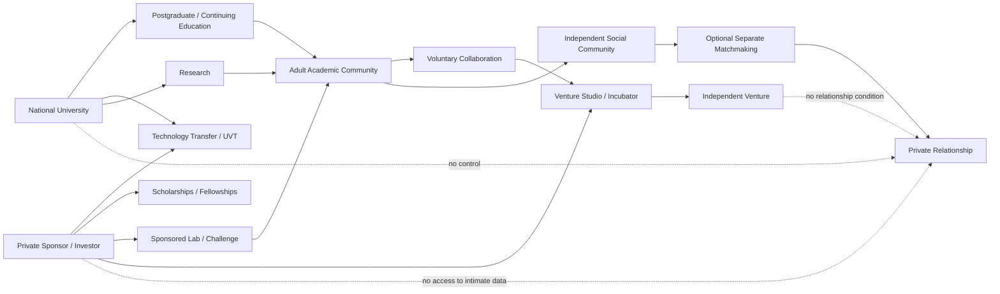

---

# 4. What "Investing in a National University" Should Mean

Argentine national universities are public institutions. The recommended model is **not** to treat a university as an equity investment target.

Instead, private or philanthropic capital can participate through structured collaboration mechanisms such as:

```text
Private / Philanthropic Capital
        ↓
┌─────────────────────────────────────────────┐
│ University Collaboration Vehicles           │
├─────────────────────────────────────────────┤
│ Sponsored research                          │
│ Technology-transfer projects                │
│ UVT-managed projects                        │
│ Scholarships / fellowships                  │
│ Laboratories / equipment                    │
│ Professional training                       │
│ Continuing-education programs               │
│ Applied innovation challenges               │
│ Incubation / entrepreneurship programs      │
│ University-linked foundations               │
│ Spin-offs / independent startups            │
└─────────────────────────────────────────────┘
        ↓
Research + Education + Innovation
        ↓
Independent Commercial Ventures
```

## Argentine legal/institutional basis

Under Argentina's Higher Education Law, national universities have economic-financial autonomy, may generate additional resources through goods, services, subsidies, contributions and other activities, and may create or participate in public/private legal entities. The same law also allows them to promote foundations, companies, or other civil associations supporting university purposes.

The Technology Innovation Law provides for **Technology Linkage Units (UVTs)** that facilitate contractual relationships between research institutions and productive sectors. UVTs may use civil, cooperative, commercial, or mixed legal forms, subject to applicable regulation.

Therefore, the most realistic investment concept is:

```text
Investor / Company
        ↓
University Agreement / UVT / Foundation
        ↓
Research or Training Program
        ↓
IP / Technology / Talent / Prototypes
        ↓
Independent Startup / Cooperative / Company
        ↓
Commercial Investment
```

not:

```text
Investor
   ↓
Equity ownership of public university
```

---

# 5. Three Capital Layers

## Layer A — Education & Social Impact Capital

Suitable instruments:

- scholarships;
- mobility support;
- postgraduate fellowships;
- research assistantships;
- equipment grants;
- community-service grants;
- open-source infrastructure grants.

Return:

```text
Human Capital
+
Regional Capacity
+
Research Output
+
Community Development
```

This layer is normally **non-equity**.

---

## Layer B — Technology Transfer Capital

Suitable instruments:

- sponsored R&D;
- licensing;
- applied research contracts;
- UVT projects;
- testing / certification services;
- industrial challenges;
- joint prototypes.

Return:

```text
Technology
+
IP / Licensing
+
Applied Solutions
+
Commercial Contracts
```

---

## Layer C — Venture Capital

Investment occurs in an **independent legal entity**, not in student relationships.

```text
University Research / Project
          ↓
Validated Prototype
          ↓
Independent Spin-off
          ↓
Founders Agreement
          ↓
Seed Capital
          ↓
Company / Cooperative / Venture
```

Possible participants:

- graduates;
- researchers;
- engineers;
- entrepreneurs;
- external founders;
- investors.

Romantic or marital status should be irrelevant to equity allocation.

---

# 6. Northern Argentina University Partnership Map

The following institutions are illustrative targets for the **education, innovation, technology-transfer, and community layer**. Program availability and admissions should always be verified for the relevant academic year.

| University | Province / Region | Current strengths relevant to this architecture | Potential JFXAI4MAD collaboration |
|---|---|---|---|
| Universidad Nacional de Salta (UNSa) | Salta | Informatics, Technology & Innovation Management, Renewable Energy, development economics, technology-transfer activity | AI, open source, tourism-tech, innovation labs, startup challenges |
| Universidad Nacional de Jujuy (UNJu) | Jujuy | UVT, business school, incubator, foundation, institutional/private-sector linkage | venture studio, entrepreneurship, tourism/cultural tech, open-source projects |
| Universidad Nacional de Tucumán (UNT) | Tucumán | Large postgraduate ecosystem; active postgraduate technology-linkage training | postgraduate innovation, applied AI, research-to-market teams |
| Universidad Nacional de Santiago del Estero (UNSE) | Santiago del Estero | Postgraduate programs, research and regional-development orientation | applied technology, digital inclusion, entrepreneurship communities |
| Universidad Nacional del Nordeste (UNNE) | Corrientes / Chaco | Flexible postgraduate education; technology transfer; "Strategic Partners" program | corporate-university partnerships, internships, innovation projects |
| Universidad Nacional de Misiones (UNaM) | Misiones | Informatics, IT, business administration, territorial development, family/social studies, energy and engineering | multidisciplinary social-tech, AI, tourism, family/social research, venture formation |
| Universidad Nacional de Catamarca (UNCA) | Catamarca | Technology & Innovation Management, Economics, Renewable Energy, applied sciences | innovation management, entrepreneurship, regional technology ventures |

---

# 7. Strong Candidate Programs / Academic Anchors

## Universidad Nacional de Salta — UNSa

Relevant official postgraduate examples include:

- Master's in Informatics;
- Master's in Technology and Innovation Management;
- Master's / specialization in Renewable Energy;
- Master's in Development Economics;
- engineering and applied-science doctorates.

This makes UNSa a strong candidate for:

```text
AI / Software
   +
Innovation Management
   +
Regional Entrepreneurship
   +
Technology Transfer
```

Suggested model:

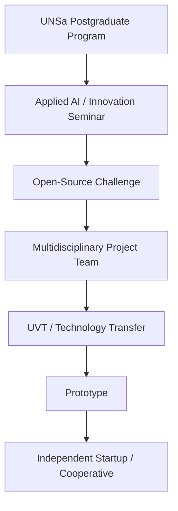

---

## Universidad Nacional de Jujuy — UNJu

UNJu publicly presents an institutional linkage structure including:

- Technology Linkage Unit;
- Business School;
- Circular/Popular Economy center;
- Business Incubator;
- Fundación UNJu para el Desarrollo.

This is particularly compatible with a **university-to-venture pipeline**:

```text
Postgraduate / Research Community
       ↓
UNJu Business / Incubation Ecosystem
       ↓
Prototype
       ↓
Mentoring
       ↓
Technology Transfer
       ↓
Independent Venture
```

For JFXAI4MAD, the social layer could focus on:

- cultural tourism;
- digital community platforms;
- AI for regional services;
- open-source entrepreneurship;
- language/cultural exchange;
- community innovation.

---

## Universidad Nacional de Tucumán — UNT

UNT has a broad postgraduate structure and in 2026 promoted postgraduate training specifically around **technology linkage**, emphasizing collaboration between postgraduate students, researchers, companies, and productive sectors.

That is almost directly compatible with:

```text
Postgraduate Research
       +
Industry Problem
       ↓
Collaborative Innovation
       ↓
Applied Project
       ↓
Technology Transfer
       ↓
Business / Social Impact
```

---

## Universidad Nacional del Nordeste — UNNE

UNNE supports flexible continuing postgraduate formats such as:

- advanced diploma programs;
- professional-update programs;
- postgraduate courses;
- workshops;
- seminars.

Its technology-transfer area explicitly connects university capacities with public/private organizations and operates a **Strategic Partners** program aimed at collaboration with individuals and legal entities to finance socio-productive innovation.

This makes UNNE particularly attractive for a sponsor-based model:

```text
Company / Investor
       ↓
UNNE Strategic Partnership
       ↓
Postgraduate / Innovation Program
       ↓
Applied Team
       ↓
Regional Challenge
       ↓
Technology / Startup / Employment
```

---

## Universidad Nacional de Misiones — UNaM

Relevant current postgraduate areas include:

- Doctorate in Informatics;
- Master's in Information Technologies;
- Master's in Strategic Business Administration;
- postgraduate programs in territorial development;
- family-integral approaches;
- social policies;
- engineering and energy.

This makes UNaM unusually suitable for a multidisciplinary research architecture combining:

```text
Technology
   +
Business
   +
Territorial Development
   +
Social / Family Research
```

Important boundary:

> Social/family postgraduate research can inform policies and voluntary support services, but students must never be classified or recruited according to fertility, romantic availability, or willingness to marry.

---

## Universidad Nacional de Catamarca — UNCA

Relevant programs include:

- Master's in Technology and Innovation Management;
- Doctorate in Economic Sciences;
- Doctorate in Renewable Energy;
- applied-science and regional-development programs.

Potential JFXAI4MAD direction:

```text
Innovation Management
       ↓
Open-Source Technology Project
       ↓
Regional Startup
       ↓
Employment / Enterprise Formation
```

---

# 8. Recommended Education-to-Venture Architecture

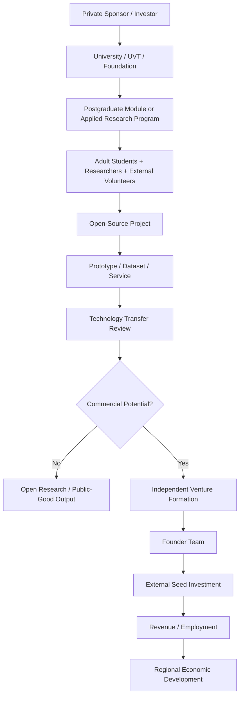

---

# 9. Recommended "Society Formation" Model

If by **societies** we mean durable entrepreneurial organizations, the architecture should distinguish:

```text
Academic Community
        ↓
Project Team
        ↓
Collaboration Agreement
        ↓
Independent Legal Entity
        ↓
┌────────────┬────────────┬─────────────┐
│ Startup    │ Cooperative│ Consortium  │
└────────────┴────────────┴─────────────┘
        ↓
Capital + Governance + IP
```

Potential founder selection criteria:

- demonstrated contribution;
- complementary skills;
- reliability;
- technical/business competence;
- shared mission;
- transparent financial expectations.

Do **not** use:

- romantic compatibility;
- marriage status;
- sexual relationships;
- fertility;
- pregnancy plans;

as conditions for company ownership or academic participation.

---

# 10. Professional Friendship Layer

Postgraduate programs and volunteer/open-source projects can provide stronger opportunities for professional friendship because they create repeated interaction.

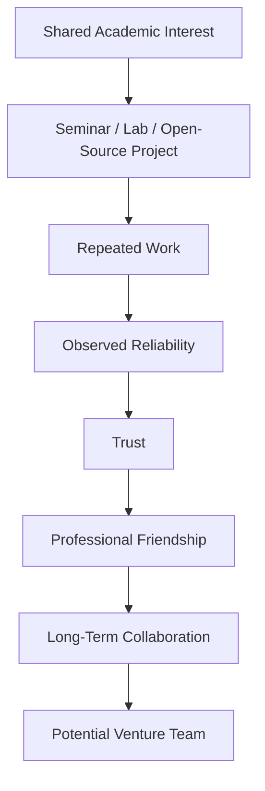

This is a legitimate institutional objective.

---

# 11. Optional Personal Relationship Layer

A separate, adult-only layer may exist outside academic evaluation and funding relationships.

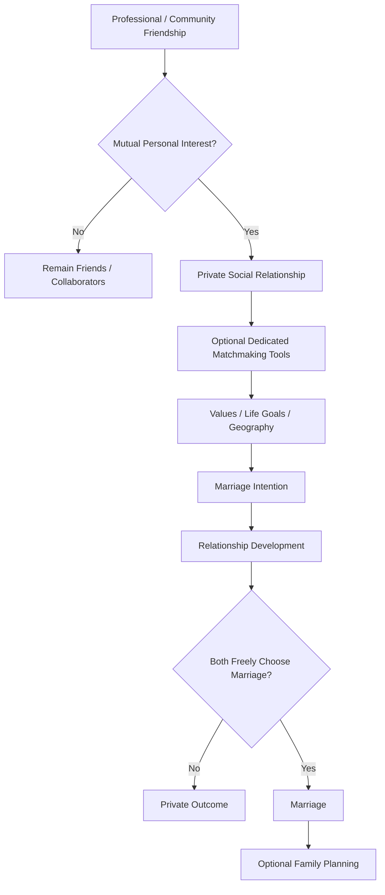

The university, sponsor, investor, professor, supervisor, or project manager should not control any transition in this diagram.

---

# 12. Family-Formation Support Without Reproductive Pressure

If the broader social objective is to reduce barriers to family formation, a university-linked social enterprise can support adults through:

```text
Education
+
Employment
+
Entrepreneurship
+
Housing Information
+
Financial Literacy
+
Relationship Education
+
Childcare Information
+
Health / Family-Planning Referrals
```

The goal should be:

> **enable adults who already want families to make sustainable choices**

rather than:

> maximize the number of marriages or births.

Recommended social-impact indicators:

- graduate employment;
- startup formation;
- income stability;
- housing access;
- volunteer retention;
- community belonging;
- reported social support;
- relationship satisfaction;
- access to childcare information;
- voluntary family-planning access.

Marriage or childbirth should not be used as individual performance targets.

---

# 13. Tourism + Education + Community Integration

JFXAI4MAD already includes tourism, culture, sports and shared experiences.

Northern Argentina allows an additional model:

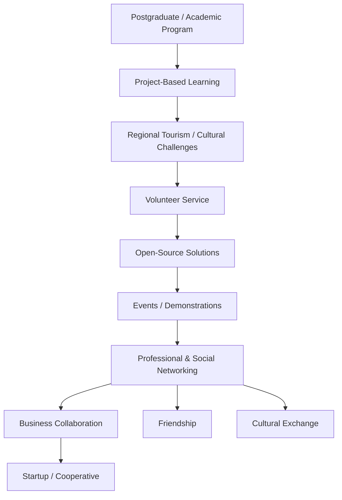

Possible project themes:

- cultural-tourism recommendation systems;
- local-business digitization;
- multilingual tourism assistants;
- community-event platforms;
- agritourism;
- regional mobility;
- sustainable tourism analytics;
- heritage digitization;
- open-source hospitality tools;
- regional marketplace platforms.

---

# 14. Proposed JFXAI4MAD Extended Platform

```text
┌──────────────────────────────────────────────────────────────┐
│                    USER EXPERIENCE                           │
│ Community | Education | Tourism | Events | Matchmaking      │
└───────────────────────────┬──────────────────────────────────┘
                            ↓
┌──────────────────────────────────────────────────────────────┐
│                       API / IDENTITY                         │
│ REST | GraphQL | MCP | OAuth/OIDC | Consent                │
└───────────────────────────┬──────────────────────────────────┘
                            ↓
┌──────────────────────────────────────────────────────────────┐
│                    COMMUNITY SERVICES                        │
│ Volunteer Projects | Academic Events | Open Source | Clubs  │
└───────────────────────────┬──────────────────────────────────┘
                            ↓
        ┌───────────────────┼───────────────────┐
        ↓                   ↓                   ↓
  EDUCATION            VENTURE             SOCIAL
 Postgraduate          Incubator           Activities
 Research              UVT                 Tourism
 Courses               Startup             Culture
        │                   │                   │
        └──────────────┬────┴──────────────┬────┘
                       ↓                   ↓
               PROFESSIONAL NETWORK   FRIENDSHIP
                       │                   │
                       ↓                   ↓
                 BUSINESS TEAM      Optional Private
                       │             Relationship
                       ↓                   ↓
                   VENTURE           MATCHMAKING
                                           ↓
                                  Voluntary Marriage
                                           ↓
                                  Optional Parenthood
```

---

# 15. Data Separation Architecture

This separation is critical.

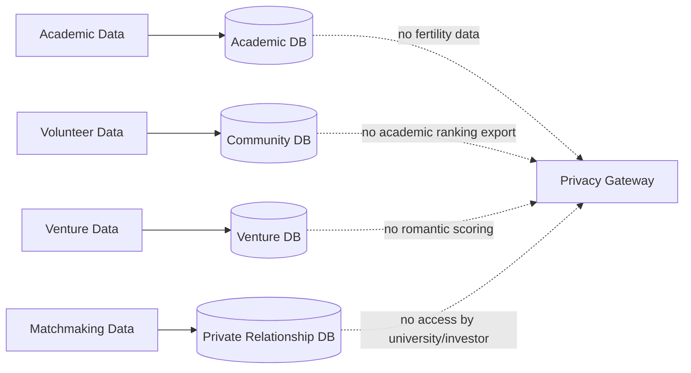

### Rules

- investors cannot inspect intimate compatibility profiles;
- professors cannot access private dating data;
- matchmaking algorithms cannot alter academic admission or grading;
- fertility or relationship intentions cannot affect scholarships;
- business equity cannot depend on sexual or marital compliance;
- volunteers can leave matchmaking while remaining volunteers;
- students can decline social invitations without professional consequences.

---

# 16. AI Layer

JFXAI4MAD can use AI differently for each domain.

## Education AI

- course discovery;
- RAG over university materials;
- research assistance;
- project-team skill matching;
- multilingual academic support.

## Venture AI

- business-model analysis;
- market research;
- technology landscaping;
- startup mentor agents;
- financial scenario modelling.

## Community AI

- event recommendation;
- shared-interest discovery;
- volunteer-project recommendation;
- community graph analysis.

## Matchmaking AI

- optional compatibility recommendations;
- explainable preference matching;
- user-controlled filters.

AI should **not** decide who must marry, reproduce, receive funding, or receive academic opportunities.

---

# 17. Business Intelligence Architecture

```text
EDUCATION SOURCES
courses / research / skills
        │
COMMUNITY SOURCES
events / projects / volunteering
        │
VENTURE SOURCES
teams / prototypes / companies
        │
        ▼
PRIVACY-PRESERVING ANALYTICS
        │
        ├── Education KPIs
        ├── Community KPIs
        ├── Venture KPIs
        └── Aggregated Social KPIs
```

Private relationship data should be separately governed and used only with explicit consent.

---

# 18. Suggested Pilot Model

A realistic pilot should begin with **education + open source + entrepreneurship**, not matchmaking.

## Phase 1 — University Partnership

```text
1 university
+
1 postgraduate / continuing-education unit
+
1 UVT / incubator
+
1 external sponsor
```

## Phase 2 — Open-Source Challenge

Example:

> "AI and open-source technology for regional tourism, local commerce and community services."

Participants:

- postgraduate students;
- graduates;
- researchers;
- adult volunteers;
- companies;
- NGOs.

## Phase 3 — Venture Formation

Top projects may enter:

- incubation;
- technology transfer;
- cooperative formation;
- startup formation;
- corporate pilots.

## Phase 4 — Community Layer

Add:

- cultural events;
- language exchange;
- hiking;
- dance;
- professional seminars;
- gastronomy;
- regional tourism;
- volunteer activities.

## Phase 5 — Independent Social / Matchmaking Layer

Only after governance and privacy separation are established.

---

# 19. Recommended Regional Pilot Sequence

```text
PILOT A
UNSa / Salta
AI + Innovation + Tourism-Tech
        ↓
PILOT B
UNJu / Jujuy
Incubation + Cultural / Regional Innovation
        ↓
PILOT C
UNT / Tucumán
Postgraduate Research + Technology Transfer
        ↓
PILOT D
UNNE / Corrientes-Chaco
Strategic Partners + Continuing Education
        ↓
PILOT E
UNaM / Misiones
IT + Business + Territorial / Social Research
```

This is an architecture proposal, not a ranking of university quality.

---

# 20. Capital Flow Example

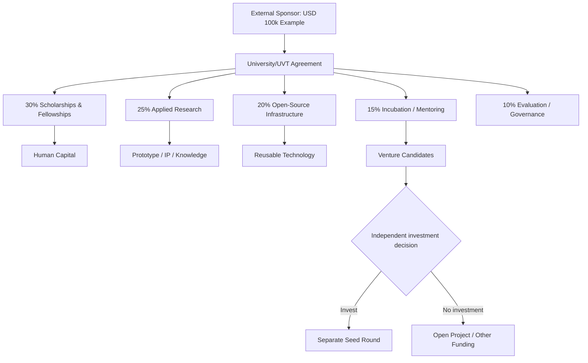

The percentages are illustrative only and must be negotiated with the institution.

---

# 21. Venture Formation and Personal Relationships Must Be Separate

Even when two adults are both business partners and romantic partners:

```text
BUSINESS
Founders Agreement
Equity
IP
Voting
Vesting
Exit
        │
        │ legally separated
        ▼
PERSONAL
Relationship
Marriage
Property Regime
Family Planning
```

A business contract should never purchase or condition consent to marriage, sex, pregnancy, or relationship continuation.

If a couple decides to marry and also own a business, each legal relationship should receive independent professional advice.

---

# 22. Why This Model Can Be Stronger Than a Dating-App-Only Strategy

The combined model adds real-world context:

```text
Dating App Only
Profile
  ↓
Match
  ↓
Conversation
  ↓
Date
```

versus:

```text
Education / Service / Open Source
Shared Interest
      ↓
Repeated Work
      ↓
Observed Behavior
      ↓
Trust
      ↓
Friendship
      ↓
Optional Personal Interest
```

Potential advantages:

- more behavioral evidence;
- longer interaction horizon;
- professional reputation;
- common intellectual interests;
- mutual networks;
- productive outcomes even without romance;
- stronger regional community.

However, there is no guarantee that these relationships will be more stable. Stability depends on the people, not only on the channel.

---

# 23. Why LinkedIn Should Remain Outside the Matchmaking Funnel

LinkedIn should continue to serve:

```text
Employment
Business Networking
Investors
Founders
University Contacts
Technology Partners
```

GitHub should serve:

```text
Technical Proof
Open-Source Collaboration
Research Prototypes
Contributor Reputation
```

The university/community layer should serve:

```text
Education
Repeated Collaboration
Volunteering
Entrepreneurship
Community
```

A dedicated optional service should serve:

```text
Dating
Marriage Intent
Family Preferences
```

This preserves clear expectations and reduces reputational and consent problems.

---

# 24. Recommended Platform Ecosystem

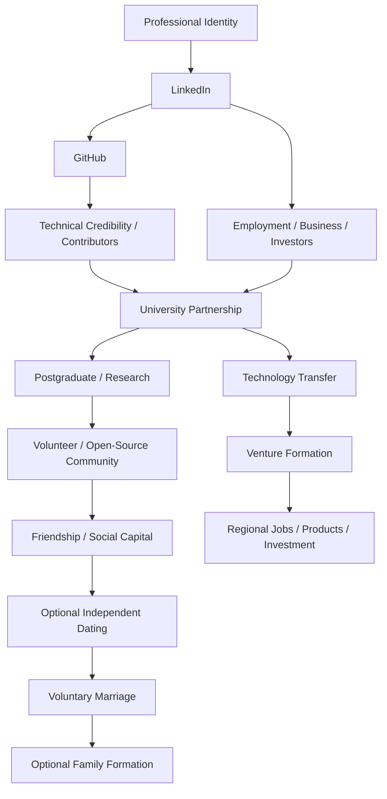

---

# 25. Recommended JFXAI4MAD Strategic Reframing

The extended project can be described as:

> **An open-source social-intelligence and community platform connecting shared interests, education, tourism, volunteering, innovation, entrepreneurship, and optional adult relationship discovery, while maintaining strict separation between academic opportunity, investment decisions, and personal relationship choices.**

This broadens JFXAI4MAD from a dating-centered architecture into a:

```text
COMMUNITY
+
EDUCATION
+
TOURISM
+
OPEN SOURCE
+
VENTURE DEVELOPMENT
+
OPTIONAL MATCHMAKING
```

platform.

---

# 26. Responsible Governance

Create four independent governance domains:

### Academic Governance
Managed by the university.

### Venture Governance
Managed by founders, investors, UVTs/incubators and applicable legal structures.

### Community Governance
Manages volunteering, events, safety and conduct.

### Relationship Governance
User-controlled and independent from academic/business authority.

A person in one authority domain should not automatically receive privileged access to another.

---

# 27. Key Safeguards for Students and Volunteers

- adults only for matchmaking;
- no academic benefit for dating participation;
- no scholarship conditioned on marriage or parenthood;
- no investor access to intimate student profiles;
- no supervisor-subordinate romantic solicitation within active supervision;
- easy opt-out from social/matchmaking features;
- anti-retaliation policy;
- conflict-of-interest disclosures;
- privacy-by-design;
- independent complaint channel;
- explicit consent for every data transfer;
- no automated marriage or fertility scoring;
- no demographic targeting designed to pressure particular groups into reproduction.

---

# 28. Suggested KPIs

## Education

- enrollment;
- completion;
- research output;
- scholarship utilization;
- project participation.

## Community

- repeat participation;
- volunteer retention;
- cross-disciplinary collaboration;
- reported belonging;
- satisfaction.

## Venture

- prototypes;
- startups/cooperatives formed;
- pilots;
- jobs;
- external capital;
- licensing;
- revenue.

## Social

- friendships and continuing community ties;
- opt-in social participation;
- user-reported relationship satisfaction.

## Family Support

Only aggregated, voluntary indicators should be used, such as:

- demand for family-support resources;
- childcare information utilization;
- housing/financial-literacy program use.

Avoid setting individual marriage or birth quotas.

---

# 29. 24-Month Pilot Roadmap

```text
Months 1–3
Governance + University/UVT discussions

Months 4–6
Postgraduate / continuing-education pilot design

Months 7–9
Open-source regional challenge

Months 10–12
Prototype demonstrations + incubator selection

Months 13–15
Independent venture formation

Months 16–18
Tourism / cultural / volunteer community expansion

Months 19–21
Community BI and social-network analytics

Months 22–24
Optional separate relationship-discovery pilot
only after privacy and ethics review
```

---

# 30. Final Integrated Architecture

```text
                    NORTHERN ARGENTINA
                           │
                    NATIONAL UNIVERSITY
                           │
            ┌──────────────┼──────────────┐
            ↓              ↓              ↓
       POSTGRADUATE      RESEARCH        UVT
            │              │              │
            └──────────────┼──────────────┘
                           ↓
                 OPEN-SOURCE PROJECTS
                           ↓
                  VOLUNTEER COMMUNITY
                           ↓
             REPEATED COLLABORATION
                           ↓
                TRUST / FRIENDSHIP
                    ┌──────┴──────┐
                    ↓             ↓
             PROFESSIONAL       OPTIONAL
             COLLABORATION      PERSONAL
                    ↓           INTEREST
               INCUBATOR           ↓
                    ↓         INDEPENDENT
                 VENTURE       MATCHMAKING
                    ↓             ↓
             JOBS / INCOME    RELATIONSHIP
                    ↓             ↓
             REGIONAL VALUE   VOLUNTARY
                              MARRIAGE
                                 ↓
                              OPTIONAL
                              FAMILY
                              PLANNING
```

---

# 31. Source and Institutional References

## JFXAI4MAD
- https://github.com/robotics-intelligent-systems/jfxai4mad

## Argentina — Higher Education / Technology Transfer
- Higher Education Law 24.521:  
  https://www.argentina.gob.ar/normativa/nacional/ley-24521-25394/actualizacion
- Technology Innovation Law 23.877:  
  https://www.argentina.gob.ar/normativa/nacional/277/actualizacion
- Technology Linkage Units (UVT):  
  https://www.argentina.gob.ar/ciencia/vinculacion-y-transferencia/unidades-de-vinculacion-tecnologica
- RedVITEC — National University Technology Transfer Network:  
  https://redvitec.cin.edu.ar/

## Northern Argentina University References
- Universidad Nacional de Salta — Postgraduate:  
  https://www.unsa.edu.ar/posgrado/
- Universidad Nacional de Jujuy:  
  https://www.unju.edu.ar/
- Universidad Nacional de Tucumán — Postgraduate:  
  https://posgrado.unt.edu.ar/
- Universidad Nacional de Santiago del Estero — Postgraduate:  
  https://posgrado.unse.edu.ar/
- Universidad Nacional del Nordeste — Postgraduate / Technology Transfer:  
  https://www.unne.edu.ar/
- Universidad Nacional de Misiones — Postgraduate:  
  https://unam.edu.ar/index.php/posgrados/carreras-de-posgrado
- Universidad Nacional de Catamarca — Postgraduate:  
  https://www.unca.edu.ar/posgrado

---

# 32. Disclaimer

This is a conceptual social-enterprise, educational-partnership, and software architecture proposal.

It is not legal, investment, university-admissions, demographic, medical, or reproductive advice.

National-university cooperation requires institution-specific agreements, governance approval, applicable procurement/financial rules, academic accreditation requirements, and—where relevant—technology-transfer or UVT structures.

The project should never use education, money, employment, investment, immigration, housing, grades, scholarships, professional references, or access to research as leverage for romantic, marital, sexual, or reproductive decisions.

Personal relationships and family planning must remain voluntary, private, adult-only, and institutionally separate from academic and investment decision-making.


---

# 33. Ethical Pronatality Incentive Policy Based on Volunteer Merit

> **Policy objective:** Support adults who voluntarily choose marriage, partnership, and parenthood by reducing economic and practical barriers through a transparent merit system based on verified volunteer contribution.
>
> **Non-negotiable boundary:** Volunteer merit may generate access to **neutral social benefits**, but it must never generate entitlement to another person, romantic priority, sexual access, marriage, pregnancy, fertility treatment, or reproductive expectations.

## 33.1 Merit-Based Volunteer Credits

Participants may accumulate transparent, auditable credits for:

- verified volunteer hours;
- open-source contributions;
- mentoring;
- community service;
- educational support;
- technical documentation;
- research assistance;
- regional development projects;
- event organization;
- environmental or cultural service.

```text
Verified Contribution
        ↓
Volunteer Merit Credits
        ↓
Transparent Eligibility Rules
        ↓
Family-Support Benefits
```

The merit system should reward contribution, not relationship status.

---

## 33.2 Eligible Pronatality-Support Benefits

Volunteer merit credits may be converted into benefits such as:

- childcare vouchers;
- parental education;
- housing support or rental assistance;
- transportation support;
- meal support;
- health and family-planning information;
- fertility and reproductive-health referrals where lawful and requested;
- continuing-education scholarships;
- flexible study/work arrangements;
- family-oriented tourism or cultural activities;
- entrepreneurship grants;
- microenterprise seed support;
- parental leave top-ups funded by the program;
- access to community childcare cooperatives.

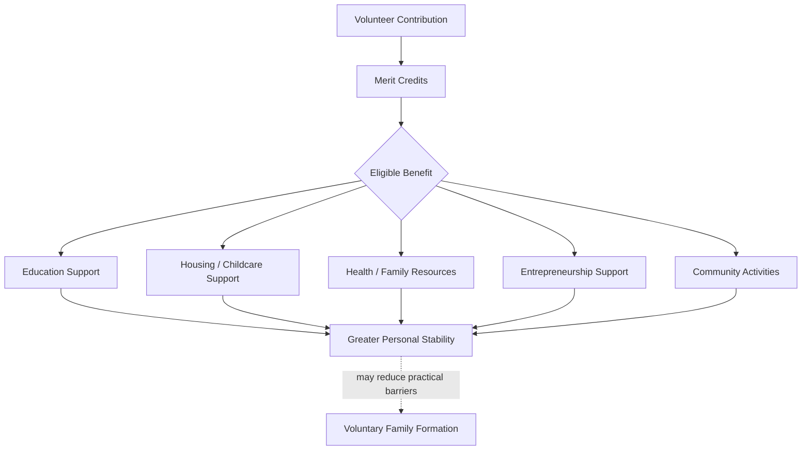

The system should not use births as a performance quota for individual volunteers.

---

# 34. Relationship Autonomy and Consensual Non-Monogamy

The platform may recognize that some adults choose:

- monogamy;
- consensual non-monogamy;
- polyamorous relationships;
- other lawful adult relationship structures.

However, relationship structure must remain a **private, opt-in preference**.

```text
Adult Participants
      ↓
Private Relationship Preferences
      ↓
Mutual Consent
      ↓
Independent Relationship Agreements
      ↓
No Effect on Volunteer Merit
      ↓
No Effect on Academic or Investment Access
```

The platform must not institutionalize or prescribe polyamory as a requirement for receiving social, educational, housing, business, or family benefits.

---

# 35. Safe Alternative to "Alternating Polyamory"

A policy that assigns or rotates partners based on volunteer merit would create unacceptable pressure and conflicts of interest.

A safe alternative is an **adult social-community model** where:

1. all relationship participation is opt-in;
2. adults disclose their relationship preferences voluntarily;
3. no ranking determines access to people;
4. participants may enter or leave consensual non-monogamous relationships privately;
5. the organization only provides neutral social spaces and conflict-resolution resources;
6. academic, volunteer, employment, housing, and investment decisions remain separate.

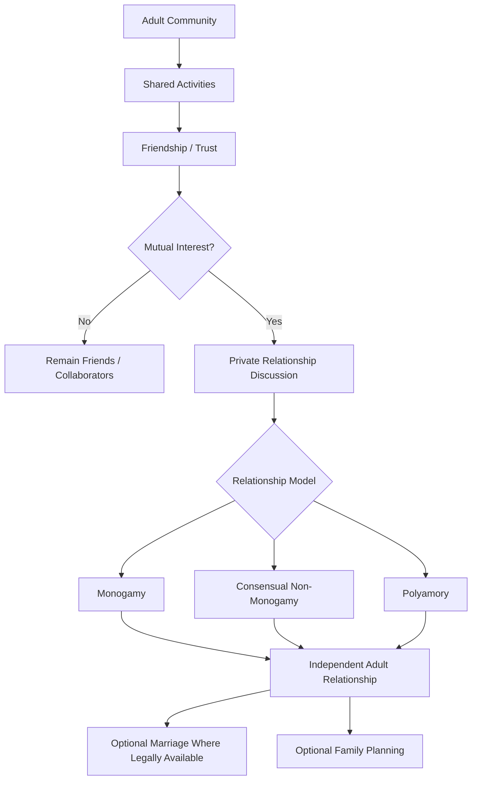

---

# 36. "Express Marriage" Reframed as Accelerated, Informed Marriage Preparation

The project should not optimize for marriage speed alone.

A safer concept is:

> **Accelerated Marriage Preparation**

This means reducing administrative and informational friction while preserving informed consent.

```text
Declared Marriage Intention
        ↓
Identity Verification
        ↓
Compatibility Discussion
        ↓
Financial / Legal Disclosure
        ↓
Conflict & Relationship Education
        ↓
Independent Legal Advice
        ↓
Cooling-Off / Reflection Period
        ↓
Voluntary Marriage Decision
```

The platform can accelerate:

- documentation;
- appointment scheduling;
- premarital education;
- financial-planning resources;
- legal-information access;
- family-support enrollment.

It should not accelerate or bypass consent.

---

# 37. Pronatality Policy Architecture

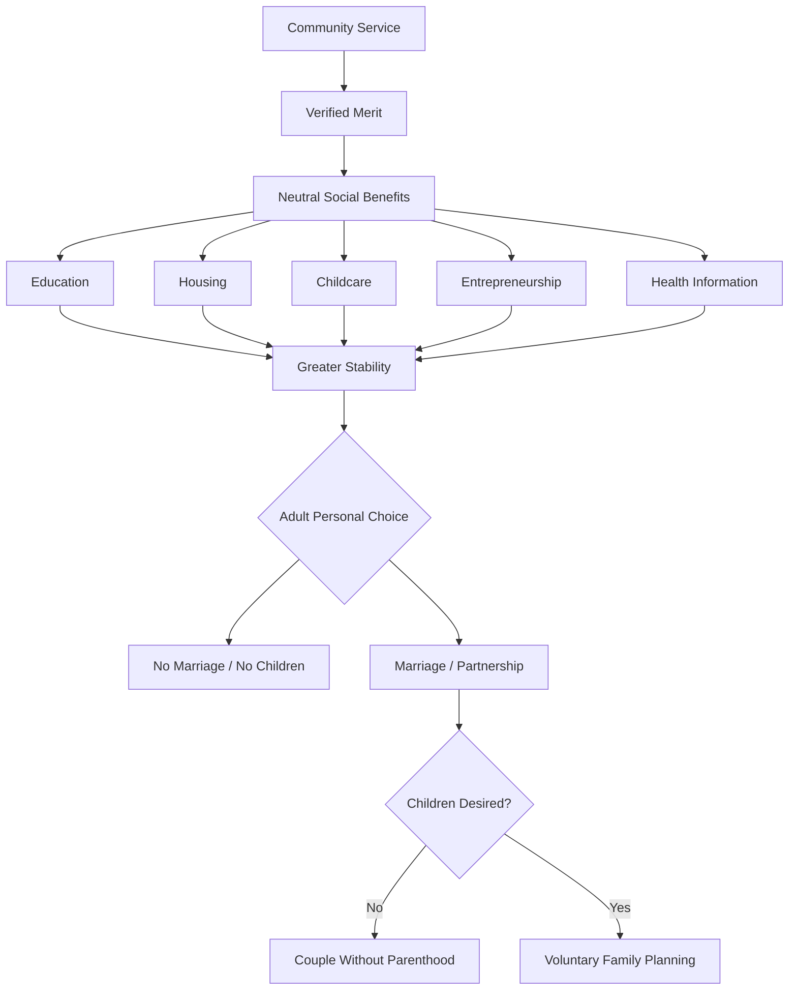

The architecture incentivizes **stability and contribution**, not reproduction itself.

---

# 38. Separation of Merit, Relationships and Reproduction

```text
VOLUNTEER MERIT
hours · contribution · mentoring · projects
            │
            ▼
SOCIAL BENEFITS
education · housing · childcare · enterprise support

---------------------------------------------------

RELATIONSHIP CHOICES
monogamy · consensual non-monogamy · polyamory
            │
            ▼
PRIVATE ADULT DECISIONS

---------------------------------------------------

REPRODUCTIVE CHOICES
children · no children · timing · health decisions
            │
            ▼
PRIVATE ADULT DECISIONS
```

No data should cross these boundaries without explicit, revocable consent.

---

# 39. Governance Rules for Pronatality Incentives

The program should require:

- adult-only participation in relationship services;
- no romantic or reproductive quotas;
- no partner assignment;
- no partner rotation imposed by the program;
- no "better partner access" for higher volunteer scores;
- no scholarship or investment bonus for marrying;
- no academic advantage for pregnancy or parenthood;
- equal access to volunteer opportunities regardless of relationship model;
- private handling of relationship-preference data;
- independent complaints and anti-retaliation mechanisms;
- conflict-of-interest rules for supervisors, professors, mentors, investors, and students;
- separate governance for volunteer merit and relationship services.

---

# 40. Recommended KPI Framework

## Volunteer Merit KPIs

- verified service hours;
- open-source contributions;
- mentoring outcomes;
- community-project completion;
- participant retention;
- quality reviews.

## Social-Support KPIs

- childcare support delivered;
- education benefits delivered;
- housing-assistance utilization;
- family-support resource access;
- entrepreneurship grants issued.

## Relationship KPIs

Only aggregated and opt-in:

- satisfaction;
- perceived safety;
- voluntary retention;
- conflict-resolution usage.

## Family-Formation KPIs

Use only population-level, voluntary indicators.

Avoid individual birth quotas or linking a participant's score to fertility outcomes.

---

# 41. Final Integrated Policy Model

```text
                 COMMUNITY SERVICE
                        ↓
                 VERIFIED MERIT
                        ↓
            NEUTRAL SOCIAL BENEFITS
          ┌────────┬────────┬────────┐
          ↓        ↓        ↓        ↓
      Education  Housing  Childcare  Venture
          └────────┴────────┴────────┘
                        ↓
               PERSONAL STABILITY
                        ↓
                  ADULT AUTONOMY
             ┌──────────┴──────────┐
             ↓                     ↓
      Professional Path       Personal Path
             ↓                     ↓
       Venture / Career      Private Relationships
                                   ↓
                         Monogamy / CNM / Polyamory
                                   ↓
                         Optional Lawful Marriage
                                   ↓
                         Optional Family Planning
```

This model preserves the original JFXAI4MAD objective of supporting long-term relationship and family-oriented decision making while preventing volunteer merit from becoming a mechanism for assigning partners, pressuring marriage, or conditioning reproductive choices.
