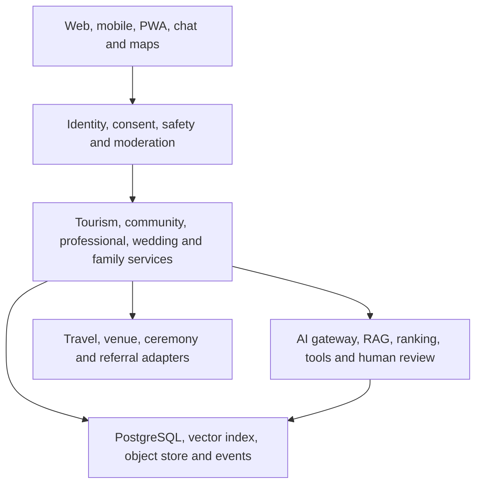

  

  <em>Travel Connections Architecture — JFXAI4MAD</em>

# Evidence-Based Social Discovery, Tourism and Optional Relationship Services

**Expanded English consolidation and executive summary · 13 September 2026**  
**Repository:** [`robotics-intelligent-systems/jfxai4mad`](https://github.com/robotics-intelligent-systems/jfxai4mad)  
**Reviewed source:** `main` at commit `8df406c6337636a5ce033cd86917bd57a9259993`  
**Status:** Proposed architecture and product baseline for review. No provider API, hotel partnership, university partnership or commercial integration is confirmed by this document.

## Executive summary

JFXAI4MAD is an open-source concept for combining travel planning, cultural discovery, communities, professional collaboration and optional adult relationship services. The repository already describes remote wedding coordination, wedding tourism, consensual non-monogamy, voluntary shared accommodation, family celebrations, local private support, AI-assisted recommendations, multilingual retrieval and a future provider-adapter model. This consolidated version keeps those capabilities while adding an evidence discipline for the supplied analysis about attraction, occupations, age groups, night work, cities, universities and dating applications.

The analysis is useful as an idea backlog, but its occupation-by-age lists, claims about polyamory or infidelity by profession, night-shift demographics, city rankings, university “attractiveness” rankings and generalizations about application behavior do not provide a reliable basis for classifying people. The product therefore uses self-declared adult preferences, interests, boundaries, availability, travel intent and community participation. It does not infer attraction, sexual orientation, relationship behavior, fertility, consent or character from employment, age, gender, location, campus, income or schedule. The cited Chapman study is a national quota sample of 3,438 single adults in the United States and is relevant to the scope of relationship research, but it does not validate an occupation-based ranking for individual users. [Chapman University record](https://digitalcommons.chapman.edu/psychology_articles/241/) and [published paper](https://doi.org/10.3389/fpsyg.2021.619640).

The recommended implementation is modular. Identity, consent, safety, professional collaboration, travel, wedding cases, family events and private support have separate service boundaries and data permissions. A local-first AI gateway can route open models, RAG, tools and human review. Recommendation scores describe explicit service fit and mutual opt-in; they are not probabilities that one person will be attracted to another. A small PostgreSQL plus vector-search MVP can precede an event bus, Kubernetes and larger model operations. Every legal or provider claim is dated, jurisdiction-scoped and linked to evidence.

## 1. Consolidated project scope

JFXAI4MAD connects five related but separately governed domains:

| Domain | Purpose | Boundary |
|---|---|---|
| Tourism and culture | Destinations, hotels, cruises, yachts, attractions, activities, routes and local events | A travel booking never enrolls a person in relationship discovery |
| Community and social discovery | Interest groups, conversations, events, introductions and networking | Participation is voluntary, adult-only where personal discovery is involved |
| Professional and academic collaboration | Marketing, CRM, occupational health and safety, balanced-scorecard work, volunteering, study and venture formation | Professional records never expose intimate preferences or support cases |
| Optional adult relationship and wedding services | Consensual non-monogamy, symbolic commitments, remote wedding case coordination and voluntary room sharing | Each adult accepts separately; marital status remains a legal record |
| Family events and private support | Welcome gatherings, accessibility, confidential assistance and later family-law referrals | Children can attend approved family events but never enter adult discovery |

The repository’s current README is the product and requirements baseline. The accompanying Draw.io diagram, [`ai_tourism_social_architecture.drawio`](https://github.com/robotics-intelligent-systems/jfxai4mad/blob/main/MBSE/CAS/drawio/ai_tourism_social_architecture.drawio), is a candidate reference architecture rather than evidence that every component is deployed. The repository also contains MBSE, CAD, CAS and digital-twin assets for other engineering work; those assets can inform systems engineering but are outside the first social-tourism MVP.

### Design principles

1. **Choice before matching.** A person chooses whether to use tourism, community, professional, relationship, wedding or family services.
2. **Consent is granular and revocable.** A booking, introduction, room share, conversation and document share have separate permissions.
3. **Evidence before automation.** A claim carries a source, population, date, jurisdiction, variables and confidence label.
4. **Human review for legal and safety matters.** The AI explains procedures and prepares tasks; it does not decide legal capacity, marital status, foreign recognition or safety outcomes.
5. **Data minimization.** Collect what is required for a selected service, retain it for a stated period and prevent sensitive data from crossing domains.

## 2. Translating the supplied analysis into responsible product requirements

The attached document, **“La probabilidad de atraer(1).txt,”** is treated as exploratory market research. It is not a validated dataset and is not used to score or target identifiable people. The following translation preserves potentially useful product questions while removing unsupported profiling.

| Analysis topic | Evidence assessment | Product translation |
|---|---|---|
| Occupations that supposedly attract women by age | The attachment gives narrative lists of jobs and motives but no sampling frame, denominator, geography, measurement instrument or reproducible ranking. | Offer optional value and interest tags such as creativity, service, adventure, stability, learning and leadership. Let adults choose what they want to disclose and see. Do not assign attraction weights to occupations or age bands. |
| Profession, polyamory and infidelity | The attachment mixes consensual non-monogamy with infidelity and relies on anecdotes, posts and weakly identified sources. The Chapman study measures relationship desire and experience in a U.S. sample; it does not justify a professional “probability” for an individual. | Treat monogamy, consensual non-monogamy and polyamory as self-declared, changeable preferences. Never infer them from a job, gender, age, nightlife participation or message pattern. |
| Night-shift work and young women | Job advertisements and social posts show that night work exists; they do not establish the joint distribution of age, gender, occupation and shift for a population. | Ask for preferred contact windows, quiet hours, time zone and travel availability. Use an opt-in calendar or declared availability, never employer schedules or job titles as a proxy. |
| Lesbian or queer city concentrations | The cited style of list mixes sexual identity, queer/FLINTA categories, couples, venues and editorial impressions. It is not a comparable census of individual women. | Allow adults to self-describe identity and discovery boundaries. Recommend verified inclusive venues and events by location, accessibility and organizer policy, not by guessing who is queer. |
| Dating-app and campus behavior | Features and eligibility change by region and product. Tinder’s official College Mode requires a qualifying institution and a valid student email in supported regions; that does not prove availability for every university or Peru. Bumble’s Opening Moves feature documents prompt-based conversation starts; it does not support a universal claim that one gender must always message first. [Tinder College Mode](https://www.help.tinder.com/hc/en-us/articles/360015516052-Tinder-U-College-Mode) · [Bumble Opening Moves](https://bumble.com/en/features/opening-moves/). | Maintain a dated capability register with region, eligibility, source URL and verification date. Build only authorized adapters. Present campus groups as opt-in communities and never pressure an institution to facilitate dating. |
| “Most attractive” university rankings | The attachment acknowledges that its Peruvian university lists are anecdotal and not a scientific ranking. Physical attractiveness is not a legitimate platform metric for eligibility or access. | Support opt-in campus events, study and venture communities, accessibility and safety information. Do not rank universities or students by appearance, desirability or presumed relationship intent. |

This evidence matrix becomes an implementation control: a hypothesis can inform a survey or usability test, while a production recommendation must rely on a user’s current, explicit choice and a service-relevant fact.

## 3. Product proposition and user journeys

### Who the platform serves

- **Travellers and event guests** plan cultural, sporting, wellness or family itineraries.
- **Adult participants** choose relationship discovery, a symbolic commitment, voluntary shared lodging or a remote legal-wedding case as an additional service.
- **Organizers and hosts** manage invitations, capacity, accessibility, schedules and venue conditions.
- **Professional and academic users** collaborate on marketing, volunteering, learning and venture formation through a separate workspace.
- **Support staff** handle confidential assistance, safeguarding, complaints and referrals.
- **Providers and authorities** remain the issuers of bookings, ceremonies, certificates and legal outcomes.

### Service packages retained from the baseline

1. Remote Wedding Stay
2. Destination Wedding Weekend
3. Consensual Relationship Retreat
4. Symbolic Commitment Celebration
5. Cultural Wedding Journey
6. Active Celebration
7. Welcome-to-Family Gathering
8. Independent Assistance

A person may use any tourism package without using relationship services. A symbolic celebration is not automatically a civil marriage. A relationship preference is not a marital-status assertion. A family gathering is not an adult discovery event.

### Journey and state separation

The standard journey is **account choices → eligibility and safety review → quote and consent approval → arrival and room choice → ceremony or event → provider document follow-up → celebration → checkout → optional later referral**. Each state machine is independent:

- `relationship_preference`: undisclosed, monogamy, consensual non-monogamy or polyamory.
- `relationship_participation`: invited, accepted, declined or withdrawn.
- `marital_status_assertion`: unknown, unmarried, married, divorced or widowed, with evidence metadata.
- `legal_proceeding_status`: none, separation requested, ordered, divorce pending or final decree.
- `wedding_case_status`: draft, review pending, ready, scheduled, ceremony completed, documents pending, documents verified or cancelled.
- `certificate_delivery_status`: awaiting ceremony, officiant submission, digital copy, received or delayed.
- `stay_status`: proposed, booked, check-in, check-out or cancelled.
- `event_status`: proposed, approved, delivered or cancelled.

A hotel receipt cannot establish divorce. Checkout cannot alter civil status. A provider filing confirmation cannot be displayed as an authority-issued decree.

## 4. Reference integration architecture

### Logical layers

| Layer | Proposed responsibility | Open-source direction | Maturity in this repository |
|---|---|---|---|
| Client and edge | Web/mobile/PWA, chat, maps, notifications, localization and accessibility | PWA plus a documented API gateway | Concept |
| Trust and identity | OIDC, age gate, consent ledger, block/report, abuse controls, audit and encryption | OIDC provider, policy engine and application-level authorization | Concept |
| Domain services | Tourism coordinator, matching, communities, events, wedding case manager, family events and private support | Modular services or a modular monolith with clear ports | Concept |
| AI and decision support | LLM gateway, agent router, RAG, embeddings, ranking, safety classifiers and human-in-the-loop | Open models, spaCy/OpenNLP, Qdrant or FAISS; model choices remain replaceable | Candidate stack in diagram |
| Knowledge | Dated source registry, legal/procedural corpus, destination catalogue, venue policies and provider capability records | PostgreSQL metadata plus vector retrieval | Concept |
| Data and events | Transactional data, cache, object storage, analytics and outbox/event bus | PostgreSQL, Redis, object storage, Kafka or Redpanda when scale requires it | Concept |
| Integration | Provider handoff, webhook or API adapters with capability disclosure | Adapter interface with reconciliation and idempotency | No confirmed integration |
| Operations and MBSE | CI, containers, observability, model evaluation, threat modelling and traceability to requirements | Docker, Kubernetes, OpenTelemetry, Prometheus, Grafana and Draw.io/MBSE artefacts | Reference only |

The first MVP should use PostgreSQL, a vector index, an open-model gateway and a modular application with an outbox. Kafka/Redpanda, Kubernetes and multi-model routing can be introduced after usage, reliability and privacy requirements are measured. This sequence reduces operational cost without closing the future architecture.

## 5. AI integration and recommendation behavior

The AI layer provides assistance and explanation. It does not act as an authority, therapist, matchmaker with hidden preferences or autonomous booking agent.

### Components

- **LLM gateway:** routes prompts to a local or hosted open model, applies redaction and records model/version metadata.
- **Agent router:** selects a narrow workflow such as itinerary planning, venue policy lookup, document checklist or support triage.
- **RAG service:** retrieves dated, jurisdiction-scoped sources and returns citations plus an uncertainty state.
- **Recommendation service:** filters by eligibility and consent, then ranks explicit service fit, shared activities, availability, distance, budget, accessibility and reciprocal opt-in.
- **Safety and review queue:** blocks disallowed content, detects coercion or unsafe contact patterns and assigns ambiguous cases to trained staff.
- **Evaluation service:** runs synthetic and consented test cases for citation accuracy, leakage, bias, refusal and withdrawal behavior.

A recommendation is represented as an explainable service suggestion: “both adults opted into a coastal hiking event, their declared dates overlap and the venue meets the selected accessibility requirements.” The system does not say “this person is likely to be attracted to you,” and it never converts occupation, age or inferred identity into such a probability.

### Consent-aware matching flow

1. Confirm adult eligibility and account safety status.
2. Apply each person’s explicit discovery boundaries and exclusions.
3. Apply event, travel, budget, language, accessibility and availability constraints.
4. Require reciprocal opt-in before revealing contact or room-sharing details.
5. Explain the factors used, offer a reason to hide or change each factor and log the model version.
6. Allow immediate block, report and withdrawal; revoke pending invitations and downstream notifications.

## 6. Data contracts, privacy and safety

### Minimum data model

| Record | Required fields | Access policy |
|---|---|---|
| `adult_profile` | Account identifier, age/eligibility evidence, language, coarse location and chosen display fields | User plus services explicitly authorized for the selected journey |
| `preference_declaration` | Self-declared relationship preference, discovery boundary, interests and visibility/expiry settings | Private by default; never exported to professional marketing |
| `availability_window` | Time zone, contact windows, travel dates and quiet hours | Used for scheduling; not derived from job or employer data |
| `consent_grant` | Actor, action, scope, recipient, issued time, expiry and revocation | Immutable audit trail; current permission evaluated at request time |
| `introduction` | Participants, event/context, status and separate acceptances | Participants and authorized safety staff |
| `wedding_case` | Jurisdiction, provider, ceremony state, documents and review tasks | Case staff and named participants only |
| `document_provenance` | Issuer, document type, jurisdiction, source, hash, received time and verification state | Restricted document access; audit every read |
| `family_event` | Adult organizer, guest list, venue capacity, accessibility and schedule | Child attendees represented only as event guests where required |
| `support_case` | Need category, safe channel, assigned staff, referrals and retention deadline | Confidential from partners, sponsors and organizers by default |

Relationship preference, participation, marital status, legal proceeding, wedding case, certificate delivery, stay and event status must remain separate columns or aggregates. Do not create a universal “relationship score.”

### Privacy controls

- Collect sensitive data only after a user selects a service that needs it.
- Use purpose, visibility, retention and expiry fields for every sensitive declaration.
- Keep professional, academic, relationship, support and family data stores logically separated, with deny-by-default exports.
- Use coarse location until a confirmed booking requires a specific venue or room.
- Encrypt data in transit and at rest; keep keys outside application data; record administrative access.
- Provide self-service export, correction, withdrawal and deletion workflows subject to legal retention duties.
- Apply minimum-cell-size and suppression rules to analytics; never publish a segment of identifiable people.
- Keep children out of adult profiles, discovery, messaging and recommender training.

### Safety and vulnerable-adult support

Assistance must remain available regardless of relationship choice, travel purchase, immigration status, housing need, pregnancy, gender or reproductive decision. Private channels, an exit action, safe-contact scheduling, local referrals and incident escalation are service features. No vulnerability field may improve a romantic ranking or unlock a sponsor’s access.

## 7. Legal, ceremony and provider operations

Courtly, hotels, travel operators and authorities are candidate participants in the integration design. Their contracts, APIs, webhooks, service regions, fees and terms must be verified before a production adapter is enabled. A handoff to a provider’s official page is recorded as a handoff; it is never represented as a successful API booking.

A jurisdiction-specific case can follow this generic pattern: identity and eligibility review → application or license → authorized officiant and ceremony → officiant submission → authority document delivery → optional certified copy, paper copy or apostille. The Utah County official process illustrates why the ceremony and officiant submission precede digital certificate delivery, with paper delivery handled separately; this is a jurisdictional example, not a universal promise. [Utah County Marriage License](https://clerk.utahcounty.gov/marriage-license).

The product may display a provider’s advertised “24-hour” digital-certificate service only when the provider terms, ceremony completion time, submission evidence, deadline and actual receipt are all stored. A missed deadline creates a delay task and staff escalation; it never changes a pending status to “issued.” Foreign recognition, translation, paper copies and apostilles require separate review. No checkout event, hotel invoice or symbolic ceremony may change civil status.

## 8. High-level requirements and acceptance evidence

All requirements are proposed. Owners are assigned during implementation.

| ID | Requirement | Acceptance evidence |
|---|---|---|
| R-01 | Present legal wedding, symbolic ceremony, tourism and relationship services as distinct choices. | Travel can be booked without personal-service enrollment. |
| R-02 | Accept only adults aged 18 or above, or a higher applicable threshold. | Age-boundary and exception tests pass. |
| R-03 | Require separate acceptance from every adult affected by an introduction or shared room. | A group payer cannot substitute for another participant. |
| R-04 | Let a participant withdraw and revoke affected permissions without another participant’s approval. | Invitations, room sharing and organizer access are revoked. |
| R-05 | Tie wedding readiness to jurisdiction and reviewed eligibility evidence. | Unresolved legal questions create a review hold. |
| R-06 | Prevent checkout, receipts or travel completion from changing civil-status evidence. | Status remains unchanged after booking and checkout tests. |
| R-07 | Keep provider filing estimates separate from authority-issued outcomes. | Filing confirmation cannot render as a final decree. |
| R-08 | Record property approval for accommodation and event use. | Confirmation names the property and agreed conditions. |
| R-09 | Expose each adapter’s integration method and confirmation source. | Handoff-only adapters cannot claim API success. |
| R-10 | Keep assistance requests confidential from partners, sponsors and organizers by default. | Role and notification tests show restricted access. |
| R-11 | Exclude relationship and support-case data from professional marketing exports. | Cross-domain export tests reject sensitive fields. |
| R-12 | Keep children out of adult discovery and personal-profile recommendations. | Family invitations cannot create child dating profiles. |
| R-13 | Cite reviewed procedural sources and escalate RAG uncertainty. | Tests cover recognition, filing and instant-certificate claims. |
| R-14 | Store issuer, type, jurisdiction, provenance and access metadata for participant documents. | Document validation and authorization tests pass. |
| R-15 | Keep assistance and economic benefits independent of romantic or reproductive decisions. | Workflow and commercial-term review passes. |
| R-16 | Show fees, provider, cancellation terms and participant authorization for every charged service. | Approval and reconciliation records match charges. |
| R-17 | Track any advertised 24-hour digital certificate using ceremony completion, provider terms, deadline and actual receipt; keep paper and apostille tasks separate. | Missing delivery creates delay escalation, never an issued state. |
| R-18 | Require an evidence record for every factual recommendation or legal/procedural claim. | Source URL, population, date, jurisdiction, variables and confidence are present. |
| R-19 | Use only explicit, current user attributes and service context for recommendations. | Model tests show no inference from job, age, gender, city, campus or message style. |
| R-20 | Let users control visibility, expiry and correction of preference, interest and availability declarations. | UI/API tests demonstrate consent changes and expiry. |
| R-21 | Derive scheduling from declared windows, calendars or travel dates with permission. | No employer roster or job-title proxy is read. |
| R-22 | Maintain a dated capability register for dating-app, campus and provider features by region. | Unsupported regions display “not verified” and stop automated actions. |
| R-23 | Offer opt-in inclusive events and campus communities without institutional pressure or individual orientation inference. | Venue and cohort tests use organizer policy and self-description only. |
| R-24 | Provide block, report, safe exit, incident triage and human escalation at every adult-contact point. | Safety drills cover coercion, withdrawal, lost connection and provider dispute. |
| R-25 | Version models, prompts, source collections and ranking policies. | Release gate includes leakage, citation, fairness, refusal and rollback evaluation. |

## 9. Business model and outcome measurement

Legitimate revenue may come from transparent coordination fees, event planning, hospitality referrals, activity bookings, provider reconciliation and organization-facing software subscriptions. Revenue must never depend on access to women, partner turnover, sexual activity, fertility, pregnancy, divorce or a user’s decision to disclose an intimate preference.

Recommended measures include itinerary completion, informed-consent completion, reciprocal opt-in rate, event attendance, user-reported safety, support response time, provider confirmation accuracy, document-delivery timeliness, complaint resolution, accessibility satisfaction, supplier benefit and sustainable-travel indicators. Do not use “number of women attracted,” inferred promiscuity, reproductive counts or relationship conversion as KPIs.

Experiments should be opt-in, purpose-limited and reported with uncertainty. Small cohorts require suppression and minimum-cell rules. A/B tests must never hide withdrawal, safety reporting or legal-source citations.

## 10. Open-source implementation and delivery plan

| Stage | Deliverable | Exit condition |
|---|---|---|
| 0. Evidence and governance | Source registry, data map, threat model, consent vocabulary, legal/provider review checklist and product decision records | Every proposed claim is labelled as evidence, hypothesis or open question. |
| 1. Local-first MVP | Modular API, PostgreSQL, vector search, open-model gateway, RAG citations, consent ledger, event catalogue and manual concierge workflows | Synthetic tests pass for separation of domains, revocation, child safety and legal uncertainty. |
| 2. Controlled pilot | One destination, one jurisdiction, selected adults, verified venues and trained support staff | Safety, privacy, accessibility, provider reconciliation and satisfaction gates pass. |
| 3. Authorized integrations | Provider adapters for confirmed APIs, webhooks or documented handoffs; idempotency and reconciliation | Contract owners approve scopes, terms, failure states and audit logs. |
| 4. Scale and MBSE traceability | Event bus, Kubernetes, observability, model registry, capacity planning and links from requirements to tests and Draw.io/MBSE artefacts | Reliability, cost, model quality and privacy budgets are measured before expansion. |

### Suggested repository additions

- `docs/product/evidence-register.md` with claim, source, population, date, jurisdiction, variables, confidence and reviewer.
- `docs/architecture/adr-*.md` for domain boundaries, local-model routing, vector search, event outbox and provider adapters.
- `docs/privacy/data-inventory.md` and a retention/deletion matrix.
- `docs/contracts/` for consent, booking, document provenance, provider capability and webhook schemas.
- Synthetic fixtures for adult-only, family-event, withdrawal, disputed-document and unavailable-provider scenarios.
- Model and prompt evaluation reports linked to R-13, R-18, R-19 and R-25.

## 11. Risks, limitations and pilot decisions

The concept remains dependent on decisions that cannot be automated: launch jurisdiction, ceremony provider and terms, venue capacity and accessibility, local safeguarding partners, support staffing, identity and age verification, foreign-document recognition, data-retention duties, payment and cancellation rules, and the definition of an acceptable pilot cohort.

The supplied analysis should be validated through anonymous, voluntary research rather than converted into demographic targeting. A future survey may test which values, activities, schedules and travel constraints users want to disclose. It should report sampling and uncertainty and should never ask the platform to label a person’s orientation or fidelity from a job or location.

Before a pilot, the product owner should approve the service catalogue, the privacy officer should approve the data map, legal counsel should review each jurisdiction, providers should sign capability statements, support staff should complete safeguarding training, and an independent reviewer should inspect model evaluations and withdrawal paths.

## 12. Evidence and source register

- [LinkedIn Network and Portfolio Opportunity Report](reports/linkedin-network-portfolio-opportunity-analysis-2026-09-01-15-en.md).
- [AI tourism and social architecture diagram](https://github.com/robotics-intelligent-systems/jfxai4mad/blob/main/MBSE/CAS/drawio/ai_tourism_social_architecture.drawio) — candidate reference architecture.
- Moors, Gesselman and Garcia, [“Desire, Familiarity, and Engagement in Polyamory”](https://digitalcommons.chapman.edu/psychology_articles/241/) — national quota sample of 3,438 single U.S. adults; useful for research scope, not occupational profiling. The published article is [available through Frontiers](https://doi.org/10.3389/fpsyg.2021.619640).
- [Tinder U / College Mode eligibility](https://www.help.tinder.com/hc/en-us/articles/360015516052-Tinder-U-College-Mode) — official, region- and institution-specific product capability.
- [Bumble Opening Moves](https://bumble.com/en/features/opening-moves/) — official prompt-based conversation feature; product behavior must be checked by region and date.
- [Utah County Marriage License process](https://clerk.utahcounty.gov/marriage-license) — official example of application, officiant submission and certificate delivery sequence.

All web product and legal references should be rechecked at implementation time. A source link records provenance; it does not create a partnership, guarantee recognition or authorize an automated legal decision.

## One-paragraph positioning summary

JFXAI4MAD is a modular open-source platform for consent-aware tourism, cultural communities, professional collaboration and optional adult relationship or remote-wedding services. It helps adults plan trips, events, introductions and provider workflows while keeping professional, family, legal and support records separate. Its AI gateway combines open models, multilingual RAG and explainable ranking to organize information and service fit from explicit user choices. The platform does not infer attraction, orientation, fidelity or reproductive intent from occupation, age, gender, city or campus. Every recommendation, certificate task and provider handoff carries a source, permission, jurisdiction and audit trail, with human review for legal, safety and safeguarding decisions.
