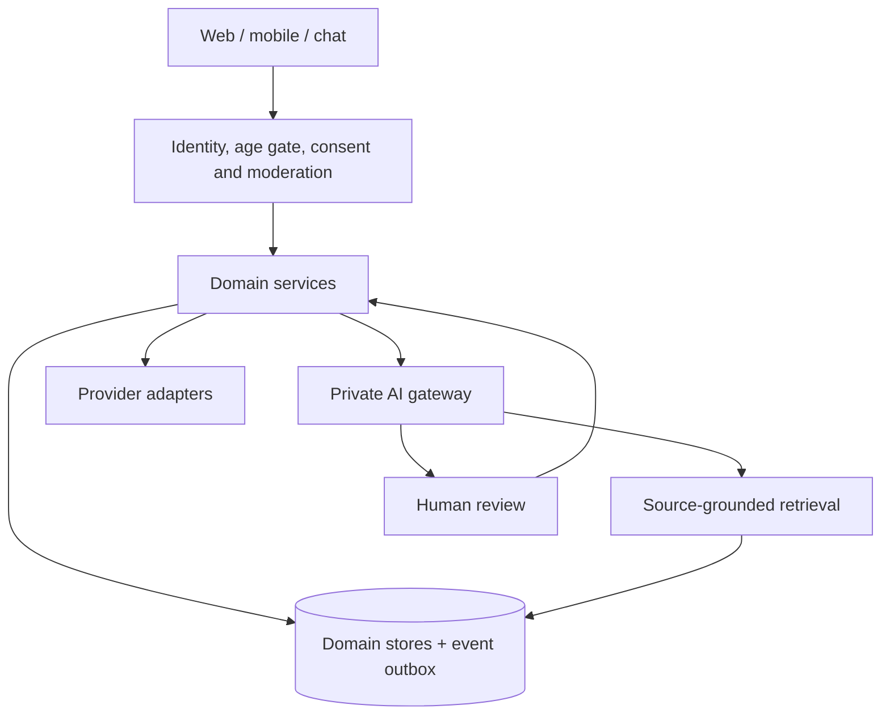

# JFXAI4MAD — GraalFlectra / Odoo, AI Coordination and OpenTwin MBSE

**Status:** proposed reference architecture, product model and research workspace.

JFXAI4MAD is a modular open-source concept that combines an Odoo/Flectra-derived enterprise platform, GraalPy/GraalVM migration research, private AI integration, destination-travel and LegalTech coordination, professional collaboration, adult-only social discovery, and MBSE/OpenTwin design studies.

The repository currently contains documentation, research notes, concept images and requirements diagrams. Proposed services, integrations, partnerships, budgets and performance figures are planning material unless explicitly documented as implemented or externally verified.

## Documentation map

The root README is intentionally concise. Detailed material is organized by domain under `docs/`.

| Area | Primary document | Purpose |
| --- | --- | --- |
| Architecture | [Odoo/Flectra → GraalPy migration](docs/architecture/odoo-graalpy-migration.md) | Runtime compatibility, C extensions, concurrency, polyglot services and migration gates |
| Architecture | [Platform integration and AI](docs/architecture/platform-integration-ai.md) | Domain services, private AI gateway, retrieval, human review and provider adapters |
| Product | [Consolidated project scope](docs/product/project-scope.md) | Platform domains, boundaries and implementation-status language |
| Product | [Valles de Alborada hybrid residence](docs/product/valles-de-alborada-hybrid-residence.md) | Residential concept, shared infrastructure and optional rental operations |
| Strategy | [Modern cooperative settlement evaluation](docs/strategy/modern-cooperative-settlement-evaluation.md) | Historical analogy, candidate regions, assumptions and evaluation gates |
| Product | [Requirements and consent](docs/product/requirements-and-consent.md) | Evidence-to-requirement rules, granular consent and sensitive-inference restrictions |
| Business | [Business model and KPIs](docs/business/business-model-and-kpis.md) | Revenue hypotheses, metrics and evaluation rules |
| Roadmap | [Implementation and investment](docs/roadmap/implementation-and-investment.md) | Delivery phases, architecture-migration track and budgeting policy |
| Strategy | [Strategy index](docs/strategy/README.md) | Navigation to long-form institutional and comparative analysis |
| Strategy | [Lean presales demonstrator plan](docs/strategy/lean-presales-demonstrator-plan.md) | Stakeholder demos, mock-service architecture and cost controls |
| Strategy | [Portfolio prioritization and delivery](docs/strategy/portfolio-prioritization-and-delivery-plan.md) | Low-code/robotics workstreams, six-month scenario and decision gates |
| Collaboration | [Recruiter partnership template](docs/strategy/recruiter-partnership-outreach-template.md) | Adaptable English outreach draft with verified-fact placeholders |
| Research | [Match Group and peer marriage-conversion research](docs/research/platforms/match-group-and-peer-marriage-conversion.md) | Platform scope, unverified qualitative claims and cohort measurement framework |
| Research | [Inbound tourism origin markets](docs/research/tourism/inbound-origin-market-research.md) | Consolidated exploratory notes for 14 destinations; rankings remain unverified |
| MBSE | [OpenTwin modular habitat](docs/mbse/opentwin-modular-habitat.md) | CAD/simulation concept, validation work package and related assets |
| Research | [Documentation index](docs/README.md) | Thematic index for migrated research notes and supporting material |

## Architecture overview

The proposed platform separates identity/consent, domain services, AI processing, provider adapters and auditable persistence.


```mermaid
flowchart TD
    U[Web / mobile / chat] --> I[Identity, age gate, consent and moderation]
    I --> S[Domain services]
    S --> A[Private AI gateway]
    S --> P[Provider adapters]
    S --> D[(Domain stores + event outbox)]
    A --> R[Source-grounded retrieval]
    A --> H[Human review]
    R --> D
    H --> S
```

The ERP/runtime track is documented separately so that GraalPy migration risk does not obscure the product architecture. See [Odoo/Flectra → GraalPy migration](docs/architecture/odoo-graalpy-migration.md).

## Core platform domains

- **Destination tourism and culture** — itineraries, accommodation, events and concierge coordination.
- **Marriage services and LegalTech** — document checklists, scheduling and case coordination for supported civil procedures.
- **Professional collaboration** — B2B partnerships, institution-led projects and opt-in professional communities.
- **Adult social discovery** — voluntary, age-gated, reciprocal introductions with separate consent controls.
- **Private support and family events** — confidential logistics and age-appropriate family participation, isolated from adult discovery.

Detailed boundaries are defined in [Consolidated Project Scope](docs/product/project-scope.md) and [Requirements and Consent](docs/product/requirements-and-consent.md).

## Odoo/Flectra and GraalPy track

The project evaluates an Odoo/Flectra-derived ERP runtime on GraalPy/GraalVM. The objective is not to assume automatic performance gains, but to test compatibility and identify where polyglot or native workers are justified.

The migration plan covers:

1. dependency audit;
2. GraalPy runtime prototype;
3. C-extension adaptation;
4. ORM and concurrency validation;
5. selected polyglot integrations;
6. performance/security testing; and
7. staging/rollback rehearsal.

Detailed compatibility and acceptance criteria are maintained in [`docs/architecture/odoo-graalpy-migration.md`](docs/architecture/odoo-graalpy-migration.md). The companion architecture diagram remains at [`MBSE/CAS/drawio/odoo-graalpy-migration.drawio`](MBSE/CAS/drawio/odoo-graalpy-migration.drawio).

## Business and implementation

Revenue and performance assumptions remain hypotheses pending controlled pilots. The platform is intended to monetize delivered coordination services rather than intimate data or vulnerability.

- [Business model and KPI framework](docs/business/business-model-and-kpis.md)
- [Implementation and investment roadmap](docs/roadmap/implementation-and-investment.md)

Historic staffing, AI-subscription and infrastructure cost estimates have been moved out of the root README and reframed as planning inputs that require current quotations.

## Strategic and research documentation

Long-form material remains separated from the implementation overview:

- [Strategic and institutional annex](docs/ANNEX.md)
- [Strategy navigation index](docs/strategy/README.md)
- [Consolidated documentation annex](docs/ANNEX-DOCS-CONSOLIDATED.md)
- [Thematic documentation index](docs/README.md)

Research notes include tourism, mobility, professional collaboration, adult relationships, comparative legal/socioeconomic analysis, child protection, platform integrity and related evidence-quality safeguards. Historical numerical, legal, medical, demographic and market claims must be revalidated before operational use.

## MBSE and OpenTwin

The repository includes concept renderings and requirements diagrams under `MBSE/`.

- [OpenTwin modular habitat and shared-retreat work package](docs/mbse/opentwin-modular-habitat.md)
- [CAD concepts](MBSE/CAD/)
- [Requirements and architecture diagrams](MBSE/CAS/drawio/)

The visual assets are conceptual engineering studies; dimensions, structures, access, utilities and simulation claims require model reconciliation and verification.

## Repository layout

```text
.
├── README.md
├── docs/
│   ├── architecture/
│   │   ├── odoo-graalpy-migration.md
│   │   └── platform-integration-ai.md
│   ├── product/
│   │   ├── valles-de-alborada-hybrid-residence.md
│   │   ├── project-scope.md
│   │   └── requirements-and-consent.md
│   ├── business/
│   │   └── business-model-and-kpis.md
│   ├── roadmap/
│   │   └── implementation-and-investment.md
│   ├── strategy/
│   │   ├── README.md
│   │   ├── modern-cooperative-settlement-evaluation.md
│   │   ├── lean-presales-demonstrator-plan.md
│   │   ├── portfolio-prioritization-and-delivery-plan.md
│   │   └── recruiter-partnership-outreach-template.md
│   ├── research/
│   │   ├── README.md
│   │   └── tourism/inbound-origin-market-research.md
│   ├── mbse/
│   │   └── opentwin-modular-habitat.md
│   ├── README.md
│   ├── ANNEX.md
│   └── ANNEX-DOCS-CONSOLIDATED.md
└── MBSE/
    ├── CAD/
    └── CAS/drawio/
```

## Governance principles

- Explicit consent and age-appropriate boundaries are mandatory.
- Professional and intimate contexts must remain logically separated.
- AI outputs for legal or jurisdiction-sensitive workflows require source tracking and human review.
- No intimate preference should be inferred from GitHub, LinkedIn, occupation, nationality, income or other professional/demographic proxies.
- Consensual adult sex-work research is analytically distinct from trafficking, coercion and child sexual exploitation.
- Budget, prevalence, market and legal claims inherited from exploratory notes require current authoritative validation before external use.

## Additional resources

- [Network and portfolio opportunity report](reports/linkedin-network-portfolio-opportunity-analysis-2026-09-01-15-en.md)
- [Documentation index](docs/README.md)
- [Strategic annex](docs/ANNEX.md)
- [Consolidated documentation annex](docs/ANNEX-DOCS-CONSOLIDATED.md)

**Positioning:** JFXAI4MAD is an evidence-led modular architecture and research project for ERP modernization, AI-assisted coordination, destination/LegalTech services, professional collaboration and OpenTwin/MBSE studies, with explicit user choice and human accountability at its core.
