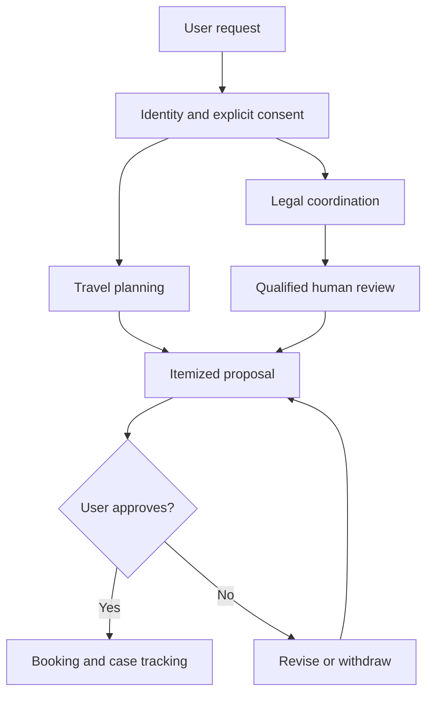
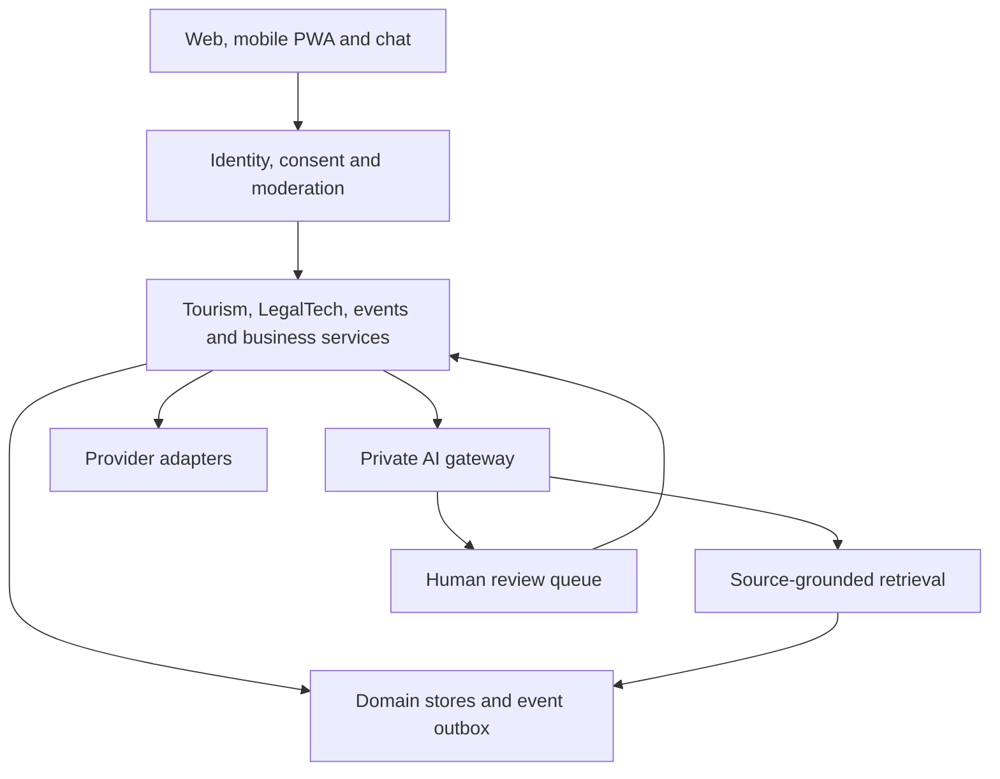

# GraalFlectra (Odoo) — High-Performance, Polyglot High-Concurrency Enterprise Suite

**Consolidated English edition · Reviewed 28 September 2026**
**Status:** Proposed reference architecture, business model and implementation roadmap for partner and investor review.

JFXAI4MAD is a proposed modular platform combining destination travel, cross-border marriage-service coordination, professional collaboration and voluntary adult social discovery. Its strategic annex explores a separate institutional track for FOSS simulation education, international collaboration and technology-hub development.

The repository currently contains documentation, concept images and requirements diagrams. The services, integrations, commercial partnerships and funding pathways described below are proposals; they are not evidence of an operating platform or secured investment. The project targets an open-source implementation; software releases require an explicit license and dependency review.

## Contents

- [Executive overview](#executive-overview)
- [1. Consolidated project scope](#1-consolidated-project-scope)
- [2. From market hypotheses to product requirements](#2-from-market-hypotheses-to-product-requirements)
- [3. Integration architecture and AI modules](#3-integration-architecture-and-ai-modules)
- [4. Business model and performance indicators](#4-business-model-and-performance-indicators)
- [5. Implementation and investment phases](#5-implementation-and-investment-phases)
- [6. Global strategic annex](#6-global-strategic-annex)
  - [Detailed annex contents](docs/ANNEX.md#contents)
  - [Utah and comparative family-law review](docs/ANNEX.md#21-utah-and-comparative-family-law-review)
  - [European rural renewal and safeguarding](docs/ANNEX.md#22-european-rural-renewal-and-independent-safeguarding-review)
  - [Rural population decline and regional differences](docs/ANNEX.md#23-rural-population-decline-drivers-and-regional-differences)
  - [Venezuelan and Ukrainian displacement](docs/ANNEX.md#24-venezuelan-and-ukrainian-displacement-comparative-review)
  - [Professional sourcing and GitHub review metrics](docs/ANNEX.md#25-professional-sourcing-channels-and-github-review-metrics)
  - [Hypothetical funnel and resource simulation](docs/ANNEX.md#26-hypothetical-conversion-funnel-and-resource-simulation)
  - [Five-week professional collaboration pilot](docs/ANNEX.md#27-five-week-professional-collaboration-pilot)
  - [Fictional OkCupid dialogue and independent life planning](docs/ANNEX.md#28-fictional-okcupid-dialogue-and-independent-life-planning)
  - [Latin American dating vocabulary and social contexts](docs/ANNEX.md#29-latin-american-dating-vocabulary-and-social-contexts)
  - [Fictional daytime and evening conversations in Lima](docs/ANNEX.md#30-fictional-daytime-and-evening-conversations-in-lima)
  - [Professional collaboration](docs/ANNEX.md#9-professional-collaboration-and-ai-assisted-sourcing)
  - [Sperm transport and postcoital evidence](docs/ANNEX.md#16-sperm-transport-lubrication-and-postcoital-evidence)
  - [Lubricants and natural secretions](docs/ANNEX.md#17-lubricants-and-natural-secretions-when-trying-to-conceive)
  - [Uterine orientation and fertility](docs/ANNEX.md#18-uterine-orientation-anatomy-comfort-and-fertility)
  - [Seven-adult household space planning](docs/ANNEX.md#19-conceptual-space-planning-for-a-seven-adult-household)
  - [Shared retreat suite specifications](docs/ANNEX.md#20-shared-retreat-suite-preliminary-architectural-specifications)
  - [Annual coordination and athletic wellbeing](docs/ANNEX.md#15-annual-coordination-personal-preferences-and-athletic-wellbeing)
  - [Reproductive planning framework](docs/ANNEX.md#14-reproductive-planning-in-consensual-adult-multi-partner-families)
  - [Commercial corridors and evaluation](docs/ANNEX.md#11-proposed-international-commercial-corridors)
- [CAD spotlight: OpenTwin modular habitat and shared retreat](#cad-spotlight-opentwin-modular-habitat-and-shared-retreat)
- [Repository resources](#repository-resources)

## Executive overview

**Flectra-Graal** is a high-performance fork of the open-source Flectra ERP/CRM system (based on Odoo architecture), optimized to run on the **GraalVM** polyglot virtual machine.

By leveraging **GraalPy** and GraalVM’s AOT (Ahead-of-Time) execution environment, this project transforms the ERP's traditional Python engine into an enterprise platform featuring enhanced concurrency, reduced memory consumption, and native polyglot execution.

---

### 🚀 Why Flectra on GraalVM?

The CPython-based core of Odoo/Flectra often faces bottlenecks under heavy loads due to the GIL (Global Interpreter Lock) and I/O overhead. By porting the runtime to GraalVM, we achieve:

1. **Accelerated Performance (JIT & AOT):** Enhanced runtime compilation and acceleration of compute-intensive business logic (inventory calculations, mass accounting, and payroll processing).
2. **Scalable Concurrency:** Direct integration with JVM/Graal threads, enabling superior handling of simultaneous HTTP requests and WebSocket/ORM loads.
3. **Seamless Polyglot Interop:** The ability to invoke Java, Kotlin, Scala, R, or Node.js code directly from Flectra modules without the overhead of RPC or REST serialization.
4. **Resource Optimization:** Lower initial memory footprint and ultra-fast startup times through the generation of *Native Images* for background tasks or isolated microservices. ---

### ⚙️ Key Fork Features

- **GraalPy Compat Engine:** An optimized compatibility layer for key Flectra dependencies (`psycopg2`, `werkzeug`, `gevent/asyncio`, `lxml`) running on GraalPy.
- **Polyglot ORM Extensions:** Extensions to the Flectra ORM enabling the execution of Machine Learning pipelines (Python/R) or intensive analytical calculations (Java/Scala) directly within the process memory.
- **Native AOT Microservices (Workers):** Cron tasks, queue processing (*queue jobs*), and payment integrations compiled into native GraalVM binaries for lightweight deployment on Kubernetes/Docker.
- **Java/Enterprise Ecosystem Integration:** Native connectivity with enterprise messaging engines (Apache Kafka, RabbitMQ) and optimized JDBC connectors, eliminating intermediate layers.

---

The proposed collaborative B2B/B2C model connects travelers and couples with accommodation providers, tour operators, authorized officiants and qualified advisers. Revenue would come from disclosed coordination fees, bookings and operator services. Demand, margins and repeat business remain hypotheses to validate through a controlled pilot.

Three opportunities guide the product:

- **Destination tourism:** coordinated accommodation, yacht charters, cultural activities, events and concierge services.
- **LegalTech coordination:** identity checks, document preparation, appointment scheduling and case tracking for eligible civil-marriage procedures.
- **Professional collaboration:** voluntary communities, business partnerships and institution-led projects, isolated from intimate user data.

Remote marriage is a jurisdiction-specific service. The [Utah County Clerk](https://clerk.utahcounty.gov/marriage-license) is an official starting point for its licensing process; the platform must obtain current authority guidance and qualified review for each cross-border case. It must not promise universal recognition, a fixed certificate deadline, automatic immigration benefits or automatic dissolution.

```mermaid
flowchart TD
    U["User request"] --> C["Identity and explicit consent"]
    C --> T["Travel planning"]
    C --> L["Legal coordination"]
    L --> H["Qualified human review"]
    T --> Q["Itemized proposal"]
    H --> Q
    Q --> A{"User approves?"}
    A -->|Yes| B["Booking and case tracking"]
    A -->|No| R["Revise or withdraw"]
    R --> Q
```

## 1. Consolidated project scope

Five domains define the core platform and its data-access boundaries.

| Domain | Purpose | Operational boundary |
| --- | --- | --- |
| Destination tourism and culture | Destinations, hotels, cruises, yachts, itineraries and premium experiences | A booking never automatically enrolls a traveler in social discovery. |
| Marriage services and LegalTech | Remote civil-marriage coordination, destination weddings and symbolic ceremonies | Each adult consents separately; legal status and symbolic celebrations remain distinct. |
| Community and social discovery | Interest-based networking, events and introductions | Voluntary participation for age-verified adults, with reciprocal consent and withdrawal controls. |
| Professional collaboration and investment | B2B partnerships, ventures, affiliate arrangements and impact projects | Professional profiles do not expose relationship preferences or legal case records. |
| Private support and family events | Confidential assistance, accessibility and family-event logistics | Minors may participate in appropriate family events but never enter adult discovery. |

Institutional training and mobility in [section 6](#6-global-strategic-annex) form an optional extension with separate enrollment, records and governance.

## 2. From market hypotheses to product requirements

Earlier exploratory market notes are treated as hypotheses, not representative statistical evidence. Recommendations use declared intentions and preferences; they must not infer attraction, availability or suitability from occupation, age stereotypes or assumed wealth.

| Analysis topic | Evidence assessment | Product requirement |
| --- | --- | --- |
| Occupation and financial attractiveness | Narrative claims do not establish reliable attraction probabilities. | Offer optional interest and lifestyle tags; do not rank people by job title or presumed income. |
| Relationship expectations | Expectations about commitment and property arrangements vary. | Record explicit, revocable preferences such as monogamy or consensual non-monogamy; do not confuse preferences with legally available marriage forms. |
| Shift patterns and schedules | Work schedules can constrain contact and travel. | Use user-selected contact windows and travel dates rather than occupational assumptions. |
| University and business communities | Membership needs an appropriate verification process. | Offer opt-in communities with verified email or credentials and limited disclosure. |

Users must be able to inspect, correct and withdraw their preferences. Acceptance of travel, legal services, accommodation sharing and social introductions must be recorded separately.

## 3. Integration architecture and AI modules

The proposed architecture separates domain services, provider adapters, private AI processing and auditable persistence.

```mermaid
flowchart TD
    U["Web, mobile PWA and chat"] --> I["Identity, consent and moderation"]
    I --> S["Tourism, LegalTech, events and business services"]
    S --> A["Private AI gateway"]
    S --> P["Provider adapters"]
    S --> D["Domain stores and event outbox"]
    A --> R["Source-grounded retrieval"]
    R --> D
    A --> H["Human review queue"]
    H --> S
```

| Component | Proposed responsibility | Review requirement |
| --- | --- | --- |
| Local/private LLM and multilingual RAG | Draft explanations, retrieve jurisdictional sources and assist itinerary preparation | Record source, jurisdiction, publication/review date and uncertainty; escalate missing or conflicting evidence. |
| Explicit-preference recommendation | Compare declared dates, budgets, destinations and reciprocal opt-in | Explain matches and exclude inferred intimate traits. |
| Human review | Validate legal case preparation, disputed eligibility and sensitive decisions | AI does not determine legal capacity, civil status or document validity. |
| Provider adapters | Connect approved travel, accommodation and officiant services | Confirm API availability, contracts and consent before integration; provide a manual workflow where needed. |
| PostgreSQL and retrieval index | Store domain records and searchable approved material; evaluate Qdrant or FAISS as alternatives | Apply access controls, retention rules and domain isolation before indexing personal data. |
| Event outbox and audit records | Track case transitions and provider responses | Require idempotent writes, retry handling and auditable consent changes. |

Private hosting is a design choice, not a guarantee against data exposure. Implementation acceptance includes authorization, logging and retention checks across all integrations.

## 4. Business model and performance indicators

The commercial model monetizes delivered services rather than intimate data or vulnerability.

| Revenue stream | Proposed offering | Validation needed |
| --- | --- | --- |
| LegalTech coordination | Disclosed fees for case preparation and administrative support | Permitted scope of service, provider responsibilities and refund terms |
| Destination tourism | Disclosed commissions or revenue sharing with travel and event suppliers | Signed agreements, cancellation conditions and unit economics |
| B2B subscriptions | Operator tools for availability, events and booking coordination | Willingness to pay and licensing model |
| Premium concierge | Travel assistance, translation and document-service coordination | Supplier qualifications, service limits and realistic delivery times |

| KPI | Measurement |
| --- | --- |
| Completed-service conversion | Completed agreed service packages divided by accepted proposals, with cancellations reported separately |
| Legal-processing time | Elapsed time by case stage, distinguishing platform handling from authority processing |
| Reciprocal opt-in | Mutually approved interactions divided by eligible introduction requests |
| User and provider satisfaction | Post-service feedback with sample size, response rate and incident outcomes |
| Contribution margin | Revenue minus direct supplier, support, payment and refund costs |

These are proposed measurements, not published performance results.

## 5. Implementation and investment phases

| Phase | Deliverable | Exit criterion |
| --- | --- | --- |
| 0. Governance and legal inputs | Source register, data map, threat model and draft partnership terms | Qualified review of the selected pilot jurisdictions and accountable service owners |
| 1. Local-first MVP | Modular API, domain storage, retrieval and manual concierge workflows | Synthetic-case checks for consent, authorization and domain isolation pass |
| 2. Controlled pilot | One destination with contracted accommodation, legal-service and support providers | Completed pilot cases; incident review and agreed satisfaction targets assessed with an adequate sample |
| 3. Automated integrations | Approved APIs, webhooks and document workflows | Load, idempotency, recovery and audit checks pass |
| 4. Expansion | Additional markets and operating partners; event infrastructure and orchestration where justified | Sustainable unit economics, capacity and privacy controls demonstrated before expansion |

The earlier satisfaction target above 90% remains a proposed pilot ambition, not a guaranteed outcome. Kafka, Kubernetes or alternative infrastructure should be selected only when measured requirements justify the operational cost.

## 6. Global strategic annex

The [strategic and institutional annex](docs/ANNEX.md) consolidates proposed FOSS simulation education, professional collaboration, technology-hub evaluation and commercial research. It is a planning document; it does not establish operational services, partnerships, funding awards or individual eligibility.

| Annex topic | Detailed section |
| --- | --- |
| Legacy destination research and evidence rules | [Sections 2–3](docs/ANNEX.md#2-existing-destination-research-portfolio) |
| Institutional workflow and participation boundaries | [Sections 4–5](docs/ANNEX.md#4-proposed-integration-workflow) |
| Austria, Greece and Sweden compared with Türkiye | [Section 6: technology-city incentives](docs/ANNEX.md#6-technology-city-incentives-austria-greece-and-sweden-compared-with-turkey) |
| Official programme references | [Section 7: source register](docs/ANNEX.md#7-source-register) |
| Hydrojet craft, OpenTwin habitat and shared retreat, and amphibious ATV | [Section 8: CAD and simulation work packages](docs/ANNEX.md#8-cad-concepts-and-simulation-work-packages) |
| Voluntary professional sourcing and AI assistance | [Section 9: collaboration workflow](docs/ANNEX.md#9-professional-collaboration-and-ai-assisted-sourcing) |
| Corporate agreements and personal autonomy | [Section 10: governance](docs/ANNEX.md#10-corporate-governance-and-personal-autonomy) |
| International commercial research | [Section 11: proposed corridors](docs/ANNEX.md#11-proposed-international-commercial-corridors) |
| Project economics and separate impact measures | [Section 12: evaluation](docs/ANNEX.md#12-economic-evaluation-and-impact-measurement) |
| Reproductive planning for consenting adult families | [Section 14: fertility education and evidence limits](docs/ANNEX.md#14-reproductive-planning-in-consensual-adult-multi-partner-families) |
| Optional annual planning and athletic wellbeing | [Section 15: calendar, individual preferences and evidence boundaries](docs/ANNEX.md#15-annual-coordination-personal-preferences-and-athletic-wellbeing) |
| Sperm transport, lubrication and postcoital claims | [Section 16: clinical evidence and unsupported prescriptions](docs/ANNEX.md#16-sperm-transport-lubrication-and-postcoital-evidence) |
| Lubricants and natural secretions | [Section 17: formulation evidence, household-substitute limitations and product selection](docs/ANNEX.md#17-lubricants-and-natural-secretions-when-trying-to-conceive) |
| Uterine orientation and fertility | [Section 18: anatomy, comfort and posture evidence](docs/ANNEX.md#18-uterine-orientation-anatomy-comfort-and-fertility) |
| Residential, underground and yacht space planning | [Section 19: privacy, room programme and conceptual circulation](docs/ANNEX.md#19-conceptual-space-planning-for-a-seven-adult-household) |
| Shared retreat suite specifications | [Section 20: area budget, furniture, environmental controls and verification](docs/ANNEX.md#20-shared-retreat-suite-preliminary-architectural-specifications) |
| Utah, Japan, Türkiye and Austria: household legal status and family support | [Section 21: legal distinctions, adult-only scope and eligibility review](docs/ANNEX.md#21-utah-and-comparative-family-law-review) |
| Italy, Germany, Austria, Hungary and Bulgaria: rural renewal | [Section 22: programme status, eligibility and independent safeguarding review](docs/ANNEX.md#22-european-rural-renewal-and-independent-safeguarding-review) |
| Rural population decline in Asia, North America and Europe | [Section 23: demographic drivers, regional differences and evidence limits](docs/ANNEX.md#23-rural-population-decline-drivers-and-regional-differences) |
| Venezuelan and Ukrainian displacement | [Section 24: causes, demographics, protection systems and inclusion](docs/ANNEX.md#24-venezuelan-and-ukrainian-displacement-comparative-review) |
| Professional sourcing channels and GitHub assessment | [Section 25: platform fit, verified availability and conversion measurement](docs/ANNEX.md#25-professional-sourcing-channels-and-github-review-metrics) |
| Hypothetical funnel scenarios and resource costs | [Section 26: assumptions, expected counts, costs and sensitivity](docs/ANNEX.md#26-hypothetical-conversion-funnel-and-resource-simulation) |
| Five-week professional collaboration plan | [Section 27: outreach, mutual fit, agreement, onboarding and measured outcomes](docs/ANNEX.md#27-five-week-professional-collaboration-pilot) |
| Fictional adult ENM conversation and separate life planning | [Section 28: dialogue, platform boundaries and independent civil/financial decisions](docs/ANNEX.md#28-fictional-okcupid-dialogue-and-independent-life-planning) |
| Latin American dating vocabulary and social contexts | [Section 29: regional glossary, settings and evidence limits](docs/ANNEX.md#29-latin-american-dating-vocabulary-and-social-contexts) |
| Fictional conversations in Miraflores and Barranco | [Section 30: dialogue continuity, optional transitions and refusal branches](docs/ANNEX.md#30-fictional-daytime-and-evening-conversations-in-lima) |
| Deliverables and acceptance criteria | [Section 13: implementation gates](docs/ANNEX.md#13-implementation-matrix-and-release-gates) |

Vienna, Athens/Thessaloniki, Gothenburg and Ankara remain candidate hubs, not selected partners or a country ranking. Programme terms must be checked before applications; technology support is not automatically a housing or relocation grant.

Professional participation uses declared skills and voluntary applications. AI must not infer intimate preferences from GitHub or LinkedIn profiles. Project agreements, company formation, personal relationships, marriage services and work/residence applications have separate decisions and records. Voluntary Service Agreements do not establish entitlement to public benefits, employment, military admission, visas or residency.

The reproductive-planning extension covers conception through intercourse, optional fertility awareness and preconception care. It does not establish a validated polyamorous fertility protocol, partner quota or pregnancy guarantee. Personal health decisions and records remain separate from professional collaboration and incentive evaluation.

The annual example uses optional quarterly support reviews for two self-selected planning circles. It establishes no biological cohort size, sexual quota, physique target or ethnicity-based compatibility rule. Each adult retains independent choices and access to care throughout the year.

The [Utah comparison](docs/ANNEX.md#21-utah-and-comparative-family-law-review) distinguishes the 2020 bigamy reform from recognition of plural marriage and reviews family-support eligibility across Japan, Türkiye and Austria. It does not rank destinations by consent-age thresholds or guarantee subsidies; adult discovery remains 18+, and legal and tax conclusions require individual review.

The [European rural-renewal review](docs/ANNEX.md#22-european-rural-renewal-and-independent-safeguarding-review) separates housing, family and agricultural support from child-protection law. It distinguishes closed programmes, documented financing instruments and unverified local offers, and connects property assessment to the CAD requirements without implying funding eligibility.

The [rural demographic analysis](docs/ANNEX.md#23-rural-population-decline-drivers-and-regional-differences) separates natural population change from migration and examines employment, housing and service-access mechanisms. It corrects the Japanese vacancy figure and recognises that aggregate rural growth can coexist with local decline; CAD scenarios do not establish demographic recovery.

The [displacement comparison](docs/ANNEX.md#24-venezuelan-and-ukrainian-displacement-comparative-review) reviews Venezuelan and Ukrainian migration using dated demographic evidence and country-specific protection frameworks. It distinguishes work rights from employment outcomes and keeps voluntary housing, humanitarian support and professional inclusion separate from adult social discovery.

The [professional-sourcing review](docs/ANNEX.md#25-professional-sourcing-channels-and-github-review-metrics) records Bumble Bizz's discontinuation and OkCupid's employment-solicitation restrictions, and defines a measurable professional outreach-to-GitHub-review-to-interview sequence. Submitted conversion percentages remain unverified and are not project forecasts.

The [funnel simulation](docs/ANNEX.md#26-hypothetical-conversion-funnel-and-resource-simulation) supplies explicitly hypothetical scenarios for professional outreach, GitHub review and completed interviews. It calculates staff time, cost per interview and sensitivity, keeps personal discovery separate, and demonstrates why higher conversion alone does not establish better ROI.

The [five-week collaboration pilot](docs/ANNEX.md#27-five-week-professional-collaboration-pilot) connects transparent professional outreach to mutual assessment, written terms and supported onboarding. It distinguishes outbound and inbound cohorts, defines active contribution beyond signing an agreement, and treats the submitted KPI percentages as unvalidated planning ambitions.

The [fictional OkCupid dialogue](docs/ANNEX.md#28-fictional-okcupid-dialogue-and-independent-life-planning) illustrates adult ENM communication with pause and decline branches. It separates dating from future marriage and financial decisions, excludes transactional offers, and provides no forecast of acceptance or guaranteed legal benefits.

The [Latin American social-context review](docs/ANNEX.md#29-latin-american-dating-vocabulary-and-social-contexts) adds a regional glossary, daytime and nightlife settings, and a proposed speed-dating workflow. It distinguishes dictionary-supported meanings from unverified local examples and avoids inferring romantic intent from profession or venue attendance.

The [Lima conversation scenarios](docs/ANNEX.md#30-fictional-daytime-and-evening-conversations-in-lima) illustrate a daytime introduction in Miraflores and an independently agreed evening group meeting in Barranco. The English dialogues maintain consistent characters and include alternatives for declining, staying in place or ending the interaction.

## CAD spotlight: OpenTwin modular habitat and shared retreat

The updated **OpenTwin · Modular Habitat & Shared Retreat** concept consolidates the underground habitat and shared-suite studies into one architectural cutaway. It depicts seven private rooms, communal living and dining, a daylight courtyard, a consultation room, utility modules and an optional retreat with rest, lounge and entry/wash zones.

The proposed open-source workflow uses FreeCAD/BIM and Blender for geometry and presentation, with OpenModelica, OpenFOAM and EnergyPlus as candidate simulation tools. The rendering and wireframe are conceptual; the 48 m² suite target, circulation, structure and access arrangements remain subject to CAD reconciliation and engineering validation.

- [Concept description and simulation work package](docs/ANNEX.md#82-opentwin-modular-habitat-and-shared-retreat)
- [Household space-planning requirements](docs/ANNEX.md#19-conceptual-space-planning-for-a-seven-adult-household)
- [Detailed suite specifications and geometry checks](docs/ANNEX.md#20-shared-retreat-suite-preliminary-architectural-specifications)

## Repository resources

- [Strategic and institutional annex](docs/ANNEX.md)
- [CAD concept illustrations](MBSE/CAD/)
- [Requirements and architecture diagrams](MBSE/CAS/drawio/)
- [Network and portfolio opportunity report](reports/linkedin-network-portfolio-opportunity-analysis-2026-09-01-15-en.md)

**Positioning:** JFXAI4MAD proposes a modular, evidence-led coordination platform for destination tourism, LegalTech and professional collaboration, with explicit user choice and human accountability at its core.
