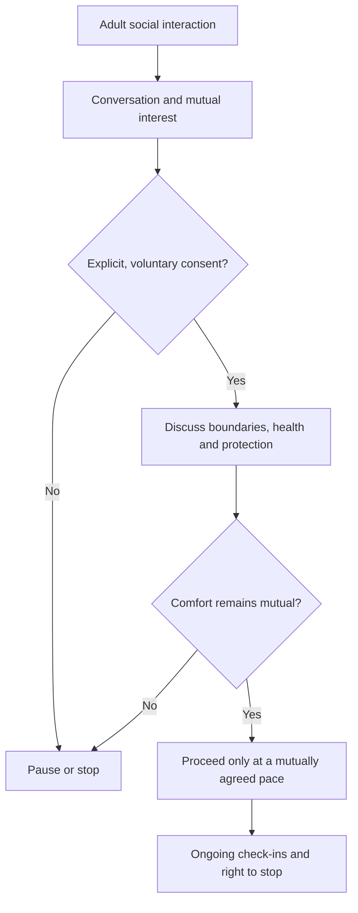
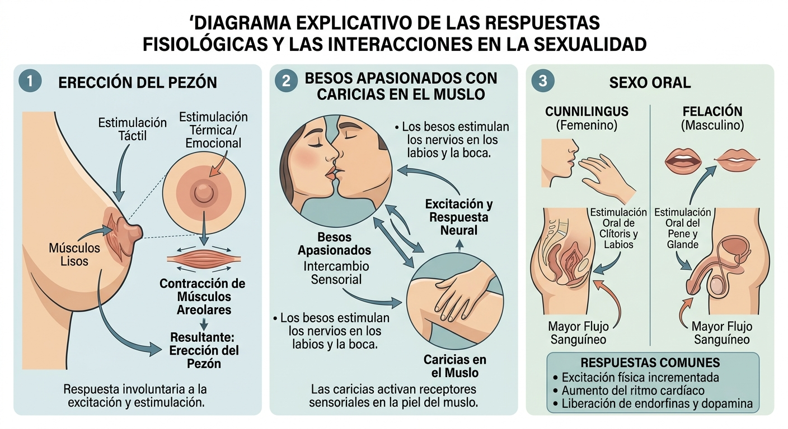
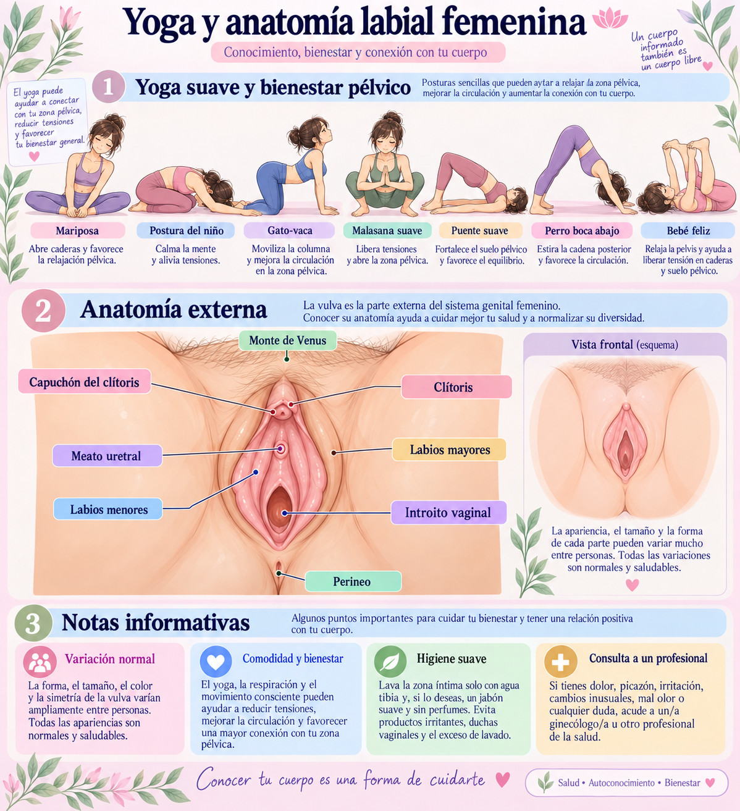

# Consolidated Documentation Annex

**Repository:** `robotics-intelligent-systems/jfxai4mad`  
**Scope:** Consolidation of legacy `docs/*.txt` notes and Markdown descriptions for `docs/*.jpg` infographics  
**Editorial date:** 30 September 2026  
**Source language:** Spanish

> **Editorial status.** This annex consolidates and normalizes the material already present in `docs/`. It does **not** independently validate legacy statistics, platform-user estimates, conversion percentages, legal assumptions, medical claims, opening hours, program availability, or demographic generalizations contained in the original notes. Any figure intended for publication, budgeting, outreach, health guidance, legal use, or operational decision-making should be rechecked against current primary sources.

## Contents

- [1. Consolidation scope and editorial rules](#1-consolidation-scope-and-editorial-rules)
- [2. U.S. tourism flows and international-marriage/K-1 notes](#2-us-tourism-flows-and-international-marriagek-1-notes)
- [3. Peru and Colombia inbound-tourism comparison](#3-peru-and-colombia-inbound-tourism-comparison)
- [4. Inter-university rural-development collaboration framework](#4-inter-university-rural-development-collaboration-framework)
- [5. Ukraine professional, volunteer and platform-conversion notes](#5-ukraine-professional-volunteer-and-platform-conversion-notes)
- [6. Adult intimacy, consent and sexual-health educational notes](#6-adult-intimacy-consent-and-sexual-health-educational-notes)
- [7. Multipurpose-project interest survey](#7-multipurpose-project-interest-survey)
- [8. Mutual-upskilling and metropolitan talent-flow strategy](#8-mutual-upskilling-and-metropolitan-talent-flow-strategy)
- [9. Ethical non-monogamy with renewable quarterly check-ins](#9-ethical-non-monogamy-with-renewable-quarterly-check-ins)
- [10. LinkedIn regional user-count estimates](#10-linkedin-regional-user-count-estimates)
- [11. LinkedIn marital-status inference note](#11-linkedin-marital-status-inference-note)
- [12. European LinkedIn and unemployment comparison](#12-european-linkedin-and-unemployment-comparison)
- [13. Argentina inbound-tourism origin notes](#13-argentina-inbound-tourism-origin-notes)
- [14. International-dating-agency and LATAM remote-work notes](#14-international-dating-agency-and-latam-remote-work-notes)
- [15. OkCupid adoption and sociocultural comparison notes](#15-okcupid-adoption-and-sociocultural-comparison-notes)
- [16. Google Forms, Calendar and Meet workflow](#16-google-forms-calendar-and-meet-workflow)
- [17. Lima activity areas and library scheduling notes](#17-lima-activity-areas-and-library-scheduling-notes)
- [18. AI-assisted cloud sales curriculum](#18-ai-assisted-cloud-sales-curriculum)
- [19. Compatibility-platform collaborative-network concept](#19-compatibility-platform-collaborative-network-concept)
- [20. Regional LinkedIn-user and unemployment table](#20-regional-linkedin-user-and-unemployment-table)
- [21. Infographic: physiological responses and interactions in adult sexuality](#21-infographic-physiological-responses-and-interactions-in-adult-sexuality)
- [22. Infographic: yoga and external female anatomy](#22-infographic-yoga-and-external-female-anatomy)
- [23. Source-file migration register](#23-source-file-migration-register)

---

## 1. Consolidation scope and editorial rules

The `docs/` directory contains nineteen legacy `.txt` files and two `.jpg` infographics. This document gives every source its own indexed Markdown section, preserves the original subject matter, and makes the material easier to navigate from one annex.

The following editorial rules apply:

1. Original `.txt` and `.jpg` files remain the source artifacts and are not deleted by this consolidation.
2. Numerical claims are retained as **legacy source notes**, not promoted to verified project facts.
3. Content relating to adult relationships or sexual health is framed as educational, consent-based and adult-only.
4. Platform-specific material must respect the current terms of the relevant platform and should not be interpreted as permission for solicitation, profiling or commercial outreach where prohibited.
5. Legal, immigration, medical and public-health material requires current professional or official-source verification before operational use.

---

## 2. U.S. tourism flows and international-marriage/K-1 notes

**Source:** [`A continuación se desglosan.txt`](./A%20continuaci%C3%B3n%20se%20desglosan.txt)

The source combines two topics: international tourism flows in the United States and a legacy overview of international dating/marriage agencies associated with fiancé(e) immigration.

### 2.1 Tourism destinations and origins

The note identifies New York, Florida, California, Nevada and Hawaii as major U.S. international-tourism destinations and highlights Canada, Mexico, Europe and Latin America as important origin markets. The original text associates each destination with characteristic travel drivers such as large metropolitan centers, theme parks, beaches, conventions and national parks.

### 2.2 International-marriage/K-1 context

The source lists the Philippines, Colombia, Ukraine/Eastern Europe, Thailand, Vietnam, Mexico and Brazil as historically relevant origin markets in international-dating-agency and fiancé(e)-visa discussions. It also names California, Texas and Florida as large destination states.

**Verification requirement:** K-1 statistics, country shares and state-level filing patterns should be rechecked against current U.S. Department of State and USCIS data. International marriage-broker activity must be distinguished from ordinary dating, and applicable protections such as IMBRA should be verified from current official guidance.

---

## 3. Peru and Colombia inbound-tourism comparison

**Source:** [`A continuación se presenta.txt`](./A%20continuaci%C3%B3n%20se%20presenta.txt)

The note compares the claimed origin mix of international visitors to Peru and Colombia.

### 3.1 Peru

The legacy text highlights Chile, the United States, Ecuador, Colombia, Brazil and a combined European market. It characterizes Peru's inbound demand as strongly connected to cultural, archaeological, gastronomic and southern-circuit tourism.

### 3.2 Colombia

The source highlights the United States, Mexico, Ecuador, Venezuela, Peru and a combined European market. It characterizes Colombia's inbound offer as more diversified across urban tourism, meetings, nature/biodiversity, beaches and Caribbean destinations.

### 3.3 Comparative interpretation

The source argues that Peru relies more heavily on neighboring-country flows while Colombia receives a larger individual share from the United States and has higher overall international-arrival volume.

**Verification requirement:** revalidate annual totals and shares against current MINCETUR, Migraciones Perú, MINCIT, ProColombia and/or official tourism-statistics releases before reuse.

---

## 4. Inter-university rural-development collaboration framework

**Source:** [`Convenio Marco de Colaboración.txt`](./Convenio%20Marco%20de%20Colaboraci%C3%B3n.txt)

The source proposes a framework for collaboration among the Universidad Nacional de Colombia (UNAL), Universidad Nacional de Cuyo (UNCUYO) and Universidad de Granada (UGR) around rural and highland development.

### 4.1 Proposed roles

| Institution | Proposed role | Main contribution described in the source |
| --- | --- | --- |
| UNAL | Host / territorial coordinator | Rural presence, watershed management and community extension |
| UNCUYO | Methodological and technical partner | Dry/high-mountain technologies and territorial methodologies |
| UGR | Innovation and co-funding partner | Mountain agroecology, water management and international cooperation |

### 4.2 Intervention areas

- Food sovereignty and agroecology.
- Efficient water and micro-watershed management.
- Community health and rural habitat.
- Local socioeconomic development, associations, agrotourism and digitalization.

### 4.3 Proposed annual workflow

```text
Phase 1 — Diagnosis and agreement (months 1–3)
Phase 2 — Call and preparation (months 4–6)
Phase 3 — Field deployment (months 7–9)
Phase 4 — Documentation and continuity (months 10–12)
```

The source also proposes academic-recognition and financing mechanisms. These are planning concepts only until confirmed directly with the named institutions.

---

## 5. Ukraine professional, volunteer and platform-conversion notes

**Source:** [`El análisis de conversión.txt`](./El%20an%C3%A1lisis%20de%20conversi%C3%B3n.txt)

The source discusses Ukraine in the context of professional services, volunteering, social-impact projects and two very different online platforms.

### 5.1 LinkedIn track

The text proposes LinkedIn as a professional channel for software, project-management, NGO, AgTech, renewable-energy and regional-development contacts. It contains legacy salary ranges and hypothetical conversion percentages for skilled volunteering and impact investment.

### 5.2 OkCupid track

The text presents OkCupid as a social/relationship platform with a narrower professional relevance and lower hypothetical conversion to collaborative projects.

### 5.3 Editorial treatment

The submitted conversion rates are **unvalidated assumptions** and must not be presented as measured platform benchmarks. Professional recruitment, fundraising and dating activity should remain separate workflows. Do not use a dating platform to disguise commercial or investment solicitation or to infer willingness to fund, volunteer, relocate or enter a relationship.

---

## 6. Adult intimacy, consent and sexual-health educational notes

**Source:** [`El baile es el único preludio.txt`](./El%20baile%20es%20el%20%C3%BAnico%20preludio.txt)

This is the largest legacy note in `docs/`. It combines an educational disclaimer, adult-consent guidance, relationship-transition scenarios, sexual-health material, lubrication and comfort notes, and process diagrams.

### 6.1 Legal and educational boundary

The source explicitly frames the material as educational rather than medical diagnosis, restricts the intended context to people who have reached the legal age of consent in their jurisdiction, and emphasizes autonomy, consent and prevention of exploitation.

### 6.2 Consent and communication

The text repeatedly emphasizes that consent should be explicit, voluntary, ongoing and reversible. It describes progression from social interaction and conversation toward a possible private setting only when both adults actively agree, with clear options to stop or change course.

### 6.3 Health and comfort

The source discusses:

- STI prevention and the use of appropriate barriers.
- Communication about health and comfort.
- Lubrication and avoidance of painful friction.
- The importance of stopping if there is pain or discomfort.
- Seeking qualified health professionals for individual medical concerns.

Some physiological details and product specifications in the source should be independently reviewed against current clinical guidance before being used as health advice.

### 6.4 Process abstraction



This abstraction intentionally avoids treating body language, dancing, prior agreement, marriage, dating status or previous intimacy as automatic consent to any later activity.

---

## 7. Multipurpose-project interest survey

**Source:** [`Encuesta de Interés Proyectos.txt`](./Encuesta%20de%20Inter%C3%A9s%20Proyectos.txt)

The source provides a reusable survey for identifying preferred project categories and collaboration models.

### 7.1 Project categories

- Recreational vehicles and mobile habitat.
- Training simulators and immersive technology.
- Mobile social-impact, health and emergency units.
- Co-working/co-living and sustainable infrastructure.
- Mobile technology classrooms and digital training.
- Open-ended project proposal.

### 7.2 Collaboration models

- Pure pro bono / volunteering.
- Commercial participation based on results or sales.
- Hybrid pro bono plus success-based commission.
- Founder/co-investor participation.

### 7.3 Functional roles and availability

The survey covers commercial/sales, technical/engineering/IT, administrative/legal/financial, and operations/logistics contributions, along with motivations and time availability.

**Implementation note:** paid, unpaid, commission-based and investment arrangements should be stated clearly and separately so participants can make informed choices.

---

## 8. Mutual-upskilling and metropolitan talent-flow strategy

**Source:** [`Estrategia de Perfeccionamiento.txt`](./Estrategia%20de%20Perfeccionamiento.txt)

The source proposes a bidirectional talent-development model between professionals or SMEs in remote/smaller locations and major Ibero-American metropolitan centers.

### 8.1 Four-phase model

```text
1. Identification and remote micro-labs
2. Cross-mentoring and bidirectional transfer
3. Co-execution and regional-hub integration
4. Scaling, absorption and/or return of value
```

### 8.2 Value exchange

Remote/local participants are described as contributing operational resilience, local knowledge and lightweight decision-making. Metropolitan firms are described as contributing scale, standardization, capital/technology access and market visibility.

### 8.3 Proposed KPIs

- Territorial retention.
- Conversion to metropolitan contracts.
- Cost-effectiveness.
- Bidirectional feedback.

The annex treats these as planning metrics, not as measured outcomes.

---

## 9. Ethical non-monogamy with renewable quarterly check-ins

**Source:** [`La No Monogamia Ética.txt`](./La%20No%20Monogamia%20%C3%89tica.txt)

The source describes an adult ethical-non-monogamy model based on alternating time/attention and renewable 90-day review periods.

### 9.1 Alternation

The proposal uses planned time blocks for a primary relationship, other consensual relationships and individual autonomy, with the aim of preserving predictability and communication.

### 9.2 Quarterly review

At each review, participants may:

- Renew the current arrangement.
- Modify boundaries or information-sharing rules.
- Adjust time allocation or sexual-health agreements.
- Pause or end the arrangement.

The key editorial principle is that renewal is active rather than automatic and every participant retains the right to change or end the arrangement.

---

## 10. LinkedIn regional user-count estimates

**Source:** [`La cantidad de usuarios.txt`](./La%20cantidad%20de%20usuarios.txt)

The source contains approximate LinkedIn registered-user counts for Latin America, California, Florida and Puerto Rico and includes a global registered-user estimate and an age-distribution observation.

| Region / jurisdiction | Legacy estimate in source |
| --- | ---: |
| Latin America | ~202 million |
| California | ~28–31 million |
| Florida | ~15–17 million |
| Puerto Rico | ~1.2 million |

These values should be revalidated before use because platform membership figures change and public estimates may use different definitions from active users.

---

## 11. LinkedIn marital-status inference note

**Source:** [`LinkedIn no recopila ni.txt`](./LinkedIn%20no%20recopila%20ni.txt)

The source correctly notes that LinkedIn does not provide a marital-status field suitable for deriving the number of single users. It then attempts to estimate the number of unmarried women by combining platform gender shares with general demographic rates.

### Editorial rule

Do **not** treat these derived values as observed LinkedIn attributes. A demographic rate from the general population cannot reliably establish the relationship status of an individual platform user, and such inferred status should not be used to target people.

The tourism figures included in the same note should likewise be treated as separate legacy estimates requiring current sources.

---

## 12. European LinkedIn and unemployment comparison

**Source:** [`Los países europeos que.txt`](./Los%20pa%C3%ADses%20europeos%20que.txt)

The note compares approximate LinkedIn user volumes and unemployment rates for the United Kingdom, France, Italy, Germany, Spain and the Netherlands, and additionally cites low- and high-unemployment examples in Europe.

The intended analytical use is a coarse professional-market comparison, but the two indicators come from different data systems and dates. Before reuse, record:

- the exact observation date,
- whether the LinkedIn value represents registered members or active users,
- the labor-force definition and seasonality of the unemployment figure,
- and whether the country is being compared within the EU, EEA or wider Europe.

---

## 13. Argentina inbound-tourism origin notes

**Source:** [`Los principales países.txt`](./Los%20principales%20pa%C3%ADses.txt)

The source identifies Brazil, Uruguay, Chile, the United States, Paraguay, a combined European group and Bolivia as important origin markets for inbound tourism to Argentina.

It highlights:

- the predominance of neighboring-country travel,
- business, shopping, snow, wine and nature tourism,
- Buenos Aires, Patagonia, Mendoza, Iguazú and northern destinations,
- and a distinction between regional volume and higher-spend/longer-stay extra-regional visitors.

Recheck current INDEC and tourism-authority releases before publishing the shares.

---

## 14. International-dating-agency and LATAM remote-work notes

**Source:** [`Mercado de novias por.txt`](./Mercado%20de%20novias%20por.txt)

The source juxtaposes two unrelated topics and they should remain analytically separate.

### 14.1 International dating/marriage agencies

The note discusses historical Eastern European participation in international dating/marriage agencies and mentions IMBRA in the U.S. context. Any country or age-profile claims require updated, reputable evidence and should not be generalized to women from those countries.

### 14.2 Latin American remote work

The source identifies Brazil, Argentina, Colombia, Mexico, Peru and Chile as remote-work markets and highlights demand for software engineering, virtual assistance/customer service, digital marketing, content and UI/UX roles. It also names global employment/freelance platforms as examples.

This remote-work material can be developed independently as a labor-market and nearshoring work package.

---

## 15. OkCupid adoption and sociocultural comparison notes

**Source:** [`OkCupid destaca por su.txt`](./OkCupid%20destaca%20por%20su.txt)

The source compares Mexico, Colombia, Brazil and Argentina in terms of a hypothesized OkCupid user profile, including age ranges, urban concentration, sociocultural interests and relationship preferences.

### Editorial qualification

The source contains broad cultural generalizations and claims about relative platform adoption that are not backed by a cited measurement series in the note. They should therefore be treated as hypotheses for research rather than demographic facts.

A future evidence-based version should distinguish:

1. platform-reported availability and features;
2. measured market penetration, if reliable public data exist;
3. survey-based attitudes toward relationships or social issues;
4. anecdotal cultural interpretation.

Do not infer an individual's political views, sexual orientation, relationship structure or willingness to participate in a project from nationality, city or platform membership.

---

## 16. Google Forms, Calendar and Meet workflow

**Source:** [`Para integrar sin problemas.txt`](./Para%20integrar%20sin%20problemas.txt)

The source describes a lightweight scheduling pipeline using Google Forms plus either Google Calendar appointment schedules or Calendly, with Google Meet as the videoconference service.


### Recommended data-minimization update

Collect only the information required for the stated purpose. Email is normally sufficient for scheduling; phone/WhatsApp should be optional unless operationally necessary and should have a stated use and retention period.

---

## 17. Lima activity areas and library scheduling notes

**Source:** [`Para organizar actividades.txt`](./Para%20organizar%20actividades.txt)

The source lists public areas and libraries in Lima for activities, meetings or urban itineraries, including Miraflores, Barranco and the historic center.

### Locations represented

- Parque Kennedy / Miraflores.
- Malecón de Miraflores, Parque del Amor and Larcomar.
- Plaza de Barranco, Puente de los Suspiros and Bajada de Baños.
- Jirón de la Unión and Plaza San Martín.
- Biblioteca Nacional del Perú, San Borja.
- Biblioteca Pública de Lima, Av. Abancay.
- Biblioteca Municipal Ricardo Palma, Miraflores.

The original note includes suggested/high-traffic hours. Opening hours, access rules and event availability should be checked directly with the venue before planning an activity.

---

## 18. AI-assisted cloud sales curriculum

**Source:** [`Plan de Estudios Ejecutiva.txt`](./Plan%20de%20Estudios%20Ejecutiva.txt)

The source proposes a 12-week, 90-hour curriculum for AI-assisted cloud sales and natural-language tools.

### 18.1 Curriculum structure

| Module | Weeks | Focus |
| --- | --- | --- |
| 1 | 1–2 | Consultative sales, SaaS, cloud value and CRM |
| 2 | 3–4 | Generative AI, prompting, conversational agents and sentiment analysis |
| 3 | 5–6 | Multilingual selling, localization and multichannel prospecting |
| 4 | 7–8 | Simulated calls, objection handling, analytics and conversation intelligence |
| 5 | 9–12 | Integrating project, professional profile and employability |

### 18.2 Graduate profile

The source targets competence in cloud CRM tools, generative AI, multilingual commercial communication, automation and strategic sales analysis.

Any scraping, outreach or automated messaging exercise should comply with applicable platform terms, privacy law and anti-spam requirements.

---

## 19. Compatibility-platform collaborative-network concept

**Source:** [`Proyecto Plataforma y.txt`](./Proyecto%20Plataforma%20y.txt)

The source explores whether compatibility-oriented platforms could help identify adults interested in social-impact projects, volunteering and alternative living arrangements.

### 19.1 Proposed phases

```text
1. Algorithmic configuration
2. Affinity discovery and filtering
3. Collaborative agreements and project integration
```

### 19.2 Proposed application areas

- Rural/community development.
- Skill-based volunteering.
- Adult consensual co-housing or relationship-structure discussions.

### 19.3 Required platform boundary

Dating-platform participation must remain primarily social/relationship-oriented according to the platform's current rules. Do not use compatibility scores as professional eligibility tests, do not disguise recruiting or commercial solicitation as dating, and do not infer consent to off-platform projects from a match.

Professional collaboration should use an explicitly professional channel and a separate consent process.

---

## 20. Regional LinkedIn-user and unemployment table

**Source:** [`Región Jurisdicción Usuarios.txt`](./Regi%C3%B3n%20Jurisdicci%C3%B3n%20Usuarios.txt)

The source provides the following legacy comparison:

| Region / jurisdiction | Approx. LinkedIn users in source | Unemployment figure in source |
| --- | ---: | ---: |
| Latin America | ~202 million | 5.3% |
| California | ~28–31 million | 5.1% |
| Florida | ~15–17 million | 4.5% |
| Hawaii | ~650k–720k | 2.9% |
| Puerto Rico | ~1.2 million | 6.5% |

The table should be refreshed before use because its platform and labor-market figures can refer to different dates and methodologies.

---

## 21. Infographic: physiological responses and interactions in adult sexuality

**Image:** [`infografia-analisis-anime-sensual.jpg`](./infografia-analisis-anime-sensual.jpg)



### 21.1 Description

The infographic is organized as a three-panel educational diagram explaining selected physiological and sensory responses during consensual adult intimacy.

1. **Nipple erection.** A simplified breast/nipple diagram shows tactile, thermal and emotional stimulation, contraction of smooth/areolar muscle and nipple erection as an involuntary physiological response.
2. **Passionate kissing and thigh caressing.** Two adult figures are shown kissing, with a second inset illustrating a hand caressing the thigh. Arrows connect sensory input with neural excitation and response.
3. **Oral sex.** The panel is split into female and male subsections labeled cunnilingus and fellatio. Simplified anatomical diagrams associate oral stimulation with increased local blood flow.

A final box lists common responses such as increased physical arousal, increased heart rate, and release of neurochemical mediators including endorphins and dopamine.

### 21.2 Editorial and clinical note

The visual is best treated as a simplified educational overview rather than a comprehensive physiological model. Individual responses vary considerably. The diagram does not imply consent, desire or a required sequence of activities; consent must be explicit and ongoing. Medical questions, pain or unusual symptoms require individualized professional assessment.

---

## 22. Infographic: yoga and external female anatomy

**Image:** [`yoga-anatomia-labial-femenina-anime-down-dog-happy-baby.jpg`](./yoga-anatomia-labial-femenina-anime-down-dog-happy-baby.jpg)



### 22.1 Yoga and pelvic-wellbeing panel

The upper section uses a pastel anime-style adult character to demonstrate seven gentle poses:

- Butterfly / **Mariposa**.
- Child's pose / **Postura del niño**.
- Cat-cow / **Gato-vaca**.
- Gentle Malasana / **Malasana suave**.
- Gentle bridge / **Puente suave**.
- Downward-facing dog / **Perro boca abajo**.
- Happy baby / **Bebé feliz**.

Short captions associate the poses with mobility, relaxation, circulation, posterior-chain stretching and pelvic comfort.

### 22.2 External-anatomy panel

The central medical-education diagram labels the external female genital anatomy, including:

- mons pubis / **monte de Venus**;
- clitoral hood / **capuchón del clítoris**;
- clitoris / **clítoris**;
- urethral opening / **meato uretral**;
- labia majora / **labios mayores**;
- labia minora / **labios menores**;
- vaginal opening / **introito vaginal**;
- perineum / **perineo**.

A secondary frontal schematic emphasizes normal anatomical variation.

### 22.3 Informational notes

The lower panel discusses normal variation, comfort and wellbeing, gentle hygiene, and seeking a health professional for pain, itching, irritation, unusual changes or other concerns.

The infographic is educational and non-sexualized; it should not be interpreted as individual medical advice. Yoga poses should be adapted to each person's comfort, mobility and clinical context.

---

## 23. Source-file migration register

| # | Original source | Consolidated Markdown section | Status |
| ---: | --- | --- | --- |
| 1 | `A continuación se desglosan.txt` | [Section 2](#2-us-tourism-flows-and-international-marriagek-1-notes) | Consolidated |
| 2 | `A continuación se presenta.txt` | [Section 3](#3-peru-and-colombia-inbound-tourism-comparison) | Consolidated |
| 3 | `Convenio Marco de Colaboración.txt` | [Section 4](#4-inter-university-rural-development-collaboration-framework) | Consolidated |
| 4 | `El análisis de conversión.txt` | [Section 5](#5-ukraine-professional-volunteer-and-platform-conversion-notes) | Consolidated |
| 5 | `El baile es el único preludio.txt` | [Section 6](#6-adult-intimacy-consent-and-sexual-health-educational-notes) | Consolidated |
| 6 | `Encuesta de Interés Proyectos.txt` | [Section 7](#7-multipurpose-project-interest-survey) | Consolidated |
| 7 | `Estrategia de Perfeccionamiento.txt` | [Section 8](#8-mutual-upskilling-and-metropolitan-talent-flow-strategy) | Consolidated |
| 8 | `La No Monogamia Ética.txt` | [Section 9](#9-ethical-non-monogamy-with-renewable-quarterly-check-ins) | Consolidated |
| 9 | `La cantidad de usuarios.txt` | [Section 10](#10-linkedin-regional-user-count-estimates) | Consolidated |
| 10 | `LinkedIn no recopila ni.txt` | [Section 11](#11-linkedin-marital-status-inference-note) | Consolidated |
| 11 | `Los países europeos que.txt` | [Section 12](#12-european-linkedin-and-unemployment-comparison) | Consolidated |
| 12 | `Los principales países.txt` | [Section 13](#13-argentina-inbound-tourism-origin-notes) | Consolidated |
| 13 | `Mercado de novias por.txt` | [Section 14](#14-international-dating-agency-and-latam-remote-work-notes) | Consolidated |
| 14 | `OkCupid destaca por su.txt` | [Section 15](#15-okcupid-adoption-and-sociocultural-comparison-notes) | Consolidated |
| 15 | `Para integrar sin problemas.txt` | [Section 16](#16-google-forms-calendar-and-meet-workflow) | Consolidated |
| 16 | `Para organizar actividades.txt` | [Section 17](#17-lima-activity-areas-and-library-scheduling-notes) | Consolidated |
| 17 | `Plan de Estudios Ejecutiva.txt` | [Section 18](#18-ai-assisted-cloud-sales-curriculum) | Consolidated |
| 18 | `Proyecto Plataforma y.txt` | [Section 19](#19-compatibility-platform-collaborative-network-concept) | Consolidated |
| 19 | `Región Jurisdicción Usuarios.txt` | [Section 20](#20-regional-linkedin-user-and-unemployment-table) | Consolidated |
| 20 | `infografia-analisis-anime-sensual.jpg` | [Section 21](#21-infographic-physiological-responses-and-interactions-in-adult-sexuality) | Described in Markdown |
| 21 | `yoga-anatomia-labial-femenina-anime-down-dog-happy-baby.jpg` | [Section 22](#22-infographic-yoga-and-external-female-anatomy) | Described in Markdown |

### 23.1 Recommended next cleanup

After review, the project may optionally deprecate the loose `.txt` notes in favor of this annex while retaining the originals in Git history. If that cleanup is performed later, use a separate commit so the content migration and source-file deletion remain independently reviewable.
