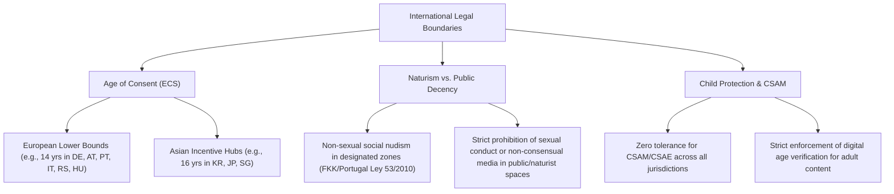
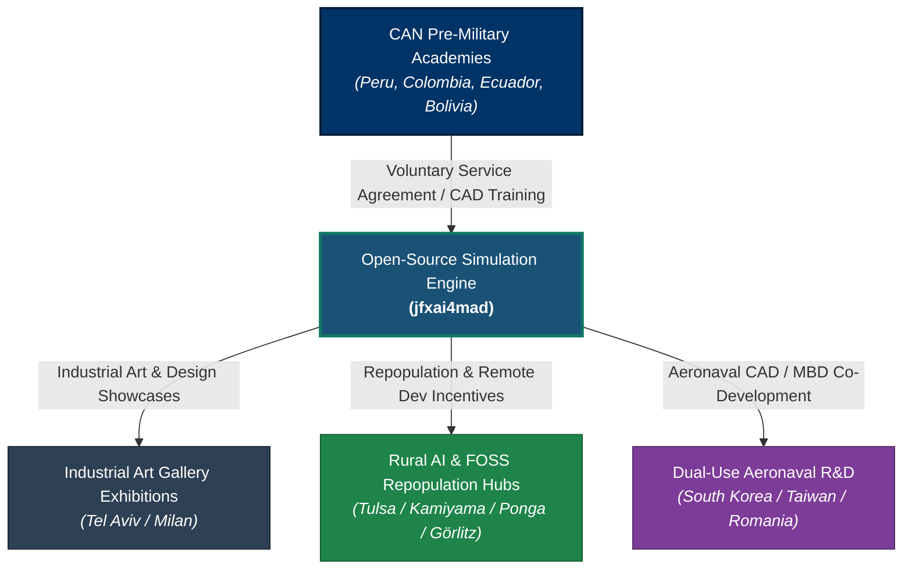

## # Project Annex: Strategic Analysis, International Frameworks & Legal Boundaries
- *Repository Target:** `https://github.com/robotics-intelligent-systems/jfxai4mad`
- *Document Class:** Technical, Strategic & Legal Annex
- *Topic:** FOSS Simulation Framework for Pre-Military Academies, Demographic Repopulation Grants, Trade Agreement Synergies (CAN/EU/Asia), and Comparative Legal Protections
---
- ## 1. Executive Summary
- This document establishes the consolidated strategic, legal, and demographic framework for integrating an Open-Source Software (FOSS) simulation ecosystem—including Model-Based Design (MBD) and CAD components for naval aviation—into pre-military academies.
- To counter severe demographic declines, rural depopulation, and brain drain, the project pairs technical FOSS development with **Voluntary Service Agreements (VSAs)** linked to state-backed housing grants, tax relief, and family settlement incentives across North America, Europe, and Asia.
---
- ## 2. City-Specific Demographic & Relocation Incentives
- ### A. North America
- **Tulsa, Oklahoma, USA (*Tulsa Remote*):** Provides a **$10,000 USD direct grant** for home purchases or stipends, plus co-working space memberships to foster regional innovation clusters.
- **Topeka, Kansas & Marmarth, North Dakota, USA:** Offer **$10,000–$15,000 USD** relocation grants for engineering and technical professionals purchasing homes or accepting local software contracts.
- ### B. Europe
- **Ponga (Asturias, Spain):** Grants **€3,000** for relocation plus **€3,000 per child born** in the municipality.
- **Griegos (Teruel, Spain) & Rubiá (Galicia, Spain):** Offer **3 months of free rent** followed by heavily subsidized housing (€225/month) and family stipends.
- **Görlitz (Saxony, Germany - *Görlitz Testing*):** Provides **1 month of free housing and workspace** (*Probewohnen*) for FOSS developers and digital creators testing rural relocation.
- **Cluj-Napoca (Transylvania, Romania):** Applies a **0% income tax exemption** for IT and software developers to attract engineering talent.
- **Santo Stefano di Sessanio (Abruzzo, Italy):** Offers up to **€20,000** for new business/tech ventures plus nominal-rent housing for young residents under 40.
- ### C. Asia-Pacific
- **Chuncheon (Gangwon-do, South Korea):** Combines AI data cluster investments with direct municipal housing subsidies and monthly child-rearing grants (*Parent Allowance* up to ~$750/month) to address a regional TFR of **0.72**.
- **Kamiyama (Tokushima Prefecture, Japan):** Converts vacant rural homes (*Akiya*) into fiber-connected satellite offices for remote open-source and software development teams.
- **Singapore:** Operates specialized tech-pass visa frameworks (e.g., *Tech.Pass*, *ONE Pass*) offering tax incentives, incubator co-funding, and streamlined paths for foreign engineering leadership.
---
- ## 3. Comprehensive Global Matrix
- | Country / Region | Target Area | Demographic Status (TFR) | CAN Access & Legal Regime | FOSS & Technical Synergy | Primary Incentive Mechanism |
- | :--- | :--- | :--- | :--- | :--- | :--- |
- | **United States** | Tulsa (OK) / Topeka (KS) | Declining ($\approx 1.66$) | Bilateral Frameworks | AI analytics, remote simulation dev. | **$10,000–$15,000 USD** direct grant |
- | **Spain** | Ponga / Teruel / Galicia | Severe Decline ($\approx 1.16$) | **EU-CAN Agreement** / Schengen | Aerospace manufacturing & FOSS networks | **€3,000 relocation + €3,000/birth** |
- | **Germany** | Görlitz / Altena | Severe Decline ($\approx 1.46$) | **EU-CAN Agreement** / Schengen | CAD/CAM, precision engineering | **1-month trial workspace/housing** |
- | **Italy** | Abruzzo / Milan | Severe Decline ($\approx 1.24$) | **EU-CAN Agreement** / Schengen | Aeronaval design & industrial galleries | **Up to €20,000 grant** + nominal rent |
- | **Romania** | Cluj-Napoca | Severe Emigration ($\approx 1.60$) | **EU-CAN Agreement** / Schengen | Cost-efficient software engineering | **0% income tax** for software developers |
- | **South Korea**| Chuncheon (Gangwon) | **Critical** ($\approx 0.72$) | **Active FTAs** (Peru, Colombia) | Aerospace simulation & AI clusters | Subsidized housing + **$750/mo stipend** |
- | **Japan** | Kamiyama (Tokushima) | Critical ($\approx 1.20$) | Short Stay Visa-Free | Rural satellite hubs for FOSS code | **Free/nominal *Akiya* rehabilitation** |
- | **Singapore** | Urban Hub | Replacement Boundary ($\approx 0.97$)| Bilateral Trade Agreements | High-tech R&D, LegalTech automation | Tech pass visas + startup co-funding |
- | **Serbia** | Regional Hubs | Declining ($\approx 1.63$) | Bilateral Agreements | Open-source R&D & engineering | Low operational tax + Tech park access |
- | **Hungary** | Regional Hubs | Declining ($\approx 1.50$) | **EU-CAN Agreement** / Schengen | Software development & CAD research | Corporate tax breaks + regional grants |
---
- ## 4. Legal Framework: Age of Consent, Public Decency & Youth Protection
- To maintain clarity and strict adherence to international law, all institutional agreements within this project operate under the principle of **"Interests of the Child"** and relevant national penal codes.

- A. Age of Consent (ECS) Dynamics
- European Framework (Lower Bound = 14): Countries such as Germany (§176 StGB), Austria (§206 StGB), Portugal (Art. 173 CP), Italy (Art. 609-quater CP), Serbia, and Hungary maintain a legal baseline Age of Consent of 14 years for consensual peer interactions (subject to exploitation and abuse-of-power restrictions).
- Asian Incentive Hubs (Higher Bounds = 16+): In contrast, high-tech incentive destinations like South Korea (raised to 16 in 2020), Japan (raised nationally to 16 in 2023), and Singapore (16) enforce higher statutory age limits.
- Project Boundary: Independent of local statutory minimums, all project-related training and Voluntary Service Agreements involving minors operate under strict educational protocols and mandatory parental/guardian consent.
- B. Social Naturism vs. Sexual Conduct
- Regulated Social Naturism: In European jurisdictions with strong naturist traditions (e.g., Germany's FKK, Portugal's Lei do Naturismo 53/2010), non-sexual recreational nudism in designated areas is legally protected and distinguished from public indecency.
- Prohibition of Exploitation: Naturism is strictly non-sexual. Any sexualized behavior, harassment, or unauthorized photography/videography in naturist spaces is criminalized across all jurisdictions regardless of local Age of Consent laws.
- C. Digital Content & Minor Protection
- CSAM/CSAE Prevention: International law (including the UN Convention on the Rights of the Child and the Lanzarote Convention) imposes strict criminal penalties on the production, distribution, or possession of Child Sexual Abuse Material (CSAM), including digital or simulated representations.
- Age-Gating: All LegalTech platforms, social hubs, and digital tools operating under jfxai4mad mandate robust age-verification mechanisms to prevent minor exposure to adult-oriented content or services.
- 5. Strategic Integration Workflow

