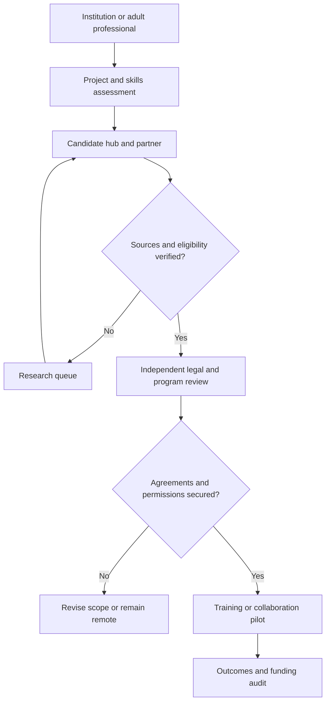

# Project Annex: Strategic Analysis and Institutional Framework

**Repository:** [robotics-intelligent-systems/jfxai4mad](https://github.com/robotics-intelligent-systems/jfxai4mad)  
**Document class:** Proposed technical and strategic framework  
**Review date:** 27 September 2026  
**Related overview:** [README section 6](../README.md#6-global-strategic-annex)

## Contents

- [1. Executive summary](#1-executive-summary)
- [2. Existing destination research portfolio](#2-existing-destination-research-portfolio)
- [3. International access and evidence rules](#3-international-access-and-evidence-rules)
- [4. Proposed integration workflow](#4-proposed-integration-workflow)
- [5. Institutional agreements and evaluation](#5-institutional-agreements-and-evaluation)
- [6. Technology-city incentives: Austria, Greece and Sweden compared with Türkiye](#6-technology-city-incentives-austria-greece-and-sweden-compared-with-turkey)
- [7. Source register](#7-source-register)

## 1. Executive summary

This annex proposes an institutional extension for FOSS simulation, CAD and model-based design education, including potential cooperation with naval-aviation preparatory academies. Aircraft references such as the Stavatti Stiletto are concept-study subjects; their inclusion does not establish an open design license, an endorsed partnership or a certified training platform.

The development hypothesis combines technical education, remote software collaboration, industrial-design exhibitions and voluntary professional mobility. Public incentives may support eligible activities, but no program is automatically attached to a JFXAI4MAD course or Voluntary Service Agreement (VSA).

The new four-country comparison in [section 6](#6-technology-city-incentives-austria-greece-and-sweden-compared-with-turkey) addresses technology-hub development. It separates business support from personal relocation, residence permission and demographic policies.

## 2. Existing destination research portfolio

The previous annex mixed city-level claims, national fertility estimates, immigration assumptions and incentive amounts without dated sources. The destinations are retained below as a research portfolio. Unsupported amounts and undated fertility rankings are not carried forward as current offers.

| Country / region | Retained destinations | Research question before publication as an opportunity |
| --- | --- | --- |
| United States | Tulsa, Topeka, Marmarth | Verify each operator independently, current application window, employment conditions, right to work and repayment terms; do not attribute one city's program to another. |
| Spain | Ponga, Rubiá, Griegos / Teruel | Obtain current municipal calls before advertising relocation, newborn or rent support. |
| Germany | Altena, Görlitz | Confirm current trial-living or housing initiatives, capacity and eligibility rather than relying on earlier editions. |
| South Korea | Chuncheon, Jeonju | Separate national family benefits from municipal startup or housing programs; verify access for foreign residents. |
| Japan | Kamiyama, Higashikawa | Verify satellite-office opportunities, property availability, rehabilitation costs and municipal eligibility. |
| Italy | Santo Stefano di Sessanio / Abruzzo, Milan | Revalidate business and housing calls; treat design exhibitions as prospective partnerships. |
| Romania | Cluj-Napoca | Recheck current payroll and business taxation; do not budget the former annex's unsupported blanket 0% software-developer income tax. |
| Taiwan | Taipei and candidate regional hubs | Verify startup support and nationality-specific entry/residence rules. |
| Israel | Tel Aviv | Verify incubator participation, R&D calls, exhibition partners and travel conditions. |

**Evidence status:** these legacy destinations were not fully revalidated in this revision and must remain excluded from advertised grant totals. Their inclusion is neither a finding that a program is active nor that it has ended. Historical assertions remain available in Git history.

A later demographic comparison must identify the statistical authority, observation year and geographic scope of each indicator. National fertility rates must not be presented as city-level eligibility criteria or used to infer anyone's relationship intentions.

## 3. International access and evidence rules

The Andean Community (CAN) comprises Bolivia, Colombia, Ecuador and Peru. The European Commission describes its trade agreement with **Colombia, Peru and Ecuador**; Bolivia may seek accession. Therefore, “EU-CAN agreement” must not imply identical treaty coverage for all four countries. [S12]

For Austria, Greece and Sweden, assess applicable EU trade provisions separately from national immigration procedures. The EU agreement must not be carried over to Türkiye; any relevant Turkish trade arrangement requires an independent check.

Maintain distinct records for:

| Question | Required evidence |
| --- | --- |
| Short visit | Passport nationality, destination, purpose, duration and official entry rules |
| Work, study or business residence | Applicable national route, applicant eligibility and authority decision |
| Trade or procurement | Exact treaty parties, goods/services coverage and any exclusions |
| Tax benefit or R&D grant | Eligible beneficiary, qualifying activity, costs, approval and period |
| Family relocation or housing | Specific program, household conditions, local availability and award terms |

Trade access, visa-free short visits and a signed VSA are not substitutes for an appropriate work or residence route. Austria's founder route, Sweden's work/residence routes and Türkiye's work-permit process illustrate the need for separate applications. [S3] [S9] [S13]

## 4. Proposed integration workflow

Possible outputs include FOSS engineering contributions, industrial-art exhibitions, simulation coursework and eligible regional-development pilots. Remote work, relocation and institutional enrollment require separate approvals. No participating academy, technopark or funding agency is currently represented here as a contracted partner.

## 5. Institutional agreements and evaluation

A proposed VSA should define the parties, learning or project deliverables, duration, compensation if any, termination, intellectual-property terms and dispute process. It must not promise public funding or bind personal relationships to training or employment.

Keep academy education records separate from adult professional mobility and the platform's adult social-discovery data. Any program involving minors requires its own institution-led enrollment and safeguarding arrangements.

Evaluate candidate projects using documented partner interest, technical fit, eligible funding, full operating costs, infrastructure, legal feasibility and sustainable participation. For simulation projects, distinguish educational visualization from validated models and approved operational training.

## 6. Technology-city incentives: Austria, Greece and Sweden compared with Turkey

### 6.1 Scope and comparison method

“Technology city” means a candidate urban innovation ecosystem, not a single statutory incentive category. The comparison separates four mechanisms: **company grants, R&D tax support, personal tax treatment and ecosystem services**. None of the reviewed sources establishes a universal cash reward for moving to the listed cities.

Facts below are drawn from the official program and ecosystem sources in section 7. Project-fit assessments and suggested pilot roles are explicitly planning judgments. Availability must be rechecked before an application or financial commitment.

### 6.2 Austria: Vienna as the initial reference hub

Vienna Business Agency's Innovation Funding supports eligible SMEs and founders in Vienna developing innovative products, technologies or services. Its published terms list a **€300,000 maximum**, funding rates of **45% for small businesses and 35% for medium-sized enterprises**, and a **€30,000 minimum project value**. The remaining published 2026 deadline is **31 December 2026**. Projects must start after submission of a complete application; selection is competitive. These figures are ceilings and conditions, not an award to this project. [S1]

At national level, Austria's research premium is **14% of qualifying R&D expenditure**. In-house R&D requires an FFG assessment and an application to the tax authority. Grant support and the research premium must be evaluated together under the applicable eligible-cost and cumulation rules rather than simply added. [S2]

**Planning judgment:** Vienna merits evaluation as a coordination and R&D base for the platform, with a defined experimental software work package. Routine tourism operations and ordinary application development must not automatically be classified as eligible research.

For non-EU founders, the Red-White-Red Card startup-founder route has separate business, capital and qualification requirements. Incorporation or a grant application does not itself establish residence eligibility. [S3]

### 6.3 Greece: Athens and Thessaloniki

Elevate Greece offers a national startup registry and ecosystem visibility, networking and access to information about support measures. **Registry admission does not automatically confer eligibility for state aid.** Each scheme has its own conditions and assessment. Treat Athens as a candidate coordination location and Thessaloniki as a candidate research-partnership location, not as locations with an automatic municipal relocation payment. [S4]

Thess INTEC is presented by its operator as a developing science and technology park intended to connect universities, research institutions and businesses. Verify delivery, tenancy and partner availability before treating planned facilities as operational capacity. [S5]

Separately, Article 5C provides a **50% income-tax exemption for seven tax years** on qualifying Greek employment and/or individual business income for approved individuals transferring tax residence. Conditions include prior non-residence for five of the preceding six years, transfer from an eligible jurisdiction, qualifying Greek activity and an intention to remain at least two years. It is a personal tax regime, not a corporate grant or visa; CAN applicants require individual review. [S6]

**Planning judgment:** Greece merits evaluation for a destination-tourism/LegalTech pilot and university-linked software collaboration. The tax regime should be modeled only for eligible individuals, separately from company funding.

### 6.4 Sweden: Gothenburg as the initial reference hub

Lindholmen Science Park in Gothenburg coordinates collaborative research and development involving industry, academia and public actors, including mobility programs. This provides an ecosystem reference for simulation partnerships; it is not a grant offer or confirmed admission. [S7]

Vinnova funding is awarded through specific calls with defined eligibility, assessment criteria and submission windows. Project partners, company characteristics, financing and eligible activities must be checked against the selected call. This annex does not assign a universal Swedish grant amount to a FOSS developer or assume a foreign entity qualifies directly. [S8]

**Planning judgment:** Gothenburg merits evaluation for collaborative mobility simulation, model validation and university–industry pilots. The starting action is to identify a suitable partner and live call, then establish the applicant structure and co-financing.

Swedish work and residence routes are separate from innovation funding. A prospective employee or self-employed founder must use the appropriate Migration Agency process. [S9]

### 6.5 Türkiye: Ankara technopark benchmark

ODTÜ TEKNOKENT in Ankara provides an established technology-park reference with entrepreneurship and company-development activities. Admission, services and project fit require direct confirmation; its inclusion does not imply a partnership with JFXAI4MAD. [S10]

The Investment and Finance Office describes Technology Development Zone (TDZ) exemptions for profits from qualifying software, R&D and design activities through **31 December 2028**, alongside VAT relief for qualifying application software produced exclusively in TDZs. These are activity- and zone-specific provisions, not a blanket exemption for all company income or all technology workers in a city. [S11]

**Planning judgment:** Ankara is a useful benchmark for a technopark-based engineering and software team. A financial model must separate qualifying R&D/software work from tourism bookings, coordination fees and other ordinary revenue. Include a post-2028 scenario without assuming an extension.

Foreign personnel must independently satisfy applicable work-permit requirements. Technopark participation alone does not replace that process. [S13]

### 6.6 Decision matrix

| Dimension | Austria / Vienna | Greece / Athens–Thessaloniki | Sweden / Gothenburg | Türkiye / Ankara |
| --- | --- | --- | --- | --- |
| Main reviewed mechanism | Municipal innovation grant and national R&D premium | Startup registry; conditional personal tax regime | Call-specific innovation funding and collaborative ecosystem | TDZ tax treatment and technopark ecosystem |
| Beneficiary distinction | Eligible business / qualifying R&D taxpayer | Startup entity versus qualifying individual taxpayer | Applicants and partners meeting a particular call | Accepted qualifying activity within the TDZ framework |
| Proposed project fit | Coordination and experimental software R&D | Tourism/LegalTech pilot and research partnerships | Mobility simulation and validation partnerships | Engineering/software development benchmark |
| First dependency | Eligible Vienna project and application timing | Registry/call eligibility; personal tax eligibility checked separately | Suitable partner, call and applicant structure | Park acceptance and qualifying-activity assessment |
| Do not assume | Grants and tax premium can be added without adjustment | Registry admission guarantees funding or residence | All FOSS work receives a grant | All revenue is exempt or benefits extend beyond 2028 |
| Personal relocation | Separate migration and household review | Separate immigration and tax-residence review | Separate work/residence process | Separate work/residence process |
| Comparison status | Candidate, not selected | Candidate, not selected | Candidate, not selected | Benchmark, not selected |

There is no supported overall “best country” ranking at this stage. Austria's project funding, Greece's personal tax treatment, Sweden's collaborative calls and Türkiye's qualifying-profit relief have different beneficiaries and tax bases; their percentages are not directly comparable.

### 6.7 Proposed pilot and incentive register

Prepare one common work package and budget for all four locations: a privacy-preserving platform prototype plus an optional, separately scoped FOSS simulation module. Use the same staffing, deliverables and service assumptions.

For each candidate, record:

| Register field | Required value |
| --- | --- |
| Program identity | Authority, official URL, city/country and scheme or call identifier |
| Evidence | Source publication date when available, review date and stored version |
| Status | Open, closed, forthcoming or unverified; application deadline and next review |
| Applicant | Entity type, location, ownership and partner requirements |
| Benefit | Grant, loan, tax relief or service; cap, rate, qualifying base and payment timing |
| Obligations | Matching funds, reporting, retention, clawback and cumulation rules |
| Mobility | Nationality-specific work/residence route assessed separately |
| Decision | Named reviewer, eligibility rationale and outstanding evidence |

Use a **no-incentive baseline** and a **conditional-support scenario**. Include employer costs, premises, insurance, local professional advice, reporting, currency exposure and the timing of reimbursements. Do not count pending grants as committed cash or record the Greek personal exemption as company revenue.

Refresh evidence before publication to users, before applying and before signing a relocation or project contract. Suspend expired or unverified offers from recommendations. Keep marriage, family formation and social-discovery preferences out of incentive scoring.

## 7. Source register

Sources reviewed on **27 September 2026**. Official summaries guide screening; applicable legislation, complete call terms and authority decisions govern individual cases.

| ID | Official source | Supports |
| --- | --- | --- |
| S1 | [Vienna Business Agency — Innovation Funding](https://viennabusinessagency.at/current-funding/innovation-funding/) | Grant limits, applicant scope, timing and published deadline |
| S2 | [FFG — Research premium assessments](https://www.ffg.at/forschungspraemie) | 14% R&D premium and application process |
| S3 | [Austria Migration — Startup founders](https://www.migration.gv.at/en/types-of-immigration/permanent-immigration/start-up-founders/) | Separate founder immigration route |
| S4 | [Elevate Greece — Startup registry](https://elevategreece.gov.gr/startup-registry/) | Registry benefits and non-automatic state-aid eligibility |
| S5 | [Thess INTEC — Project operator](https://www.thessintec.eu/) | Planned technology-park ecosystem |
| S6 | [AADE — Tax incentives, Articles 5A, 5B and 5C](https://www.aade.gr/sites/default/files/2025-11/forologika_kinitra_ENG.pdf) | Personal tax-residence incentive and conditions |
| S7 | [Lindholmen Science Park — Project activities](https://www.lindholmen.se/en/project-activities) | Mobility research and collaboration |
| S8 | [Vinnova — Apply for funding](https://www.vinnova.se/en/apply-for-funding) | Call-specific eligibility and assessment |
| S9 | [Swedish Migration Agency — Work](https://www.migrationsverket.se/en/you-want-to-apply/work.html) | Work and residence application routes |
| S10 | [ODTÜ TEKNOKENT](https://odtuteknokent.com.tr/en/) | Ankara technology-park and entrepreneurship ecosystem |
| S11 | [Invest in Türkiye — Investment zones](https://www.invest.gov.tr/en/investmentguide/pages/investment-zones.aspx) | TDZ incentives and published 2028 horizon |
| S12 | [European Commission — Andean Community](https://policy.trade.ec.europa.eu/eu-trade-relationships-country-and-region/countries-and-regions/andean-community_en) | Treaty coverage for Colombia, Peru and Ecuador; Bolivia accession distinction |
| S13 | [Invest in Türkiye — Obtaining a work permit](https://www.invest.gov.tr/en/investmentguide/pages/obtaining-a-work-permit.aspx) | Separate foreign-worker application process |
