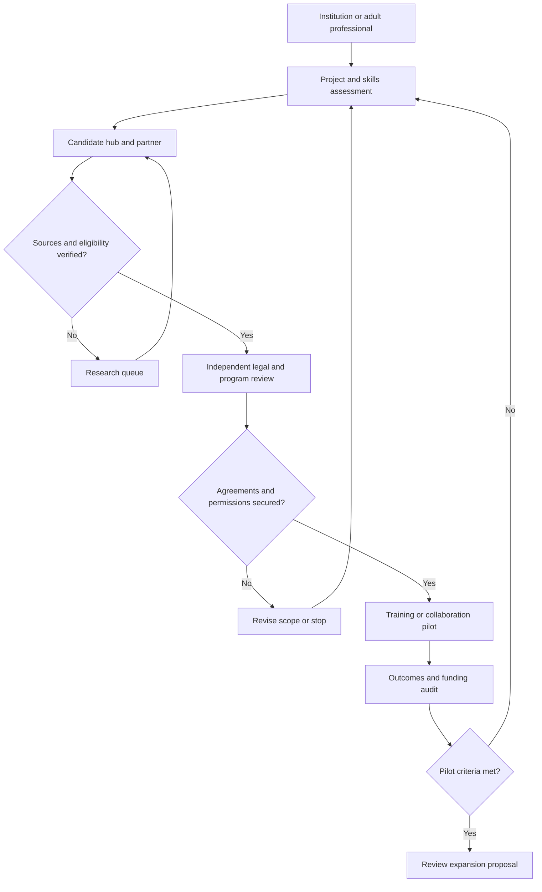
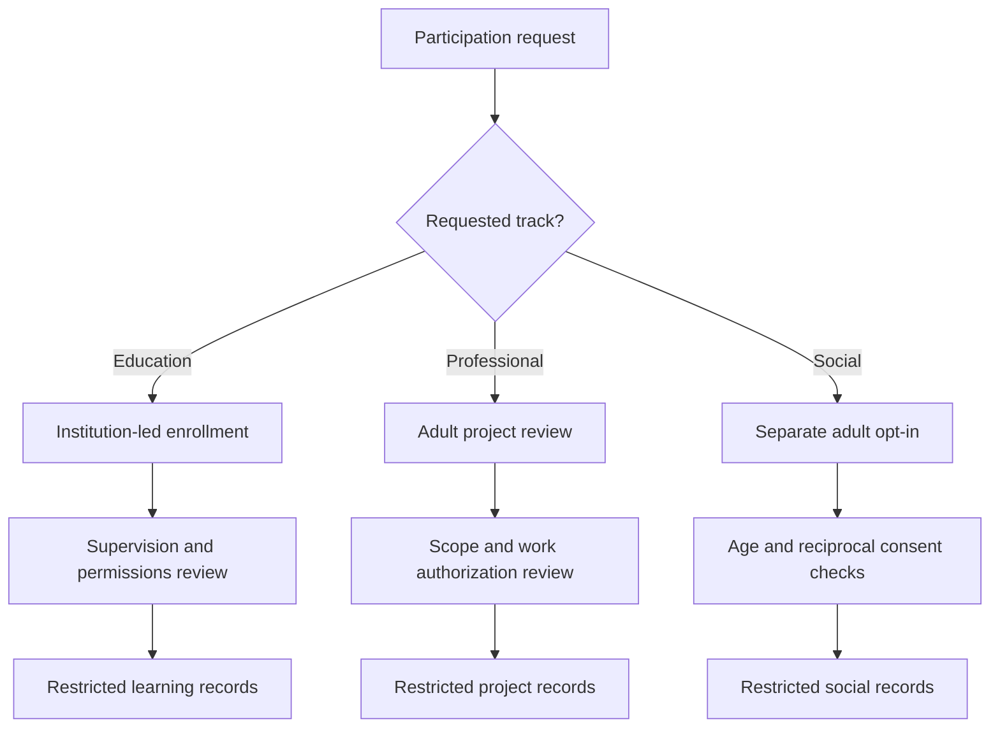
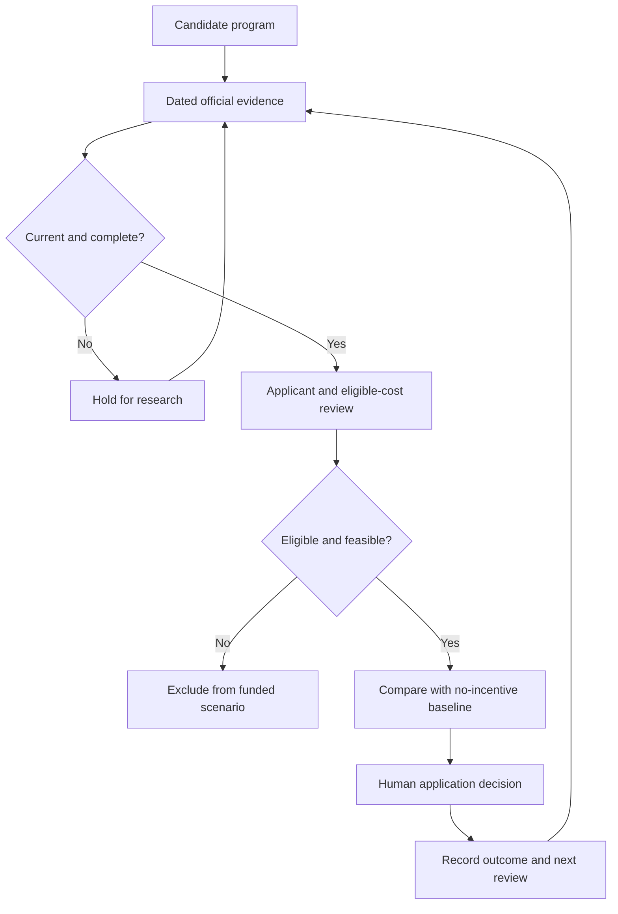
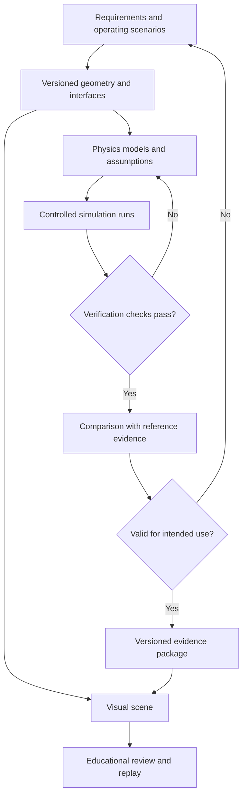
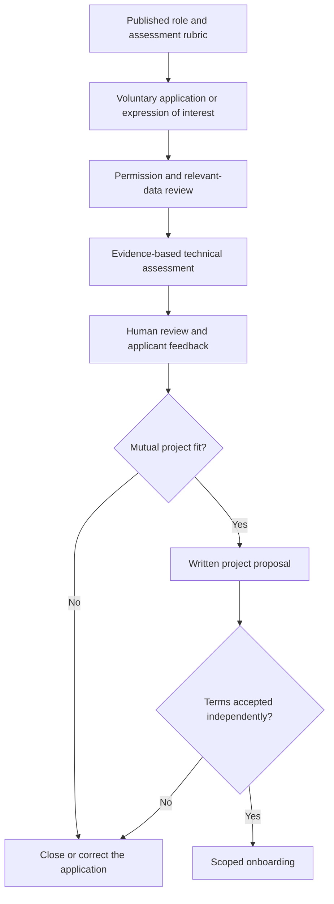
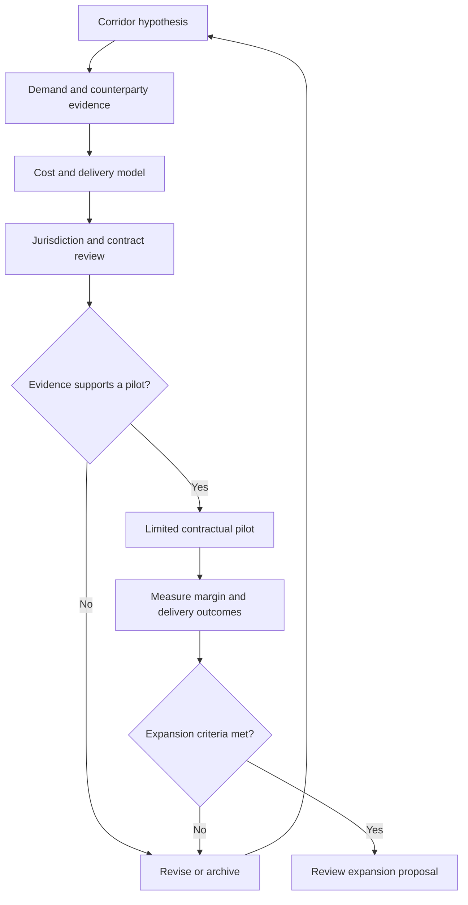
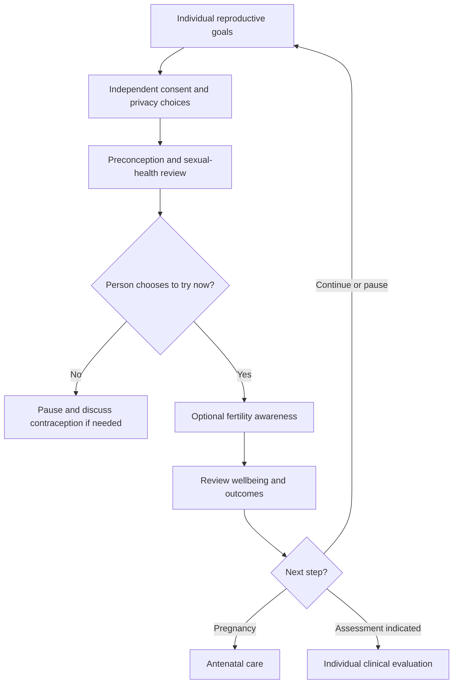
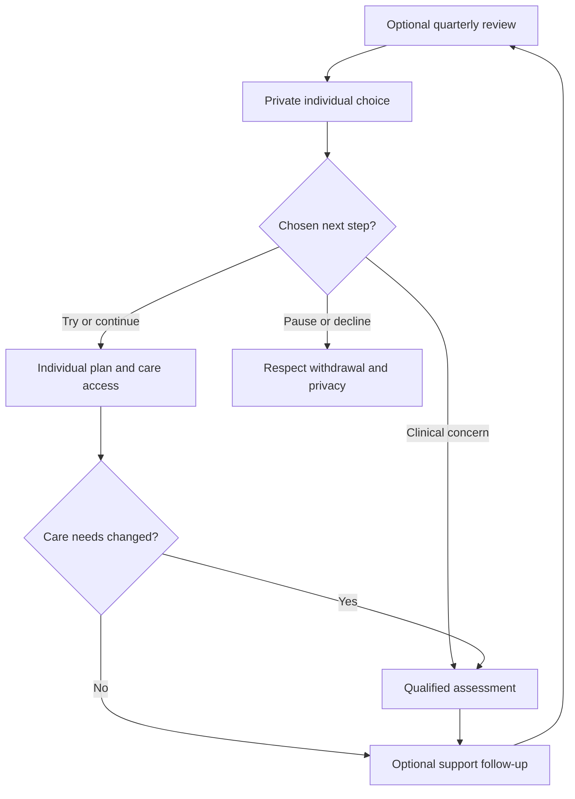
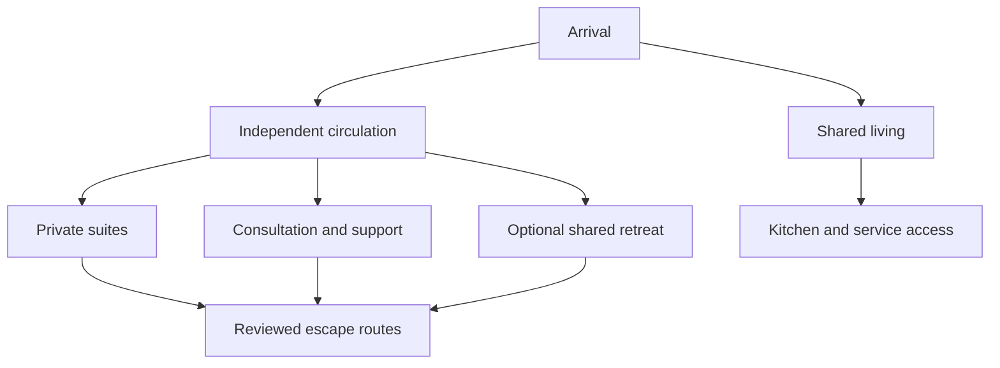
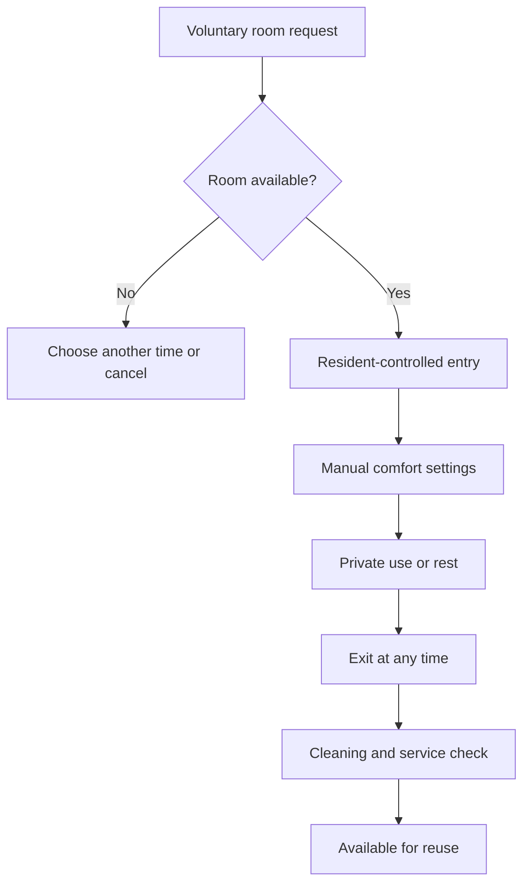

# Project Annex: Strategic Analysis and Institutional Framework

**Repository:** [robotics-intelligent-systems/jfxai4mad](https://github.com/robotics-intelligent-systems/jfxai4mad)
**Document class:** Proposed technical and strategic framework
**Editorial review date:** 28 September 2026

**Incentive-source review:** 27 September 2026; recheck current terms before an application.
**Related overview:** [README section 6](../README.md#6-global-strategic-annex)

## Contents

- [1. Executive summary](#1-executive-summary)
- [2. Existing destination research portfolio](#2-existing-destination-research-portfolio)
- [3. International access and evidence rules](#3-international-access-and-evidence-rules)
- [4. Proposed integration workflow](#4-proposed-integration-workflow)
- [5. Institutional agreements and evaluation](#5-institutional-agreements-and-evaluation)
- [6. Technology-city incentives: Austria, Greece and Sweden compared with Türkiye](#6-technology-city-incentives-austria-greece-and-sweden-compared-with-turkey)
- [7. Source register](#7-source-register)
- [8. CAD concepts and simulation work packages](#8-cad-concepts-and-simulation-work-packages)
- [9. Professional collaboration and AI-assisted sourcing](#9-professional-collaboration-and-ai-assisted-sourcing)
- [10. Corporate governance and personal autonomy](#10-corporate-governance-and-personal-autonomy)
- [11. Proposed international commercial corridors](#11-proposed-international-commercial-corridors)
- [12. Economic evaluation and impact measurement](#12-economic-evaluation-and-impact-measurement)
- [13. Implementation matrix and release gates](#13-implementation-matrix-and-release-gates)
- [14. Reproductive planning in consensual adult multi-partner families](#14-reproductive-planning-in-consensual-adult-multi-partner-families)

- [15. Annual coordination, personal preferences and athletic wellbeing](#15-annual-coordination-personal-preferences-and-athletic-wellbeing)

- [16. Sperm transport, lubrication and postcoital evidence](#16-sperm-transport-lubrication-and-postcoital-evidence)
- [17. Lubricants and natural secretions when trying to conceive](#17-lubricants-and-natural-secretions-when-trying-to-conceive)
- [18. Uterine orientation: anatomy, comfort and fertility](#18-uterine-orientation-anatomy-comfort-and-fertility)
- [19. Conceptual space planning for a seven-adult household](#19-conceptual-space-planning-for-a-seven-adult-household)
- [20. Shared retreat suite: preliminary architectural specifications](#20-shared-retreat-suite-preliminary-architectural-specifications)
- [21. Utah and comparative family-law review](#21-utah-and-comparative-family-law-review)
- [22. European rural renewal and independent safeguarding review](#22-european-rural-renewal-and-independent-safeguarding-review)
- [23. Rural population decline: drivers and regional differences](#23-rural-population-decline-drivers-and-regional-differences)

## 1. Executive summary

This annex proposes an institutional extension for FOSS simulation, CAD and model-based design education, including potential cooperation with naval-aviation preparatory academies. The CAD portfolio in section 8 provides concept-study subjects for mobility and resilient infrastructure. Inclusion does not establish an open hardware license, an endorsed partnership or a certified training platform.

The development hypothesis combines technical education, remote software collaboration, industrial-design exhibitions and voluntary professional mobility. Public incentives may support eligible activities, but no program is automatically attached to a JFXAI4MAD course or Voluntary Service Agreement (VSA).

The four-country comparison in [section 6](#6-technology-city-incentives-austria-greece-and-sweden-compared-with-turkey) addresses technology-hub development. It separates business support from personal relocation, residence permission and demographic policies.

## 2. Existing destination research portfolio

The previous annex mixed city-level claims, national fertility estimates, immigration assumptions and incentive amounts without dated sources. The destinations are retained below as a research portfolio. Unsupported amounts and undated fertility rankings are not carried forward as current offers.

| Country / region | Retained destinations | Research question before publication as an opportunity |
| --- | --- | --- |
| United States | Tulsa, Topeka, Marmarth | Verify each operator independently, current application window, employment conditions, right to work and repayment terms; do not attribute one city's program to another. |
| Spain | Ponga, Rubiá, Griegos / Teruel | Obtain current municipal calls before advertising relocation, newborn or rent support. |
| Germany | Altena, Görlitz | Confirm current trial-living or housing initiatives, capacity and eligibility rather than relying on earlier editions. |
| South Korea | Chuncheon, Jeonju | Separate national family benefits from municipal startup or housing programs; verify access for foreign residents. |
| Japan | Kamiyama, Higashikawa | Verify satellite-office opportunities, property availability, rehabilitation costs and municipal eligibility. |
| Italy | Santo Stefano di Sessanio / Abruzzo, Milan | Revalidate business and housing calls; treat design exhibitions as prospective partnerships. |
| Romania | Cluj-Napoca | Recheck current payroll and business taxation; do not budget the former annex's unsupported blanket 0% software-developer income tax. |
| Singapore | Singapore | Verify founder and employment routes independently of startup calls; do not infer tax benefits from a visa. |
| Serbia | Candidate regional hubs | Identify a named technology park, current call and applicant requirements before comparing costs. |
| Hungary | Candidate regional hubs | Verify the relevant research program and separate business incentives from residence eligibility. |
| Taiwan | Taipei and candidate regional hubs | Verify startup support and nationality-specific entry/residence rules. |
| Israel | Tel Aviv | Verify incubator participation, R&D calls, exhibition partners and travel conditions. |

**Evidence status:** these legacy destinations were not fully revalidated in this revision and must remain excluded from advertised grant totals. Their inclusion is neither a finding that a program is active nor that it has ended. Historical assertions remain available in Git history.

A later demographic comparison must identify the statistical authority, observation year and geographic scope of each indicator. National fertility rates must not be presented as city-level eligibility criteria or used to infer anyone's relationship intentions.

## 3. International access and evidence rules

The Andean Community (CAN) comprises Bolivia, Colombia, Ecuador and Peru. The European Commission describes its trade agreement with **Colombia, Peru and Ecuador**; Bolivia may seek accession. Therefore, “EU-CAN agreement” must not imply identical treaty coverage for all four countries. [S12]

For Austria, Greece and Sweden, assess applicable EU trade provisions separately from national immigration procedures. The EU agreement must not be carried over to Türkiye; any relevant Turkish trade arrangement requires an independent check.

Maintain distinct records for:

| Question | Required evidence |
| --- | --- |
| Short visit | Passport nationality, destination, purpose, duration and official entry rules |
| Work, study or business residence | Applicable national route, applicant eligibility and authority decision |
| Trade or procurement | Exact treaty parties, goods/services coverage and any exclusions |
| Tax benefit or R&D grant | Eligible beneficiary, qualifying activity, costs, approval and period |
| Family relocation or housing | Specific program, household conditions, local availability and award terms |

Trade access, visa-free short visits and a signed VSA are not substitutes for an appropriate work or residence route. Austria's founder route, Sweden's work/residence routes and Türkiye's work-permit process illustrate the need for separate applications. [S3] [S9] [S13]

## 4. Proposed integration workflow

Possible outputs include FOSS engineering contributions, industrial-art exhibitions, simulation coursework and eligible regional-development pilots. Remote work, relocation and institutional enrollment require separate approvals. No participating academy, technopark or funding agency is currently represented here as a contracted partner.

## 5. Institutional agreements and evaluation

A proposed VSA should define the parties, learning or project deliverables, duration, compensation if any, termination, intellectual-property terms and dispute process. It must not promise public funding or bind personal relationships to training or employment.

Keep academy education records separate from adult professional mobility and the platform's adult social-discovery data. Any program involving minors requires its own institution-led enrollment and safeguarding arrangements.

Evaluate candidate projects using documented partner interest, technical fit, eligible funding, full operating costs, infrastructure, legal feasibility and sustainable participation. For simulation projects, distinguish educational visualization from validated models and approved operational training.

### 5.1 Participation and data boundaries

| Track | Enrollment and record boundary | Required review |
| --- | --- | --- |
| Institution-led education | Learning records and guardian permissions where applicable | Institution approval, safeguarding, supervision and curriculum suitability |
| Adult professional collaboration | Separate project agreement and skills portfolio | Scope, compensation, intellectual property and lawful work arrangements |
| Adult social discovery | Separate, explicit opt-in in the core platform | Age verification, reciprocal consent and withdrawal controls |

No incentive assessment uses relationship status, intimate preferences or family-formation targets. Local legal thresholds must not be reduced to country-wide age labels in a recruitment diagram. Venue-specific conduct and media rules belong in an independently reviewed service policy, not in technology-hub scoring.

## 6. Technology-city incentives: Austria, Greece and Sweden compared with Turkey

### 6.1 Scope and comparison method

“Technology city” means a candidate urban innovation ecosystem, not a single statutory incentive category. The comparison separates four mechanisms: **company grants, R&D tax support, personal tax treatment and ecosystem services**. None of the reviewed sources establishes a universal cash reward for moving to the listed cities.

Facts below are drawn from the official program and ecosystem sources in section 7. Project-fit assessments and suggested pilot roles are explicitly planning judgments. Availability must be rechecked before an application or financial commitment.

### 6.2 Austria: Vienna as the initial reference hub

Vienna Business Agency's Innovation Funding supports eligible SMEs and founders in Vienna developing innovative products, technologies or services. Its published terms list a **€300,000 maximum**, funding rates of **45% for small businesses and 35% for medium-sized enterprises**, and a **€30,000 minimum project value**. The remaining published 2026 deadline is **31 December 2026**. Projects must start after submission of a complete application; selection is competitive. These figures are ceilings and conditions, not an award to this project. [S1]

At national level, Austria's research premium is **14% of qualifying R&D expenditure**. In-house R&D requires an FFG assessment and an application to the tax authority. Grant support and the research premium must be evaluated together under the applicable eligible-cost and cumulation rules rather than simply added. [S2]

**Planning judgment:** Vienna merits evaluation as a coordination and R&D base for the platform, with a defined experimental software work package. Routine tourism operations and ordinary application development must not automatically be classified as eligible research.

For non-EU founders, the Red-White-Red Card startup-founder route has separate business, capital and qualification requirements. Incorporation or a grant application does not itself establish residence eligibility. [S3]

### 6.3 Greece: Athens and Thessaloniki

Elevate Greece offers a national startup registry and ecosystem visibility, networking and access to information about support measures. **Registry admission does not automatically confer eligibility for state aid.** Each scheme has its own conditions and assessment. Treat Athens as a candidate coordination location and Thessaloniki as a candidate research-partnership location, not as locations with an automatic municipal relocation payment. [S4]

Thess INTEC is presented by its operator as a developing science and technology park intended to connect universities, research institutions and businesses. Verify delivery, tenancy and partner availability before treating planned facilities as operational capacity. [S5]

Separately, Article 5C provides a **50% income-tax exemption for seven tax years** on qualifying Greek employment and/or individual business income for approved individuals transferring tax residence. Conditions include prior non-residence for five of the preceding six years, transfer from an eligible jurisdiction, qualifying Greek activity and an intention to remain at least two years. It is a personal tax regime, not a corporate grant or visa; CAN applicants require individual review. [S6]

**Planning judgment:** Greece merits evaluation for a destination-tourism/LegalTech pilot and university-linked software collaboration. The tax regime should be modeled only for eligible individuals, separately from company funding.

### 6.4 Sweden: Gothenburg as the initial reference hub

Lindholmen Science Park in Gothenburg coordinates collaborative research and development involving industry, academia and public actors, including mobility programs. This provides an ecosystem reference for simulation partnerships; it is not a grant offer or confirmed admission. [S7]

Vinnova funding is awarded through specific calls with defined eligibility, assessment criteria and submission windows. Project partners, company characteristics, financing and eligible activities must be checked against the selected call. This annex does not assign a universal Swedish grant amount to a FOSS developer or assume a foreign entity qualifies directly. [S8]

**Planning judgment:** Gothenburg merits evaluation for collaborative mobility simulation, model validation and university–industry pilots. The starting action is to identify a suitable partner and live call, then establish the applicant structure and co-financing.

Swedish work and residence routes are separate from innovation funding. A prospective employee or self-employed founder must use the appropriate Migration Agency process. [S9]

### 6.5 Türkiye: Ankara technopark benchmark

ODTÜ TEKNOKENT in Ankara provides an established technology-park reference with entrepreneurship and company-development activities. Admission, services and project fit require direct confirmation; its inclusion does not imply a partnership with JFXAI4MAD. [S10]

The Investment and Finance Office describes Technology Development Zone (TDZ) exemptions for profits from qualifying software, R&D and design activities through **31 December 2028**, alongside VAT relief for qualifying application software produced exclusively in TDZs. These are activity- and zone-specific provisions, not a blanket exemption for all company income or all technology workers in a city. [S11]

**Planning judgment:** Ankara is a useful benchmark for a technopark-based engineering and software team. A financial model must separate qualifying R&D/software work from tourism bookings, coordination fees and other ordinary revenue. Include a post-2028 scenario without assuming an extension.

Foreign personnel must independently satisfy applicable work-permit requirements. Technopark participation alone does not replace that process. [S13]

### 6.6 Decision matrix

| Dimension | Austria / Vienna | Greece / Athens–Thessaloniki | Sweden / Gothenburg | Türkiye / Ankara |
| --- | --- | --- | --- | --- |
| Main reviewed mechanism | Municipal innovation grant and national R&D premium | Startup registry; conditional personal tax regime | Call-specific innovation funding and collaborative ecosystem | TDZ tax treatment and technopark ecosystem |
| Beneficiary distinction | Eligible business / qualifying R&D taxpayer | Startup entity versus qualifying individual taxpayer | Applicants and partners meeting a particular call | Accepted qualifying activity within the TDZ framework |
| Proposed project fit | Coordination and experimental software R&D | Tourism/LegalTech pilot and research partnerships | Mobility simulation and validation partnerships | Engineering/software development benchmark |
| First dependency | Eligible Vienna project and application timing | Registry/call eligibility; personal tax eligibility checked separately | Suitable partner, call and applicant structure | Park acceptance and qualifying-activity assessment |
| Do not assume | Grants and tax premium can be added without adjustment | Registry admission guarantees funding or residence | All FOSS work receives a grant | All revenue is exempt or benefits extend beyond 2028 |
| Personal relocation | Separate migration and household review | Separate immigration and tax-residence review | Separate work/residence process | Separate work/residence process |
| Comparison status | Candidate, not selected | Candidate, not selected | Candidate, not selected | Benchmark, not selected |

There is no supported overall “best country” ranking at this stage. Austria's project funding, Greece's personal tax treatment, Sweden's collaborative calls and Türkiye's qualifying-profit relief have different beneficiaries and tax bases; their percentages are not directly comparable.

### 6.7 Proposed pilot and incentive register

Prepare one common work package and budget for all four locations: a privacy-preserving platform prototype plus an optional, separately scoped FOSS simulation module. Use the same staffing, deliverables and service assumptions.

For each candidate, record:

| Register field | Required value |
| --- | --- |
| Program identity | Authority, official URL, city/country and scheme or call identifier |
| Evidence | Source publication date when available, review date and stored version |
| Status | Open, closed, forthcoming or unverified; application deadline and next review |
| Applicant | Entity type, location, ownership and partner requirements |
| Benefit | Grant, loan, tax relief or service; cap, rate, qualifying base and payment timing |
| Obligations | Matching funds, reporting, retention, clawback and cumulation rules |
| Mobility | Nationality-specific work/residence route assessed separately |
| Decision | Named reviewer, eligibility rationale and outstanding evidence |

Use a **no-incentive baseline** and a **conditional-support scenario**. Include employer costs, premises, insurance, local professional advice, reporting, currency exposure and the timing of reimbursements. Do not count pending grants as committed cash or record the Greek personal exemption as company revenue.

Refresh evidence before publication to users, before applying and before signing a relocation or project contract. Suspend expired or unverified offers from recommendations. Keep marriage, family formation and social-discovery preferences out of incentive scoring.

### 6.8 Evidence-to-decision workflow

A positive screening result authorizes preparation of an application only. Record an award separately from its payment and reconcile actual receipts with the project budget.

## 7. Source register

Sources reviewed on **27 September 2026**. Official summaries guide screening; applicable legislation, complete call terms and authority decisions govern individual cases.

| ID | Official source | Supports |
| --- | --- | --- |
| S1 | [Vienna Business Agency — Innovation Funding](https://viennabusinessagency.at/current-funding/innovation-funding/) | Grant limits, applicant scope, timing and published deadline |
| S2 | [FFG — Research premium assessments](https://www.ffg.at/forschungspraemie) | 14% R&D premium and application process |
| S3 | [Austria Migration — Startup founders](https://www.migration.gv.at/en/types-of-immigration/permanent-immigration/start-up-founders/) | Separate founder immigration route |
| S4 | [Elevate Greece — Startup registry](https://elevategreece.gov.gr/startup-registry/) | Registry benefits and non-automatic state-aid eligibility |
| S5 | [Thess INTEC — Project operator](https://www.thessintec.eu/) | Planned technology-park ecosystem |
| S6 | [AADE — Tax incentives, Articles 5A, 5B and 5C](https://www.aade.gr/sites/default/files/2025-11/forologika_kinitra_ENG.pdf) | Personal tax-residence incentive and conditions |
| S7 | [Lindholmen Science Park — Project activities](https://www.lindholmen.se/en/project-activities) | Mobility research and collaboration |
| S8 | [Vinnova — Apply for funding](https://www.vinnova.se/en/apply-for-funding) | Call-specific eligibility and assessment |
| S9 | [Swedish Migration Agency — Work](https://www.migrationsverket.se/en/you-want-to-apply/work.html) | Work and residence application routes |
| S10 | [ODTÜ TEKNOKENT](https://odtuteknokent.com.tr/en/) | Ankara technology-park and entrepreneurship ecosystem |
| S11 | [Invest in Türkiye — Investment zones](https://www.invest.gov.tr/en/investmentguide/pages/investment-zones.aspx) | TDZ incentives and published 2028 horizon |
| S12 | [European Commission — Andean Community](https://policy.trade.ec.europa.eu/eu-trade-relationships-country-and-region/countries-and-regions/andean-community_en) | Treaty coverage for Colombia, Peru and Ecuador; Bolivia accession distinction |
| S13 | [Invest in Türkiye — Obtaining a work permit](https://www.invest.gov.tr/en/investmentguide/pages/obtaining-a-work-permit.aspx) | Separate foreign-worker application process |

## 8. CAD concepts and simulation work packages

The three illustrations below are the current [CAD portfolio](../MBSE/CAD/). They define educational work packages for the institutional track, not products offered through the tourism platform. Rendered meshes, streamlines and cutaways are illustrative; no executable model, measured performance or live telemetry is established by these images.

### 8.1 Dolphin-inspired hydrojet submersible

A streamlined recreational craft study combines a tandem cockpit, outer fairing, an optional battery-electric energy module and an enclosed stern waterjet. The board depicts surface, transition and submerged modes alongside an exploded assembly and digital mesh.

**Proposed study:** compare hull variants, buoyancy and trim, propulsion demand and transition-control behavior. Pressure integrity, emergency recovery, occupant support and operating limits require dedicated engineering evidence; the illustration establishes no dive depth, endurance or passenger-safety approval.

### 8.2 OpenTwin modular habitat and shared retreat

The consolidated **OpenTwin · Modular Habitat & Shared Retreat** illustration replaces the previous standalone underground-habitat concept. It combines a surface pavilion with solar generation, underground residential modules, seven numbered private sleeping rooms, communal kitchen and living areas, a private consultation room and an optional shared retreat. A daylight courtyard brings an open-air connection to the retreat; the board also depicts a main stair and lift, a separate emergency-access shaft and utility modules for energy, ventilation and water.

The enlarged retreat view distinguishes **A: rest**, **B: lounge** and **C: entry and wash**. It presents adjustable furniture, seating and privacy features as comfort and accessibility proposals. The **48 m² study target** remains provisional: the illustration does not resolve the bed-clearance conflict or the net/gross area budget documented in [section 20](#20-shared-retreat-suite-preliminary-architectural-specifications). The illustrated emergency shaft and lift likewise require a proper access and evacuation design; their appearance does not demonstrate compliant egress.

**Proposed study:** develop a parametric BIM layout, reconcile the detailed suite with the overall habitat, and evaluate daylight, thermal loads, ventilation, acoustics, water and energy balances, modular interfaces and utility-outage scenarios. The wireframe and system panels communicate a proposed digital-twin workflow, not an executable model or live measurements. FreeCAD/BIM, Blender, OpenModelica, OpenFOAM and EnergyPlus are candidate tools described in section 8.4.

**Requirements traceability:** [section 19](#19-conceptual-space-planning-for-a-seven-adult-household) defines the room programme, privacy and independent circulation; [section 20](#20-shared-retreat-suite-preliminary-architectural-specifications) defines preliminary dimensions, furniture, environmental controls and verification deliverables. Site-specific geotechnical, groundwater, structural, fire and accessibility assessments remain necessary. This is architectural concept artwork, not a fertility intervention, construction approval or evidence of housing-incentive eligibility.

### 8.3 OpenTwin modular amphibious ATV

A four-wheel amphibious vehicle study combines interchangeable bodywork, a structural chassis, control electronics, energy storage, suspension and an aquatic propulsion module. The board links physical cutaway, wireframe and terrain-to-water scenarios.

**Proposed study:** evaluate tire–terrain interaction, traction, buoyancy, trim, land–water transition and thermal demand. Sensor interfaces and replay are proposed integration tasks. Roadworthiness, seaworthiness, payload and stability limits remain unvalidated.

### 8.4 Proposed FOSS tool responsibilities

These are candidate work-package assignments, not installed integrations. Review licenses, versions, model validity and exchange formats before implementation. A visualization binding does not provide a physics solver.

| Tool / layer | Proposed responsibility | Portfolio application |
| --- | --- | --- |
| FreeCAD and Blender | Parametric geometry, assembly inspection and visual assets | All three concepts |
| OpenModelica | Energy, thermal, fluid-network and control-system models | Propulsion, habitat utilities and ATV power systems |
| OpenFOAM | Dedicated fluid-flow studies with documented boundary conditions | Hydrodynamics and habitat ventilation |
| Project Chrono | Multibody and terrain-interaction studies | ATV suspension and traction |
| EnergyPlus | Building energy and thermal-load studies | Habitat envelope and occupancy scenarios |
| ROS 2 | Proposed sensor and telemetry interfaces | Vehicle replay and later test-data acquisition |
| Godot with gdext | Interactive inspection and scenario replay | Presentation of model outputs across the portfolio |

### 8.5 Model development and acceptance workflow

Verification checks numerical behavior, units, interfaces and reproducibility. Validation assesses agreement with suitable reference or measured evidence for a stated use; neither a plausible render nor a passing parser constitutes physical validation.

| Deliverable | Acceptance evidence |
| --- | --- |
| Requirements baseline | Scenario, owner, measurable criteria and traceable concept version |
| Model package | Geometry revision, parameters, units, solver version and boundary conditions |
| Verification report | Reproducible cases, conservation checks where applicable and sensitivity analysis |
| Validation report | Reference data provenance, uncertainty and documented applicability limits |
| Educational release | Reviewed limitations, licenses, reproducible instructions and assessment rubric |

Until those deliverables exist, the portfolio remains a set of simulation proposals. Live digital-twin claims additionally require a defined physical asset, synchronized observations and a maintained calibration process.

## 9. Professional collaboration and AI-assisted sourcing

This extension uses the project identity and scope defined in the [main overview](../README.md). It proposes a professional collaboration workflow around declared skills, voluntary applications and documented project needs. It does not redefine JFXAI4MAD as a deployed multi-agent recruitment product.

GitHub and LinkedIn are potential discovery or application channels, not evidence of authorised scraping, available APIs or confirmed partnerships. Select an access method only after checking the applicable platform terms and data permissions. No outreach campaign is initiated by this document.

### 9.1 Data and assessment boundaries

| Input | Proposed use | Boundary |
| --- | --- | --- |
| Applicant-selected repositories and portfolio | Discuss demonstrated work relevant to a defined role | Record provenance and context; contribution counts are not a competence score |
| Declared skills and availability | Match project requirements and scheduling | Let applicants correct the record and decline participation |
| Work sample and interview | Assess a published technical rubric | Human review, accommodations and an explanation of the decision |
| Voluntary mobility preferences | Discuss remote or location-specific options | Separate from technical evaluation; verify eligibility independently |
| Personal relationship information | No role in professional selection | Do not infer sexual orientation, intimate preferences or relationship availability from profiles |

AI may summarise applicant-provided material, identify missing evidence and draft a review brief. It must not score “cultural affinity”, intimate receptivity or suitability for a personal relationship. A human owns selection decisions and reviews errors or disputes.

### 9.2 Proposed sourcing workflow

Track application completion, time to decision, accepted offers, project completion and correction requests. Report denominators and observation periods. Do not claim retention or conversion improvements before a measured pilot.

## 10. Corporate governance and personal autonomy

Use an appropriate project agreement, employment arrangement or business entity selected with qualified advice for the relevant jurisdiction. Define contributions, compensation, ownership, intellectual property, decision rights, conflicts of interest and exit terms.

Marriage and consensual adult relationships are personal matters, separately governed by the core platform's consent boundaries. They are not corporate onboarding mechanisms, selection criteria or promises of residence, tax relief or public funding. This annex makes no claim that a civil union substitutes for incorporation or grants immigration eligibility.

| Decision | Separate record and owner |
| --- | --- |
| Project participation | Technical scope and written agreement reviewed by the parties |
| Company formation | Entity and jurisdiction assessment with qualified advisers |
| Work or residence application | Individual eligibility and authority process |
| Personal relationship or marriage service | Separate voluntary request and confidential case record |
| Public incentive | Programme-specific application and award decision |

Volunteering in Argentina or another location is a possible project hypothesis. Identify a host, scope, expenses, permissions and participant protections before presenting an opportunity. No host or programme is confirmed here.

## 11. Proposed international commercial corridors

These are market-research hypotheses, not established logistics routes, preferential trade entitlements or committed revenue streams. Cultural or historical connections alone do not establish commercial access.

| Candidate corridor | Proposed research question | Evidence required before a pilot |
| --- | --- | --- |
| Japan–United States | Is there a viable robotics/software or supply-chain collaboration? | Named counterparties, product/service scope, demand evidence, delivery costs and applicable trade requirements |
| Philippines–Spain / Latin America | Is there demand for bilingual technical support or localisation? | Customer interviews, available skills, service quality, contracting and data-handling requirements |
| Europe–Latin America | Can remote engineering and institutional projects be delivered sustainably? | Host interest, work scope, costs and independent mobility checks |

The annex does not treat the Philippines as an automatic gateway to all ASEAN preferences. Evaluate the exact countries, goods or services, origin rules and contractual responsibilities for each proposed transaction before making a market-access claim.

## 12. Economic evaluation and impact measurement

Use an explicit project period, currency and accounting basis. The following is a proposed reporting convention, not a forecast or investment recommendation:

$$
\mathrm{ROI}_{\mathrm{project}} = \frac{R-C}{C} \times 100\%, \qquad C>0
$$

Here, **R** is project revenue over the selected period and **C** is the complete project cost on the same basis. Report cash collections and payments separately when they differ from recognised revenue and cost. If no revenue exists yet, report burn, milestones and scenarios rather than a realised ROI.

| Measure | Treatment |
| --- | --- |
| Revenue | Contracted/delivered service or product revenue under the stated basis |
| Cost | Acquisition, labour, delivery, infrastructure, legal setup, support and administration; avoid double counting |
| Public support | Separate pending, awarded and received amounts; identify accounting treatment before including support |
| Tax effects | Separate, reviewed scenario assumptions; no automatic benefit from location or personal status |
| Technical output | Accepted deliverables, reproducibility and reuse; do not add an invented code value to revenue |
| Social impact | Voluntary participation, completed training and host feedback in a separate dashboard |

Compare a no-incentive baseline with a conditional-support scenario using the same scope. Do not monetise intimate relationships, assign a “social lifetime value” to individuals or count unconfirmed migration benefits as financial savings. Avoid adding gross margin to revenue when it already derives from the same sales.

## 13. Implementation matrix and release gates

| Workstream | Initial deliverable | Release gate |
| --- | --- | --- |
| Technical collaboration | Role description, opt-in process and work-sample rubric | Data boundaries, human ownership and correction path documented |
| Institutional education | Host proposal and curriculum package | Institution approval and separate safeguarding arrangements |
| Technology hubs | Dated incentive register from section 6 | Applicant eligibility, current terms and funding assumptions reviewed |
| Commercial corridors | Customer evidence and cost model | Named parties, reviewed contracts and bounded pilot scope |
| Economic reporting | Common-period budget and impact dashboard | Assumptions, denominators and duplicate-value checks documented |
| CAD simulation | Model and evidence package from section 8 | Verification and intended-use validation completed before capability claims |

Keep this annex as the detailed source for these extensions and the README as its navigation summary. Changes to section titles must update both contents lists and cross-document anchors. Expired or unverified programme claims must remain outside active recommendations.

## 14. Reproductive planning in consensual adult multi-partner families

**Scope:** educational information for adults choosing conception through vaginal intercourse, including consensually non-monogamous or polyamorous families. Assisted reproduction, IVF and clinical insemination protocols are outside this section. This scope does not exclude preconception care, fertility assessment or antenatal care.

Timed intercourse is a general fertility-awareness approach, not a distinct validated “polyamorous technique”. The sources below do not validate rotational cohorts, a maximum partner count or group pregnancy targets. Individual reproductive choices must remain independent of employment, housing, immigration, public incentives and the professional sourcing workflow in section 9.

### 14.1 Evidence review of the proposed protocol

| Proposed rule | Evidence-based disposition |
| --- | --- |
| One ejaculation every 24–48 hours as a biological maximum | ASRM does not recommend restricting frequency; daily ejaculation can retain normal semen parameters. [F1] |
| Fixed semen volume, concentration and monthly session quotas | Remove universal depletion thresholds and the 12–18-session capacity calculation; these are not supported by the cited guidance. [F1] |
| Four to six participants per cycle; eleven or more cannot succeed | No validated cohort limit is established by these sources. Do not encode one in the platform. |
| Morning intercourse, prescribed pelvic angle and post-coital rest | No established fertility benefit supports prescribed positions or post-coital routines; the proposed clock-time rule is not established here. [F1] |
| Highest LH reading or age over 30 determines priority | Do not rank people for access to conception attempts; the proposed ranking has no validated basis in this framework. |
| Approximately 85% success for each annual cohort | Do not transfer a population estimate into a guarantee for an individual or multi-partner group. |

### 14.2 Fertile-window awareness and tracking

The fertile window spans the five days before ovulation and ovulation day. Intercourse every one to two days within it is a general option, guided by participants' preferences rather than a mandatory timetable. Tracking can assist timing but must not become a performance obligation. [F1]

Urinary LH suggests approaching ovulation rather than its exact time; a positive result may precede ovulation by up to two days. Cervical mucus observations can help identify fertile days. Avoid assuming every cycle follows a 28-day calendar. [F1]

Basal body temperature is retrospective and can be unreliable; it does not confirm an exact ovulation moment. Choose test start dates according to cycle history and kit instructions rather than prescribing day 10 universally. Discuss irregular cycles or confusing results with a clinician. [F2]

### 14.3 Individual plans and voluntary review periods

Quarterly, six-monthly or annual meetings may be used to review family resources and preferences. They are administrative choices, not hormonal synchronisation, a sperm-recovery schedule or evidence-based fertility treatment.

| Review period | Optional discussion | Boundary |
| --- | --- | --- |
| Three months | Preferences, emotional burden and shared support | No automatic reassignment of a person's reproductive plans |
| Six months | Care access, expenses and childcare responsibilities | Do not postpone a clinically indicated fertility assessment |
| Twelve months | Longer-term family plans and completed decisions | No guaranteed conception rate or compulsory cohort rotation |

Each adult may pause or withdraw at any time. Being outside an agreed planning period is not a biologically “non-fertile” state. If pregnancy is not desired, discuss contraception separately; a roster is not contraception. Shared calendars should expose only information each person expressly chooses to share.

### 14.4 Preconception care and sexual health

Review medical conditions, medicines, supplements, vaccination needs, substance use and nutrition with a qualified clinician before pregnancy. Do not start hormone manipulation or high-dose fertility supplements from an AI-generated schedule. General preconception guidance supports healthy activity and balanced nutrition, with individual assessment where needed. [F3]

CDC recommends **400 micrograms of folic acid daily** for people who can become pregnant to help prevent neural-tube defects. This is not a conception-rate booster; ask a clinician whether individual circumstances require a different plan. [F4]

STIs may be asymptomatic and can affect pregnancy. Discuss testing, timing after exposures, prevention and any treatment needs with a clinician; a negative result is not a permanent guarantee. Condoms reduce STI risk, while conception through intercourse involves a separate informed discussion about exposure. Pregnancy itself offers no protection, and prenatal STI screening remains important. [F5]

Sunlight, room temperature, music tempo, clothing and specific micronutrient combinations are not established fertility prescriptions in this framework. Comfort preferences may be recorded as preferences, without claiming an endocrine or pregnancy benefit. Avoid presenting a particular climate as treatment for infertility.

### 14.5 When to seek evaluation

ASRM recommends evaluation after 12 months of unsuccessful attempts when the woman is younger than 35, or after six months at 35 or older. Over 40, more immediate assessment may be warranted. Seek earlier review for irregular or absent cycles, known reproductive conditions or suspected male-factor problems. Relevant partners may need concurrent assessment. Time already spent trying matters; a group rotation does not reset it. [F2]

Choosing conception without ART does not require declining diagnostic advice. A clinician can discuss findings and options while respecting that preference.

### 14.6 Location and family-support research

The submitted destinations remain lifestyle research candidates, not ranked fertility locations. No climate range, tax entitlement, residency route or healthcare-quality claim is confirmed by this section.

| Candidate location | Evidence needed before relocation advice |
| --- | --- |
| Canary Islands, Spain | Local care access, housing, climate data and separately verified programme eligibility |
| Costa del Sol, Spain | Continuity of maternity care, insurance, living costs and support network |
| Panama City or coastal Panama | Care access, travel logistics and independent tax/residence review |
| Medellín or Colombia's Coffee Region | Local services, insurance, costs and family-support arrangements |

Review parentage, caregiving, guardianship and financial responsibilities with qualified local advisers before relying on any cross-border arrangement. Relationship structure does not itself establish legal recognition or public-benefit eligibility.

### 14.7 Consent-led planning workflow

This is a proposed educational navigation flow, not a diagnostic or pregnancy-prediction algorithm. Do not optimise pregnancy counts, allocate partners or infer fertility from social profiles. Reproductive records must be opt-in, access-restricted and excluded from recruitment, investment and incentive scoring. Examples must use synthetic data.

### 14.8 Source register and publication gate

Sources consulted on **28 September 2026**. These materials support general education; they do not study or endorse the proposed rotational-cohort protocol.

| ID | Source | Scope |
| --- | --- | --- |
| F1 | [ASRM — Optimizing natural fertility, 2022](https://www.asrm.org/practice-guidance/practice-committee-documents/optimizing-natural-fertility-a-committee-opinion-2021/) | Timing, frequency and unsupported coital practices |
| F2 | [ASRM — Fertility evaluation, 2021](https://www.asrm.org/practice-guidance/practice-committee-documents/fertility-evaluation-of-infertile-women-a-committee-opinion-2021/) | Evaluation timing and tracking limitations |
| F3 | [ASRM/ACOG — Prepregnancy counseling, 2019](https://www.asrm.org/practice-guidance/practice-committee-documents/prepregnancy-counseling-2019/) | Individual health and medication review |
| F4 | [CDC — Folic acid intake and sources](https://www.cdc.gov/folic-acid/about/intake-and-sources.html) | Folic acid for neural-tube-defect prevention |
| F5 | [CDC — STIs and pregnancy](https://www.cdc.gov/sti/about/about-stis-and-pregnancy.html) | Infection prevention and prenatal testing |

Before turning this documentation into a user-facing health feature, obtain qualified clinical review, define privacy and escalation requirements, and evaluate the accuracy of all educational outputs. No such clinical validation is claimed by this addition.

## 15. Annual coordination, personal preferences and athletic wellbeing

This extension develops the voluntary planning approach in section 14. It is an administrative example for consenting adults, not a validated reproductive protocol. It does not introduce assisted-reproduction procedures or replace individual medical care.

### 15.1 Optional annual calendar

For the submitted example of 10–12 adults considering pregnancy, two self-selected planning circles, A and B, could each contain 5–6 people. These numbers describe the example only: they have no demonstrated biological advantage and confer no entitlement to another person's participation. A circle coordinates support, not access to intercourse.

The proposed maximum of one ejaculation every 24–48 hours and 12–15 sessions per month is not adopted. ASRM does not recommend limiting intercourse frequency to protect fertility; section 14 summarises the clinical guidance. [F1]

| Quarter | Optional coordination focus | Individual decisions and care |
| --- | --- | --- |
| January–March | Circle A reviews preferences, care access and practical support | Each person independently chooses whether to try, continue, pause or seek assessment; tracking remains optional |
| April–June | Circle A reviews support needs; Circle B may request preconception appointments | Pregnancy care begins when needed, not at the quarter boundary; people who have not conceived retain their own plan |
| July–September | Circle B reviews preferences and support; Circle A revisits caregiving arrangements | No automatic transfer to a “rest” or pregnancy state; clinical needs override the calendar |
| October–December | Both circles review costs, wellbeing and next-year preferences | Continuing attempts, pregnancy, postpartum care and non-participation are individual circumstances, not group milestones |

All quarters permit all decisions. Preparing for pregnancy is not reserved for the quarter immediately before a group's nominal planning period. Unsuccessful attempts do not move someone into a lower-priority category, and review dates must not delay the assessment thresholds in section 14.5. There is no scheduled “confirmation trimester”: pregnancy cannot be promised or assigned to a calendar phase.

### 15.2 Individual-state workflow

The calendar must not generate compulsory sexual appointments, publish fertility rankings or treat a missed appointment as noncompliance. Pregnancy and postpartum needs require their own care plans, irrespective of circle membership.

### 15.3 Attraction and anthropometric claims

The project will represent attraction through self-declared, reciprocal preferences. It will not use body measurements, ancestry or athletic participation to predict a person's sexual interests or to rank reproductive suitability.

| Submitted claim | Treatment in this framework |
| --- | --- |
| Shoulder-to-waist proportions directly reveal testosterone and fertility | Do not use appearance as a hormone test, semen assessment or clinical diagnosis |
| Tall or curvier body types predict preference for particular male athletes | Do not assign preferences from height, weight or somatotype; ask individuals only about information they wish to share |
| Ethnic mixing establishes “hybrid vigour”, MHC compatibility or pheromone-driven attraction | Not established by the sources used here; no ethnic matching or genetic-quality score is implemented |
| Combat sports imply protective dominance or sexual compatibility | Treat sport as an optional shared interest, not evidence of consent, character or intimate compatibility |
| Dance or martial arts directly improve a specific person's sexual experience | Do not infer intimate performance from a sporting discipline |

Race or ethnicity is not used as a substitute for an individual genetic assessment. If a family has a genetic-health question, the project can direct them to qualified counselling rather than an ancestry-based matching rule. This section is a product-design boundary, not a systematic review of attraction research.

### 15.4 Optional shared activities

| Activity | Voluntary community use | Boundary |
| --- | --- | --- |
| Strength training or calisthenics | Shared exercise interests and mutual encouragement | No prescribed physique or body-fat target for participation |
| Swimming or outdoor activity | Recreation and social connection | Participation never indicates sexual availability |
| Martial arts | A chosen sporting activity with appropriate instruction | No inference of dominance, protection or fertility |
| Dance | Recreation and communication | Consent to dance is not consent to intimacy |

Activity choices should accommodate disability, pregnancy, recovery, different fitness levels and the option not to participate. Do not use music, exercise or a group setting to engineer receptivity to scheduled intercourse. No oxytocin, dopamine or cortisol response is measured or guaranteed by these activities in this project.

### 15.5 Training, energy availability and reproductive health

The IOC REDs consensus identifies problematic low energy availability as a health concern for female and male athletes, with possible reproductive effects. It supports individual assessment rather than diagnosing someone from sport, muscularity or body-fat percentage alone. [F6]

The proposed 10–14% body-fat target and universal effects attributed to a value below 6% are not adopted as fertility thresholds. Training load, food intake, recovery and symptoms need individual consideration. Persistent fatigue, menstrual changes, reduced libido or other concerns warrant discussion with a qualified clinician; they are not automatically proof of “overtraining” or infertility.

Discuss testosterone, anabolic steroids and other performance-enhancing products with a clinician when planning pregnancy. Exogenous testosterone can suppress sperm production; AUA/ASRM guidance advises against testosterone monotherapy for men interested in current or future fertility. This is not a recommendation to self-treat hormone levels or abruptly change prescribed treatment. [F7]

No endocrine optimisation score, supplement regimen or athletic-performance target is generated by the platform. Healthy training is a wellbeing objective, not a guarantee of conception or attraction.

### 15.6 Implementation and evidence requirements

| Requirement | Acceptance criterion |
| --- | --- |
| Voluntary scheduling | Every person can decline, pause or leave without losing unrelated project opportunities |
| Private records | Shared views show only explicitly authorised information; reproductive details stay outside recruitment and incentives |
| No biological quotas | No partner-count limits, ejaculation quotas or guaranteed conception milestones encoded as medical rules |
| No inferred attraction | No scoring from ethnicity, body shape, photographs, testosterone assumptions or sporting discipline |
| Clinical continuity | The calendar cannot postpone assessment or care because another circle has priority |
| Wellbeing review | Use participant feedback and support needs, not pregnancy counts or sexual compliance as success metrics |

Additional references consulted on **28 September 2026**:

| ID | Source | Scope and access |
| --- | --- | --- |
| F6 | [IOC REDs consensus statement, 2023](https://doi.org/10.1136/bjsports-2023-106994) | Low energy availability and athlete health; indexed abstract and publisher excerpts consulted, full-text retrieval unavailable in this review |
| F7 | [AUA/ASRM male infertility guideline, part II](https://prod.asrm.org/practice-guidance/practice-committee-documents/diagnosis-and-treatment-of-infertility-in-men-aua-asrm-guideline-part2/) | Testosterone and sperm-production considerations; clinical guidance, not a self-treatment protocol |

These sources do not validate annual reproductive cohorts or attraction matching. Any user-facing implementation requires the clinical and privacy review described in section 14.8.

## 16. Sperm transport, lubrication and postcoital evidence

This adult clinical-education supplement reviews the submitted biomechanical claims. It does not prescribe sexual techniques or establish an optimal position. Sections 14–15 continue to govern individual choice, fertility evaluation and privacy.

### 16.1 Anatomy and interpretation

The posterior vaginal fornix is the recess behind the cervix, not the site of fertilisation. The anatomical route is vagina, cervical canal, uterine cavity and fallopian tube; fertilisation usually occurs in a fallopian tube. This description is not a targeting instruction, and shorter deposition distance is not a validated optimisation objective.

ASRM reports rapid entry of sperm into the cervical canal irrespective of position. Clear, slippery cervical mucus may help identify fertile days, but its absence does not rule out pregnancy. [F1]

Do not equate a physiological transport mechanism, a laboratory finding or an anatomical illustration with improved pregnancy or live-birth outcomes. The platform must distinguish these evidence levels.

### 16.2 Review of position and retention claims

ASRM finds no demonstrated fertility advantage from a particular coital position or postcoital routine. Remaining supine to improve transport or prevent leakage lacks scientific support. [F1]

| Submitted prescription | Documentation decision |
| --- | --- |
| A “gold standard” position or a fixed pelvic angle | Do not publish a ranked-position table or angle prescription |
| Greater depth or cervical contact improves conception | Do not make penetration depth a performance target |
| A posture selected for uterine retroversion | Do not generate posture advice from an assumed uterine orientation |
| Timed prone/supine transitions or 15–20 minutes of mandatory rest | Do not create countdowns or compliance requirements |
| Slow withdrawal prevents fertility loss through “suction” | No validated withdrawal-speed rule is established here |
| Leg elevation changes cervical alignment in a clinically useful way | No leg-angle or cervical-position optimisation rule is adopted |

These editorial decisions remove unsupported recommendations rather than replacing them with another mechanical protocol. Comfort and the ability to stop take priority over completing a scheduled attempt.

### 16.3 Lubrication and hygiene

Some lubricants impair sperm in laboratory testing, but that does not establish reduced pregnancy rates in everyday use. ASRM distinguishes these findings from observational conception outcomes. [F1]

If lubrication is needed, discuss a product intended to be compatible with sperm with a clinician or pharmacist and follow its labelling. Do not interpret “fertility-friendly” marketing as a guarantee of conception or a universally recognised certification. This annex recommends no brand, home preparation or vaginal pH manipulation. See [section 17](#17-lubricants-and-natural-secretions-when-trying-to-conceive) for formulation evidence and product-selection criteria.

The Office on Women's Health advises against vaginal douching: it can disturb normal bacteria and acidity. Internal washing is unnecessary, and douching neither prevents pregnancy nor protects against STIs. Gentle external washing is distinct from internal irrigation. Seek clinical advice for unusual discharge, odour, irritation or pain rather than trying to wash symptoms away. [F8]

### 16.4 Orgasm and neuroendocrine claims

ASRM reports no known relationship between female orgasm and fertility. A proposed effect on transport does not establish improved conception, and no simultaneous or post-ejaculatory orgasm schedule is supported. [F1]

The submitted “up-suck” and hormone explanations therefore remain unvalidated hypotheses for this purpose. No participant should be assigned an orgasm target, and no AI feature should score orgasm timing, presumed oxytocin release or endometrial receptivity from reported sexual behaviour.

### 16.5 Product requirements and review

| Requirement | Acceptance criterion |
| --- | --- |
| Evidence labels | Separate anatomy, mechanism, laboratory observations and clinical outcomes |
| Educational content | No superior-position, depth, retention-time or orgasm-sequence claims without suitable clinical evidence |
| Comfort and symptoms | No instruction to continue through pain; provide a route to qualified care |
| Data minimisation | Do not collect intimate technique or orgasm records as fertility-performance metrics |
| Clinical oversight | A named qualified reviewer approves any future user-facing health content |

Use the existing consent-led planning workflow in section 14.7. No additional procedural diagram is needed because the supplied posture sequence is not a validated fertility intervention.

### 16.6 Sources

Reviewed on **28 September 2026**:

- **F1:** [ASRM — Optimizing natural fertility, 2022](https://www.asrm.org/practice-guidance/practice-committee-documents/optimizing-natural-fertility-a-committee-opinion-2021/), especially fertility-awareness methods and coital practices.
- **F8:** [Office on Women's Health — Douching](https://womenshealth.gov/a-z-topics/douching), updated 27 February 2025.

This addition is a sourced educational correction, not clinical validation of the platform.

## 17. Lubricants and natural secretions when trying to conceive

This supplement reviews the proposed “natural fertility-friendly lubricant” guidance. It addresses comfort and product compatibility, not a method for increasing pregnancy rates. Read it with sections 14–16; it supplies no home formulation or hormone-treatment protocol.

### 17.1 Formulation and evidence review

ASRM describes adverse effects of some lubricants and saliva on sperm in laboratory experiments, while observational studies did not find lower cycle fecundability among lubricant users. These findings do not establish that every product is equivalent or that a compatible lubricant improves conception. [F1]

| Submitted factor | Evidence boundary and documentation decision |
| --- | --- |
| Glycerol or propylene glycol | Evaluate the finished formulation, concentration and measured osmolality. Ingredient presence alone does not establish sperm immobilisation or DNA fragmentation; no ingredient-only blacklist is adopted here. |
| Acidity | Do not turn a proposed pH cutoff into an instant sperm-death rule. Normal vaginal acidity is protective; do not attempt to alkalinise the vagina. Product compatibility requires more than a pH claim. [F8] |
| Parabens and other preservatives | Do not infer universal acrosomal toxicity from a preservative name. Require evidence for the particular formulation and exposure. “Preservative-free” alone does not establish compatibility. |
| Silicone and oils | Do not describe all such products as impenetrable sperm barriers. Some oils have shown limited effects on motility in laboratory studies, which does not validate household products for vaginal use. [F1] |
| Motility, viability and DNA integrity | These are different endpoints. A favourable result for one cannot be relabelled as proof of all three, successful fertilisation or improved live-birth rates. |

The proposed exact pH ranges, universal damage timelines and blanket claims of DNA protection are not adopted. Any future product comparison must record the tested formulation, exposure conditions, endpoint and limitations.

### 17.2 Natural secretions and proposed household substitutes

Cervical mucus changes across the cycle. Clear, slippery mucus can indicate fertile days, but its absence does not exclude conception. [F1] Cervical mucus and lubrication associated with sexual arousal should not be treated as interchangeable measurements or scored as reproductive performance.

| Proposed option | Position in this annex |
| --- | --- |
| Natural lubrication | Allow time for comfort and stop if intercourse is painful. No mucus-volume target or requirement to avoid a suitable lubricant is imposed. |
| Hydration, L-arginine or evening primrose oil | No evidence reviewed here establishes a supplement regimen that creates fertility-enhancing mucus. Do not convert general wellbeing advice into a fertility-treatment claim. |
| Estrogen | Do not recommend self-prescribed hormones to stimulate mucus. Any treatment belongs to individual clinical assessment. |
| Raw or pasteurised egg white | Not recommended as a vaginal lubricant. Food pasteurisation does not establish suitability for intravaginal use; resemblance to mucus is not evidence of equivalent function or safety. |
| Canola, mineral or baby oil | Laboratory findings about selected substances do not validate a kitchen or cosmetic product. No household-oil recommendation, mixing recipe or application protocol is provided. |
| Saliva | Not recommended as a substitute for a lubricant assessed for sperm compatibility. Laboratory motility findings do not establish the submitted universal explanation involving acidity and digestive enzymes. [F1] |

“Natural,” “organic” and “food-grade” are not substitutes for evidence about the intended vaginal use. Persistent dryness, pain, irritation or unusual discharge warrants clinical advice rather than experimenting with household substances.

### 17.3 Selecting and using a product

The FDA's PEB category covers personal lubricants intended to be compatible with gametes, fertilisation and embryos. This compatibility category is distinct from evidence that a product increases pregnancy or live-birth rates. It also does not automatically establish compatibility with every condom material. [F9]

The submitted brands—Pre-Seed, Conceive Plus, BabyDance and Astroglide TTC—are not a verified product shortlist in this annex. Formulations, availability, instructions and regulatory status require separate checks for the exact product and market; a brand name is insufficient.

1. **Identify the intended use.** If lubrication is needed while attempting conception, ask a clinician or pharmacist about a product specifically assessed for sperm compatibility.
2. **Check the exact label.** Confirm the formulation, intended route, expiry date and relevant regulatory record. “Non-spermicidal” alone does not establish sperm compatibility.
3. **Follow product-specific directions.** Use the labelled amount and application method. This annex prescribes neither a universal dose nor placement near the cervix, and does not assume every product includes an applicator.
4. **Keep comfort central.** Do not withhold needed lubrication because of an unproven dilution rule. Stop a product that causes irritation and seek advice for persistent symptoms.
5. **Check barrier compatibility separately.** CDC recommends water- or silicone-based lubricants with external condoms and warns that oils can weaken them. Follow the condom and lubricant labels; conception compatibility is not STI protection. [F10]

Do not douche or manipulate vaginal pH to improve sperm survival. [F8] This product-selection guidance does not replace the evaluation timelines in section 14.

### 17.4 Sources and maintenance

Reviewed on **28 September 2026**:

| ID | Source | Relevant scope |
| --- | --- | --- |
| F1 | [ASRM — Optimizing natural fertility, 2022](https://www.asrm.org/practice-guidance/practice-committee-documents/optimizing-natural-fertility-a-committee-opinion-2021/) | Laboratory lubricant findings, observational conception outcomes and cervical mucus |
| F8 | [Office on Women's Health — Douching](https://womenshealth.gov/a-z-topics/douching) | Normal vaginal environment and avoidance of douching |
| F9 | [FDA — Product classification PEB](https://www.accessdata.fda.gov/scripts/cdrh/cfdocs/cfpcd/classification.cfm?id=PEB) | Intended use and compatibility category; not a comparative efficacy trial |
| F10 | [CDC — Preventing HIV with Condoms](https://www.cdc.gov/hiv/prevention/condoms.html) | Lubricant and external-condom compatibility |

Before publishing product-specific recommendations, a qualified reviewer must verify the current label, supporting evidence and jurisdiction. The platform must not generate household vaginal preparations, supplement doses or fertility guarantees from ingredient lists.

## 18. Uterine orientation: anatomy, comfort and fertility

Neither anteversion nor retroversion is established as a superior orientation for natural conception. This section replaces the proposed position-specific optimisation protocol with anatomical education and comfort-led guidance. The evidence boundaries in sections 14–17 remain applicable.

### 18.1 Anatomical comparison

| Feature | Anteverted uterus | Retroverted uterus |
| --- | --- | --- |
| General orientation | Tilts forward toward the bladder | Tilts backward toward the rectum and spine |
| Typical cervical direction | More posterior | More anterior |
| Interpretation | Common anatomical orientation | Common variation; not automatically a disease |

These are simplified descriptions, not fixed coordinates for an individual. Cleveland Clinic estimates retroversion in approximately one in five women; the submitted percentage ranges should not be treated as universal population measurements. A clinician can assess orientation by pelvic examination, with ultrasound when appropriate. [F11]

Use **retroverted**, rather than “inverted,” for a backward tilt. Uterine inversion is a different condition; the annex must not use these terms interchangeably. Nor should retroversion be illustrated as an “inverted posterior fornix” or as an obstructed sperm pathway.

### 18.2 Fertility and associated conditions

Retroversion alone generally does not impair fertility. It can coexist with conditions such as endometriosis, fibroids or pelvic adhesions; an associated disorder may warrant assessment independently of the tilt. [F11, F12]

The project must not assign a fertility score from uterine orientation or infer it from body shape, symptoms or a preferred sexual position. A diagram is not a diagnosis. Continue to use the individual evaluation guidance in section 14 rather than delaying care while trying to change uterine alignment.

### 18.3 Review of posture and postcoital claims

ASRM finds no evidence that a particular coital position improves fecundability; prescribed postcoital routines likewise lack demonstrated benefit. Sperm transport is not adequately described as passive fluid pooling under gravity. [F1]

| Submitted recommendation | Evidence-based documentation decision |
| --- | --- |
| A particular position for each uterine orientation | No orientation-based ranking for conception |
| A 10–15 cm cushion or a fixed pelvic angle | No validated height or alignment prescription |
| Deeper penetration or cervical contact improves delivery | No depth target or requirement for cervical contact |
| Posterior entry is universally preferable for retroversion | Do not prescribe a universal position; comfort varies |
| Supine rest for anteversion and prone rest for retroversion | No evidence-based orientation-specific retention routine established |
| Mandatory 10–20 minute rest after intercourse | No fertility timer or compliance requirement |

A change that improves comfort is not evidence that it improves conception. Users may stop or adjust an activity that is uncomfortable; no one should persist through pain to complete a scheduled attempt.

### 18.4 Symptoms and clinical review

Persistent pain during intercourse, troublesome menstrual pain or urinary symptoms deserve clinical assessment. Do not assume that retroversion explains every symptom or prescribe deep hip flexion, exercises or manual repositioning as a remedy. [F11]

For an asymptomatic anatomical variant, this annex proposes no corrective intervention. Any treatment decision should address the person's symptoms and relevant diagnosis, not an aesthetic or reproductive preference for a forward tilt. [F12]

### 18.5 Sources and publication requirements

Reviewed on **28 September 2026**:

| ID | Source | Scope |
| --- | --- | --- |
| F1 | [ASRM — Optimizing natural fertility, 2022](https://www.asrm.org/practice-guidance/practice-committee-documents/optimizing-natural-fertility-a-committee-opinion-2021/) | Coital positions, sperm transport and postcoital routines |
| F11 | [Cleveland Clinic — Retroverted Uterus](https://my.clevelandclinic.org/health/diseases/23426-retroverted-uterus) | Orientation, approximate prevalence, diagnosis and symptoms |
| F12 | [Better Health Channel — Retroverted uterus](https://www.betterhealth.vic.gov.au/health/conditionsandtreatments/retroverted-uterus) | Anatomical variation, associated conditions and fertility |

A qualified clinical reviewer must approve future patient-facing anatomy illustrations. Keep anatomical orientation, reported comfort and clinical fertility outcomes separate; do not implement automated sexual-position prescriptions or collect intimate technique records for optimisation.

## 19. Conceptual space planning for a seven-adult household

This initial architectural brief addresses the submitted scenario of one man and six women who may independently choose to pursue pregnancy. Occupancy is a design assumption, not a medically validated reproductive cohort. The brief supports privacy, rest, voluntary intimacy and access to care; it does not synchronise ovulation or prescribe sexual activity.

The following is a proposed programme and adjacency study, not a dimensioned plan, construction specification or approved vessel arrangement. Site, jurisdiction, budget, accessibility needs and professional design review remain open inputs.

### 19.1 Three-zone programme and circulation

Retain three functional zones without requiring literal concentric rings. Every adult should have an independent private sleeping space, including the male resident; a shared room must not substitute for someone's right to retreat.

| Zone | Initial room programme | Adjacency and privacy intent |
| --- | --- | --- |
| Shared living | Lounge, dining room, kitchen and optional garden or terrace | Near arrival and service access; no route through bedrooms |
| Support and wellbeing | Private consultation room, accessible bathroom, laundry, storage and optional exercise studio | Reachable discreetly from common circulation; separate noisy equipment from sleep areas |
| Private retreat | Seven private sleeping suites with comparable amenity and individual storage | Resident-controlled access, bathroom access and acoustic separation; adapt dimensions to access needs rather than imposing identical geometry |
| Optional shared retreat | Flexible, bookable room for private time or rest | Independent access; no compulsory central location or assigned reproductive function |

Arrows show conceptual access relationships, not a mandatory sequence, occupant-tracking system or compliant escape design. Independent circulation must allow residents to bypass social gatherings and the shared retreat.

### 19.2 Residential and underground adaptation

For a country residence, test daylight, shading, views, noise and accessible circulation against the actual site. An east-facing room may be a preference; no 06:00–08:00 fertility advantage or hormonal outcome is specified. Provide adjustable lighting and blackout options for different sleep schedules.

For an underground habitat, develop a separate engineering brief for ventilation, moisture and water ingress, utilities, emergency lighting, communications and evacuation. A surface room arrangement cannot simply be copied underground. Link this study to the [habitat concept in section 8](#8-cad-concepts-and-simulation-work-packages), while keeping rendered concepts separate from verified engineering models.

| Submitted specification | Revised design treatment |
| --- | --- |
| Articulated bed and pelvic supports | Optional comfort or accessibility furniture; no prescribed angle or postcoital retention function |
| Constant 22–23 °C and 50% humidity | Candidate comfort preferences only; mechanical design must account for climate, condensation, occupancy and individual needs |
| Sound insulation above 50 dB | Incomplete specification: an acoustic designer must define the rating, test method, assemblies, doors, flanking paths and building-services noise |
| Identical suites prevent conflict | Aim for equitable amenity and resident input; geometry cannot guarantee interpersonal outcomes |
| Eight to nine hours of mandatory sleep | Enable quiet rest and individual schedules; do not impose a fertility compliance target |

WHO housing guidance supports attention to crowding, indoor temperatures, injury prevention and accessibility; it does not validate this reproductive household programme. [F13]

### 19.3 Private health support and information boundaries

Provide a discreet room for private conversations, telehealth and storage of personal supplies. Calling it a room for health support does not establish a licensed laboratory or diagnostic service. Any clinical use needs a separately defined professional scope and applicable approvals.

LH or temperature tracking remains optional and individual, as described in section 14. Do not display a household ranking of fertile residents, infer exact ovulation from a single reading or allocate access to intimacy from a dashboard. Shared calendars may show voluntary room reservations without recording reproductive status. No cameras, microphones or intimate-activity sensing belong in this concept.

### 19.4 Preliminary adaptation to a 40–50 metre yacht

Length alone does not establish capacity for seven suites, crew accommodation and support functions. A naval architect must test the arrangement against displacement, stability, structure, machinery, services, operating area and applicable flag requirements. No compliance or feasibility claim is made here.

| Deck concept | Possible use | Design question to resolve |
| --- | --- | --- |
| Upper deck | Shaded outdoor lounge and optional recreation | Weather protection, safe circulation and weight allocation; no prescribed heliotherapy |
| Main deck | Shared living and an accessible private cabin or support room | Boarding, access to essential services and emergency transfer |
| Lower deck | Remaining private cabins where feasible | Noise, vibration, ventilation, escape and access needs |

Crew spaces, machinery, stores, sanitation and evacuation provisions require their own allocation. Stabilisation is a motion-reduction objective, not a promise to eliminate roll; equipment selection requires vessel-specific analysis. Plan access to shoreside healthcare before treating the yacht as a setting for pregnancy support.

### 19.5 Shared amenities and environmental controls

A kitchen should support resident preferences, food storage, preparation hygiene and cleaning. It is not a “fertility banquet” intervention. Exercise, dance and outdoor areas are optional wellbeing amenities without promised oxytocin, cortisol or conception effects.

Spa or bathing facilities need separate equipment, hygiene and user-suitability review. Do not encode pelvic-circulation treatments, sex-specific temperature zones or testicular-temperature targets in building controls. Pregnancy-related activity and heat questions belong to individual clinical advice.

Use source control, ventilation and appropriately selected filtration as indoor-air design considerations. EPA notes that ionisers can generate ozone, a lung irritant; negative-ion enrichment is therefore not included as a health feature. HEPA filtration is not a substitute for ventilation or humidity management. [F14, F15]

### 19.6 Next design deliverables and sources

The next stage should produce a room schedule, alternative dimensioned plans, accessibility and escape review, environmental-services concept and cost estimate. Test daylight, thermal loads, acoustics and circulation with explicit assumptions; do not simulate conception probability from room geometry. Resident review and qualified building or marine design review precede implementation.

Reviewed on **28 September 2026**:

| ID | Source | Scope |
| --- | --- | --- |
| F1 | [ASRM — Optimizing natural fertility, 2022](https://www.asrm.org/practice-guidance/practice-committee-documents/optimizing-natural-fertility-a-committee-opinion-2021/) | Clinical boundaries described in sections 14–18; no validation of a fertility-specific floor plan |
| F13 | [WHO — Housing and health guidelines](https://www.who.int/publications/i/item/9789241550376) | Healthy housing considerations |
| F14 | [EPA — Ionisers and ozone-generating air cleaners](https://www.epa.gov/indoor-air-quality-iaq/what-are-ionizers-and-other-ozone-generating-air-cleaners) | Ozone concerns |
| F15 | [EPA — Guide to Air Cleaners in the Home](https://www.epa.gov/indoor-air-quality-iaq/guide-air-cleaners-home) | Filtration within indoor-air management |

## 20. Shared retreat suite: preliminary architectural specifications

This section develops the optional shared retreat in section 19 from the submitted 48 m² suite concept. It is a comfort and accessibility brief, not a clinical fertility installation. The proposed morning schedule, anatomy-specific furniture and automatic postcoital positioning are not adopted as reproductive interventions; sections 16 and 18 explain the evidence limits.

### 20.1 Area budget and dimensional feasibility

The initial study envelope is **8.0 × 6.0 m**, with **2.80 m clear height**. Treat these as client targets pending a measured plan. If dimensions are clear internal dimensions, the nominal volume is **134.4 m³** before partitions, furniture and services; gross construction area will be larger. If 48 m² is instead a gross-area limit, usable area must be reduced accordingly.

| Zone | Initial allocation | Intended use | Design check |
| --- | --- | --- | --- |
| A: rest and adjustable furniture | 24 m² | Bed, optional comfort supports and circulation | Test transfer space, adjustment envelope and access to both sides |
| B: sitting and refreshment | 14 m² | Adjustable seating, drinking water and personal storage | Keep seating and cabinet doors outside the circulation route |
| C: entry and wash area | 10 m² | Privacy vestibule, handwashing and optional consultation-room connection | Check door swings, plumbing, ventilation and manoeuvring space |
| Total | 48 m² | Preliminary functional budget | Reconcile partitions, service shafts and all circulation before freezing dimensions |

The allocations sum to 48 m² and leave no additional allowance for partitions. They must not be presented as verified net room areas inside a 48 m² gross shell.

For a **2.20 × 2.00 m** bed, a nominal **1.20 m clearance on every side** produces a **4.60 × 4.40 m** envelope, or **20.24 m²**, before other furniture. A 24 m² zone is not automatically adequate: a 6 × 4 m strip cannot contain that envelope. Reconfigure the zones or enlarge the suite after testing the plan. The 1.20 m target does not certify wheelchair access, door manoeuvring or compliance with any jurisdiction.

Use a circulation spine rather than forcing visitors through the bed zone to reach seating, washing or the consultation room. A proposed 3 m window opening requires structural, shading, glazing and privacy review; an eastern orientation is optional.

### 20.2 Furniture and material schedule

| Item | Preliminary requirement | Verification before selection |
| --- | --- | --- |
| Adjustable bed | Nominal 2.20 × 2.00 m footprint; user-operated positioning | Rated loads, full moving envelope, pinch and entrapment protection, reachable stop control, power-loss behaviour and cleaning instructions |
| Motor noise | Submitted target below 30 dB remains provisional | Define dB weighting, distance, operating load, background noise and measurement method |
| Adjustment range | Select for individual comfort and access | No universal 0–25° range, 15° wedge or automatic pelvic-elevation programme is medically specified |
| Mattress and cushions | Removable, cleanable covers; user-selected comfort | Allergies, durability, emissions documentation and applicable fire performance; “medical” requires substantiation |
| Adjustable lounge chair | Optional rest seating | Stability, transfer access and pinch protection; no uterine-orientation prescription |
| Textiles and finishes | Documented material composition and maintenance | “Natural,” silk, latex or organic cotton does not establish absence of allergens or endocrine effects; do not remove required fire protection on that basis |
| Water station | Drinking water and accessible storage | Plumbing hygiene and spill control; no automatic supplement dispensing |

Moving furniture must remain under deliberate local user control. No movement is triggered by a reported sexual event, elapsed retention time or reproductive measurement.

### 20.3 Lighting, acoustics and indoor environment

- **Lighting:** Provide separate task, ambient and night settings, dimming, shading and manual override. A 2000–3000 K value describes colour appearance, not illuminance or sunlight intensity. Specify illuminance separately in lux at defined locations, along with glare and blackout performance. No lighting preset promises testosterone, dopamine or conception effects. [F16]
- **Acoustics:** Develop wall, door, glazing and service-noise requirements as one system. A vestibule should preserve easy exit and usable door clearances. Verify the completed assembly rather than relying on a single insulation number.
- **Temperature and humidity:** Treat 23 °C as an optional comfort setpoint, adjustable within the engineered operating range. Account for condensation, local climate, occupancy and equipment loads; no fertility-specific thermal effect is claimed.
- **Air cleaning:** HEPA filtration addresses particles; gas-phase media such as activated carbon address selected gases subject to capacity and maintenance limits. Neither guarantees VOC-free air. Source control and ventilation remain necessary. [F15]
- **Ventilation:** Define supply and extract flow, outdoor-air fraction, noise, pressure relationships and maintenance access. “100% renewal” is ambiguous: outdoor-air fraction and removal of contaminants are different quantities. Commission measured airflow and document any purge mode; a timer alone does not establish sanitation.
- **UV-C:** Omit it from the baseline specification. Any later in-duct proposal needs specialist assessment of efficacy, exposure containment, interlocks, maintenance and material compatibility; it cannot replace cleaning or be advertised as instant sterilisation.

### 20.4 Voluntary use and controls

Room access is independent of LH results, fertility ranking or participation in any intimate activity. Residents may request private time without sharing health data. Locks need resident control and a professionally reviewed emergency-egress arrangement; avoid reproductive-data-triggered unlocking.

This workflow has no mandatory 06:00 start, biological confirmation, allocated participant, sexual-position instruction or 20-minute rest period. Optional handwashing facilities do not imply vaginal irrigation. Routine cleaning follows product and surface instructions; air treatment is not a substitute.

Keep health records outside building automation. Provide local controls for essential functions during network failure, limit access logs and retention, and exclude intimate-event detection. A booking indicates room availability, not consent to any activity.

### 20.5 Residence and vessel implementation gates

A building architect must resolve the area budget, structure, accessibility, services and applicable approvals. A naval architect must separately check whether the 8 × 6 m footprint and 2.80 m clear height fit the vessel, including structural depth, equipment weight, stability, securing of furniture, access and escape. Residential dimensions are not automatically transferable to a yacht.

Before procurement, produce a dimensioned furniture plan with operating envelopes, an area reconciliation, acoustic and lighting schedules, a mechanical-services schematic, a controls cause-and-effect table and a commissioning checklist. Acceptance should test safe movement, manual overrides, privacy, airflow and usable circulation—not pregnancy rates or sexual compliance.

### 20.6 References

Reviewed on **28 September 2026**:

| ID | Source | Scope |
| --- | --- | --- |
| F1 | [ASRM — Optimizing natural fertility, 2022](https://www.asrm.org/practice-guidance/practice-committee-documents/optimizing-natural-fertility-a-committee-opinion-2021/) | Clinical boundaries already discussed in sections 16 and 18 |
| F15 | [EPA — Guide to Air Cleaners in the Home](https://www.epa.gov/indoor-air-quality-iaq/guide-air-cleaners-home) | Particle and gas filtration limitations |
| F16 | [US Department of Energy — Purchasing Energy-Efficient Light Bulbs](https://www.energy.gov/cmei/femp/purchasing-energy-efficient-light-bulbs) | Colour temperature versus light output |

All numerical values above are preliminary design inputs or explicitly shown geometric calculations, not validated clinical thresholds or declarations of code compliance.

## 21. Utah and comparative family-law review

**Review date: 28 September 2026.** This supplement compares the submitted Utah, Japan, Türkiye and Austria proposals without declaring a preferred destination. It distinguishes private cohabitation, marriage recognition, criminal liability and household-benefit eligibility. The project's adult social-discovery and reproductive-planning functions remain **18+**, regardless of lower statutory thresholds in any jurisdiction.

### 21.1 Utah: reform is not recognition of plural marriage

Utah's 2020 S.B. 102 reduced the basic bigamy offence to an infraction and retained felony provisions for specified aggravated conduct. It defined the basic offence around purporting to marry while knowing, or reasonably being expected to know, that either person is already legally married. Mere cohabitation is not the same statutory element. The reform does not mean that every multi-partner arrangement is immune from legal consequences. [L1]

Do not describe this as a purely civil matter or promise that prosecution occurs only when there is abuse: the basic offence remains an infraction in the criminal-law framework. Fraud, threats, coercion and additional offences have distinct consequences. Article III of Utah's Constitution continues to prohibit plural marriages. Reduced punishment is not recognition of multiple spouses. [L1, L2]

The official code search also exposes a version effective **1 January 2027**. That future text must not be substituted for the law applicable on this review date. Direct retrieval of some current-code pages was blocked; the historical reform and official marriage guidance were accessible. A qualified Utah lawyer must verify the applicable consolidated statute before a user-facing legal determination.

Historical religious context is not evidence of present-day acceptance of a particular household. The annex makes no claim that Utah is uniquely permissive worldwide or that its residents, institutions or religious communities uniformly support non-monogamy.

### 21.2 Age, marriage and safeguarding are separate questions

The submitted table conflates sexual-consent rules, legal adulthood and marriage eligibility. A single age cannot communicate exceptions, age differences, authority relationships, coercion provisions and other protections.

Utah County's official guidance states a standard marriage age of 18, with parental and judicial consent required for 16–17-year-olds and no marriage below 16. The 2026 enrolled H.B. 103 text, effective 6 May 2026, strengthens protections relating to unlawful minor marriages and recognition of marriages performed elsewhere; it does not support the supplied statement “18 without exception.” [L3, L4]

The submitted “Utah consent age 16” must not be presented as unrestricted permission for adult-minor relationships. Sexual-offence provisions require a separate current-law analysis. This review does not publish a jurisdiction-shopping table of minimum sexual ages or implement minor participation. Legal majority, capacity and freely given, continuing consent must be assessed independently.

Austria's current national marriage guidance states legal adulthood at 18 and decision-making capacity as requirements. Older official pages can conflict with current guidance, so dated or superseded summaries must not drive product eligibility. [L5]

### 21.3 Comparative evidence matrix

| Jurisdiction | Marriage and cohabitation assessment | Family-support evidence | Unresolved requirements |
| --- | --- | --- | --- |
| Utah / United States | Bigamy reform does not authorise plural civil marriage; cohabitation and purported marriage require separate analysis. [L1–L3] | Federal child-related tax benefits depend on qualifying-child and taxpayer rules; they are not Utah-specific grants for multiple partners. [L6] | Current state code, parentage, property, insurance, immigration and actual household tax eligibility |
| Japan | Do not equate informal cohabitation with recognised multi-spouse status. A current family-law review is required before claiming legal protection. | Official guidance describes pregnancy and child-rearing support, with local administration and eligibility differences. [L7] | Current marriage/parentage law, residence requirements and municipal benefits; no unsupported social-stigma rating |
| Türkiye | Do not classify all informal cohabitation or every religious practice as criminal from a summary about civil marriage. Use the official marriage authority and qualified local review. [L8] | The expanded birth-assistance programme applies eligibility conditions including Turkish citizenship, residence and qualifying births from 2025. [L9] | Marriage recognition, relevant criminal provisions, parentage and programme-specific eligibility |
| Austria | Current official guidance requires marriageability and absence of marriage prohibitions; privacy rights do not themselves create plural spousal rights. [L5] | Familienbeihilfe and related supports exist, but cross-border rules and individual conditions matter. Residence registration or citizenship alone does not establish entitlement. [L10, L11] | Household attribution, applicable EU coordination, employment/insurance and parental-leave eligibility |

No verified, comparable model supports the submitted “low / high / very high” ratings or a conclusion that Utah maximises family support. Nor do the reviewed sources establish Austria as the universal financial winner. Compare the same household assumptions, tax year, residence status, childcare costs, healthcare coverage and net disposable income before making an economic recommendation.

The proposal's references to an “Office of Families,” historical fertility leadership and broad sociocultural preferences do not establish a benefit entitlement and are not adopted as evidence of financial advantage.

### 21.4 Requirements for a defensible household comparison

1. Identify each adult's nationality, residence and legal marital status without inferring eligibility from relationship labels.
2. Obtain separate advice on marriage recognition, parentage, guardianship, property, inheritance and emergency decision-making.
3. Calculate benefits for named programmes and eligible claimants. Do not assume that every adult may claim the same child or that relocation creates immediate entitlement.
4. Record controlling sources, effective dates, conflicting guidance and qualified-review status. Distinguish proposed legislation from enacted law.
5. Preserve individual finances, consent, access to advice and the ability to leave. Do not rank jurisdictions by presumed ease of avoiding safeguarding rules.

Utah remains a jurisdiction to evaluate for the project's existing marriage-coordination track, not an endorsed destination for plural marriage or a guaranteed source of family subsidies. The housing concepts in sections 19–20 establish no legal household status or right to public support.

### 21.5 Official source register

| ID | Source | Evidence scope and limitation |
| --- | --- | --- |
| L1 | [Utah S.B. 102, enrolled, 2020](https://le.utah.gov/~2020/bills/sbillenr/SB0102.htm) | Historical bigamy reform; current consolidation requires rechecking |
| L2 | [Utah Constitution, Article III](https://le.utah.gov/xcode/ArticleIII/UC_AIII_1800010118000101.pdf) | Prohibition on plural marriage; official indexed text consulted |
| L3 | [Utah County Clerk — Officiant responsibilities](https://clerk.utahcounty.gov/marriage-license/officiant-responsibilities) | Marriage age, consent and prohibited marriages |
| L4 | [Utah H.B. 103, enrolled, 2026](https://le.utah.gov/Session/2026/bills/enrolled/HB0103.pdf) | Underage-marriage protections and effective date |
| L5 | [Austria — Registering to get married](https://www.oesterreich.gv.at/en/themen/familie_und_partnerschaft/partnerschaft-und-ehe/heirat/3/Seite.070100) | Current national marriage guidance |
| L6 | [IRS — Family, dependents and students credits](https://www.irs.gov/credits-deductions/family-dependents-and-students-credits) | Federal programme starting points, not a household eligibility determination |
| L7 | [Japan Children and Families Agency — Pregnancy and child-rearing guide](https://mchbook.cfa.go.jp/pdf/R5_EN_lea.pdf) | General service guide; current municipal conditions must be checked |
| L8 | [Türkiye General Directorate of Population and Citizenship Affairs — Marriage procedures](https://www.nvi.gov.tr/evlenme-islemleri) | Official procedural starting point; not a complete criminal-law opinion |
| L9 | [Türkiye Ministry of Family and Social Services — New birth assistance FAQ](https://www.aile.gov.tr/sss/sosyal-yardimlar-genel-mudurlugu/yeni-dogum-yardimi/) | Programme conditions; no cross-country generosity ranking |
| L10 | [Austria — Family allowance](https://www.oesterreich.gv.at/en/themen/familie_und_partnerschaft/familienbeihilfe) | Programme overview |
| L11 | [Austria — Cross-border family benefits](https://www.oesterreich.gv.at/en/themen/familie_und_partnerschaft/finanzielle-unterstuetzungen/Grenz%C3%BCberschreitende-Familienleistungen-in-der-EU) | Eligibility and coordination limitations |

This is a sourced comparative planning note, not an individual legal or tax determination. Numeric consent-age comparisons for Japan, Türkiye and Austria remain outside the verified scope of this update.

## 22. European rural renewal and independent safeguarding review

**Review date: 28 September 2026.** Rural housing, regional development, family benefits and criminal-law protections are separate policy domains. Funding eligibility does not change the law on consent, marriage or child protection. This section compares the five countries submitted for review—Italy, Germany, Austria, Hungary and Bulgaria—by documented programme mechanisms, not by sexual-consent thresholds.

The project remains **18+** for adult discovery and reproductive planning. A lower statutory threshold is neither legal adulthood nor an eligibility criterion for these services. Children may benefit from appropriate family services; they do not enter adult discovery or reproductive scheduling.

### 22.1 Programme comparison and evidence status

| Country | Documented mechanism | Status and limits at review | Required local verification |
| --- | --- | --- | --- |
| Italy | Municipal symbolic-price property initiatives, illustrated by Mussomeli's official one-euro-house purchase and transfer documentation. [R1] | A municipal programme is not a national right to a €1 habitable home. The existence of application documents does not establish that a particular property is currently available. | Current listing and tender rules, title, transaction costs, renovation scope, guarantees, deadlines and any residence obligation |
| Germany | KfW housing finance, including programme 308, *Jung kauft Alt*, for eligible families purchasing and improving an existing property. [R2, R3] | Baukindergeld 424 is closed to new applications. Programme 308 is a loan with conditions, not a rural relocation grant or free-land entitlement. | Current product rules, income and ownership eligibility, renovation requirements, financing approval and application timing |
| Austria | Länder-administered housing support, including regional loans or interest subsidies. [R4] | Conditions differ by Bundesland and project. General housing support is not automatically restricted to depopulating villages or available to every relocating household. | Regional funding rules, income, residence, building type, energy requirements and any municipal supplement |
| Hungary | Rural family-housing measures including *Falusi CSOK*, alongside other distinct loan and renovation programmes. [R5] | Government material documents the programme, but the cited announcement does not determine an applicant's current eligibility or establish an open application window for every associated scheme. | Eligible settlement list, purchase/renovation purpose, existing versus planned children, applicant status, deadlines and repayment obligations |
| Bulgaria | CAP Strategic Plan interventions addressing rural living conditions and young or small farmers. [R6] | An approved strategy is not an individual grant award or confirmation of an open call. Agricultural business support is not a general birth bonus or residential relocation payment. | National managing-authority call, farm/business requirements, eligible expenditure, co-financing, selection criteria and deadlines |

**Germany:** KfW 308 concerns eligible existing homes and energy renovation requirements; renovation costs have a separate financing route. Its criteria include household circumstances and owner occupation. Do not relabel it as a programme exclusively for underdeveloped rural districts. [R3]

**Austria:** Housing support and Familienbeihilfe are different instruments. Section 21 covers family-benefit starting points; no nationwide entitlement to an additional municipal baby bonus is established here.

**Hungary:** Do not merge *Falusi CSOK*, *CSOK Plusz*, renovation support and personal-income-tax allowances into a single “forgivable loan.” The tax authority separately describes relief for qualifying mothers and specified income categories. That does not establish exemption from every tax on every type of income, nor an entitlement for a newly arrived resident. [R7]

### 22.2 Submitted claims requiring correction or further evidence

| Submitted claim | Treatment in this study |
| --- | --- |
| All one-euro homes require renovation within 1–3 years and permanent residence | Replace with property- and municipality-specific requirements; no universal deadline or occupancy rule is asserted |
| Molise pays €700 per month for three years to new residents | Treat as an unverified historical programme lead, not a current offer; obtain the original call, closure date and any successor scheme before budgeting |
| Free or symbolic-price plots are broadly available across eastern Germany | No named current municipal offer was verified; exclude this promise until a specific tender and binding conditions are available |
| Rural relocation grants are routinely available to doctors, nurses and teachers | Verify a named professional scheme, licensing requirements and service commitment; no blanket entitlement is recorded |
| Local birth bonuses are available throughout rural Italy and Austria | Require an identified municipality, current ordinance, budget and eligibility rules; do not extrapolate a local example nationwide |
| Hungary universally rewards promises of future children | Distinguish programme-specific eligibility and contractual commitments from support for existing children; review consequences if conditions are not met |
| Bulgaria offers general tax exemptions to rural newcomers | No specific tax provision was verified; retain only the documented agricultural-development research lead |

The source review does not establish comparable national depopulation rates, social acceptance or net financial advantage. No country ranking follows from this table.

### 22.3 Independent child-protection review

The supplied “14 years in all five countries” table is not adopted as a verified legal summary. The cited provisions and simplified age-gap statements do not establish a complete rule for each jurisdiction. General criminal responsibility, sexual-offence law, majority and marriage capacity are distinct concepts.

For example, Germany's StGB §182 contains additional protections concerning exploitation and adolescent vulnerability; Austria's relevant review extends beyond §206 to provisions such as §207b. This is why a headline threshold or a single three-year-gap rule is inadequate. [R8, R9] The detailed current thresholds and exceptions for all five jurisdictions were not fully verified in this review and must not be presented as operational advice.

Any future legal appendix requires a qualified reviewer to check the applicable consolidated text, effective date, authority/dependency relationships, exploitation, coercion and cross-border rules. Rural relocation tools must not filter, rank or recommend destinations by access to minors or lower sexual-consent thresholds. Keep this legal review separate from economic eligibility and the existing 18+ service boundary.

### 22.4 Rural opportunity assessment and CAD integration

Use a programme-level register with the following fields:

| Record | Required information |
| --- | --- |
| Programme identity | Authority, municipality/region, official call and version |
| Availability | Open, closed, historical or unverified; application deadline and remaining-budget evidence where published |
| Eligibility | Residence/citizenship, income, household definition, ownership and activity requirements |
| Financial instrument | Grant, repayable loan, tax relief or discounted asset; identify which costs are excluded |
| Obligations | Occupancy, renovation, business activity, reporting, clawback and transfer restrictions |
| Total cost | Purchase, professional fees, tax, rehabilitation, energy, financing, maintenance and contingency |
| Review | Named legal/financial reviewer, source date and next recheck |

Before linking a property to the OpenTwin habitat concept, assess planning permission, heritage constraints, ground conditions, accessibility, services and actual renovation feasibility. A low purchase price does not validate an underground extension, seven-suite layout or funding eligibility. Sections 8.2 and 19–20 provide design-study inputs, not ready-to-build plans.

Compare candidate locations using adult household needs, employment, healthcare, education, connectivity, total costs and verified programme terms. Do not count speculative subsidies as secured financing or make reproductive commitments on behalf of residents.

### 22.5 Official source register

| ID | Source | Review scope |
| --- | --- | --- |
| R1 | [Comune di Mussomeli — One-euro property purchase request](https://www.comune.mussomeli.cl.it/amministrazione/documenti_e_dati/modulistica/documento_91.html) | Municipal documentation; current property availability not established |
| R2 | [KfW — Baukindergeld 424](https://www.kfw.de/inlandsfoerderung/Privatpersonen/Bestandsimmobilie/F%C3%B6rderprodukte/Baukindergeld-%28424%29/) | Explicit closure to new applications |
| R3 | [KfW — Existing-home purchase programme 308](https://www.kfw.de/inlandsfoerderung/Privatpersonen/Bestehende-Immobilie/F%C3%B6rderprodukte/Wohneigentum-f%C3%BCr-Familien-Bestandserwerb-%28308%29/) | Loan purpose and conditions; not an approval or interest-rate quotation |
| R4 | [Austria — Housing support and allowances](https://www.oesterreich.gv.at/de/themen/bauen_und_wohnen/wohnen/8/3/Seite.210172) | Differences between regional housing schemes |
| R5 | [Hungarian Government — Continuation of the Hungarian Village Programme](https://kormany.hu/hirek/folytatodik-a-magyar-falu-program5) | Programme announcement; current applicant terms require separate verification |
| R6 | [European Commission — Bulgaria CAP Strategic Plan](https://agriculture.ec.europa.eu/cap-my-country/cap-strategic-plans/bulgaria_en) | Approved strategy and links to national implementation |
| R7 | [Hungarian tax authority — Relief for mothers raising four or more children](https://nav.gov.hu/ado/szja/szja-kedvezmenyek/negy-vagy-tobb-gyermeket-nevelo-anyak-kedvezmenye) | Separate tax-relief framework; individual qualification not determined |
| R8 | [Germany — StGB §182](https://www.gesetze-im-internet.de/stgb/__182.html) | Additional adolescent-protection provisions; not a complete consent-law opinion |
| R9 | [Austria — Consolidated Criminal Code](https://www.ris.bka.gv.at/GeltendeFassung.wxe?Abfrage=Bundesnormen&Gesetzesnummer=10002296) | Official legal-review starting point; indexed text consulted, direct §207b retrieval unavailable |

These sources establish research starting points and selected verified corrections. They do not establish immigration rights, benefit eligibility, approval of a household structure or permission to bypass child-protection rules.

## 23. Rural population decline: drivers and regional differences

**Review date: 28 September 2026.** Rural decline is uneven, not a universal trajectory or a single-cause process. This supplement reviews East and Southeast Asia, the United States and Canada, and Europe; it is not an exhaustive global assessment. National population trends cannot substitute for local rural evidence.

### 23.1 Demographic accounting and possible mechanisms

For a consistent territory and interval, population change equals **births minus deaths plus arrivals minus departures**. Boundary changes, rural/urban reclassification and statistical adjustments must be reconciled separately. Low fertility and population ageing affect natural change; education, employment, housing and services can influence migration. A falling rural share does not necessarily mean a falling rural population.

| Possible mechanism | Local evidence needed | Interpretation limit |
| --- | --- | --- |
| Young-adult outmigration | Age-specific arrivals and departures, education and employment destinations | Do not infer permanent departure from student registration alone |
| Ageing and fewer births | Births, deaths, age structure and fertility measures over time | A low birth count may reflect fewer prospective parents as well as fertility behaviour |
| Economic restructuring | Sector employment, plant closures, farm labour, productivity and business formation | Automation can alter jobs and create new tasks; correlation does not identify its net demographic effect |
| Service contraction | Travel time, capacity and opening/closure dates for healthcare, education, childcare and transport | Service loss may be both a cause and a consequence of population loss |
| Housing and connectivity constraints | Habitable vacancies, renovation costs, broadband quality and transport reliability | Empty buildings and advertised internet coverage do not establish usable housing or effective connectivity |
| Health and environmental pressures | Age-specific mortality, cause of death, hazards and displacement records | Estimate local contributions instead of assigning one explanation to an entire region |

OECD research distinguishes remote places from rural areas near cities and separates natural change from migration. These categories provide a stronger starting point than continent-wide labels such as “demographic implosion.” [D1, D2]

### 23.2 East and Southeast Asia

Low fertility, ageing and metropolitan concentration are relevant to several East Asian settings, but the region is heterogeneous. Use country/area-specific, dated series from the UN population framework; do not claim that all named countries have fertility below one child per woman or that all Southeast Asian rural areas are shrinking fastest globally. Total fertility rates and crude birth rates are different measures. [D3]

**Japan:** The 2023 Housing and Land Survey reported **9.002 million vacant dwellings nationwide**, or **13.8%** of dwellings. This replaces the submitted “8.5 million abandoned rural homes” figure: the national vacancy total is neither rural-only nor equivalent to abandonment. [D4] Local property studies must distinguish vacancy type, habitability, ownership and location.

The submitted Japanese term should be written *genkai shūraku*, rather than *Genkai Shūro*. Its proposed age-based definition is retained only as a terminology lead requiring a dedicated source before classification; this annex does not treat it as proof that a settlement is inevitably unsustainable.

For China, the “4–2–1” family description and historical birth-policy effects are hypotheses for further study, not a quantified explanation of local farm-labour decline. Policy history must be analysed alongside migration, household structure, education, employment and care arrangements. National fertility statistics alone cannot establish which mechanism dominates in a particular village.

### 23.3 United States and Canada

Economic concentration, industrial or resource-sector restructuring, distance from services and ageing are relevant research dimensions. Their relative importance varies by locality. The Rust Belt includes metropolitan as well as rural places; it is not a rural classification.

USDA reports that the US nonmetropolitan population grew **0.29% between 2023 and 2024**. Yet **51% of nonmetro counties lost population over 2020–24**; growth was concentrated in metro-adjacent and recreation-oriented areas. Migration offset aggregate natural decrease. “Nonmetro” is the USDA analytical definition here and should not be silently substituted for another rural definition. [D5]

Statistics Canada's **2016–2021** census comparison reported rural population growth of **0.4%**, below urban growth. This dated result also contradicts a blanket claim of continent-wide rural collapse; it is not a 2026 estimate. [D6]

Farm consolidation must not be equated with universal displacement by non-family corporations. USDA's 2024 farm typology reports that **97% of US farms were family farms**, including large operations. Size, legal organisation, ownership and use of hired labour are different dimensions. [D7]

Premature mortality and substance-use harms warrant attention, but this review does not quantify their contribution to rural depopulation. CDC's historical **2020** comparison found higher overall age-adjusted overdose mortality in urban than rural counties, with subgroup differences. It does not support portraying addiction as uniquely rural or as the principal cause of regional decline. [D8]

### 23.4 Europe

Internal and international migration, ageing, employment opportunities and access to services can interact. EU rural-policy material identifies healthcare, childcare, transport, housing and digital connectivity as important to generational renewal. [D9] Evaluate Eastern, Southern, mountainous, remote and city-adjacent areas separately rather than treating the EU as one demographic system.

Gender-selective migration is a question for local age- and sex-disaggregated data. Do not assume that all rural areas lose young women at the same rate or frame women as instruments for household formation. Employment, education, safety, care services and independent choices belong in the analysis.

The submitted claims about EU enlargement, small-producer competitiveness and regulatory costs need time-series and sector-specific evidence before causal attribution. Farm exit, agricultural labour decline and residential population loss are not interchangeable outcomes. Terms such as *España Vaciada* and *Mezzogiorno* describe different territorial contexts, not a shared statistical boundary.

### 23.5 Comparative synthesis

| Region covered | Mechanisms to investigate | Key correction | Potential response to evaluate |
| --- | --- | --- | --- |
| East and Southeast Asia | Ageing, fertility change, metropolitan concentration and intergenerational care | National vacancy or fertility figures do not establish rural abandonment or uniform regional decline | Reuse habitable property, improve access to care and diversify local work |
| United States and Canada | Natural decrease, migration, industry restructuring and service access | Aggregate rural growth can coexist with many shrinking localities; large farms can remain family-owned | Assess employment diversification, service networks and affordable housing |
| Europe | Internal/cross-border migration, ageing, connectivity and access to opportunity | No single gender-migration or farm-competitiveness explanation applies everywhere | Improve transport, digital access, childcare, skills and place-specific economic opportunities |

These are candidate policy responses, not established causal remedies. Financial incentives in section 22 should address diagnosed local barriers rather than assume that birth bonuses or a housing purchase alone reverse decline.

### 23.6 Implications for the study and OpenTwin models

For each candidate location, establish a baseline with a stable geography, observation period and source definition. Record population by age, natural change, migration, habitable housing, service travel times, employment diversity and fiscal capacity. Where reliable data are absent, label the gap rather than generating a precise forecast.

The CAD work in sections 8.2 and 19–20 can support housing, energy, ventilation and accessibility scenarios. Demographic modelling requires a separate documented model, calibrated data and uncertainty analysis; architectural renderings cannot predict population recovery. Compare scenarios with and without proposed interventions and distinguish observed outcomes from assumptions.

Use retention, voluntary in-migration, access to services, employment and resident wellbeing as separate measures. Demographic objectives do not justify reproductive quotas, participant ranking or changes to the project's 18+ and safeguarding boundaries.

### 23.7 Source register

| ID | Source | Data or analytical scope |
| --- | --- | --- |
| D1 | [OECD — Classifying shrinking regions](https://www.oecd.org/en/publications/classifying-shrinking-regions_0185fe09-en.html) | Granular geography and components of demographic change |
| D2 | [OECD — Rural Well-being: assessment and recommendations](https://www.oecd.org/en/publications/rural-well-being_d25cef80-en/full-report/assessment-and-recommendations_0ae39211.html) | Rural diversity and place-based policy |
| D3 | [UN — World Population Prospects 2024](https://www.un.org/development/desa/pd/content/World-Population-Prospects-2024) | National/area demographic framework; not a rural causal dataset |
| D4 | [Statistics Bureau of Japan — 2023 Housing and Land Survey results bulletin](https://www.stat.go.jp/english/info/news/20241030.html) | Nationwide dwelling and vacancy counts |
| D5 | [USDA ERS — Population and Migration](https://ers.usda.gov/topics/rural-economy-population/population-migration) | US nonmetro trends through 2024 |
| D6 | [Statistics Canada — 2021 Census population release](https://www150.statcan.gc.ca/n1/daily-quotidien/220209/dq220209a-eng.htm) | 2016–2021 comparison; official indexed excerpt consulted |
| D7 | [USDA ERS — Farm Structure and Contracting](https://www.ers.usda.gov/topics/farm-economy/farm-structure-and-organization/farm-structure-and-contracting) | 2024 farm ownership typology |
| D8 | [CDC — Urban–Rural Differences in Drug Overdose Death Rates, 2020](https://www.cdc.gov/nchs/products/databriefs/db440.htm) | Historical mortality comparison, not a current demographic attribution |
| D9 | [EU Rural Pact — Access to services and generational renewal](https://ruralpact.rural-vision.europa.eu/news/strengthening-access-services-foster-generational-renewal-rural-areas_en) | Rural service-access policy context |

Review dates are not observation dates. Recheck local series and definitions before comparing candidate sites or estimating intervention effects.
