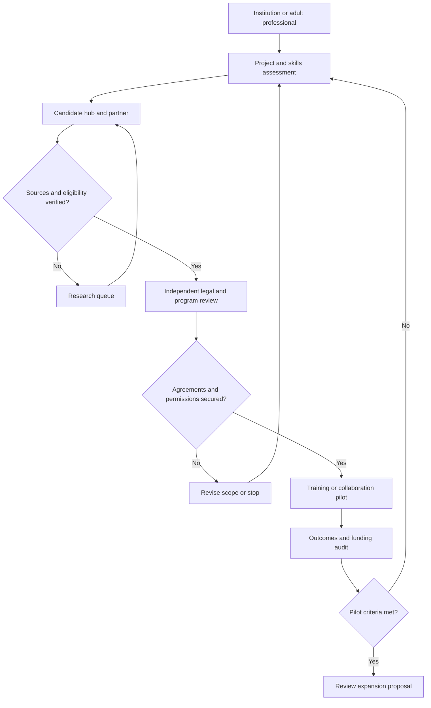
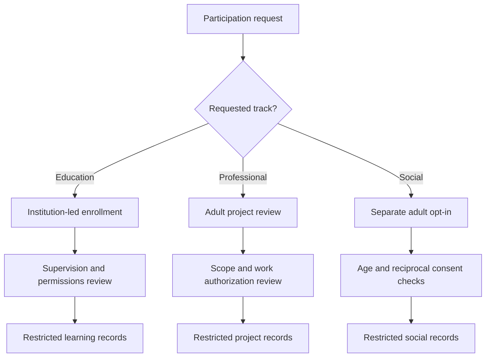
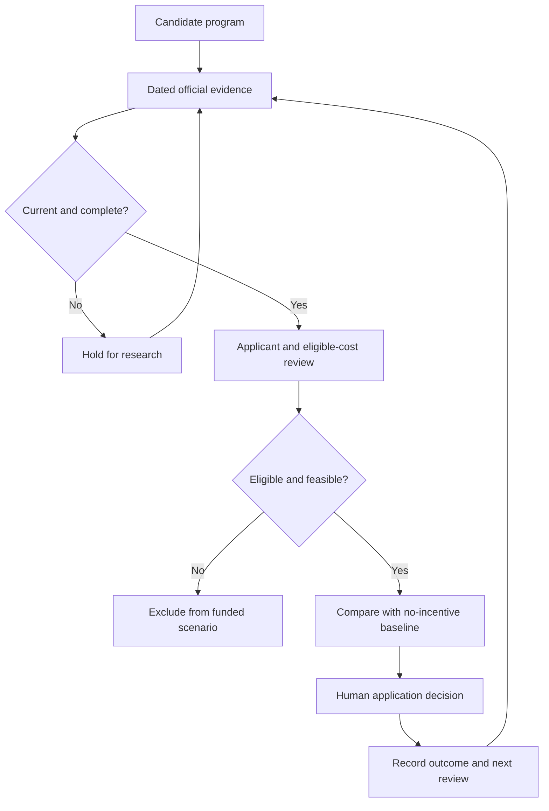
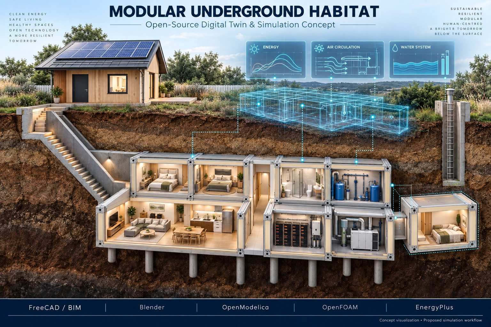
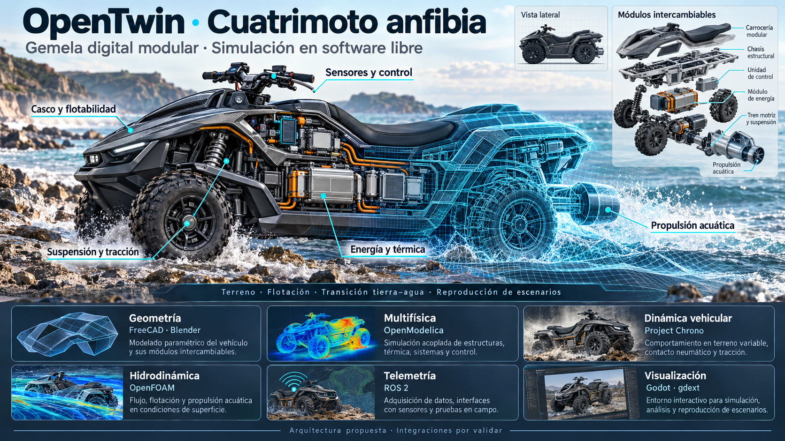
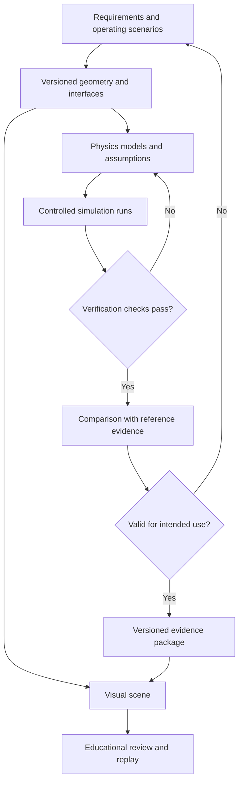
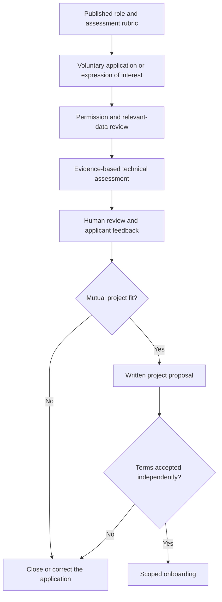
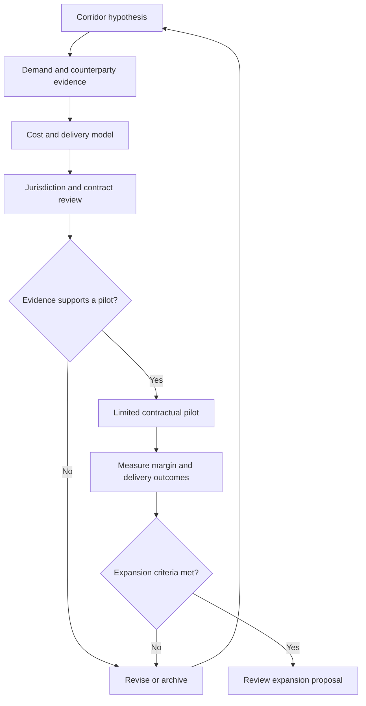
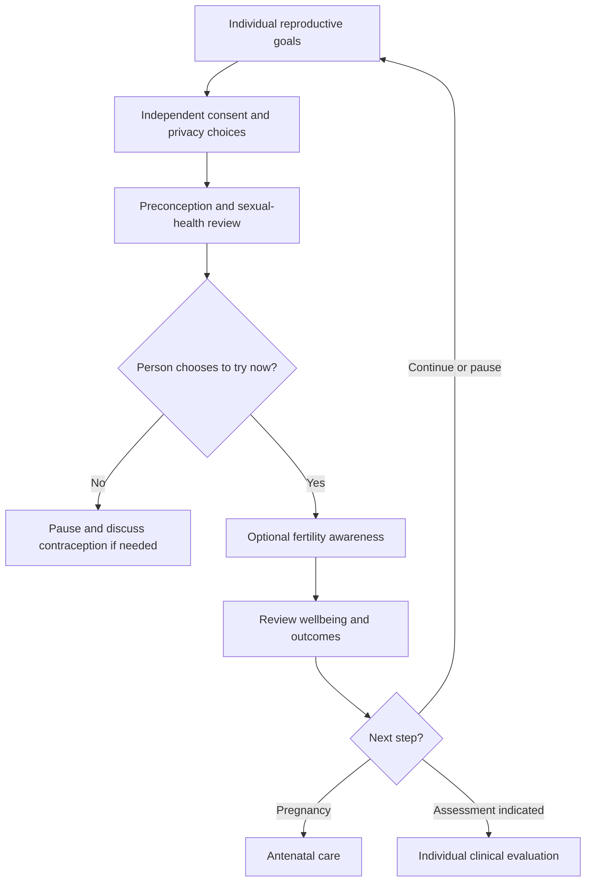

# Project Annex: Strategic Analysis and Institutional Framework

**Repository:** [robotics-intelligent-systems/jfxai4mad](https://github.com/robotics-intelligent-systems/jfxai4mad)
**Document class:** Proposed technical and strategic framework
**Editorial review date:** 28 September 2026

**Incentive-source review:** 27 September 2026; recheck current terms before an application.
**Related overview:** [README section 6](../README.md#6-global-strategic-annex)

## Contents

- [1. Executive summary](#1-executive-summary)
- [2. Existing destination research portfolio](#2-existing-destination-research-portfolio)
- [3. International access and evidence rules](#3-international-access-and-evidence-rules)
- [4. Proposed integration workflow](#4-proposed-integration-workflow)
- [5. Institutional agreements and evaluation](#5-institutional-agreements-and-evaluation)
- [6. Technology-city incentives: Austria, Greece and Sweden compared with Türkiye](#6-technology-city-incentives-austria-greece-and-sweden-compared-with-turkey)
- [7. Source register](#7-source-register)
- [8. CAD concepts and simulation work packages](#8-cad-concepts-and-simulation-work-packages)
- [9. Professional collaboration and AI-assisted sourcing](#9-professional-collaboration-and-ai-assisted-sourcing)
- [10. Corporate governance and personal autonomy](#10-corporate-governance-and-personal-autonomy)
- [11. Proposed international commercial corridors](#11-proposed-international-commercial-corridors)
- [12. Economic evaluation and impact measurement](#12-economic-evaluation-and-impact-measurement)
- [13. Implementation matrix and release gates](#13-implementation-matrix-and-release-gates)
- [14. Reproductive planning in consensual adult multi-partner families](#14-reproductive-planning-in-consensual-adult-multi-partner-families)

## 1. Executive summary

This annex proposes an institutional extension for FOSS simulation, CAD and model-based design education, including potential cooperation with naval-aviation preparatory academies. The CAD portfolio in section 8 provides concept-study subjects for mobility and resilient infrastructure. Inclusion does not establish an open hardware license, an endorsed partnership or a certified training platform.

The development hypothesis combines technical education, remote software collaboration, industrial-design exhibitions and voluntary professional mobility. Public incentives may support eligible activities, but no program is automatically attached to a JFXAI4MAD course or Voluntary Service Agreement (VSA).

The four-country comparison in [section 6](#6-technology-city-incentives-austria-greece-and-sweden-compared-with-turkey) addresses technology-hub development. It separates business support from personal relocation, residence permission and demographic policies.

## 2. Existing destination research portfolio

The previous annex mixed city-level claims, national fertility estimates, immigration assumptions and incentive amounts without dated sources. The destinations are retained below as a research portfolio. Unsupported amounts and undated fertility rankings are not carried forward as current offers.

| Country / region | Retained destinations | Research question before publication as an opportunity |
| --- | --- | --- |
| United States | Tulsa, Topeka, Marmarth | Verify each operator independently, current application window, employment conditions, right to work and repayment terms; do not attribute one city's program to another. |
| Spain | Ponga, Rubiá, Griegos / Teruel | Obtain current municipal calls before advertising relocation, newborn or rent support. |
| Germany | Altena, Görlitz | Confirm current trial-living or housing initiatives, capacity and eligibility rather than relying on earlier editions. |
| South Korea | Chuncheon, Jeonju | Separate national family benefits from municipal startup or housing programs; verify access for foreign residents. |
| Japan | Kamiyama, Higashikawa | Verify satellite-office opportunities, property availability, rehabilitation costs and municipal eligibility. |
| Italy | Santo Stefano di Sessanio / Abruzzo, Milan | Revalidate business and housing calls; treat design exhibitions as prospective partnerships. |
| Romania | Cluj-Napoca | Recheck current payroll and business taxation; do not budget the former annex's unsupported blanket 0% software-developer income tax. |
| Singapore | Singapore | Verify founder and employment routes independently of startup calls; do not infer tax benefits from a visa. |
| Serbia | Candidate regional hubs | Identify a named technology park, current call and applicant requirements before comparing costs. |
| Hungary | Candidate regional hubs | Verify the relevant research program and separate business incentives from residence eligibility. |
| Taiwan | Taipei and candidate regional hubs | Verify startup support and nationality-specific entry/residence rules. |
| Israel | Tel Aviv | Verify incubator participation, R&D calls, exhibition partners and travel conditions. |

**Evidence status:** these legacy destinations were not fully revalidated in this revision and must remain excluded from advertised grant totals. Their inclusion is neither a finding that a program is active nor that it has ended. Historical assertions remain available in Git history.

A later demographic comparison must identify the statistical authority, observation year and geographic scope of each indicator. National fertility rates must not be presented as city-level eligibility criteria or used to infer anyone's relationship intentions.

## 3. International access and evidence rules

The Andean Community (CAN) comprises Bolivia, Colombia, Ecuador and Peru. The European Commission describes its trade agreement with **Colombia, Peru and Ecuador**; Bolivia may seek accession. Therefore, “EU-CAN agreement” must not imply identical treaty coverage for all four countries. [S12]

For Austria, Greece and Sweden, assess applicable EU trade provisions separately from national immigration procedures. The EU agreement must not be carried over to Türkiye; any relevant Turkish trade arrangement requires an independent check.

Maintain distinct records for:

| Question | Required evidence |
| --- | --- |
| Short visit | Passport nationality, destination, purpose, duration and official entry rules |
| Work, study or business residence | Applicable national route, applicant eligibility and authority decision |
| Trade or procurement | Exact treaty parties, goods/services coverage and any exclusions |
| Tax benefit or R&D grant | Eligible beneficiary, qualifying activity, costs, approval and period |
| Family relocation or housing | Specific program, household conditions, local availability and award terms |

Trade access, visa-free short visits and a signed VSA are not substitutes for an appropriate work or residence route. Austria's founder route, Sweden's work/residence routes and Türkiye's work-permit process illustrate the need for separate applications. [S3] [S9] [S13]

## 4. Proposed integration workflow

Possible outputs include FOSS engineering contributions, industrial-art exhibitions, simulation coursework and eligible regional-development pilots. Remote work, relocation and institutional enrollment require separate approvals. No participating academy, technopark or funding agency is currently represented here as a contracted partner.

## 5. Institutional agreements and evaluation

A proposed VSA should define the parties, learning or project deliverables, duration, compensation if any, termination, intellectual-property terms and dispute process. It must not promise public funding or bind personal relationships to training or employment.

Keep academy education records separate from adult professional mobility and the platform's adult social-discovery data. Any program involving minors requires its own institution-led enrollment and safeguarding arrangements.

Evaluate candidate projects using documented partner interest, technical fit, eligible funding, full operating costs, infrastructure, legal feasibility and sustainable participation. For simulation projects, distinguish educational visualization from validated models and approved operational training.

### 5.1 Participation and data boundaries

| Track | Enrollment and record boundary | Required review |
| --- | --- | --- |
| Institution-led education | Learning records and guardian permissions where applicable | Institution approval, safeguarding, supervision and curriculum suitability |
| Adult professional collaboration | Separate project agreement and skills portfolio | Scope, compensation, intellectual property and lawful work arrangements |
| Adult social discovery | Separate, explicit opt-in in the core platform | Age verification, reciprocal consent and withdrawal controls |

No incentive assessment uses relationship status, intimate preferences or family-formation targets. Local legal thresholds must not be reduced to country-wide age labels in a recruitment diagram. Venue-specific conduct and media rules belong in an independently reviewed service policy, not in technology-hub scoring.

## 6. Technology-city incentives: Austria, Greece and Sweden compared with Turkey

### 6.1 Scope and comparison method

“Technology city” means a candidate urban innovation ecosystem, not a single statutory incentive category. The comparison separates four mechanisms: **company grants, R&D tax support, personal tax treatment and ecosystem services**. None of the reviewed sources establishes a universal cash reward for moving to the listed cities.

Facts below are drawn from the official program and ecosystem sources in section 7. Project-fit assessments and suggested pilot roles are explicitly planning judgments. Availability must be rechecked before an application or financial commitment.

### 6.2 Austria: Vienna as the initial reference hub

Vienna Business Agency's Innovation Funding supports eligible SMEs and founders in Vienna developing innovative products, technologies or services. Its published terms list a **€300,000 maximum**, funding rates of **45% for small businesses and 35% for medium-sized enterprises**, and a **€30,000 minimum project value**. The remaining published 2026 deadline is **31 December 2026**. Projects must start after submission of a complete application; selection is competitive. These figures are ceilings and conditions, not an award to this project. [S1]

At national level, Austria's research premium is **14% of qualifying R&D expenditure**. In-house R&D requires an FFG assessment and an application to the tax authority. Grant support and the research premium must be evaluated together under the applicable eligible-cost and cumulation rules rather than simply added. [S2]

**Planning judgment:** Vienna merits evaluation as a coordination and R&D base for the platform, with a defined experimental software work package. Routine tourism operations and ordinary application development must not automatically be classified as eligible research.

For non-EU founders, the Red-White-Red Card startup-founder route has separate business, capital and qualification requirements. Incorporation or a grant application does not itself establish residence eligibility. [S3]

### 6.3 Greece: Athens and Thessaloniki

Elevate Greece offers a national startup registry and ecosystem visibility, networking and access to information about support measures. **Registry admission does not automatically confer eligibility for state aid.** Each scheme has its own conditions and assessment. Treat Athens as a candidate coordination location and Thessaloniki as a candidate research-partnership location, not as locations with an automatic municipal relocation payment. [S4]

Thess INTEC is presented by its operator as a developing science and technology park intended to connect universities, research institutions and businesses. Verify delivery, tenancy and partner availability before treating planned facilities as operational capacity. [S5]

Separately, Article 5C provides a **50% income-tax exemption for seven tax years** on qualifying Greek employment and/or individual business income for approved individuals transferring tax residence. Conditions include prior non-residence for five of the preceding six years, transfer from an eligible jurisdiction, qualifying Greek activity and an intention to remain at least two years. It is a personal tax regime, not a corporate grant or visa; CAN applicants require individual review. [S6]

**Planning judgment:** Greece merits evaluation for a destination-tourism/LegalTech pilot and university-linked software collaboration. The tax regime should be modeled only for eligible individuals, separately from company funding.

### 6.4 Sweden: Gothenburg as the initial reference hub

Lindholmen Science Park in Gothenburg coordinates collaborative research and development involving industry, academia and public actors, including mobility programs. This provides an ecosystem reference for simulation partnerships; it is not a grant offer or confirmed admission. [S7]

Vinnova funding is awarded through specific calls with defined eligibility, assessment criteria and submission windows. Project partners, company characteristics, financing and eligible activities must be checked against the selected call. This annex does not assign a universal Swedish grant amount to a FOSS developer or assume a foreign entity qualifies directly. [S8]

**Planning judgment:** Gothenburg merits evaluation for collaborative mobility simulation, model validation and university–industry pilots. The starting action is to identify a suitable partner and live call, then establish the applicant structure and co-financing.

Swedish work and residence routes are separate from innovation funding. A prospective employee or self-employed founder must use the appropriate Migration Agency process. [S9]

### 6.5 Türkiye: Ankara technopark benchmark

ODTÜ TEKNOKENT in Ankara provides an established technology-park reference with entrepreneurship and company-development activities. Admission, services and project fit require direct confirmation; its inclusion does not imply a partnership with JFXAI4MAD. [S10]

The Investment and Finance Office describes Technology Development Zone (TDZ) exemptions for profits from qualifying software, R&D and design activities through **31 December 2028**, alongside VAT relief for qualifying application software produced exclusively in TDZs. These are activity- and zone-specific provisions, not a blanket exemption for all company income or all technology workers in a city. [S11]

**Planning judgment:** Ankara is a useful benchmark for a technopark-based engineering and software team. A financial model must separate qualifying R&D/software work from tourism bookings, coordination fees and other ordinary revenue. Include a post-2028 scenario without assuming an extension.

Foreign personnel must independently satisfy applicable work-permit requirements. Technopark participation alone does not replace that process. [S13]

### 6.6 Decision matrix

| Dimension | Austria / Vienna | Greece / Athens–Thessaloniki | Sweden / Gothenburg | Türkiye / Ankara |
| --- | --- | --- | --- | --- |
| Main reviewed mechanism | Municipal innovation grant and national R&D premium | Startup registry; conditional personal tax regime | Call-specific innovation funding and collaborative ecosystem | TDZ tax treatment and technopark ecosystem |
| Beneficiary distinction | Eligible business / qualifying R&D taxpayer | Startup entity versus qualifying individual taxpayer | Applicants and partners meeting a particular call | Accepted qualifying activity within the TDZ framework |
| Proposed project fit | Coordination and experimental software R&D | Tourism/LegalTech pilot and research partnerships | Mobility simulation and validation partnerships | Engineering/software development benchmark |
| First dependency | Eligible Vienna project and application timing | Registry/call eligibility; personal tax eligibility checked separately | Suitable partner, call and applicant structure | Park acceptance and qualifying-activity assessment |
| Do not assume | Grants and tax premium can be added without adjustment | Registry admission guarantees funding or residence | All FOSS work receives a grant | All revenue is exempt or benefits extend beyond 2028 |
| Personal relocation | Separate migration and household review | Separate immigration and tax-residence review | Separate work/residence process | Separate work/residence process |
| Comparison status | Candidate, not selected | Candidate, not selected | Candidate, not selected | Benchmark, not selected |

There is no supported overall “best country” ranking at this stage. Austria's project funding, Greece's personal tax treatment, Sweden's collaborative calls and Türkiye's qualifying-profit relief have different beneficiaries and tax bases; their percentages are not directly comparable.

### 6.7 Proposed pilot and incentive register

Prepare one common work package and budget for all four locations: a privacy-preserving platform prototype plus an optional, separately scoped FOSS simulation module. Use the same staffing, deliverables and service assumptions.

For each candidate, record:

| Register field | Required value |
| --- | --- |
| Program identity | Authority, official URL, city/country and scheme or call identifier |
| Evidence | Source publication date when available, review date and stored version |
| Status | Open, closed, forthcoming or unverified; application deadline and next review |
| Applicant | Entity type, location, ownership and partner requirements |
| Benefit | Grant, loan, tax relief or service; cap, rate, qualifying base and payment timing |
| Obligations | Matching funds, reporting, retention, clawback and cumulation rules |
| Mobility | Nationality-specific work/residence route assessed separately |
| Decision | Named reviewer, eligibility rationale and outstanding evidence |

Use a **no-incentive baseline** and a **conditional-support scenario**. Include employer costs, premises, insurance, local professional advice, reporting, currency exposure and the timing of reimbursements. Do not count pending grants as committed cash or record the Greek personal exemption as company revenue.

Refresh evidence before publication to users, before applying and before signing a relocation or project contract. Suspend expired or unverified offers from recommendations. Keep marriage, family formation and social-discovery preferences out of incentive scoring.

### 6.8 Evidence-to-decision workflow

A positive screening result authorizes preparation of an application only. Record an award separately from its payment and reconcile actual receipts with the project budget.

## 7. Source register

Sources reviewed on **27 September 2026**. Official summaries guide screening; applicable legislation, complete call terms and authority decisions govern individual cases.

| ID | Official source | Supports |
| --- | --- | --- |
| S1 | [Vienna Business Agency — Innovation Funding](https://viennabusinessagency.at/current-funding/innovation-funding/) | Grant limits, applicant scope, timing and published deadline |
| S2 | [FFG — Research premium assessments](https://www.ffg.at/forschungspraemie) | 14% R&D premium and application process |
| S3 | [Austria Migration — Startup founders](https://www.migration.gv.at/en/types-of-immigration/permanent-immigration/start-up-founders/) | Separate founder immigration route |
| S4 | [Elevate Greece — Startup registry](https://elevategreece.gov.gr/startup-registry/) | Registry benefits and non-automatic state-aid eligibility |
| S5 | [Thess INTEC — Project operator](https://www.thessintec.eu/) | Planned technology-park ecosystem |
| S6 | [AADE — Tax incentives, Articles 5A, 5B and 5C](https://www.aade.gr/sites/default/files/2025-11/forologika_kinitra_ENG.pdf) | Personal tax-residence incentive and conditions |
| S7 | [Lindholmen Science Park — Project activities](https://www.lindholmen.se/en/project-activities) | Mobility research and collaboration |
| S8 | [Vinnova — Apply for funding](https://www.vinnova.se/en/apply-for-funding) | Call-specific eligibility and assessment |
| S9 | [Swedish Migration Agency — Work](https://www.migrationsverket.se/en/you-want-to-apply/work.html) | Work and residence application routes |
| S10 | [ODTÜ TEKNOKENT](https://odtuteknokent.com.tr/en/) | Ankara technology-park and entrepreneurship ecosystem |
| S11 | [Invest in Türkiye — Investment zones](https://www.invest.gov.tr/en/investmentguide/pages/investment-zones.aspx) | TDZ incentives and published 2028 horizon |
| S12 | [European Commission — Andean Community](https://policy.trade.ec.europa.eu/eu-trade-relationships-country-and-region/countries-and-regions/andean-community_en) | Treaty coverage for Colombia, Peru and Ecuador; Bolivia accession distinction |
| S13 | [Invest in Türkiye — Obtaining a work permit](https://www.invest.gov.tr/en/investmentguide/pages/obtaining-a-work-permit.aspx) | Separate foreign-worker application process |

## 8. CAD concepts and simulation work packages

The three illustrations below are the current [CAD portfolio](../MBSE/CAD/). They define educational work packages for the institutional track, not products offered through the tourism platform. Rendered meshes, streamlines and cutaways are illustrative; no executable model, measured performance or live telemetry is established by these images.

### 8.1 Dolphin-inspired hydrojet submersible

A streamlined recreational craft study combines a tandem cockpit, outer fairing, an optional battery-electric energy module and an enclosed stern waterjet. The board depicts surface, transition and submerged modes alongside an exploded assembly and digital mesh.

**Proposed study:** compare hull variants, buoyancy and trim, propulsion demand and transition-control behavior. Pressure integrity, emergency recovery, occupant support and operating limits require dedicated engineering evidence; the illustration establishes no dive depth, endurance or passenger-safety approval.

### 8.2 Modular underground habitat

A surface service building and photovoltaic installation connect to underground living, sleeping, sanitation and utility modules. The cutaway depicts energy storage, air circulation, water treatment and separate access routes, with a digital overlay for system monitoring.

**Proposed study:** assess thermal loads, ventilation, water and energy balances, module interfaces and outage scenarios. Geotechnical conditions, groundwater, structural loading, fire protection and egress need site-specific assessment. The artwork is neither construction documentation nor evidence of eligibility for a housing incentive.

### 8.3 OpenTwin modular amphibious ATV

A four-wheel amphibious vehicle study combines interchangeable bodywork, a structural chassis, control electronics, energy storage, suspension and an aquatic propulsion module. The board links physical cutaway, wireframe and terrain-to-water scenarios.

**Proposed study:** evaluate tire–terrain interaction, traction, buoyancy, trim, land–water transition and thermal demand. Sensor interfaces and replay are proposed integration tasks. Roadworthiness, seaworthiness, payload and stability limits remain unvalidated.

### 8.4 Proposed FOSS tool responsibilities

These are candidate work-package assignments, not installed integrations. Review licenses, versions, model validity and exchange formats before implementation. A visualization binding does not provide a physics solver.

| Tool / layer | Proposed responsibility | Portfolio application |
| --- | --- | --- |
| FreeCAD and Blender | Parametric geometry, assembly inspection and visual assets | All three concepts |
| OpenModelica | Energy, thermal, fluid-network and control-system models | Propulsion, habitat utilities and ATV power systems |
| OpenFOAM | Dedicated fluid-flow studies with documented boundary conditions | Hydrodynamics and habitat ventilation |
| Project Chrono | Multibody and terrain-interaction studies | ATV suspension and traction |
| EnergyPlus | Building energy and thermal-load studies | Habitat envelope and occupancy scenarios |
| ROS 2 | Proposed sensor and telemetry interfaces | Vehicle replay and later test-data acquisition |
| Godot with gdext | Interactive inspection and scenario replay | Presentation of model outputs across the portfolio |

### 8.5 Model development and acceptance workflow

Verification checks numerical behavior, units, interfaces and reproducibility. Validation assesses agreement with suitable reference or measured evidence for a stated use; neither a plausible render nor a passing parser constitutes physical validation.

| Deliverable | Acceptance evidence |
| --- | --- |
| Requirements baseline | Scenario, owner, measurable criteria and traceable concept version |
| Model package | Geometry revision, parameters, units, solver version and boundary conditions |
| Verification report | Reproducible cases, conservation checks where applicable and sensitivity analysis |
| Validation report | Reference data provenance, uncertainty and documented applicability limits |
| Educational release | Reviewed limitations, licenses, reproducible instructions and assessment rubric |

Until those deliverables exist, the portfolio remains a set of simulation proposals. Live digital-twin claims additionally require a defined physical asset, synchronized observations and a maintained calibration process.

## 9. Professional collaboration and AI-assisted sourcing

This extension uses the project identity and scope defined in the [main overview](../README.md). It proposes a professional collaboration workflow around declared skills, voluntary applications and documented project needs. It does not redefine JFXAI4MAD as a deployed multi-agent recruitment product.

GitHub and LinkedIn are potential discovery or application channels, not evidence of authorised scraping, available APIs or confirmed partnerships. Select an access method only after checking the applicable platform terms and data permissions. No outreach campaign is initiated by this document.

### 9.1 Data and assessment boundaries

| Input | Proposed use | Boundary |
| --- | --- | --- |
| Applicant-selected repositories and portfolio | Discuss demonstrated work relevant to a defined role | Record provenance and context; contribution counts are not a competence score |
| Declared skills and availability | Match project requirements and scheduling | Let applicants correct the record and decline participation |
| Work sample and interview | Assess a published technical rubric | Human review, accommodations and an explanation of the decision |
| Voluntary mobility preferences | Discuss remote or location-specific options | Separate from technical evaluation; verify eligibility independently |
| Personal relationship information | No role in professional selection | Do not infer sexual orientation, intimate preferences or relationship availability from profiles |

AI may summarise applicant-provided material, identify missing evidence and draft a review brief. It must not score “cultural affinity”, intimate receptivity or suitability for a personal relationship. A human owns selection decisions and reviews errors or disputes.

### 9.2 Proposed sourcing workflow

Track application completion, time to decision, accepted offers, project completion and correction requests. Report denominators and observation periods. Do not claim retention or conversion improvements before a measured pilot.

## 10. Corporate governance and personal autonomy

Use an appropriate project agreement, employment arrangement or business entity selected with qualified advice for the relevant jurisdiction. Define contributions, compensation, ownership, intellectual property, decision rights, conflicts of interest and exit terms.

Marriage and consensual adult relationships are personal matters, separately governed by the core platform's consent boundaries. They are not corporate onboarding mechanisms, selection criteria or promises of residence, tax relief or public funding. This annex makes no claim that a civil union substitutes for incorporation or grants immigration eligibility.

| Decision | Separate record and owner |
| --- | --- |
| Project participation | Technical scope and written agreement reviewed by the parties |
| Company formation | Entity and jurisdiction assessment with qualified advisers |
| Work or residence application | Individual eligibility and authority process |
| Personal relationship or marriage service | Separate voluntary request and confidential case record |
| Public incentive | Programme-specific application and award decision |

Volunteering in Argentina or another location is a possible project hypothesis. Identify a host, scope, expenses, permissions and participant protections before presenting an opportunity. No host or programme is confirmed here.

## 11. Proposed international commercial corridors

These are market-research hypotheses, not established logistics routes, preferential trade entitlements or committed revenue streams. Cultural or historical connections alone do not establish commercial access.

| Candidate corridor | Proposed research question | Evidence required before a pilot |
| --- | --- | --- |
| Japan–United States | Is there a viable robotics/software or supply-chain collaboration? | Named counterparties, product/service scope, demand evidence, delivery costs and applicable trade requirements |
| Philippines–Spain / Latin America | Is there demand for bilingual technical support or localisation? | Customer interviews, available skills, service quality, contracting and data-handling requirements |
| Europe–Latin America | Can remote engineering and institutional projects be delivered sustainably? | Host interest, work scope, costs and independent mobility checks |

The annex does not treat the Philippines as an automatic gateway to all ASEAN preferences. Evaluate the exact countries, goods or services, origin rules and contractual responsibilities for each proposed transaction before making a market-access claim.

## 12. Economic evaluation and impact measurement

Use an explicit project period, currency and accounting basis. The following is a proposed reporting convention, not a forecast or investment recommendation:

$$
\mathrm{ROI}_{\mathrm{project}} = \frac{R-C}{C} \times 100\%, \qquad C>0
$$

Here, **R** is project revenue over the selected period and **C** is the complete project cost on the same basis. Report cash collections and payments separately when they differ from recognised revenue and cost. If no revenue exists yet, report burn, milestones and scenarios rather than a realised ROI.

| Measure | Treatment |
| --- | --- |
| Revenue | Contracted/delivered service or product revenue under the stated basis |
| Cost | Acquisition, labour, delivery, infrastructure, legal setup, support and administration; avoid double counting |
| Public support | Separate pending, awarded and received amounts; identify accounting treatment before including support |
| Tax effects | Separate, reviewed scenario assumptions; no automatic benefit from location or personal status |
| Technical output | Accepted deliverables, reproducibility and reuse; do not add an invented code value to revenue |
| Social impact | Voluntary participation, completed training and host feedback in a separate dashboard |

Compare a no-incentive baseline with a conditional-support scenario using the same scope. Do not monetise intimate relationships, assign a “social lifetime value” to individuals or count unconfirmed migration benefits as financial savings. Avoid adding gross margin to revenue when it already derives from the same sales.

## 13. Implementation matrix and release gates

| Workstream | Initial deliverable | Release gate |
| --- | --- | --- |
| Technical collaboration | Role description, opt-in process and work-sample rubric | Data boundaries, human ownership and correction path documented |
| Institutional education | Host proposal and curriculum package | Institution approval and separate safeguarding arrangements |
| Technology hubs | Dated incentive register from section 6 | Applicant eligibility, current terms and funding assumptions reviewed |
| Commercial corridors | Customer evidence and cost model | Named parties, reviewed contracts and bounded pilot scope |
| Economic reporting | Common-period budget and impact dashboard | Assumptions, denominators and duplicate-value checks documented |
| CAD simulation | Model and evidence package from section 8 | Verification and intended-use validation completed before capability claims |

Keep this annex as the detailed source for these extensions and the README as its navigation summary. Changes to section titles must update both contents lists and cross-document anchors. Expired or unverified programme claims must remain outside active recommendations.

## 14. Reproductive planning in consensual adult multi-partner families

**Scope:** educational information for adults choosing conception through vaginal intercourse, including consensually non-monogamous or polyamorous families. Assisted reproduction, IVF and clinical insemination protocols are outside this section. This scope does not exclude preconception care, fertility assessment or antenatal care.

Timed intercourse is a general fertility-awareness approach, not a distinct validated “polyamorous technique”. The sources below do not validate rotational cohorts, a maximum partner count or group pregnancy targets. Individual reproductive choices must remain independent of employment, housing, immigration, public incentives and the professional sourcing workflow in section 9.

### 14.1 Evidence review of the proposed protocol

| Proposed rule | Evidence-based disposition |
| --- | --- |
| One ejaculation every 24–48 hours as a biological maximum | ASRM does not recommend restricting frequency; daily ejaculation can retain normal semen parameters. [F1] |
| Fixed semen volume, concentration and monthly session quotas | Remove universal depletion thresholds and the 12–18-session capacity calculation; these are not supported by the cited guidance. [F1] |
| Four to six participants per cycle; eleven or more cannot succeed | No validated cohort limit is established by these sources. Do not encode one in the platform. |
| Morning intercourse, prescribed pelvic angle and post-coital rest | No established fertility benefit supports prescribed positions or post-coital routines; the proposed clock-time rule is not established here. [F1] |
| Highest LH reading or age over 30 determines priority | Do not rank people for access to conception attempts; the proposed ranking has no validated basis in this framework. |
| Approximately 85% success for each annual cohort | Do not transfer a population estimate into a guarantee for an individual or multi-partner group. |

### 14.2 Fertile-window awareness and tracking

The fertile window spans the five days before ovulation and ovulation day. Intercourse every one to two days within it is a general option, guided by participants' preferences rather than a mandatory timetable. Tracking can assist timing but must not become a performance obligation. [F1]

Urinary LH suggests approaching ovulation rather than its exact time; a positive result may precede ovulation by up to two days. Cervical mucus observations can help identify fertile days. Avoid assuming every cycle follows a 28-day calendar. [F1]

Basal body temperature is retrospective and can be unreliable; it does not confirm an exact ovulation moment. Choose test start dates according to cycle history and kit instructions rather than prescribing day 10 universally. Discuss irregular cycles or confusing results with a clinician. [F2]

### 14.3 Individual plans and voluntary review periods

Quarterly, six-monthly or annual meetings may be used to review family resources and preferences. They are administrative choices, not hormonal synchronisation, a sperm-recovery schedule or evidence-based fertility treatment.

| Review period | Optional discussion | Boundary |
| --- | --- | --- |
| Three months | Preferences, emotional burden and shared support | No automatic reassignment of a person's reproductive plans |
| Six months | Care access, expenses and childcare responsibilities | Do not postpone a clinically indicated fertility assessment |
| Twelve months | Longer-term family plans and completed decisions | No guaranteed conception rate or compulsory cohort rotation |

Each adult may pause or withdraw at any time. Being outside an agreed planning period is not a biologically “non-fertile” state. If pregnancy is not desired, discuss contraception separately; a roster is not contraception. Shared calendars should expose only information each person expressly chooses to share.

### 14.4 Preconception care and sexual health

Review medical conditions, medicines, supplements, vaccination needs, substance use and nutrition with a qualified clinician before pregnancy. Do not start hormone manipulation or high-dose fertility supplements from an AI-generated schedule. General preconception guidance supports healthy activity and balanced nutrition, with individual assessment where needed. [F3]

CDC recommends **400 micrograms of folic acid daily** for people who can become pregnant to help prevent neural-tube defects. This is not a conception-rate booster; ask a clinician whether individual circumstances require a different plan. [F4]

STIs may be asymptomatic and can affect pregnancy. Discuss testing, timing after exposures, prevention and any treatment needs with a clinician; a negative result is not a permanent guarantee. Condoms reduce STI risk, while conception through intercourse involves a separate informed discussion about exposure. Pregnancy itself offers no protection, and prenatal STI screening remains important. [F5]

Sunlight, room temperature, music tempo, clothing and specific micronutrient combinations are not established fertility prescriptions in this framework. Comfort preferences may be recorded as preferences, without claiming an endocrine or pregnancy benefit. Avoid presenting a particular climate as treatment for infertility.

### 14.5 When to seek evaluation

ASRM recommends evaluation after 12 months of unsuccessful attempts when the woman is younger than 35, or after six months at 35 or older. Over 40, more immediate assessment may be warranted. Seek earlier review for irregular or absent cycles, known reproductive conditions or suspected male-factor problems. Relevant partners may need concurrent assessment. Time already spent trying matters; a group rotation does not reset it. [F2]

Choosing conception without ART does not require declining diagnostic advice. A clinician can discuss findings and options while respecting that preference.

### 14.6 Location and family-support research

The submitted destinations remain lifestyle research candidates, not ranked fertility locations. No climate range, tax entitlement, residency route or healthcare-quality claim is confirmed by this section.

| Candidate location | Evidence needed before relocation advice |
| --- | --- |
| Canary Islands, Spain | Local care access, housing, climate data and separately verified programme eligibility |
| Costa del Sol, Spain | Continuity of maternity care, insurance, living costs and support network |
| Panama City or coastal Panama | Care access, travel logistics and independent tax/residence review |
| Medellín or Colombia's Coffee Region | Local services, insurance, costs and family-support arrangements |

Review parentage, caregiving, guardianship and financial responsibilities with qualified local advisers before relying on any cross-border arrangement. Relationship structure does not itself establish legal recognition or public-benefit eligibility.

### 14.7 Consent-led planning workflow

This is a proposed educational navigation flow, not a diagnostic or pregnancy-prediction algorithm. Do not optimise pregnancy counts, allocate partners or infer fertility from social profiles. Reproductive records must be opt-in, access-restricted and excluded from recruitment, investment and incentive scoring. Examples must use synthetic data.

### 14.8 Source register and publication gate

Sources consulted on **28 September 2026**. These materials support general education; they do not study or endorse the proposed rotational-cohort protocol.

| ID | Source | Scope |
| --- | --- | --- |
| F1 | [ASRM — Optimizing natural fertility, 2022](https://www.asrm.org/practice-guidance/practice-committee-documents/optimizing-natural-fertility-a-committee-opinion-2021/) | Timing, frequency and unsupported coital practices |
| F2 | [ASRM — Fertility evaluation, 2021](https://www.asrm.org/practice-guidance/practice-committee-documents/fertility-evaluation-of-infertile-women-a-committee-opinion-2021/) | Evaluation timing and tracking limitations |
| F3 | [ASRM/ACOG — Prepregnancy counseling, 2019](https://www.asrm.org/practice-guidance/practice-committee-documents/prepregnancy-counseling-2019/) | Individual health and medication review |
| F4 | [CDC — Folic acid intake and sources](https://www.cdc.gov/folic-acid/about/intake-and-sources.html) | Folic acid for neural-tube-defect prevention |
| F5 | [CDC — STIs and pregnancy](https://www.cdc.gov/sti/about/about-stis-and-pregnancy.html) | Infection prevention and prenatal testing |

Before turning this documentation into a user-facing health feature, obtain qualified clinical review, define privacy and escalation requirements, and evaluate the accuracy of all educational outputs. No such clinical validation is claimed by this addition.
