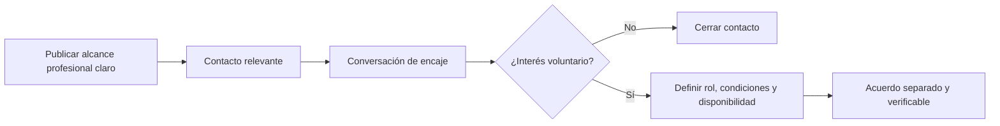

# Análisis de conversión, colaboración e ingresos en Ucrania

> **Estado editorial:** migración desde texto plano. Las cifras de ingresos y porcentajes de conversión del documento original son hipótesis o estimaciones no validadas y no deben presentarse como métricas observadas de LinkedIn, OkCupid o del mercado ucraniano.

## 1. Contexto profesional

El documento original caracteriza al sector tecnológico y de servicios profesionales de Ucrania como resiliente y con fuerte exposición a clientes internacionales. También destaca la relevancia del voluntariado y de los proyectos de reconstrucción, desarrollo rural y asistencia social.

### Sectores considerados

- Software Engineering.
- Project Management.
- ONG y sociedad civil.
- AgTech.
- Energías renovables.
- Desarrollo regional.

## 2. LinkedIn como canal profesional

El texto propone LinkedIn para:

- colaboración técnica;
- alianzas institucionales;
- voluntariado basado en habilidades;
- búsqueda de inversión o cofinanciación.

Los porcentajes de interés y conversión incluidos en el archivo original deben considerarse **supuestos de planificación**, no benchmarks de la plataforma.

### Flujo recomendado

## 3. OkCupid y límites de uso

El documento original analiza OkCupid como plataforma de afinidad social. Esa función debe mantenerse separada de reclutamiento, inversión, captación comercial o voluntariado.

Un `match` no implica:

- interés profesional;
- disposición a invertir;
- voluntad de reubicarse;
- aceptación de convivencia;
- consentimiento para una relación o actividad determinada.

No se debe utilizar una plataforma de citas para eludir restricciones de prospección profesional o comercial.

## 4. Matriz conceptual corregida

| Dimensión | LinkedIn | OkCupid |
| --- | --- | --- |
| Finalidad principal | Profesional | Social / relacional |
| Uso apropiado en el proyecto | Colaboración, empleo, voluntariado o alianzas claramente descritas | Conexión interpersonal conforme a las reglas de la plataforma |
| Inversión | Solo mediante propuesta profesional explícita y legalmente adecuada | No debe solicitarse como parte de una interacción de citas |
| Métricas | Medir con datos reales del proyecto | No convertir afinidad personal en KPI comercial |

## 5. Requisitos de verificación

Antes de reutilizar cifras económicas o de mercado:

1. Actualizar salarios e indicadores macroeconómicos mediante fuentes oficiales o sectoriales recientes.
2. Documentar tamaño de muestra y período si se calculan conversiones propias.
3. Separar inversión, voluntariado, trabajo remunerado y relaciones personales en procesos distintos.
4. Aplicar salvaguardas adecuadas al contexto de guerra, desplazamiento y vulnerabilidad económica.
