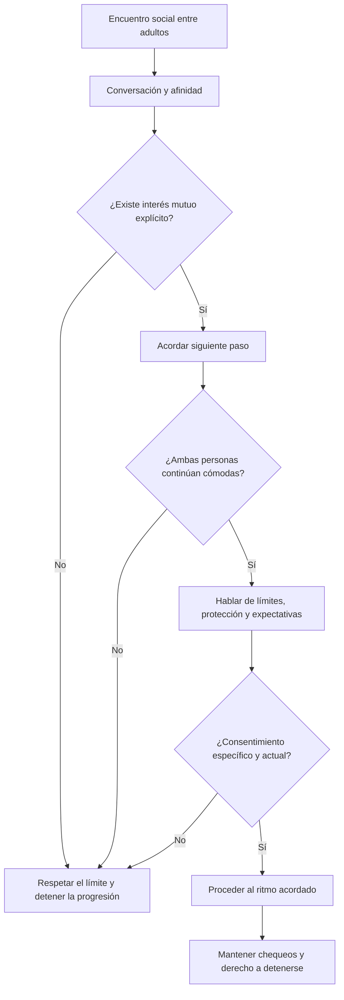
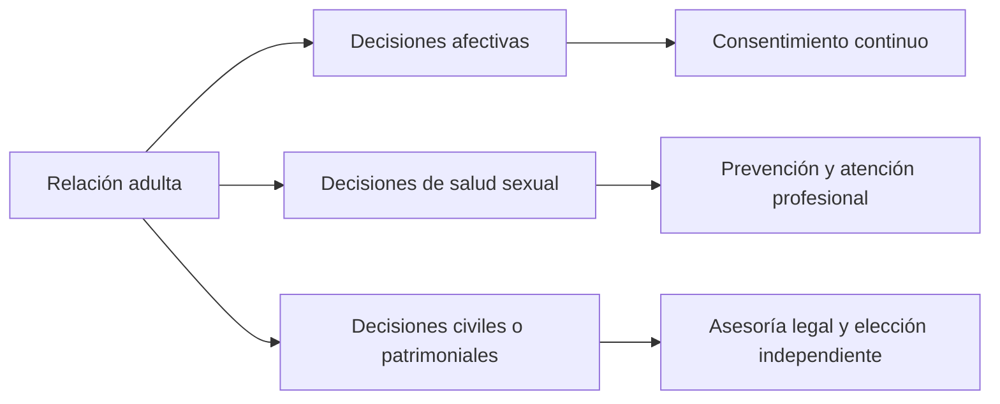

# Interacción adulta, consentimiento y salud sexual

> **Aviso educativo y clínico:** este documento tiene fines informativos y formativos. No sustituye atención médica, psicológica, sexológica o jurídica individualizada. Está dirigido exclusivamente a personas adultas con capacidad legal para consentir en su jurisdicción.

## 1. Principios generales

### 1.1 Consentimiento y autonomía

El consentimiento debe ser:

- **explícito**;
- **voluntario**;
- **continuo**;
- **reversible**;
- **específico para cada actividad**.

Una conversación, una cita, un baile, un beso, una relación previa, un matrimonio o un traslado a un espacio privado no sustituyen el consentimiento para una actividad posterior.

### 1.2 Salud y prevención

El enfoque educativo prioriza:

- comunicación clara sobre límites y preferencias;
- prevención de infecciones de transmisión sexual (ITS);
- uso apropiado de métodos de barrera cuando corresponda;
- planificación reproductiva consensuada;
- comodidad física y ausencia de dolor;
- consulta profesional ante síntomas, dudas o condiciones clínicas.

### 1.3 Neutralidad y alcance

El material no promueve explotación, coerción, comercio sexual ni presión para mantener una relación. Tampoco presupone que una formalización civil sea requisito para la intimidad adulta; las decisiones personales y legales son independientes y requieren consentimiento propio.

## 2. Flujo de interacción social y consentimiento

## 3. Baile y contacto social

El baile puede facilitar cercanía y coordinación corporal, pero debe interpretarse únicamente como consentimiento para el baile dentro de los límites acordados.

### Buenas prácticas

- Pedir permiso para iniciar o intensificar contacto.
- Observar señales de incomodidad como complemento, no sustituto, de la comunicación verbal.
- No asumir que proximidad, sonrisa o continuidad en la pista equivale a consentimiento para besar o mantener intimidad.
- Ofrecer siempre una salida sencilla y sin presión.

## 4. Transición a una conversación más privada

Una propuesta clara puede incluir una alternativa explícita:

> “Me gustaría seguir conversando en un lugar más tranquilo. ¿Te gustaría o prefieres quedarnos aquí?”

Si la respuesta es ambigua, existe duda, intoxicación significativa o incapacidad para decidir libremente, la progresión debe detenerse.

## 5. Salud sexual, lubricación y comodidad

### 5.1 Excitación y respuesta fisiológica

La respuesta sexual puede incluir cambios vasculares, musculares y de lubricación, pero varía mucho entre personas y situaciones. La ausencia o presencia de una respuesta corporal no equivale a consentimiento.

### 5.2 Lubricación

Cuando se utiliza lubricante, debe elegirse un producto compatible con el método de barrera y con las necesidades individuales. La lubricación puede reducir fricción, pero no garantiza ausencia de lesión ni reemplaza la comunicación sobre dolor o comodidad.

### 5.3 Dolor o resistencia

La actividad debe detenerse ante:

- dolor;
- ardor;
- sangrado inesperado;
- resistencia muscular marcada;
- incomodidad emocional;
- petición verbal o no verbal de parar.

La persistencia de dolor, vaginismo, infecciones recurrentes u otros síntomas requiere evaluación profesional.

## 6. Métodos de barrera y planificación

Antes de una actividad sexual, las personas adultas pueden acordar:

- preservativos u otros métodos de barrera;
- anticoncepción;
- pruebas de ITS cuando resulten apropiadas;
- expectativas reproductivas;
- límites y actividades aceptadas.

Ningún certificado médico elimina completamente el riesgo ni sustituye la prevención continua.

## 7. Formalización civil y salud

El documento original vinculaba intimidad, trámites matrimoniales y certificación de salud en una secuencia rígida. En esta versión corregida se separan estas decisiones:

El matrimonio, la convivencia, la anticoncepción y la intimidad son decisiones distintas. Ninguna debe condicionarse automáticamente a otra.

## 8. Uso de imágenes y estilo anime

Las imágenes de adultos en estilo anime pueden utilizarse con fines educativos o artísticos siempre que:

- las personas representadas sean claramente adultas;
- no se utilicen imágenes de una etapa juvenil para sexualizar a una persona real;
- exista autorización cuando se empleen fotografías identificables de terceros;
- el material clínico o anatómico mantenga un propósito educativo claro.

## 9. Reglas de seguridad y revisión

1. Mantener el derecho a retirar consentimiento en cualquier momento.
2. Evitar presión económica, migratoria, profesional o emocional sobre decisiones íntimas.
3. Separar acuerdos laborales, financieros y civiles de la aceptación de intimidad.
4. Consultar fuentes clínicas actualizadas para afirmaciones sobre pH, osmolaridad, ITS, fertilidad o anatomía.
5. Consultar asesoría jurídica independiente para matrimonio, inmigración, patrimonio o contratos.

## 10. Resumen

El objetivo del flujo no es conducir a una actividad predeterminada, sino proporcionar un marco de **comunicación, consentimiento, prevención, comodidad y autonomía**. Cada etapa puede terminar sin que ello se considere un fracaso ni genere obligación alguna.
