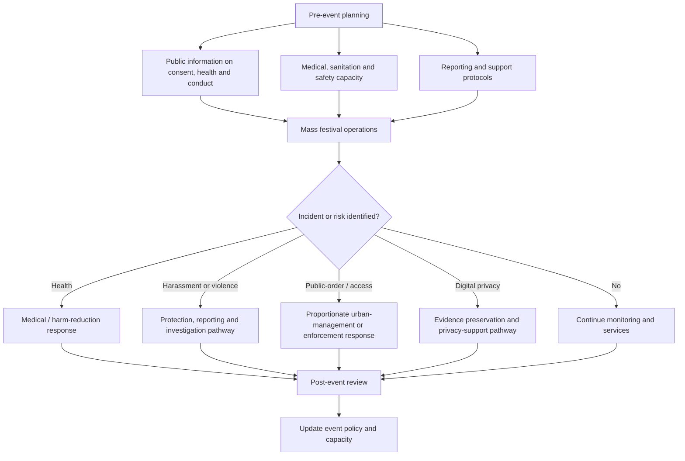

# Public-Space Sexual Behavior at Mass Festivals: Social, Health and Urban-Policy Notes

**Scope:** sociocultural, public-health, legal and urban-management analysis of adult sexual behavior in public space during mass festivals in Latin America.  
**Editorial revision:** 1 October 2026

> **Editorial note.** This document refactors a legacy plaintext note into structured Markdown. It is descriptive and analytical, not a claim that the same behaviors, risks or institutional responses occur uniformly across all festivals, cities or countries. Legal provisions, public-health measures, local programs and event rules should be verified from current official sources before operational use.

## Contents

- [1. Festival context and temporary norm relaxation](#1-festival-context-and-temporary-norm-relaxation)
- [2. Public-problem dimensions](#2-public-problem-dimensions)
- [3. Health and harm-reduction considerations](#3-health-and-harm-reduction-considerations)
- [4. Consent, sexual violence and digital privacy](#4-consent-sexual-violence-and-digital-privacy)
- [5. Urban coexistence and service saturation](#5-urban-coexistence-and-service-saturation)
- [6. Legal and institutional responses](#6-legal-and-institutional-responses)
- [7. Integrated public-management framework](#7-integrated-public-management-framework)
- [8. Verification requirements](#8-verification-requirements)

## 1. Festival context and temporary norm relaxation

Mass festivals such as the Rio de Janeiro Carnival, the Barranquilla Carnival and other large Latin American street celebrations can temporarily change ordinary patterns of public behavior. The legacy note interprets this through the idea of the carnival as a temporary social exception in which hierarchy, restraint and routine conventions may be relaxed.

Relevant contextual factors include:

- **High-density crowds:** large numbers of participants in streets and public plazas can reduce ordinary interpersonal distance and complicate supervision.
- **Anonymity within the crowd:** people may feel less individually visible or accountable in very large gatherings.
- **Alcohol and other substances:** intoxication can impair judgment, increase vulnerability and complicate consent assessment.
- **Festival norms:** local customs may tolerate forms of dress, dancing, affection or bodily expression that differ from ordinary daily settings.

These factors help explain context, but they do not suspend consent requirements, privacy rights, public-order rules or criminal law.

## 2. Public-problem dimensions

A private behavior becomes a public-policy concern when it affects third parties, shared space, public services or protected rights. The legacy source identifies four overlapping dimensions:

1. **Public health:** STI prevention, unplanned pregnancy prevention, emergency care and harm reduction.
2. **Consent and personal safety:** harassment, sexual assault, intoxication-related vulnerability and coercion.
3. **Digital privacy:** non-consensual recording, distribution, extortion and reputational harm.
4. **Urban coexistence:** sanitation, noise, blocked access, waste, resident impact and strain on emergency services.

The central management challenge is therefore broader than morality or public decency. It involves balancing cultural celebration, tourism, health, safety, privacy and the rights of residents and event participants.

## 3. Health and harm-reduction considerations

Large events can create conditions in which spontaneous sexual activity occurs with limited preparation or protection. Public-health strategies described in the legacy note include:

- distribution of condoms and other barrier methods;
- rapid testing or referral for STI services;
- emergency medical posts;
- public-health messaging before and during the event;
- harm-reduction communication for alcohol and substance use.

These measures should be understood as risk reduction, not as encouragement of sexual activity in public space. Current local health-agency guidance should determine actual event protocols.

## 4. Consent, sexual violence and digital privacy

### 4.1 Consent

Crowds, alcohol and noise can make communication more difficult, but they do not lower the standard for consent. Consent must remain voluntary, specific and revocable. A person's clothing, dancing, intoxication, previous affection or participation in a festival does not constitute consent to sexual contact.

### 4.2 Harassment and sexual violence

The legacy note identifies risks such as unwanted touching, sexual assault and substance-facilitated violence. Event organizers and public authorities may respond through:

- clearly marked support or safe points;
- trained staff and referral protocols;
- accessible reporting channels;
- transport or accompaniment assistance;
- public campaigns emphasizing that celebration does not override personal boundaries.

### 4.3 Non-consensual recording

Smartphones add a separate privacy risk. Recording or distributing intimate or compromising images without consent can cause long-term harm, including harassment, extortion, employment consequences and digital abuse.

Operational policies should therefore distinguish between:

- conduct occurring in public;
- the legality of recording in a particular jurisdiction;
- privacy, image-rights and intimate-image laws;
- platform policies governing non-consensual intimate content.

## 5. Urban coexistence and service saturation

Mass celebrations can impose significant external costs on residents and municipal infrastructure. The legacy note highlights:

- blocked residential or commercial access;
- biological and solid waste;
- sanitation burdens;
- excessive noise;
- crowd-control demands;
- emergency-service saturation.

For public management, the issue is not only individual conduct but the cumulative effect of thousands or millions of participants using the same urban space.

## 6. Legal and institutional responses

The original note mentions public-decency or public-obscenity provisions, including a reference to Article 233 of the Brazilian Penal Code. That reference should be checked against the current official text and local enforcement guidance before citation.

A practical policy mix may include:

| Approach | Typical measure | Limitation |
| --- | --- | --- |
| Public-order enforcement | warnings, fines, removal or arrest where legally justified | difficult to apply uniformly in very large crowds |
| Harm reduction | condoms, health information, testing/referral and medical support | reduces health risk but does not resolve consent or public-space concerns |
| Violence prevention | safe points, trained teams, reporting channels and consent campaigns | requires staffing, visibility and coordination |
| Urban management | sanitation, barriers, toilets, transport, access corridors and crowd plans | resource-intensive during peak attendance |
| Digital-safety response | reporting channels and support for non-consensual recording or distribution | effectiveness depends on law, evidence preservation and platform response |

The legacy note also refers to campaigns such as **"Não é Não"** and to protective or support points sometimes described as **Pontos Violetas / Puntos Violeta**. Their names, scope and current availability vary by jurisdiction and event and should be verified locally.

## 7. Integrated public-management framework

A useful policy model separates the problem into prevention, event operations and post-event response:

This framework avoids relying exclusively on either prohibition or permissiveness. It treats health, consent, privacy and urban coexistence as separate but coordinated responsibilities.

## 8. Verification requirements

Before this material is used in project planning or external publication, verify:

- the current criminal and administrative rules on public sexual conduct in each jurisdiction;
- current consent and sexual-assault law;
- intimate-image, recording and privacy law;
- actual public-health measures used by the named event or municipality;
- existence and operating details of support points, reporting centers or campaigns;
- current event attendance, sanitation and emergency-service data;
- the distinction between documented incidents and generalized assumptions about festival participants.

No participant group, nationality, gender or festival audience should be characterized as inherently more promiscuous, violent or irresponsible on the basis of the event context alone.
