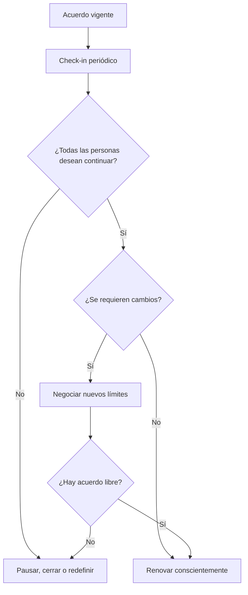

# No monogamia ética con alternancia y revisiones trimestrales

> **Alcance:** modelo conceptual para relaciones consensuadas entre adultos. No constituye recomendación clínica ni jurídica.

## 1. Alternancia

La alternancia propone organizar tiempo, energía y espacios entre distintos vínculos y la autonomía individual.

### Elementos principales

- **Rotación de atención y tiempo:** bloques acordados para convivencia, otras relaciones y tiempo personal.
- **Gestión de la energía afectiva:** evitar que una relación nueva desplace de forma no acordada compromisos existentes.
- **Previsibilidad:** mantener acuerdos explícitos en lugar de asumir reglas implícitas.
- **Flexibilidad:** permitir cambios mediante conversación y consentimiento.

## 2. Acuerdo trimestral de prueba renovable

Se propone una revisión cada 90 días como mecanismo de conversación, no como contrato irreversible.

### En cada revisión, las personas pueden

1. Renovar el acuerdo.
2. Modificar límites o reglas de información.
3. Ajustar distribución de tiempo.
4. Revisar acuerdos de salud sexual.
5. Pausar o concluir la apertura.

La renovación debe ser **activa y voluntaria**; nunca automática.

## 3. Principios de funcionamiento

- Comunicación continua.
- Consentimiento informado y reversible.
- Autonomía individual.
- Respeto por límites distintos entre participantes.
- Derecho a terminar o modificar el acuerdo sin penalización.

## 4. Flujo de revisión

El modelo no convierte afecto, convivencia o intimidad en métricas de desempeño; su finalidad es facilitar conversaciones claras entre adultos.
