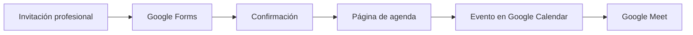

# Integración de encuesta, agenda y videollamada

## Google Forms + Google Calendar + Google Meet

La propuesta organiza un flujo sencillo para pasar de una encuesta inicial a una videollamada programada.

## 1. Google Forms

### Datos mínimos recomendados

- Nombre.
- Correo electrónico.
- Información adicional únicamente cuando sea necesaria para el propósito declarado.

> **Privacidad:** teléfono o WhatsApp deberían ser opcionales salvo que exista una necesidad operativa clara, con una explicación de uso y retención.

### Mensaje de confirmación

Ejemplo:

> Gracias por completar la encuesta. El siguiente paso es agendar una llamada de 15 minutos. Utiliza el enlace de agenda para seleccionar la fecha y hora que prefieras.

## 2. Opción A: Google Calendar Appointment Schedules

1. Abrir Google Calendar.
2. Crear una página/programación de citas.
3. Configurar la duración de la sesión.
4. Definir disponibilidad.
5. Seleccionar Google Meet como ubicación de videollamada, cuando la función esté disponible.
6. Compartir el enlace de reserva desde el formulario o canal profesional correspondiente.

## 3. Opción B: servicio de agenda externo

Cuando las funciones nativas no estén disponibles, puede utilizarse un servicio de agenda compatible con Google Calendar y Google Meet, sujeto a sus condiciones vigentes.

## 4. Flujo consolidado

## 5. Buenas prácticas

- Utilizar un canal de contacto coherente con la finalidad de la invitación.
- No pedir datos personales innecesarios.
- Informar duración, finalidad y participantes de la llamada.
- Permitir reprogramación o cancelación sencilla.
- Verificar periódicamente las funciones y límites de Google Workspace/Calendar, ya que pueden cambiar.
