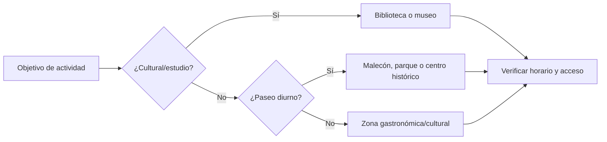

# Zonas urbanas y bibliotecas para actividades en Lima

> **Estado editorial:** los horarios del documento original son referencias históricas y deben verificarse directamente con cada espacio antes de organizar una actividad.

## 1. Zonas turísticas y espacios urbanos

### Miraflores

- Parque Kennedy.
- Calle de las Pizzas y entorno urbano.
- Malecón de Miraflores.
- Parque del Amor.
- Larcomar.

El documento original distingue franjas de mañana para actividad física y tarde/noche para mayor tránsito social y turístico.

### Barranco

- Plaza de Barranco.
- Puente de los Suspiros.
- Bajada de Baños.

Se describe como un entorno cultural, gastronómico y de vida nocturna.

### Centro Histórico

- Jirón de la Unión.
- Plaza San Martín.

El texto original los identifica como corredores peatonales de alto flujo.

## 2. Bibliotecas destacadas

| Biblioteca | Zona | Uso descrito |
| --- | --- | --- |
| Biblioteca Nacional del Perú | San Borja | Estudio, investigación y eventos culturales |
| Biblioteca Pública de Lima | Av. Abancay / Centro Histórico | Estudio y consulta pública |
| Biblioteca Municipal Ricardo Palma | Miraflores | Lectura y actividades culturales |

## 3. Recomendaciones de planificación

- Verificar horarios oficiales y posibles cierres temporales.
- Confirmar si una actividad grupal requiere reserva o autorización.
- Elegir espacios públicos bien iluminados y accesibles para reuniones iniciales.
- No interpretar `horario de mayor afluencia` como horario oficial de atención.

## 4. Uso en itinerarios

