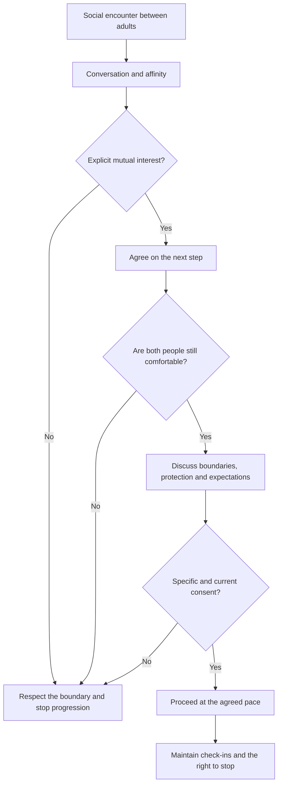
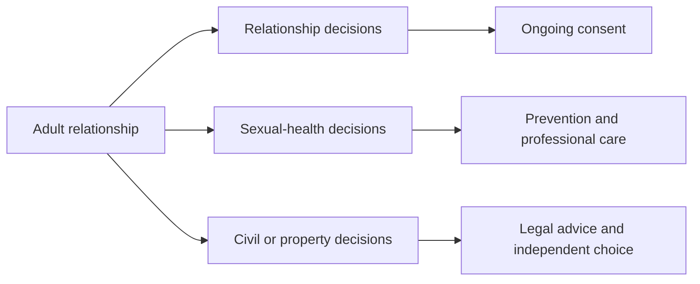

# Adult Interaction, Consent and Sexual Health

> **Educational and clinical notice:** this document is informational and educational. It does not replace individualized medical, psychological, sexological or legal care. It is intended exclusively for adults who have legal capacity to consent in their jurisdiction.

## 1. General principles

### 1.1 Consent and autonomy

Consent must be:

- **explicit**;
- **voluntary**;
- **continuous**;
- **revocable**;
- **specific to each activity**.

A conversation, date, dance, kiss, prior relationship, marriage or move to a private location does not replace consent for any later activity.

### 1.2 Health and prevention

The educational approach prioritizes:

- clear communication about boundaries and preferences;
- prevention of sexually transmitted infections (STIs);
- appropriate use of barrier methods when relevant;
- consensual reproductive planning;
- physical comfort and absence of pain;
- professional consultation for symptoms, questions or clinical conditions.

### 1.3 Neutrality and scope

The material does not promote exploitation, coercion, sex trade or pressure to maintain a relationship. It also does not assume civil formalization is required for adult intimacy; personal and legal decisions are independent and require their own consent.

## 2. Social-interaction and consent flow

## 3. Dancing and social contact

Dancing may facilitate proximity and body coordination, but it should be interpreted only as consent to the dance within the agreed boundaries.

### Good practices

- Ask permission before initiating or intensifying contact.
- Observe signs of discomfort as a complement to, not a substitute for, verbal communication.
- Do not assume proximity, smiling or remaining on the dance floor equals consent to kiss or engage in intimacy.
- Always provide an easy, pressure-free way to decline.

## 4. Transition to a more private conversation

A clear proposal can include an explicit alternative:

> “I would like to keep talking somewhere quieter. Would you like that, or would you rather stay here?”

If the answer is ambiguous, there is doubt, significant intoxication, or inability to decide freely, progression should stop.

## 5. Sexual health, lubrication and comfort

### 5.1 Arousal and physiological response

Sexual response may involve vascular, muscular and lubrication changes, but it varies greatly across people and situations. The presence or absence of a bodily response does not equal consent.

### 5.2 Lubrication

When lubricant is used, it should be compatible with the barrier method and the individual's needs. Lubrication can reduce friction, but it does not guarantee absence of injury and does not replace communication about pain or comfort.

### 5.3 Pain or resistance

Activity should stop in the presence of:

- pain;
- burning;
- unexpected bleeding;
- marked muscular resistance;
- emotional discomfort;
- a verbal or nonverbal request to stop.

Persistent pain, vaginismus, recurrent infections or other symptoms require professional assessment.

## 6. Barrier methods and planning

Before sexual activity, adults may agree on:

- condoms or other barrier methods;
- contraception;
- STI testing when appropriate;
- reproductive expectations;
- boundaries and accepted activities.

No medical certificate fully eliminates risk or replaces ongoing prevention.

## 7. Civil formalization and health

The original document linked intimacy, marriage procedures and health certification in a rigid sequence. This corrected version separates those decisions:

Marriage, cohabitation, contraception and intimacy are distinct decisions. None should automatically be conditioned on another.

## 8. Use of images and anime style

Anime-style images of adults may be used for educational or artistic purposes when:

- represented people are clearly adults;
- images from a person's younger stage are not used to sexualize a real person;
- authorization exists when identifiable photographs of third parties are used;
- clinical or anatomical material maintains a clear educational purpose.

## 9. Safety and review rules

1. Preserve the right to withdraw consent at any time.
2. Avoid economic, migration, professional or emotional pressure on intimate decisions.
3. Keep labor, financial and civil agreements separate from acceptance of intimacy.
4. Consult current clinical sources for claims about pH, osmolality, STIs, fertility or anatomy.
5. Seek independent legal advice for marriage, immigration, property or contracts.

## 10. Summary

The purpose of the flow is not to lead to a predetermined activity, but to provide a framework for **communication, consent, prevention, comfort and autonomy**. Any stage may end without being treated as a failure or creating an obligation.
