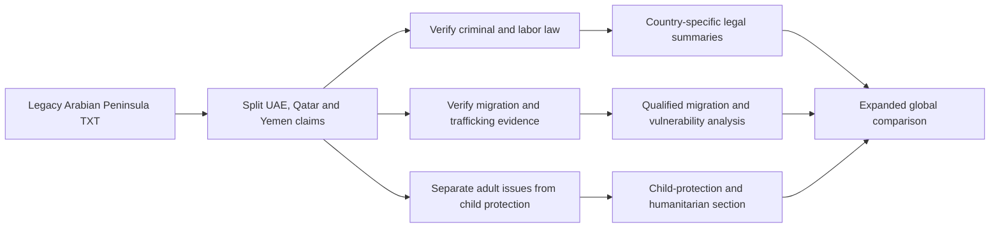

# Arabian Peninsula and Gulf Sex-Work, Trafficking and Child-Protection Analysis

**Scope:** Refactored English version of the legacy Spanish plaintext note `La inclusión de la Península.txt`.

> **Editorial status.** This document preserves the legacy source's comparative themes for the United Arab Emirates, Qatar and Yemen while correcting terminology, separating adult sex work from trafficking and child exploitation, and qualifying inherited legal and socioeconomic claims. Legal classifications, migration-system descriptions, prevalence assertions and child-protection claims require current authoritative verification before external use.

## 1. Purpose and regional scope

The source adds a Gulf and Arabian Peninsula dimension to the broader comparative framework by contrasting high-income migrant-labor destinations with a conflict-affected humanitarian setting.

The three jurisdictions should not be treated as one homogeneous legal or social system. A sound analysis must distinguish:

- the United Arab Emirates (UAE);
- Qatar; and
- Yemen.

For each, national law, enforcement, migration, labor sponsorship, trafficking, conflict and child-protection conditions should be verified independently.

## 2. UAE and Qatar: legal and regulatory context

The legacy source characterizes prostitution-related conduct as prohibited in both the UAE and Qatar and associates enforcement with criminal penalties and immigration consequences for foreign nationals.

It also links vulnerability to migrant-labor sponsorship and recruitment practices. These claims require careful current verification because criminal codes, personal-status rules, immigration law and labor sponsorship reforms can change over time.

A publication-ready review should verify:

1. current criminal-law provisions governing prostitution-related conduct, procurement and trafficking;
2. current treatment of consensual adult sexual conduct under applicable national law;
3. immigration and deportation consequences;
4. anti-trafficking statutes and implementation;
5. labor-sponsorship and worker-mobility rules; and
6. protections against passport retention, debt bondage, coercion and recruitment fraud.

## 3. Yemen: conflict and institutional fragmentation

The legacy source describes Yemen as a conflict-affected environment in which formal criminal and personal-status rules coexist with fragmented authority and limited access to protection or justice.

Rather than labeling the country simply as a failed state, the revised analysis treats Yemen as a **severe humanitarian and institutional-fragmentation case**. Any current assessment should distinguish between formal national law, de facto authorities, conflict zones, local justice mechanisms and humanitarian protection systems.

## 4. Adult sex work, survival economies and exploitation

The legacy source describes different patterns across the three settings:

- **UAE:** a destination economy with international migration, tourism and hospitality sectors, alongside trafficking-risk claims;
- **Qatar:** a smaller, highly regulated migrant-labor environment in which any illicit sexual market is described as comparatively hidden;
- **Yemen:** conflict-driven survival economies associated with displacement, poverty and loss of household income.

These descriptions must not be used to infer that migrant workers, hospitality workers or displaced women are involved in sex work. They are population-level hypotheses requiring evidence.

## 5. Trafficking and migrant-worker vulnerability

The source links trafficking risk to migration, recruitment intermediaries, debt, document retention and restricted worker mobility.

A rigorous framework should distinguish:

| Topic | Analytical treatment |
| --- | --- |
| Consensual adult sex work | Adult rights, health, regulation and socioeconomic conditions |
| Labor exploitation | Wage theft, contract substitution, passport retention, excessive recruitment debt and coercive work conditions |
| Human trafficking | Exploitation involving prohibited means or, for children, exploitative purpose regardless of adult-consent concepts |
| Migrant vulnerability | Documentation, sponsorship, recruitment, housing and access to remedies |
| Smuggling | Separate migration offense; not automatically trafficking |

Nationality, ethnicity, occupation or visa category must never be treated as proof of trafficking or sex work.

## 6. Child commercial sexual exploitation and forced/child marriage

The legacy source includes claims about minors in the UAE, Qatar and Yemen. These issues are separated from adult sex-work analysis and placed under a child-protection framework.

For the UAE and Qatar, any claim about transnational exploitation of minors, online exploitation or unaccompanied migrant children should be supported by current child-protection, trafficking or law-enforcement evidence.

For Yemen, the source emphasizes child and forced marriage in the context of poverty, displacement and conflict. These practices should be analyzed through child-rights, forced-marriage, gender-based-violence and humanitarian-protection frameworks rather than described as a form of adult prostitution.

Detailed cross-cutting terminology and safeguarding principles are provided in [`child-commercial-sexual-exploitation-global-analysis.md`](./child-commercial-sexual-exploitation-global-analysis.md).

## 7. Comparative regional matrix

| Jurisdiction | Legacy analytical emphasis | Verification focus |
| --- | --- | --- |
| UAE | Restrictive legal framework, migrant destination economy and trafficking-risk claims | Current criminal law, labor sponsorship, anti-trafficking enforcement and migrant protections |
| Qatar | Restrictive legal framework and highly regulated migrant-labor environment | Current law, sponsorship reforms, enforcement, trafficking evidence and worker safeguards |
| Yemen | Conflict, displacement, poverty and fragmented protection systems | Current legal authority, humanitarian evidence, displacement, child marriage and protection mechanisms |

This matrix is descriptive and does not rank the jurisdictions.

## 8. Integration with the wider comparative framework

The Arabian Peninsula/Gulf material adds a different axis to the existing Philippines–Thailand–India–Türkiye–Mexico–Israel comparison:

- high-income migrant-labor destinations;
- restrictive or prohibition-oriented legal environments;
- trafficking and labor-exploitation risks linked to cross-border recruitment; and
- conflict-driven humanitarian vulnerability in Yemen.

These dimensions should be compared cautiously. Legal status, enforcement intensity, prevalence, labor migration and child-protection conditions are not interchangeable variables.

## 9. Evidence-quality checklist

Before publication, verify:

- current criminal-law and anti-trafficking statutes for the UAE, Qatar and Yemen;
- current migrant-labor and sponsorship reforms;
- authoritative data on trafficking investigations and victim identification;
- documented evidence on passport retention and recruitment debt;
- current humanitarian and displacement indicators for Yemen;
- child-marriage prevalence with date, age bands and methodology;
- online child-exploitation evidence from credible child-protection sources; and
- clear separation of adult consensual activity from trafficking, forced labor and child exploitation.

## 10. Research workflow

## 11. Editorial safeguards

- Adult consensual sex work, trafficking, forced labor, forced marriage and child sexual exploitation remain separate analytical categories.
- Children are never treated as participants in adult sex work.
- Migrant status, nationality, occupation, poverty or displacement must not be used to profile individuals.
- Claims about specific ethnic or regional groups require strong evidence and should not be generalized.
- Conflict-related survival strategies must be described without stigmatizing displaced people or survivors.
- The document is for comparative research, safeguarding and policy analysis, not for locating or arranging sexual services.
