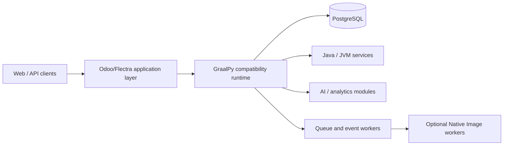

# Odoo/Flectra to GraalPy Migration Architecture

## Purpose

This document isolates the runtime-migration material that previously lived in the root `README.md`. It defines the proposed path for running an Odoo/Flectra-derived ERP workload on GraalVM through GraalPy while preserving a clear separation between validated capabilities and implementation hypotheses.

## Target architecture

The proposed architecture keeps the ERP domain model and PostgreSQL persistence while introducing a GraalPy compatibility layer, polyglot services and selectively compiled native workers.

## Migration objectives

- Evaluate GraalPy compatibility with the selected Odoo/Flectra release.
- Preserve ORM, transaction and module semantics before optimizing performance.
- Replace unsupported or fragile native dependencies only where measurement justifies the change.
- Introduce JVM/polyglot interoperability behind explicit interfaces rather than assuming zero-cost in-process calls.
- Use native-image workers only for isolated components that are proven compatible.

## Technical feasibility concerns

### C-extension compatibility

Odoo/Flectra deployments depend on libraries such as `psycopg2`, Pillow, `lxml`, `xmlsec` and asynchronous/networking packages. GraalPy provides compatibility mechanisms for many CPython extensions, but each dependency must be tested against the exact application version and deployment target.

The migration should therefore maintain a compatibility matrix containing:

| Dependency | Role | GraalPy status | Required action |
| --- | --- | --- | --- |
| `psycopg2` / PostgreSQL driver | Database access | Verify | Functional and performance tests |
| `lxml` | XML processing | Verify | Module and memory profiling |
| Pillow | Image processing | Verify | Native-library compatibility tests |
| `xmlsec` | XML signatures | Verify | Security and native dependency audit |
| `gevent` / async stack | Concurrency | High-risk area | Worker-model redesign if needed |

### Concurrency model

Odoo traditionally relies on a combination of processes, cooperative I/O and worker isolation. A GraalPy migration must not assume that JVM threads automatically improve throughput. Benchmarking should compare:

1. the current CPython worker model;
2. GraalPy with equivalent process isolation;
3. GraalPy with adjusted thread/worker pools; and
4. isolated JVM or native workers for selected background tasks.

Acceptance should be based on measured latency, throughput, memory use, recovery behavior and database contention.

## Polyglot integration

Potential JVM-side integrations include Java, Kotlin and Scala services for analytics, messaging, rule execution or integration adapters. These should use explicit ownership boundaries and testable contracts.

Candidate integrations:

- Apache Kafka or compatible event streaming;
- RabbitMQ-compatible messaging;
- JDBC-based enterprise connectors;
- Java/Kotlin analytical services;
- GraalVM-hosted JavaScript or other supported languages where there is a justified use case.

## Native-image strategy

Native Image is not assumed to be appropriate for the whole ERP monolith. Preferred candidates are isolated workers with stable dependency graphs, such as:

- scheduled jobs;
- queue consumers;
- document transformations;
- payment or provider adapters;
- narrow integration services.

## Migration plan

| Phase | Scope | Exit criterion |
| --- | --- | --- |
| 1. Dependency audit | Inventory Python, native and system dependencies | Compatibility matrix completed |
| 2. Runtime prototype | Boot selected ERP version on GraalPy | Core application starts and basic transactions pass |
| 3. C-extension adaptation | Resolve incompatible dependencies | Critical modules pass automated tests |
| 4. ORM and concurrency validation | Compare worker models | No correctness regressions; benchmark data recorded |
| 5. Polyglot integration | Introduce selected JVM services | Interfaces and failure recovery validated |
| 6. Performance and security | Load, memory, security and rollback tests | Acceptance thresholds met |
| 7. Staging deployment | Rehearse production migration | Rollback and observability verified |

## Cost and schedule assumptions

The earlier README estimate of a five-month migration with a six-person specialist team should be treated as a planning hypothesis, not a validated quotation. Any current estimate must be rebuilt from the selected Odoo/Flectra version, dependency inventory, benchmark baseline, staffing rates, cloud environment and target service-level objectives.

AI tooling costs should likewise be refreshed from current vendor pricing before budgeting. Tool subscriptions are optional productivity aids and do not replace compatibility testing, code review or engineering accountability.

## Related repository assets

- [`MBSE/CAS/drawio/odoo-graalpy-migration.drawio`](../../MBSE/CAS/drawio/odoo-graalpy-migration.drawio)
- [Platform integration and AI architecture](./platform-integration-ai.md)
- [Implementation and investment roadmap](../roadmap/implementation-and-investment.md)
