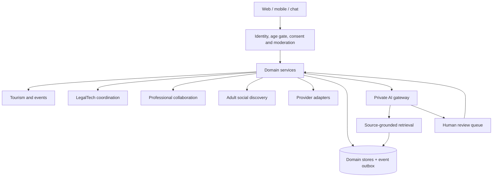

# Platform Integration and AI Architecture

## Scope

This document extracts the platform-integration material from the root README and defines the proposed architecture for tourism, LegalTech coordination, professional collaboration, explicit-consent social discovery and private AI support.

## Logical architecture

## Architectural principles

- Separate intimate, legal, travel and professional records by domain.
- Require explicit, revocable consent for each category of interaction.
- Do not infer intimate traits from occupation, income, nationality, GitHub, LinkedIn or other professional profiles.
- Keep AI outputs advisory and source-grounded for legal or jurisdiction-sensitive workflows.
- Require qualified human review for document validity, civil status, eligibility and disputed cases.
- Treat provider APIs as optional adapters with manual fallbacks.
- Use an event outbox and idempotent integration patterns for external side effects.

## Core components

| Component | Responsibility | Control |
| --- | --- | --- |
| Identity and consent | Authentication, age gating and granular permissions | Explicit opt-in and withdrawal |
| Domain services | Tourism, LegalTech, events and collaboration | Domain isolation |
| Private AI gateway | Drafting, retrieval and workflow assistance | Source tracking and escalation |
| Retrieval layer | Approved legal, travel and institutional material | Date/jurisdiction metadata |
| Provider adapters | Hotels, travel, officiants and other approved suppliers | Contract/API verification |
| PostgreSQL | Transactional domain records | Least privilege and retention rules |
| Retrieval index | Searchable approved content | Personal-data minimization |
| Event outbox | Reliable integration events | Idempotency, retries and audit |

## AI module boundaries

AI may assist with multilingual explanations, itinerary preparation, source retrieval, document checklists and summarization. It must not independently determine legal capacity, relationship status, immigration eligibility or document authenticity.

## Data and privacy boundaries

Private hosting reduces dependency on external processors but does not eliminate exposure risk. Acceptance criteria therefore include authorization tests, encryption, audit logging, retention controls, incident response and deletion workflows.

## Related documents

- [Odoo/Flectra to GraalPy migration](./odoo-graalpy-migration.md)
- [Project scope](../product/project-scope.md)
- [Requirements and consent](../product/requirements-and-consent.md)
- [Implementation roadmap](../roadmap/implementation-and-investment.md)
