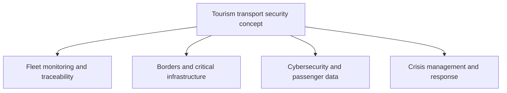

# Tourism Transport Security Concept

**Status:** translated conceptual inventory of security and defense applications. No deployed integration, procurement specification or measured safety/performance result is established.

## Purpose and four functional areas

The source presents traveler confidence and protection of travelers, fleets and critical infrastructure as contributors to tourism-route viability across air, road and water transport. Its descriptions of indispensable security, uninterrupted tracking and non-intrusive technology are aspirations requiring evidence.

This diagram replaces the source's plaintext map.

## 1. Fleet monitoring and traceability

The draft proposes concealed GPS tracking combined with L-band or Starlink connectivity for buses, boats and tourist aircraft in remote areas, including the Paraguayan Chaco, the Amazon and cross-border corridors. It also proposes AI and infrared onboard cameras to identify driver fatigue, unauthorized entry and unusual cabin behavior.

The draft does not supply communications coverage, equipment suitability, outage behavior or accuracy evidence. Positioning and the communications link need separate evaluation. Concealed installation is retained as a source detail, not a recommendation to track passengers secretly. Any pilot needs defined purpose, access, retention, traveler/staff notice and human assessment of alerts; “unusual behavior” is not evidence of wrongdoing.

## 2. Borders and critical infrastructure

| Source proposal | Intended function | Evidence or design gap |
| --- | --- | --- |
| Contactless biometric corridors | Facial and fingerprint recognition “in motion” at airports, land terminals and borders to improve flow | Feasibility of each modality, error rates, accessibility and fallback procedures |
| X-ray and millimeter-wave inspection | Automated baggage and cross-border bus cargo inspection for contraband, weapons and narcotics | Suitability for each material and setting; detection and throughput claims, including “in seconds,” are unverified |
| UAVs and synthetic-aperture radar | Perimeter monitoring of isolated roads, ports and higher-risk corridors | Site-specific capability, operating constraints and responsible authority |

These systems are a concept list. No universal throughput improvement, detection guarantee or authorization follows from their inclusion.

## 3. Cybersecurity and passenger information

The source groups passenger name records (PNR), advance passenger information (API), identity, payment and geolocation data under large-scale passenger-data protection. It proposes cybersecurity against ransomware disruption of booking systems and autonomous fleets.

It also suggests real-time links between carrier databases and Interpol, Europol or migration authorities for wanted-person or travel-restriction alerts. This is an unimplemented institutional proposal, not evidence that those organizations offer unrestricted direct connections or that the repository has access.

An editorial implementation boundary is to specify each dataset and approved interface independently, apply least-privilege access, maintain audit and recovery procedures, and ensure human handling of disputed matches. PNR and API should not be treated as interchangeable datasets.

## 4. Crisis management and response

The source proposes panic buttons and geofencing alerts for route deviations or entry into high-risk areas, notifying C4/C5 command-and-control centers and security services. Its wording about entering an area “unarmed” is ambiguous and supplies no clear dispatch condition; the operational trigger remains undefined.

It also envisages specialized tourist-police units trained in conflict resolution, VIP protection and tactical medical response (TCCC) along key road corridors. This preserves the proposed institutional role without asserting the existence, readiness or suitability of a particular unit. A civilian pilot should define escalation ownership, false-alarm review and emergency-service coordination.

## Transport-mode matrix from the source

| Mode | Source-listed risks | Source-proposed equipment or capabilities | Intended traveler benefit |
| --- | --- | --- | --- |
| Cross-border road | Road robbery, express kidnapping, contraband and extortion | Anti-jamming GPS tracking, inspector body cameras and light vehicle armor | Greater confidence on long trips and faster customs processing |
| Aviation and airports | Cyberattacks on control towers/systems, unauthorized access and terrorism | End-to-end biometrics, operational cybersecurity and CT scanners | Shorter queues and improved operational security |
| River and maritime: cruises and feeder services | Local piracy, unauthorized boarding and offshore emergencies | “Encrypted AIS,” LRAD acoustic devices and rescue drones | Safer international and remote-river navigation |

These risks are categories, not regional incidence estimates. The quoted “encrypted AIS” and “anti-jamming GPS” labels are unverified source terminology requiring standards and equipment review; they must not be read as established system properties. Likewise, the draft calls LRAD “non-lethal,” but provides no safety assessment; this note does not certify that characterization. No tactical deployment instructions are provided.

## Future integration themes

- **Self-sovereign identity (SSI):** the source proposes blockchain-based encrypted digital passports with selective disclosure to transport providers and authorities. It supplies no interoperability, recognition or privacy design.
- **Autonomous escort UAVs:** automated observation of tourist convoys in mountains and tropical forests; no operational design or deployment is established.
- **Shared situational awareness:** portals for military/police authorities and tourism associations to share risk heatmaps and inform rerouting. Data provenance, timeliness, access and responsible decisions remain undefined.

## Connection to JFXAI4MAD

A bounded design study could separate fleet telemetry, booking/passenger data, authorized-provider interfaces and emergency workflows. Evaluate availability, false-positive rates, alert response times and access controls against explicit requirements before making safety or commercial claims. These are editorial evaluation suggestions.

- [Platform integration and AI](platform-integration-ai.md)
- [Requirements and consent](../product/requirements-and-consent.md)
- [Territorial tourism development](../strategy/multisector-territorial-tourism-development-flow.md)
- [Peru–Brazil and Brazil–Paraguay corridors](../research/tourism/peru-brazil-paraguay-integration-corridors.md)
- [Documentation index](../README.md)

## Provenance

Migration entry **53** in the [consolidated register](../ANNEX-DOCS-CONSOLIDATED.md#10-complete-migration-and-translation-register) maps the source retained in Git history at commit `bb8369643328864f471f4fc1308622d1348f38f7`. All four functional areas, three transport rows and three future themes are preserved. Qualifications and evaluation boundaries are editorial additions. No technical standards, legal permissions, vendor capabilities or operational safety claims were independently validated.
