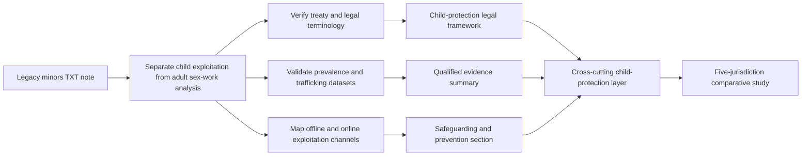

# Child Commercial Sexual Exploitation: Global Legal and Safeguarding Analysis

**Scope:** Refactored English version of the legacy Spanish plaintext note `La presencia de menores.txt`.

> **Editorial status.** This document concerns the commercial sexual exploitation of children and adolescents. It does **not** treat minors as participants in consensual adult sex work. Numerical estimates, regional prevalence claims and legal summaries inherited from the legacy source should be verified against current authoritative sources before publication or operational use.

## 1. Terminology and analytical boundary

The source uses the Spanish concept **Explotación Sexual Comercial de Niños, Niñas y Adolescentes (ESCNNA)**. In English, the preferred analytical framing is **commercial sexual exploitation of children (CSEC)** or, where relevant, **child sexual exploitation and abuse (CSEA)**.

A child under 18 should not be described as a commercial sexual-services provider or as engaging in consensual adult sex work. Any commercial sexual activity involving a child must be handled as a child-protection, abuse, exploitation and criminal-justice issue.

This distinction is fundamental to the broader repository analysis:

| Population / issue | Analytical treatment |
| --- | --- |
| Consensual adult sex work | Adult labor, health, rights, regulation and socioeconomic analysis |
| Child commercial sexual exploitation | Child protection, exploitation, abuse and criminal-law response |
| Human trafficking of children | Exploitation-focused trafficking framework; consent is not treated as a defense |
| Online child sexual exploitation | Digital-safety, platform-governance and criminal-investigation framework |
| Child sexual abuse material | Child-protection and criminal-law category; never treated as adult-content production |

## 2. Global scale and measurement limitations

The legacy note cites international estimates concerning forced labor, commercial sexual exploitation and detected trafficking victims. These figures should be treated as **historical or inherited estimates**, not as a current global count.

Measurement is particularly difficult because of:

- hidden and criminalized activity;
- under-reporting and fear of retaliation;
- inconsistent definitions across countries and datasets;
- differences between detected cases and estimated prevalence;
- overlap between trafficking, forced labor, online exploitation and other forms of abuse;
- rapidly changing digital channels; and
- major differences in national reporting capacity.

Any publication-ready use of global totals should identify the source organization, publication year, exact population definition and estimation method.

## 3. Forms of exploitation and recruitment channels

The legacy source identifies several recurring forms of commercial sexual exploitation.

### 3.1 Travel- and tourism-associated exploitation

Children may be exploited in tourism or travel contexts where offenders, facilitators or organized networks exploit weak safeguarding, poverty, corruption, displacement or high visitor flows.

Country or regional references should be used only when supported by current evidence. Tourism exposure by itself is not evidence that a destination or community is defined by child exploitation.

### 3.2 Technology-facilitated exploitation

Digital channels can facilitate:

- grooming and coercive contact;
- sexual extortion;
- livestreamed abuse;
- circulation of child sexual abuse material;
- deceptive recruitment through social media or messaging platforms; and
- payment or monetization mechanisms connected to abuse.

Research in this area should focus on prevention, detection, reporting, platform governance, victim support and law-enforcement cooperation rather than reproducing operational details that could facilitate abuse.

### 3.3 Internal and cross-border trafficking

Children may be recruited or moved within a country or across borders through coercion, deception, abuse of vulnerability, debt, family pressure or organized exploitation.

Migration, poverty or rural origin must never be treated as proof that a specific child is trafficked or exploited. These characteristics are population-level vulnerability factors only.

## 4. Structural vulnerability factors

The source highlights several recurring risk contexts:

- household poverty and unstable income;
- school exclusion or early school leaving;
- family violence or prior abuse;
- homelessness or insecure housing;
- displacement, refugee status and unaccompanied migration;
- discrimination and social exclusion;
- dependence on adults or intermediaries for money, shelter or documents; and
- weak child-protection and reporting systems.

These factors should guide prevention and social-policy analysis, not profiling. No child should be classified as exploited solely because they belong to a vulnerable demographic group.

## 5. International legal framework

The legacy source references three major international instruments that should be verified and cited from authoritative treaty texts in any external publication.

### 5.1 ILO Convention No. 182

The source describes the use, procuring or offering of a child for prostitution or pornographic production as among the **worst forms of child labor** requiring urgent elimination.

### 5.2 Palermo Protocol

The source notes that trafficking protections for children differ from adult-trafficking analysis. For children, exploitation-focused recruitment, transportation, transfer, harboring or receipt is treated under the child-trafficking framework without requiring the same demonstration of coercive means that may be relevant in adult cases.

### 5.3 Optional Protocol to the Convention on the Rights of the Child

The source also references the Optional Protocol concerning the sale of children, child prostitution and child pornography. Current terminology in child-protection practice increasingly avoids language that could imply child consent, so modern documentation should prefer terms such as **commercial sexual exploitation of children** and **child sexual abuse material**.

## 6. Integration with the five-jurisdiction comparative framework

The Philippines, Türkiye, Mexico, India and Israel comparison concerns adult legal and socioeconomic frameworks. Child exploitation should therefore be represented as a **separate cross-cutting safeguarding layer**, not as another category of adult sex work.

| Jurisdictional analysis layer | Treatment of minors |
| --- | --- |
| Adult sex-work legal model | Applies only to adults |
| Adult prevalence estimates | Must exclude minors unless a source explicitly reports a separate child-protection population |
| Trafficking analysis | Child victims handled under dedicated trafficking and protection standards |
| Tourism / migration context | Used only for safeguarding-risk analysis, not profiling |
| Online-platform analysis | Child-safety, reporting, moderation and law-enforcement cooperation |

This separation prevents the comparative study from normalizing or aggregating child exploitation into adult commercial-sex statistics.

## 7. Evidence-quality requirements

Before using any inherited quantitative claim, verify:

1. the exact publication and year;
2. whether the figure represents prevalence, detected victims, modeled estimates or service contacts;
3. whether the population is under 18, under 17 or another age definition;
4. whether trafficking, forced labor and sexual exploitation are being combined;
5. geographic scope and sampling method;
6. whether online exploitation is included; and
7. whether the estimate has been superseded by a newer dataset.

Detected cases should never be presented as equivalent to true prevalence.

## 8. Safeguarding and prevention priorities

A prevention-oriented framework should prioritize:

- child-protection hotlines and confidential reporting;
- school retention and social protection;
- safe housing and family-support services;
- trauma-informed health and psychosocial care;
- digital-literacy and online-safety programs;
- platform detection and reporting mechanisms;
- victim-centered investigation and prosecution;
- cross-border cooperation where trafficking is involved; and
- long-term recovery, education and reintegration support.

## 9. Recommended research workflow

## 10. Editorial safeguards

- Children are never treated as consenting participants in commercial sexual activity.
- Child commercial sexual exploitation must remain separate from consensual adult sex work.
- No operational details that could facilitate exploitation, grooming, evasion or abuse should be included.
- Geographic, ethnic, migration, poverty or family-status categories must not be used to profile individual children.
- Online exploitation should be discussed through prevention, detection, reporting and victim-support frameworks.
- All inherited numerical and legal claims require current authoritative validation before external use.
