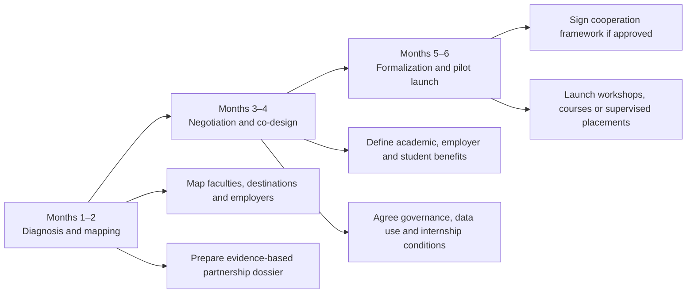

# Destination-Wedding Academic Partnership Roadmap

> **Editorial status:** translated and refactored from an additional Spanish plaintext planning note. Any market-size, institutional-interest or probability figures inherited from the source should be treated as hypotheses until validated with current institutional and tourism-industry evidence.

## 1. Purpose

Destination-wedding and romance tourism—including destination weddings, vow renewals and honeymoons—can generate demand across hospitality, gastronomy, transport, event production, legal coordination and creative services.

This roadmap proposes a structured collaboration model between the tourism/events sector and Latin American higher-education institutions. The objective is to connect applied research, professional training and formal internships without implying that any institution has already agreed to participate.

## 2. Value proposition for universities

The proposal is organized around three pillars.

### 2.1 Applied research and market intelligence

Potential activities include:

- studies of the local economic impact of destination weddings;
- supplier and destination mapping;
- analysis of visitor expenditure, seasonality and service gaps;
- evaluation of sustainability, accessibility and community impacts.

### 2.2 Training and certification

Possible academic offerings include:

- destination-wedding and luxury-event management;
- hospitality and international logistics;
- civil-document coordination and jurisdictional awareness;
- multilingual customer service;
- supplier management and quality assurance;
- digital marketing and event technology.

Any legal-content component should be taught or reviewed by qualified professionals and should clearly separate event coordination from legal advice.

### 2.3 Employability and formal internships

A partnership may create supervised placement opportunities with:

- hotels and resorts;
- event agencies;
- wedding planners;
- travel operators;
- catering, audiovisual and creative-service providers;
- venue and transport operators.

Internships should use written scopes, supervision, learning objectives and applicable labor/education rules.

## 3. Regional opportunity hypotheses

The legacy source assigns numerical probability bands to countries and institutions. Those percentages are not treated here as measured probabilities. They are refactored into **planning-priority bands** based on destination maturity, tourism specialization and academic-program fit.

| Planning priority | Example destinations in the source | Suggested institutional profile | Rationale to validate |
| --- | --- | --- | --- |
| High-priority outreach | Mexico, Colombia, Dominican Republic | Tourism, hospitality and events faculties near established wedding destinations | Existing destination-wedding demand and a potentially strong need for practical training |
| Medium-high priority | Peru, Costa Rica, Chile | Tourism administration, gastronomy and cultural-management programs | Heritage, beach, wine and nature destinations that may support differentiated wedding products |
| Exploratory priority | Argentina, Uruguay, Bolivia | Economics, international business, marketing and tourism programs | Opportunity to develop newer niches such as wine-tourism and destination-event packages |

Examples in the original note included Cancún/Riviera Maya, Cartagena, Punta Cana, Cusco, Guanacaste, Colchagua, Mendoza, Punta del Este and Tarija. These examples should be validated against current destination demand, local regulations, university programs and partner availability.

## 4. Six-month partnership workflow

### 4.1 Months 1–2: diagnosis and outreach

- identify universities with relevant tourism, hospitality, business or event programs;
- map destination-wedding employers and suppliers;
- prepare a concise evidence pack with current market data;
- identify a university contact for academic affairs, extension or industry partnerships;
- define a small pilot scope rather than a broad regional rollout.

### 4.2 Months 3–4: negotiation and co-design

Potential university benefits:

- applied curriculum updates;
- employer participation in workshops;
- supervised internship capacity;
- access to anonymized industry research where lawful and appropriate.

Potential industry benefits:

- improved access to trained entry-level talent;
- co-developed applied research;
- lower recruitment friction;
- a structured channel for skills feedback to academic programs.

Any exchange of student data, industry datasets, scholarships or payments should use explicit written terms and applicable privacy, labor and education safeguards.

### 4.3 Months 5–6: formalization and pilot launch

Subject to institutional approval, the pilot may include:

- a framework cooperation agreement;
- one short course, workshop or certificate module;
- a limited number of supervised internships;
- one applied research project;
- a joint evaluation after the first cohort.

## 5. Measurement framework

Instead of unsupported partnership-probability percentages, measure actual funnel stages.

| KPI | Measurement |
| --- | --- |
| Institutions mapped | Number meeting predefined program and destination criteria |
| Qualified conversations | Institutions that engage in a substantive meeting |
| Proposals submitted | Written pilot proposals delivered |
| Agreements approved | Signed institutional cooperation agreements |
| Student participation | Students formally enrolled in training or internships |
| Employer participation | Approved host organizations taking part |
| Completion rate | Participants completing the agreed learning activity |
| Placement quality | Supervisor and student feedback plus issue/incident tracking |
| Curriculum impact | Documented changes or modules adopted after review |

## 6. Governance and implementation boundaries

This roadmap is a planning framework, not evidence of existing university partnerships.

Before implementation:

1. verify current university programs and partnership procedures;
2. validate destination-wedding market evidence using current tourism and industry sources;
3. define the legal boundary between event coordination and legal services;
4. use formal internship and safeguarding arrangements;
5. avoid presenting estimated institutional interest as a forecast or commitment;
6. disclose commercial interests and sponsorship terms;
7. keep academic participation voluntary and separate from unrelated personal or social-discovery services.

## 7. Relationship to the project

Within `jfxai4mad`, this document supports the destination-tourism and institutional-collaboration tracks by providing a measurable path from exploratory market research to a controlled academic-industry pilot. It complements the broader strategic annex and should be read together with the documentation index and consolidated documentation annex.