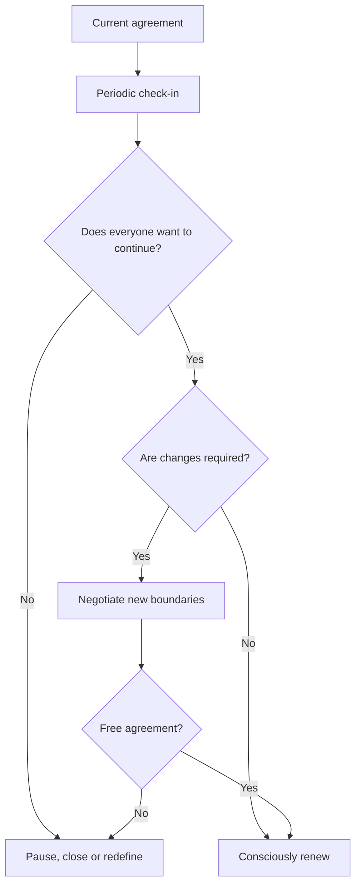

# Ethical Non-Monogamy with Alternation and Quarterly Reviews

> **Scope:** conceptual model for consensual adult relationships. It is not clinical or legal advice.

## 1. Alternation

Alternation proposes organizing time, energy and space across different relationships and individual autonomy.

### Main elements

- **Rotation of attention and time:** agreed blocks for cohabitation, other relationships and personal time.
- **Management of relationship energy:** prevent a new relationship from displacing existing commitments without agreement.
- **Predictability:** maintain explicit agreements instead of assuming implicit rules.
- **Flexibility:** allow changes through conversation and consent.

## 2. Renewable quarterly trial agreement

A review every 90 days is proposed as a conversation mechanism, not an irreversible contract.

### At each review, participants may

1. Renew the agreement.
2. Modify boundaries or information-sharing rules.
3. Adjust time distribution.
4. Review sexual-health agreements.
5. Pause or end the open arrangement.

Renewal should be **active and voluntary**, never automatic.

## 3. Operating principles

- Continuous communication.
- Informed and revocable consent.
- Individual autonomy.
- Respect for different boundaries among participants.
- Right to end or modify the agreement without penalty.

## 4. Review flow

The model does not turn affection, cohabitation or intimacy into performance metrics; its purpose is to support clear conversations among adults.
