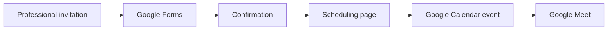

# Survey, Scheduling and Video-Call Integration

## Google Forms + Google Calendar + Google Meet

The proposal defines a simple flow from an initial survey to a scheduled video call.

## 1. Google Forms

### Recommended minimum data

- Name.
- Email address.
- Additional information only when necessary for the stated purpose.

> **Privacy:** phone or WhatsApp should be optional unless there is a clear operational need, with an explanation of use and retention.

### Confirmation message

Example:

> Thank you for completing the survey. The next step is to schedule a 15-minute call. Use the scheduling link to select the date and time you prefer.

## 2. Option A: Google Calendar Appointment Schedules

1. Open Google Calendar.
2. Create an appointment page/schedule.
3. Configure the session duration.
4. Define availability.
5. Select Google Meet as the video-call location when the feature is available.
6. Share the booking link from the form or appropriate professional channel.

## 3. Option B: external scheduling service

When native features are unavailable, an external scheduling service compatible with Google Calendar and Google Meet may be used, subject to its current terms.

## 4. Consolidated flow

## 5. Good practices

- Use a contact channel consistent with the purpose of the invitation.
- Do not request unnecessary personal data.
- State the duration, purpose and participants of the call.
- Allow easy rescheduling or cancellation.
- Periodically verify Google Workspace/Calendar features and limits because they may change.
