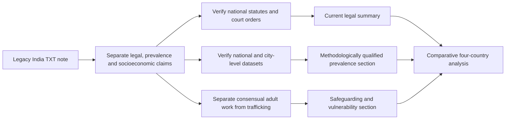

# India Sex-Work Legal and Socioeconomic Case Analysis

**Scope:** Refactored English version of the legacy Spanish plaintext note `El análisis del caso de.txt`.

> **Editorial status.** This document preserves the analytical structure of the legacy source while separating inherited legal and numerical claims from verified facts. Legal classifications, court interpretations, prevalence estimates, institutional references and descriptions of trafficking patterns must be checked against current authoritative sources before publication or operational use.

## 1. Purpose and comparative context

The India case extends the broader comparison already developed for the Philippines, Türkiye and Mexico. The source positions India as a distinct regulatory case because consensual adult sex work in private is treated differently from surrounding activities such as brothel management, public solicitation, pimping and trafficking.

The comparison should not be reduced to a simple legal/illegal binary. A reliable analysis must distinguish:

- the legality of consensual adult exchange in private;
- criminalized or regulated third-party activities;
- public-order rules and local enforcement;
- anti-trafficking law;
- labor, health and social-protection access;
- court decisions on dignity, safety and police conduct; and
- the gap between formal rules and actual implementation.

## 2. Legal and judicial framework

### 2.1 Legacy description

The source states that India regulates prostitution-related activity primarily through the **Immoral Traffic (Prevention) Act (ITPA)** and related criminal-law provisions. It characterizes consensual private exchange between adults as not itself prohibited, while associated conduct such as brothel keeping, procuring, public solicitation and trafficking may be criminalized or restricted.

The source also refers to a **2022 Supreme Court of India decision or directive** concerning the dignity and protection of sex workers. In the legacy account, this is described as strengthening protections against police harassment and reinforcing access to legal and medical assistance.

### 2.2 Verification requirements

Before citing these propositions externally, verify:

1. the current text and scope of the ITPA;
2. relevant provisions of the Bharatiya Nyaya Sanhita and any successor legislation affecting prostitution-related conduct;
3. the exact 2022 Supreme Court order, case name and operative directions;
4. whether later judgments, statutes or administrative rules have modified those directions;
5. state- and city-level enforcement practices; and
6. distinctions between adult consensual sex work, trafficking, forced labor and exploitation.

## 3. Scale and prevalence estimates

The legacy source reports a very broad estimate of approximately **800,000 to more than 2 million** people involved in sex work in India, citing government bodies, NACO-related material and NGOs in general terms.

These figures should be treated only as **legacy estimates**, not as a current national count. Large differences between estimates can result from:

- incompatible definitions of sex work;
- inclusion or exclusion of informal and street-based activity;
- hidden populations and under-reporting;
- different geographic coverage;
- different years of observation;
- sampling or extrapolation methods; and
- conflation of voluntary adult sex work with trafficking populations.

Any future quantitative use should identify the original dataset, year, population definition, sampling design and confidence limits.

## 4. Urban concentration and historical red-light districts

The source names several historically prominent urban districts, including:

- **Sonagachi, Kolkata**;
- **Kamathipura, Mumbai**; and
- **G.B. Road, Delhi**.

These locations may be useful as historical or urban-policy case studies, but they should not be treated as representative of sex work across India as a whole. Conditions can differ substantially by city, state, migration pattern, policing model, housing market and local public-health infrastructure.

A current case study should therefore distinguish national law from local implementation and avoid presenting any one district as a national proxy.

## 5. Socioeconomic vulnerability factors

The legacy note links participation in informal sex work to structural vulnerability, including:

- poverty and unstable income;
- caste and social exclusion;
- limited access to formal employment;
- migration and displacement;
- housing insecurity;
- gender discrimination; and
- residual coercive or exploitative practices in some rural contexts.

These variables should be analyzed as **population-level risk or vulnerability factors**, not as predictors of an individual's conduct. Caste, religion, region, occupation, migration status, gender identity or poverty should never be used to infer that a specific person is involved in sex work or trafficking.

## 6. Trafficking and cross-border vulnerability

The source also describes India as both an internal and cross-border trafficking context, with references to movement from rural areas and neighboring countries such as Nepal and Bangladesh.

For analytical accuracy, trafficking must remain conceptually separate from consensual adult sex work. A modern research framework should distinguish:

| Topic | Analytical treatment |
| --- | --- |
| Consensual adult sex work | Labor, health, rights, regulation and socioeconomic conditions |
| Human trafficking | Coercion, exploitation, recruitment, transport, harboring and control under applicable law |
| Child sexual exploitation | Separate child-protection and criminal-law framework; never grouped with adult consensual activity |
| Migrant vulnerability | Documentation, labor rights, discrimination, debt, housing and access to services |
| Smuggling | Distinct migration offense that should not be conflated automatically with trafficking |

## 7. Comparison with the Philippines, Türkiye and Mexico

The legacy note closes a four-case comparison. A more rigorous formulation is:

| Jurisdiction | Legacy analytical emphasis | Verification focus |
| --- | --- | --- |
| Philippines | Prohibitive legal framework alongside a large informal sector and tourism-related risk claims | Current criminal law, local enforcement, trafficking data, tourism-related evidence |
| Türkiye | State-regulated licensed system alongside a large informal/unregistered sector | Current licensing rules, municipal implementation, closure trends, worker protections |
| Mexico | Federal and local regulatory fragmentation with strong variation by state and municipality | Federal law, state/municipal rules, public-order enforcement, trafficking distinctions |
| India | Private consensual adult activity distinguished from prohibited surrounding conduct, plus recent judicial dignity protections | ITPA, current criminal code, Supreme Court directives, state implementation |

This matrix is descriptive and should not be interpreted as ranking the jurisdictions.

## 8. Evidence-quality checklist

A publication-ready India case should verify at least the following:

- current statutory text and implementing rules;
- authoritative Supreme Court documentation;
- current NACO or Ministry datasets where available;
- peer-reviewed prevalence estimates with explicit methodology;
- city-specific studies for Kolkata, Mumbai and Delhi;
- trafficking statistics that do not merge consensual adult sex work with exploitation;
- public-health access and HIV/STI program data;
- police-enforcement and rights-protection evidence; and
- credible civil-society or worker-organization research with transparent methods.

## 9. Recommended research workflow

## 10. Editorial safeguards

- All discussion concerns adults unless a child-protection issue is explicitly identified separately.
- No demographic group should be characterized as inherently more likely to engage in sex work or trafficking.
- Nationality, caste, religion, migration status, gender identity and poverty are not valid bases for profiling individuals.
- Consensual adult sex work, trafficking, exploitation and sexual violence must remain distinct analytical categories.
- Historical red-light districts should be discussed as local case studies rather than stereotypes of cities or communities.
- Numerical and legal claims inherited from the legacy TXT require fresh authoritative verification before external use.
