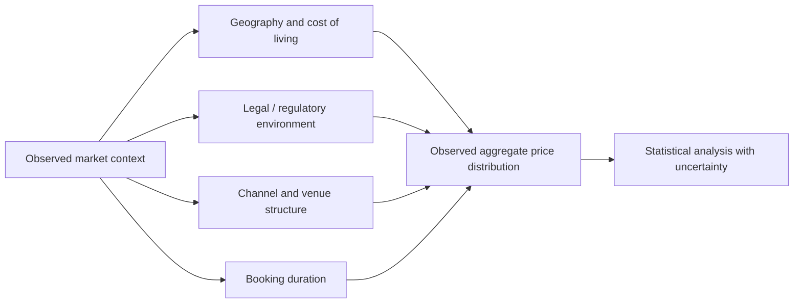

# Informal Sexual-Services Pricing: Research and Safeguarding Note

> **Editorial status:** translated and refactored from a Spanish plaintext source. The original document contained detailed price ranges and service-specific commercial comparisons. This English version preserves the analytical variables and research context while removing operational pricing guidance for sexual acts. Any empirical claims should be validated against current, identifiable socioeconomic and public-health research before publication.

## 1. Scope

The legacy source describes how prices in informal and indoor adult sex-work markets may vary according to time, geography, contact channel, perceived exclusivity and the type of interaction offered.

This document should be read as a **research, policy and safeguarding note**, not as a commercial rate card or procurement guide.

## 2. Variables described in the source

The original material groups pricing differentiation into three broad dimensions:

| Dimension | Examples described in the legacy source | Editorial treatment |
| --- | --- | --- |
| Time | Short sessions, hourly blocks, overnight periods | Retained as a structural variable only |
| Provider / channel profile | Age band, agency vs. street/independent context, perceived premium positioning | Retained only as a market-research variable; not suitable for ranking individuals |
| Interaction type | Massage, oral sex, intercourse, private dance/show, multi-person services | Retained only as category examples; operational pricing removed |

## 3. Why direct price comparisons are unreliable

Cross-market comparisons are difficult because prices can be affected by:

- city-level cost of living;
- legal and enforcement environment;
- venue costs and intermediary commissions;
- working conditions and safety arrangements;
- booking duration and cancellation risk;
- platform or agency fees;
- seasonality and event demand;
- currency volatility;
- stigma and underreporting.

Published figures may also come from convenience samples, advertisements or small local studies rather than representative datasets.

## 4. Age and appearance: methodological caution

The source associated younger age groups and perceived "VIP" appearance with higher prices in some market segments. These claims should not be generalized to individuals.

Research should avoid treating age, appearance, nationality, university status, ethnicity or socioeconomic condition as a proxy for willingness to participate in sex work or as a basis for commercial targeting.

## 5. Safer analytical model

Instead of a price list for sexual acts, a research model can record non-identifying market attributes:

Recommended output fields include median, interquartile range, sample size, observation date, city, source type and confidence limitations rather than a prescriptive service tariff.

## 6. Safeguarding and legal distinctions

Research and policy analysis must distinguish:

- consensual adult sex work;
- compensated dating or sponsorship arrangements;
- trafficking;
- coercion;
- sexual exploitation;
- sexual violence.

These categories are not interchangeable. Legal status also varies significantly by jurisdiction and may differ between selling, buying, advertising, brothel management, third-party facilitation and public-space solicitation.

## 7. Evidence requirements

Before citing any numerical estimate from the legacy material, a future study should document:

1. the city and observation period;
2. the sampling method;
3. whether the source reflects advertisements, transactions, interviews or administrative data;
4. whether listed prices were actually paid;
5. whether intermediary fees were included;
6. the legal context in force at the time;
7. currency conversion methodology;
8. sample size and uncertainty.

The original Spanish source remains traceable through Git history after migration.