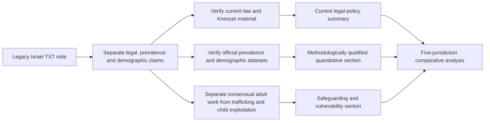

# Israel Sex-Work Legal and Socioeconomic Case Analysis

**Scope:** Refactored English version of the legacy Spanish plaintext note `Para integrar al Estado.txt`, integrated into the broader Philippines–Türkiye–Mexico–India comparative framework.

> **Editorial status.** This document preserves the analytical intent of the legacy source while separating current verified legal points from inherited demographic and prevalence claims. Legal provisions, enforcement data, demographic composition and social-policy metrics should be revalidated against authoritative Israeli sources before publication or operational use.

## 1. Purpose and comparative context

The Israel case adds a fifth jurisdiction to the existing comparative framework. It is analytically useful because Israeli law distinguishes between the legal position of a person in prostitution and the criminalization of purchasing prostitution services, while also maintaining separate offenses concerning trafficking, exploitation, pimping and related conduct.

The comparison should remain descriptive rather than evaluative. It should distinguish:

- the legal status of selling sexual services;
- the legal status of purchasing sexual services;
- third-party exploitation and trafficking offenses;
- administrative and criminal enforcement mechanisms;
- rehabilitation and exit-support programs;
- prevalence and demographic estimates; and
- the difference between national law and observed implementation.

## 2. Legal and regulatory framework

### 2.1 Current official framework

Official Israeli sources confirm that the **Prohibition of Consumption of Prostitution Services (Temporary Provision and Legislative Amendment) Law** entered into force in **July 2020**. The law prohibits purchasing prostitution services and provides for administrative fines, with increased sanctions for repeat violations. Israeli government enforcement guidance also states that prostitution itself is not prohibited per se, while a range of surrounding activities—including procurement, exploitation of minors and other prostitution-related offenses—remain separately regulated under criminal law.

A 2024 Knesset Research and Information Center summary reported that enforcement began in practice in January 2021 and that, between January 2021 and April 2024, police imposed 5,163 fines under the law. These enforcement figures are time-bounded and should not be treated as a proxy for the size of the population involved in prostitution.

### 2.2 Temporary-law and amendment context

The legislation was originally enacted as a temporary provision. Because its duration, extensions and amendments can change, any publication-ready legal summary should verify:

1. the current consolidated text of the law;
2. whether the temporary provision has been extended, replaced or amended;
3. the current fine structure and alternatives to fines;
4. related Penal Law provisions concerning exploitation, pimping, trafficking and minors; and
5. current government rehabilitation and social-support measures.

## 3. Scale and prevalence estimates

The legacy source reports approximately **12,000–14,000** people in prostitution, with roughly **95% women**. Official Israeli material based on the 2016 national survey reports an estimate of approximately **11,190–12,040 people in 2014**, of whom about **95% were women**.

These figures should be treated as historical estimates rather than a current population count. A 2026 State Comptroller publication still refers back to the 2014 estimate when discussing the scale of prostitution and human trafficking, illustrating the need to distinguish historical baseline data from current prevalence.

Any updated quantitative analysis should identify:

- the reference year;
- whether the estimate is point-in-time or annual;
- the definition of prostitution used;
- whether minors are included or separated;
- sampling and extrapolation methods; and
- whether the estimate includes online, indoor, street-based or other settings.

## 4. Demographic and socioeconomic claims

The legacy TXT also reports percentages concerning migration background, motherhood, client frequency and age of entry. These figures are retained only as **legacy source claims** and should not be repeated as current facts without locating the underlying survey tables or official publications.

For research-quality use, demographic variables should be handled as aggregate population descriptors rather than as predictors of individual conduct. Nationality, migration history, parenthood, age, religion, ethnicity or economic status must not be used to profile a specific person as being involved in prostitution or trafficking.

## 5. Trafficking, exploitation and child protection

The Israel case must preserve a clear distinction between:

| Topic | Analytical treatment |
| --- | --- |
| Consensual adult sex work | Legal status, health, social policy, labor and welfare context |
| Purchase of prostitution services | Demand-side prohibition and enforcement under current Israeli law |
| Pimping / procurement / exploitation | Separate criminal-law analysis |
| Human trafficking | Coercion, exploitation, recruitment, transport, harboring and control under applicable law |
| Child sexual exploitation | Separate child-protection and criminal-law framework; never grouped with consensual adult activity |
| Migrant vulnerability | Documentation, discrimination, housing, labor rights, coercion risks and access to services |

Official Israeli anti-trafficking guidance emphasizes that trafficking for prostitution and sexual exploitation is a serious offense and should not be conflated automatically with all adult prostitution.

## 6. Comparative framework: Philippines, Türkiye, Mexico, India and Israel

A more rigorous five-jurisdiction comparison is:

| Jurisdiction | Descriptive legal-policy emphasis | Verification focus |
| --- | --- | --- |
| Philippines | Prohibitive legal framework alongside a large informal sector and tourism-related risk claims | Current criminal law, local enforcement, trafficking data, tourism-related evidence |
| Türkiye | State-regulated licensed system alongside a large informal/unregistered sector | Current licensing rules, municipal implementation, worker protections and informal-sector evidence |
| Mexico | Federal and local regulatory fragmentation with strong state/municipal variation | Federal law, state/municipal rules, public-order enforcement and trafficking distinctions |
| India | Private consensual adult activity distinguished from prohibited surrounding conduct, plus judicial dignity protections | ITPA, current criminal code, Supreme Court directives and state implementation |
| Israel | Selling sexual services is not prohibited per se, while purchasing is prohibited under the 2020 demand-side law | Current consolidated law, enforcement data, rehabilitation policy and updated prevalence research |

This table is descriptive and does not rank the jurisdictions or recommend one legal model over another.

## 7. Evidence-quality checklist

A publication-ready Israel case should verify at least:

- current consolidated legislation and amendments;
- current enforcement guidance and fine structure;
- Knesset Research and Information Center enforcement data;
- updated Ministry of Welfare or other official prevalence studies;
- current State Comptroller findings;
- demographic statistics with original survey tables and dates;
- rehabilitation and exit-program evaluations;
- trafficking statistics that remain separate from consensual adult sex work; and
- child-protection data reported independently from adult prevalence estimates.

## 8. Recommended research workflow

## 9. Official-source references for verification

- Israel Government, **Prohibition of prostitution consumption / fine payment service**: https://www.gov.il/ar/multiservice/prevention-of-prostitution
- Knesset, **Prohibition of Consumption of Prostitution Services Law** (translated legislative text): https://main.knesset.gov.il/ru/activity/pages/law.aspx?LawId=9
- Knesset Research and Information Center, **Enforcement of the Prohibition on Prostitution Consumption** (9 July 2024): https://main.knesset.gov.il/EN/activity/mmm/mmm090724.pdf
- Israel Government anti-trafficking guidance, **Trafficking for prostitution and sexual exploitation**: https://www.gov.il/he/pages/prostitution?chapterIndex=3
- State Comptroller of Israel, **Prostitution and trafficking for prostitution — enforcement and victim protection**: https://library.mevaker.gov.il/sites/DigitalLibrary/Pages/Publications/2161.aspx

## 10. Editorial safeguards

- All discussion concerns adults unless a child-protection issue is explicitly identified separately.
- Consensual adult sex work, purchase offenses, trafficking, exploitation and sexual violence are distinct analytical categories.
- No demographic group should be characterized as inherently more likely to engage in sex work or trafficking.
- Historical prevalence estimates must not be presented as current counts.
- Enforcement data must not be used as a direct estimate of prevalence.
- The comparative framework is descriptive and should not be converted into a ranking of legal systems.
