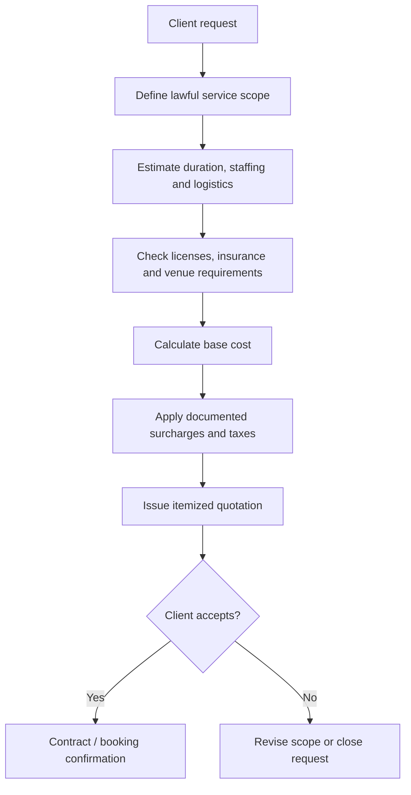

# Legal Hospitality and Entertainment Service Cost Model

> **Editorial status:** translated, corrected and consolidated from an additional Spanish plaintext planning note. The figures below are planning estimates rather than verified market quotations. They should be refreshed with current local providers, labor rules, licensing requirements, taxes, insurance and venue conditions before commercial use.

## 1. Purpose

This document defines a lawful, non-sexual pricing framework for hospitality, protocol, wellness, entertainment and concierge services. The model intentionally bases pricing on measurable professional variables such as qualifications, languages, duration, logistics, staffing and event complexity rather than subjective personal characteristics.

## 2. Indicative planning matrix

| Service | Suggested billing unit | Main cost drivers | Lima planning range | Europe metropolitan planning range | U.S. planning range |
| --- | --- | --- | ---: | ---: | ---: |
| VIP hostess / protocol staff | Hourly, usually with minimum booking, or per event | Languages, formal attire, transport, night schedule, event complexity | USD 15–35/hr | USD/EUR 30–65/hr | USD 40–85/hr |
| Non-sexual social / corporate companion | Hourly or day rate | Languages, business etiquette, dinner/event attendance, travel, scheduling | USD 40–100/hr | USD/EUR 80–200/hr | USD 100–250/hr |
| Professional / therapeutic massage | 60- or 90-minute session | Certification or license, consumables, mobile setup, in-room service | USD 35–70/session | USD/EUR 70–140/session | USD 90–180/session |
| Group dance / entertainment performance | 30-, 60- or 90-minute show | Number of performers, rehearsal, choreography, costumes, production setup | USD 150–400/show | USD/EUR 400–1,200/show | USD 500–1,500/show |
| Private concierge / personal assistant | Hourly, daily fee or package | Reservations, transport coordination, multilingual support, contingency handling | USD 25–60/hr | USD/EUR 50–120/hr | USD 60–150/hr |

These values are not a substitute for supplier quotations. They are suitable only as preliminary budgeting bands.

## 3. Standard pricing formula

A reusable quotation model can be expressed as:

```text
Final Price = (Base Hourly Rate × Hours)
            + Travel / Logistics
            + Consumables
            + Venue / Equipment
            + Additional Staff
            + Applicable Surcharges
            + Taxes / Mandatory Fees
```

For event-based work, the base rate can be replaced with a fixed production fee.

## 4. Optional surcharges

The legacy source proposed the following planning adjustments:

| Surcharge | Indicative planning adjustment | Typical reason |
| --- | ---: | --- |
| Night work | +20% to +35% | Late-hour staffing, transport and availability |
| Specialized language capability | +15% to +25% | Bilingual/trilingual or technical-language requirement |
| Last-minute booking | Up to +30% | Less than 24 hours of notice |
| Holidays / peak-demand dates | Up to +50% | Limited staffing and higher opportunity cost |

These percentages should be replaced with provider-specific terms whenever actual quotations are available.

## 5. Professional cost drivers

Pricing should be linked to transparent, job-relevant variables:

- documented training and certifications;
- years of relevant experience;
- languages and specialized communication skills;
- duration and schedule;
- number of staff or performers;
- travel and accommodation;
- venue, equipment and consumables;
- insurance and licensing;
- rehearsal or preparation time;
- event-production complexity;
- cancellation and rescheduling risk.

Appearance, age, ethnicity, nationality, relationship status and other unrelated personal attributes should not be used as rate multipliers.

## 6. Quotation workflow



## 7. Cost-control and procurement rules

For a professional implementation:

1. obtain at least two or three supplier quotations for recurring service categories where practical;
2. store base rate, effective date and currency separately;
3. record taxes, platform fees and travel costs as separate line items;
4. define cancellation and overtime conditions in writing;
5. never represent a planning range as a guaranteed market price;
6. review labor classification and local licensing requirements;
7. keep non-sexual hospitality, wellness and entertainment services contractually distinct from adult social-discovery functions.

## 8. Progress-plan integration

The cost model can be incorporated into the broader destination-wedding and hospitality roadmap in four stages:

| Stage | Output | Acceptance criterion |
| --- | --- | --- |
| 1. Market validation | Current supplier quotations by city and service | Minimum viable sample gathered with observation date |
| 2. Cost normalization | Comparable hourly/session/event rates | Taxes, logistics and currency separated from base rate |
| 3. Pilot quotation engine | Parameterized quote template | Itemized totals reproduce verified supplier examples |
| 4. Commercial governance | Contract, cancellation and review rules | Legal/compliance review completed for pilot jurisdiction |

This provides a lawful cost-planning layer that can support hospitality and destination-event operations without relying on subjective personal-value assumptions.