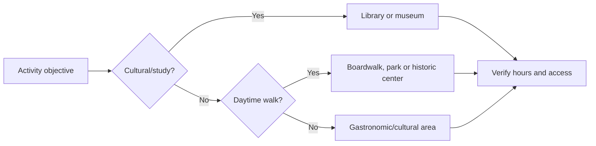

# Urban Areas and Libraries for Activities in Lima

> **Editorial status:** opening hours in the original document are historical references and should be verified directly with each location before organizing an activity.

## 1. Tourist areas and urban spaces

### Miraflores

- Kennedy Park.
- Calle de las Pizzas and surrounding urban area.
- Miraflores Boardwalk.
- Love Park (Parque del Amor).
- Larcomar.

The original document distinguishes morning periods for physical activity and afternoon/evening periods for higher social and tourist traffic.

### Barranco

- Barranco Main Square.
- Bridge of Sighs (Puente de los Suspiros).
- Bajada de Baños.

It is described as a cultural, gastronomic and nightlife environment.

### Historic Center

- Jirón de la Unión.
- Plaza San Martín.

The original text identifies them as high-traffic pedestrian corridors.

## 2. Noted libraries

| Library | Area | Described use |
| --- | --- | --- |
| National Library of Peru | San Borja | Study, research and cultural events |
| Public Library of Lima | Av. Abancay / Historic Center | Study and public consultation |
| Ricardo Palma Municipal Library | Miraflores | Reading and cultural activities |

## 3. Planning recommendations

- Verify official opening hours and temporary closures.
- Confirm whether a group activity requires booking or authorization.
- Choose well-lit and accessible public spaces for initial meetings.
- Do not interpret `peak attendance hours` as official opening hours.

## 4. Use in itineraries

