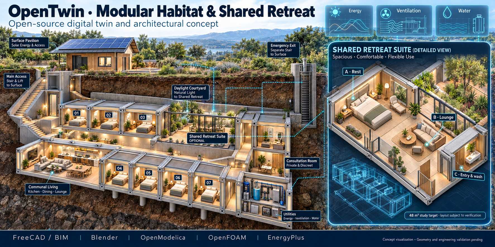

# OpenTwin Modular Habitat and Shared Retreat

## Concept

The OpenTwin modular habitat concept consolidates the underground-habitat and shared-retreat studies into one architectural cutaway. The current concept depicts seven private rooms, communal living and dining, a daylight courtyard, consultation space, utility modules and an optional shared retreat with rest, lounge and entry/wash zones.

## Proposed open-source workflow

| Stage | Candidate tool |
| --- | --- |
| Parametric/BIM geometry | FreeCAD / BIM workbench |
| Visualization | Blender |
| System modeling | OpenModelica |
| CFD/ventilation | OpenFOAM |
| Building energy | EnergyPlus |

These are candidate tools, not a fixed implementation stack.

## Engineering status

The rendering and wireframe are conceptual. The proposed 48 m² shared-suite target, circulation, structural system, emergency access, ventilation, daylighting and accessibility require CAD reconciliation and engineering validation.

## Validation work package

1. Reconcile room areas and circulation in CAD.
2. Define structural and geotechnical assumptions.
3. Model ventilation, thermal loads and emergency egress.
4. Validate water, sanitation, electrical and communications utilities.
5. Produce requirements traceability from concept to simulation.
6. Record unresolved assumptions before any detailed design claim.

## Related material

- [Strategic annex — OpenTwin modular habitat and shared retreat](../ANNEX.md#82-opentwin-modular-habitat-and-shared-retreat)
- [Household space-planning requirements](../ANNEX.md#19-conceptual-space-planning-for-a-seven-adult-household)
- [Shared retreat suite specifications](../ANNEX.md#20-shared-retreat-suite-preliminary-architectural-specifications)
- [`MBSE/CAD/`](../../MBSE/CAD/)
- [`MBSE/CAS/drawio/`](../../MBSE/CAS/drawio/)
