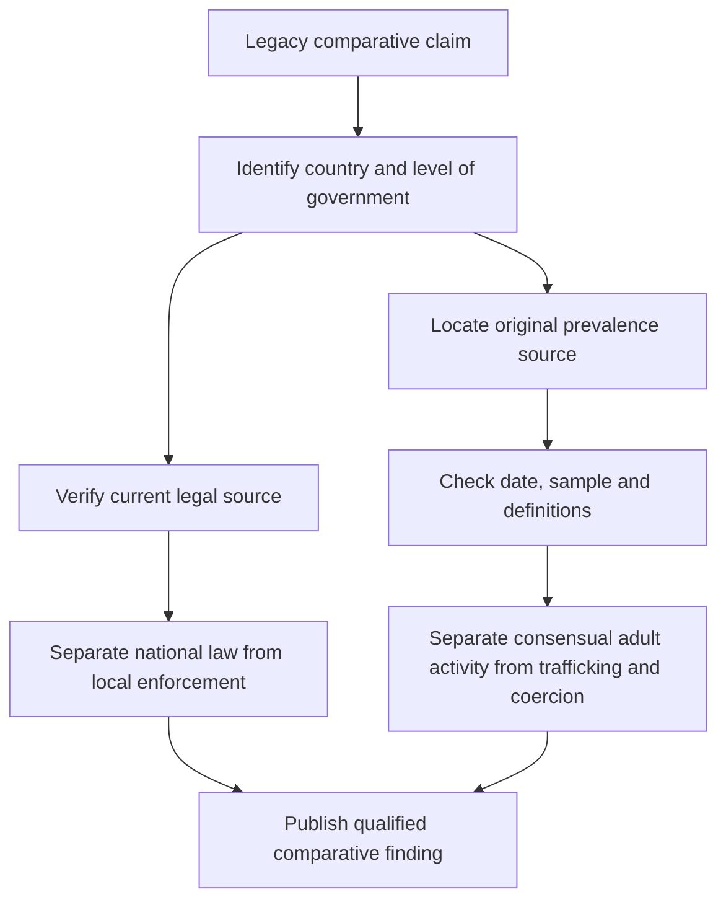

# Philippines, Türkiye and Mexico: Comparative Sex-Work Legal and Socioeconomic Analysis

> **Editorial status:** translated and refactored from the legacy Spanish plaintext source `El análisis comparativo.txt`. Legal classifications, prevalence estimates, enforcement descriptions and socioeconomic claims inherited from the source are **not independently verified in this migration** and must be checked against current official, peer-reviewed or otherwise authoritative sources before publication, policy use or operational decision-making.

## 1. Scope and comparison method

This note compares three national contexts described in the legacy source: the **Philippines**, **Türkiye** and **Mexico**. The original text used **Ankara** as an urban reference point for Türkiye; this edition does not treat one city as representative of the entire country. Instead, it separates national legal context from city-level observations.

The comparison is organized around three dimensions:

1. legal and regulatory framework;
2. scale and prevalence claims reported by the legacy source;
3. socioeconomic conditions and safeguarding risks.

The purpose is descriptive research. It is not a directory of providers, venues, prices or methods for obtaining sexual services.

## 2. Comparative legal and regulatory framework

| Dimension | Philippines | Türkiye | Mexico |
| --- | --- | --- | --- |
| Legacy-source characterization | Prostitution described as prohibited under national law | Sex work described as legal only within a regulated framework, with licensed establishments | Sex work described as not uniformly prohibited at federal level, with substantial state and municipal regulation |
| Regulatory mechanism described | Penal and anti-prostitution provisions | State authorization, registration and health-control mechanisms for licensed establishments | State and municipal ordinances, administrative controls and locally defined tolerated or restricted zones |
| Informal / unregistered sector | Described as large despite formal prohibition | Described as larger than the shrinking formally registered sector | Described as much larger than locally registered or medically supervised populations |

These descriptions are inherited from the source and should **not** be treated as a current legal opinion. A future revision should verify statutes, implementing regulations, constitutional decisions, municipal rules and enforcement practice separately for each jurisdiction.

## 3. Scale and prevalence claims in the legacy source

### 3.1 Philippines

The source reports estimates in the range of **500,000 to 800,000 people** involved in prostitution nationwide and associates the phenomenon with major urban centers and tourism-intensive areas.

This range is retained only as a historical research claim. Before reuse, the underlying study population, year, methodology and distinction between consensual adult sex work, exploitation and trafficking must be established.

### 3.2 Türkiye

The source cites national estimates of **more than 100,000 sex workers**, while stating that only a small minority operates through formally licensed establishments.

It also references Ankara as a major urban center with independent and nightlife-based activity. This edition treats Ankara as a possible case-study location rather than as a proxy for national prevalence.

### 3.3 Mexico

The source reports a national estimate of **more than 230,000 sex workers** and states that major metropolitan areas and northern-border corridors account for substantial local populations.

As with the other country estimates, this figure requires validation against the original source, observation year, definitions and sampling methodology.

## 4. Socioeconomic context and safeguarding issues

### 4.1 Philippines

The legacy source links informal sex work to:

- income inequality and poverty;
- tourism-intensive urban and coastal economies;
- limited formal employment opportunities for some populations;
- elevated vulnerability where activity is criminalized or driven underground.

It also refers to sexual exploitation and sex tourism. Those phenomena must be analytically separated from consensual adult sex work and assessed with dedicated trafficking and child-protection evidence.

### 4.2 Türkiye

The source highlights:

- a reduction in the number of newly licensed establishments;
- growth of informal, independent and internet-mediated activity;
- labor-market exclusion affecting some displaced and refugee populations;
- discrimination and employment barriers affecting transgender people.

These are safeguarding and labor-market topics that require current evidence. Refugee status, gender identity or economic hardship must never be used to infer that an individual engages in sex work.

### 4.3 Mexico

The source emphasizes:

- fragmented state and municipal regulation;
- differences between formal administrative registration and the much larger informal sector;
- migration corridors and border economies;
- overlap in some locations between sex-work markets, trafficking risks and organized crime.

Consensual adult sex work, trafficking, migrant smuggling, coercion and organized criminal activity are distinct categories and should not be merged statistically or legally.

## 5. Comparative analytical matrix

| Analytical dimension | Philippines | Türkiye | Mexico |
| --- | --- | --- | --- |
| Regulatory pattern described by source | Predominantly prohibitionist | Regulated / licensed formal sector alongside a large informal sector | Decentralized and locally variable regulation |
| Main evidence challenge | Underreporting under prohibition and overlap with exploitation statistics | Formal-registration data capture only a fraction of the market | Federal, state and municipal definitions are difficult to aggregate |
| Key socioeconomic themes | Poverty, tourism economy, informal labor | Licensing contraction, displacement, labor exclusion, digital intermediation | Urban informality, migration corridors, local regulatory variation |
| Main safeguarding concern | Exploitation and trafficking must be separated from consensual adult activity | Vulnerable populations require anti-discrimination and labor safeguards | Trafficking and organized-crime evidence must not be conflated with all sex work |

## 6. Evidence-quality requirements

A future evidence-based edition should document, for every quantitative or legal claim:

- publication year and observation period;
- exact jurisdiction and population;
- whether the statistic refers to adults only;
- definition of sex work used;
- whether online content, compensated dating and in-person services are combined or separate;
- whether trafficking or exploitation cases are included;
- sample size and estimation method;
- current statute, regulation or court decision supporting each legal classification.

## 7. Research workflow

## 8. Editorial and safeguarding principles

- Do not infer that a person is a sex worker, trafficking victim or participant in compensated relationships from nationality, age, occupation, poverty, migration status, gender identity, appearance or location.
- Do not use national prevalence estimates to target individuals or institutions.
- Keep adult consensual sex work analytically separate from trafficking, coercion, exploitation and sexual violence.
- Use authoritative, jurisdiction-specific legal sources before making operational decisions.
- Treat the numerical ranges preserved here as **legacy hypotheses pending verification**, not as current validated statistics.
