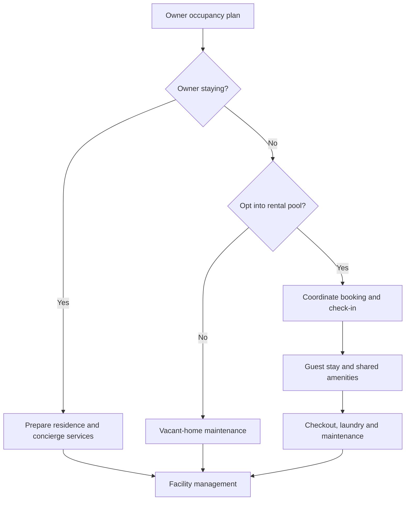

# Valles de Alborada: Hybrid Residence Concept

**Status:** translated and structured concept proposal; no site, development approval or operating service is established by this document.

## 1. General concept

Valles de Alborada is a proposed low-density private residential community for individuals and families seeking a balance between remote work and access to nature. The original proposal uses a **hybrid residence / co-primary home** model, with planned connectivity, sustainability measures and shared infrastructure.

Candidate settings in the source include the Sacred Valley in Cusco, Cieneguilla and Pachacámac near Lima, and valleys around Arequipa and Trujillo. The source describes development outside the capital while also listing locations in the Lima area; this document retains those candidates without treating them as a single geographic or climatic category. Year-round sunshine and a dry microclimate are desired site-selection attributes, not verified properties of every candidate.

## 2. Architectural and urban components

| Component | Original design proposal |
| --- | --- |
| Cabin or terraced homes | Modules of **120–250 m²**, integrated into the terrain |
| Materials and envelope | Local stone, certified timber, green roofs and thermally/acoustically insulated glazing |
| Individually titled plots | **300–600 m²**, subject to confirmation of subdivision and title arrangements |
| Design controls | Neo-Andean or bioclimatic building parameters reviewed by internal committees |
| Landscape allocation | **60–70%** of total land proposed for green spaces, community gardens, promenades and trails |
| Internal circulation | Paved-block or stabilized routes designed to support water permeability |

These dimensions and allocations are concept targets. Plot sizes, dwelling footprints, shared facilities and circulation must be reconciled in a site-specific area schedule.

## 3. Amenities and common areas

| Zone | Proposed equipment and purpose |
| --- | --- |
| Work and coworking hub | Indoor and outdoor workspaces, redundant fiber connections, meeting rooms and dedicated Starlink connectivity |
| Wellness club | Solar-heated swimming pool, spa, sauna, yoga and meditation areas |
| Active sustainability | Community organic garden, composting facility and greenhouse |
| Social and recreation | Fire pits, a clubhouse with a gourmet kitchen for private events, and integrated children's play areas |

Connectivity redundancy and service availability require site validation. The source's self-sufficiency objective remains a design aspiration.

## 4. Bioclimatic engineering and sustainability

- **Solar energy:** photovoltaic panels in common areas and pre-installation in homes for self-consumption.
- **Water management:** greywater treatment for landscape irrigation and rainwater harvesting.
- **Waste management:** independent biodigesters for each plot or residential block, with their intended feedstock and treatment role to be defined during engineering.
- **Thermal performance:** thermal-mass architecture intended to capture daytime solar heat and moderate cool valley nights.

Energy, water and waste systems need site-specific sizing and operating plans. Rainwater harvesting capacity depends on local rainfall; thermal performance depends on the envelope and local conditions.

## 5. Management and business model

### Managed rental pool

For owners who do not occupy their homes throughout the year, the community operator would provide an optional short-stay rental service inspired by a boutique-hotel model. Proposed services include check-in, laundry and integrated maintenance. The source mentions Airbnb as a service analogy; it establishes no platform affiliation.

### Security and access

The concept includes a monitored entrance operating 24/7, a living or technology-assisted perimeter barrier, and internal patrols.

### Concierge and facility management

Proposed services include private garden maintenance, cleaning before the owner's arrival, and collection of locally purchased organic groceries.

## 6. Proposed operating flow

The following Mermaid diagram organizes the source concept; it does not describe an implemented system.

## 7. Source and related documents

Translated from `docs/Este concepto de proyecto.txt` at source commit `1514dc2d52187c79432d6850e2248226941a7e7b`. The original remains in Git history. Editorial additions clarify the concept's status and organize its operating flow; they do not certify feasibility.

- [Modern cooperative settlement evaluation](../strategy/modern-cooperative-settlement-evaluation.md)
- [OpenTwin modular habitat](../mbse/opentwin-modular-habitat.md)
- [Business model and KPIs](../business/business-model-and-kpis.md)
- [Documentation index](../README.md)
