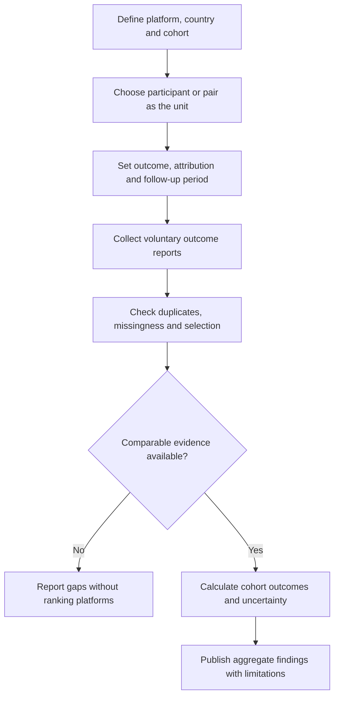

# Marriage Conversion in Latin American Dating Platforms

**Status:** English translation and editorial restructuring of an exploratory note; no measured marriage-conversion rate is established here.

## 1. Scope and evidence boundary

The source compares Tinder, Badoo, OkCupid and Mutual in Latin America. Although the requested topic refers to Match Group, this is a cross-platform comparison: Tinder and OkCupid appear in [Match Group's brand portfolio](https://mtch.com/careers/about-our-brands/), while [Bumble identifies Badoo as one of its brands](https://ir.bumble.com/). Mutual is treated as an external comparator whose [official site](https://www.mutual.app/) describes an audience of Latter-day Saints.

The source opens by asserting that no unified official Latin American marriage-conversion metric is published. This migration cannot establish that universal absence. More narrowly, **the supplied note contains no cited dataset, cohort denominator, observation period or numerical estimate** supporting its rankings. The official pages checked for this migration establish brand scope and positioning, not comparable marriage outcomes.

## 2. Translated qualitative comparison

The following table preserves the original classifications for traceability. They are **unsupported source opinions, not estimated statistical rates or a validated ranking**.

| Platform | User intent described in the source | Original qualitative label | Source's proposed explanation |
| --- | --- | --- | --- |
| Tinder | Broad, from casual dating to relationships | Low–moderate | Rapid discovery and high-volume swiping |
| Badoo | Friendship, social interaction and dating | Low | Local connections, entertainment and casual dating |
| OkCupid | Serious relationships and compatibility | Moderate–high | Questions and shared values |
| Mutual | Marriage or a stable partnership | High within its niche | Shared religious or conservative values among Latter-day Saints |

Product positioning does not establish actual user intent, and neither establishes marriage probability. No percentage should be inferred from these labels.

## 3. Platform-by-platform source analysis

### Tinder

The draft claims that Tinder has the largest Latin American user population, naming Brazil, Mexico, Colombia and Argentina as its largest regional markets. It argues that a large population can generate many marriages in absolute terms while producing a low percentage relative to initial matches. It also attributes lower conversion to visual browsing and immediate gratification.

The regional size ranking, market ordering, outcome rate and causal explanation are unverified in the source. Absolute marriage counts and conversion percentages require different evidence.

### Badoo

The draft describes popularity in secondary cities and lower-income segments, and characterizes the service as open chat and social interaction rather than explicitly marriage-oriented dating. It consequently assigns Badoo the lowest marriage-conversion label.

The geographic and socioeconomic claims and relative ranking lack supporting samples. They should not be used to classify individual users or to infer their relationship intentions.

### OkCupid

The draft describes a smaller urban Latin American audience, allegedly with higher education and ages of 25–42. It argues that extensive compatibility questions about politics, lifestyle, values and religion filter low-affinity matches and increase the likelihood of stable relationships or marriage.

Those demographic boundaries and the claimed causal benefit are not demonstrated. The source's assertion that an extensive questionnaire is mandatory is also not verified here. Compatibility features alone do not provide a marriage-outcome measure.

### Mutual

The draft focuses on Latter-day Saint communities in Mexico, Brazil, Chile, Peru and Colombia. It attributes the highest proportional conversion to alignment in faith, culture and expectations, including a religious ideal of eternal marriage.

Mutual's [community standards](https://mutual.app/standards) describe meeting, dating and potentially finding a partner for temple marriage. This supports a statement about intended positioning, not the draft's regional distribution or superior conversion claim. Religious identity must not be treated as evidence of an individual's intent or eventual outcome.

## 4. Proposed measurement framework

This section is an editorial addition, not a result reported by the source.

A study must choose its unit before computing a rate:

| Unit | Example outcome | Required denominator |
| --- | --- | --- |
| Unique consenting participants | Participant reports marrying someone first met on the platform within a defined period | Eligible participants in the same entry cohort |
| Unique matched pairs | Pair reports marriage within a defined period after matching | Eligible unique pairs in that match cohort |
| Survey respondents | Respondent reports an app-origin marriage | Respondents answering the relevant question; this is a respondent statistic, not automatically a user-population rate |

Specify country, enrollment dates, follow-up duration, eligibility, attribution rules and outcome definition. Distinguish marriage from a first date, exclusive relationship, cohabitation, engagement and account deletion.

For a fully observed participant cohort:

**Participant marriage proportion = participants reporting the defined outcome / eligible participants in that cohort.**

Count participants consistently; do not divide marriage events by user accounts or matches. Deduplicate pairs for pair-based analysis. Report incomplete follow-up, nonresponse, uncertainty and selection effects separately. Do not silently classify missing outcomes as non-marriages or generalize respondent-only findings to all users.

Cross-platform comparisons need compatible cohorts and follow-up windows. People may use multiple services, so attribution needs an explicit rule. A share of married couples who met online is not the probability that a dating-app user will marry.

## 5. Evidence workflow

Use opt-in data and aggregate reporting. Do not infer marriage, religious affiliation or relationship intent from professional profiles or demographic proxies.

## 6. Sources and migration record

Official references checked on **5 October 2026**:

- [Match Group: brand portfolio](https://mtch.com/careers/about-our-brands/) — scope of Tinder and OkCupid.
- [Bumble investor relations](https://ir.bumble.com/) — Badoo's corporate scope.
- [Mutual](https://www.mutual.app/) and [community standards](https://mutual.app/standards) — stated audience and relationship positioning.

These sources do not substantiate the comparative conversion labels.

Translated and refactored from `docs/No existe una métrica.txt` at commit `cd016c01e39d500f65bb8999efdc8e301f736b7a`. The original remains in Git history. Editorial additions correct the corporate scope and introduce measurement definitions and an evidence workflow.

Related: [Research index](../README.md), [documentation index](../../README.md), [OkCupid regional comparison](../../okcupid-regional-sociocultural-comparison.md), and [requirements and consent](../../product/requirements-and-consent.md).
