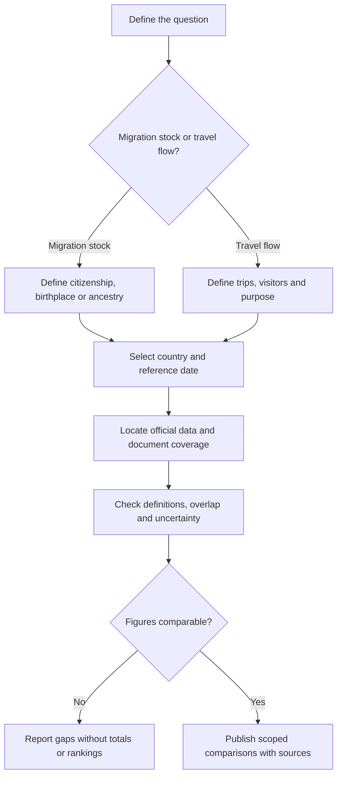

# Colombian Emigration Destinations and Diaspora Research

**Status:** English translation and restructuring of an exploratory source note. Population estimates, destination rankings, migration motives and policy references below are inherited claims without cited sources or reference dates.

## 1. Scope: emigration, not short-stay tourism

The source describes Colombian communities abroad and possible reasons for migration: employment, education, shared language, geographic proximity and family or community networks. These are migration and diaspora topics. They must not be presented as outbound tourist arrivals, holiday preferences or tourism market shares.

The document is filed alongside mobility and tourism research for navigation continuity; this placement does not make migrant populations equivalent to travelers. Any later analysis of diaspora visits or visiting-friends-and-relatives tourism would need separate travel data.

## 2. Translated destination comparison

**All figures in this table are unverified source estimates, not current population statistics.** The draft does not define whether “Colombians” means citizenship, country of birth, ancestry, consular registration or another population.

| Country or group | Estimate stated in the source | Geographic profile and motives described in the source |
| --- | --- | --- |
| United States | More than 2,000,000 | Described as the main historical destination, with concentrations in Florida, New York and New Jersey; employment, professional opportunities and family reunification |
| Spain | Approximately 1,000,000 | Described as the main European destination, with concentrations in Madrid and Catalonia; shared language, academic-recognition arrangements and employment-related regularization pathways |
| Venezuela | Approximately 500,000–1,300,000 | Historical proximity-based migration; the draft describes sustained flows since the 1970s for agricultural and commercial work, followed by a more recent reversal |
| Chile and Ecuador | More than 250,000 combined | Regional destinations associated in the draft with relative economic stability, proximity, and informal or commercial employment |
| Canada | More than 80,000 | Skilled migration, permanent-residence programs such as Express Entry, university education and family reunification |
| Australia | More than 40,000 | Education and youth employment, including English-language study, postgraduate education and a source reference to temporary “Working Holiday” arrangements |

### Interpretation limits

- The Chile/Ecuador figure is a combined source claim and must not be assigned to either country individually.
- The Venezuela interval has no documented methodology; it is not a statistical confidence interval. The claimed reversal needs origin, destination and date definitions.
- “Main destination” and relative economic-stability descriptions are source characterizations, not verified rankings.
- The figures cannot be summed into a reliable diaspora total or converted into market shares without compatible definitions, dates and coverage.
- City and regional concentrations lack denominators and supporting geographic data.

## 3. Migration drivers described in the source

### Employment and income

The draft associates migration with the search for wages in US dollars or euros and the possibility of sending remittances to Colombia. It supplies no wage comparison, remittance series or evidence quantifying the contribution of this motive.

### Education

The source describes a growing flow of young Colombians toward Spain, Australia, Canada and the United Kingdom for language learning and postgraduate education. The United Kingdom appears in this narrative but has no population estimate in the source table. The asserted growth requires enrollment or migration data over a defined period.

### Support networks

The draft identifies communities in Miami, Madrid and New York as potential sources of support for arrival and adaptation. This is a proposed explanation of migration patterns, not evidence of an individual migrant's resources or intentions.

## 4. Policy references are not eligibility guidance

The source mentions academic recognition and employment regularization in Spain, Express Entry in Canada, and study or Working Holiday arrangements in Australia. These references are preserved as research topics only.

The note provides no official rules, eligibility criteria, nationality coverage or effective dates. In particular, the Australian Working Holiday reference does **not** establish that Colombian passport holders are eligible. Likewise, academic recognition, admission to study, permission to work and permanent residence must not be treated as interchangeable approvals.

This migration does not verify those pathways or provide application instructions. A subsequent policy update would require dated official sources for the specific nationality and program.

## 5. Proposed evidence workflow

This editorial workflow separates the original figures from any future verified dataset.

For a migration dataset, record the statistical unit, population definition, country, reference date, source, exclusions and estimation method. Keep migrant stocks separate from annual migration flows, visa approvals, student enrollments, remittance transactions and tourist visits.

Only compare or aggregate figures after documenting their compatibility. Destination analysis should use aggregate data rather than infer a person's status, income or intentions from nationality.

## 6. Source and related documents

Translated from `docs/La emigración colombiana.txt` at commit `e27f42009c5e07139b100ea3b4d875b937cf9078`. The original remains in Git history. The table and three driver categories preserve the draft's content; scope distinctions, interpretation limits, policy qualifications and the Mermaid workflow are editorial additions.

No population estimate or policy claim was independently validated during this editorial migration.

- [Research index](../README.md)
- [Documentation index](../../README.md)
- [Peru and Colombia inbound-tourism comparison](../../peru-colombia-inbound-tourism-comparison.md) — a different travel direction and statistical population
- [Inbound tourism origin-market research](inbound-origin-market-research.md)
