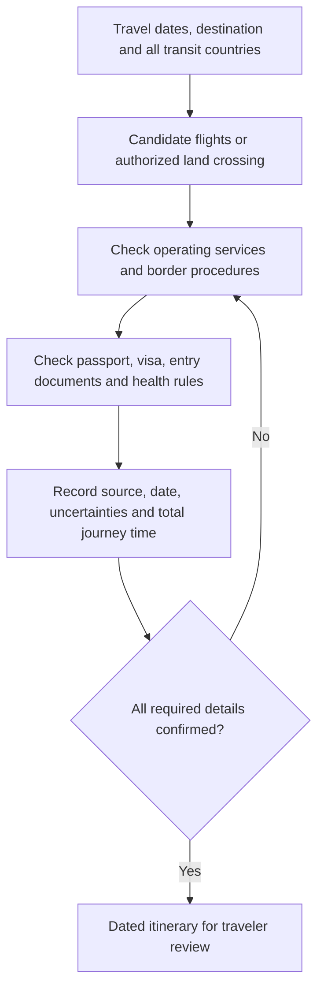

# French Guiana: Air and Overland Access

**Editorial review:** 9 October 2026 (Lima).  
**Status:** English translation and structured route research, with selected official-source checks.

This note translates the three sections of additional plaintext source entry 56: air access, the two overland corridors and border-document considerations. Carrier names, crossing times and transport availability are retained as source claims, not confirmed itineraries. The original is retained in Git history; see the [migration register](../../ANNEX-DOCS-CONSOLIDATED.md#10-complete-migration-and-translation-register).

Visa and health discussion is consolidated in the [Peruvian/Argentine passport note](../legal/french-guiana-entry-peruvian-argentine-passports.md). Its [shared reference register](../legal/french-guiana-entry-peruvian-argentine-passports.md#shared-reference-register) supplies stable IDs FG-01…07 for both documents.

## 1. Air access through Cayenne (CAY)

The draft identifies Cayenne–Félix Eboué Airport (CAY) as the main arrival airport. It calls the airport “located in the capital”; the official French business register locates the airport establishment in **Matoury**, so the location is corrected rather than repeated as central Cayenne. [FG-07](../legal/french-guiana-entry-peruvian-argentine-passports.md#shared-reference-register)

| Candidate in the source | Translated claim | Editorial treatment |
|---|---|---|
| Via Brazil | Direct flights or connections from Belém (BEL) to Cayenne, operated by regional airlines | No dated carrier, schedule or through-ticket was supplied; each leg remains to be checked |
| Via metropolitan France | Air France and Air Caraïbes flights from Paris, with Orly named in the draft | Preserve the names as research leads; verify the operating carrier and actual Paris airport for each leg |
| Via the French Caribbean | Connections involving Guadeloupe and Martinique | Service, frequency, connection protection and transit requirements remain unverified |

### Check-in and boarding: translated source assertions

The draft says the airline will require a valid Peruvian or Argentine passport, a yellow-fever certificate issued at least ten days before the flight, and a return/onward ticket before 90 days. It also states categorically that absence of the certificate will cause denied boarding.

The accompanying legal note separates the applicable health rule and medical-contraindication pathway from that blanket boarding prediction. Airline checks, permitted stay and transit rules depend on the itinerary and documentation. The notes do not verify a particular airline's decision, a booking or admission of an individual traveler.

## 2. Overland corridors

### A. Eastern border: Brazil → French Guiana

The source describes **Oiapoque → Saint-Georges-de-l'Oyapock**, across the Oyapock River, as the border with the greatest infrastructure. That comparative ranking was not substantiated.

| Source option | Translated content | Verification boundary |
|---|---|---|
| International bridge | Crossing by private vehicle, taxi or bus | The official DGTM page identifies the bridge; it is a historical operating notice, not proof of today's hours or any bus/taxi service [FG-05](../legal/french-guiana-entry-peruvian-argentine-passports.md#shared-reference-register) |
| River boat / pirogue | A frequently used crossing taking about 15 minutes into the town | This estimate and the legality/availability of the specific service are unverified; do not infer an authorized international entry point from a boat route |
| Brazilian formalities | Exit registration with Brazil's Federal Police in Oiapoque | Preserved as a draft instruction; confirm the location and procedure with the Brazilian authority |
| French formalities | Report to the Police aux Frontières (PAF) in Saint-Georges | Confirm the authorized crossing and current procedure before travel; a river crossing alone does not establish lawful admission |

The source warns that using an informal boat without French immigration formalities may leave the traveler in an irregular situation and says to request an entry stamp. This is preserved as the source's concern, not a verified remedy: use the designated control point and retain the entry record required by the authority. Do not treat a requested stamp as a substitute for admission.

### B. Western border: Suriname → French Guiana

The source describes **Albina → Saint-Laurent-du-Maroni** across the Maroni, by boat/pirogue or ferry. It instructs travelers to complete exit control in Albina and French immigration control after arrival.

The prefecture's border page identifies the French PAF post at Saint-Laurent's international landing stage and directs inquiries about Albina to Surinamese authorities. This supports the control-point distinction, not a current ferry timetable or ticket availability. Its published hours need rechecking for the travel date; they are not copied as a standing schedule. [FG-06](../legal/french-guiana-entry-peruvian-argentine-passports.md#shared-reference-register)

## 3. Border-document considerations

The source's four requirements are retained below with their evidence limits.

| Source heading | English translation | Consolidated treatment |
|---|---|---|
| Prior exit stamp | A traveler should have the neighboring country's exit recorded in the passport used for entry | Confirm each country's procedure; use required exit/entry records rather than assume every process uses the same physical stamp |
| Onward or return ticket | Border officers may ask for evidence of departure within the allowed stay | Include in the document checklist; the admitted period and circumstances must be verified |
| Yellow-fever certificate | Brazil/Suriname and French Guiana will all require the physical international certificate | French Guiana is checked separately in the legal note. The other countries' rules and accepted formats are not established by this source |
| Passport consistency | If departure from Brazil uses the Argentine passport, present it on the French side; switching to the Peruvian passport may confuse records | Preserve as a planning concern; reconcile identities/booking records and each authority's document rules. No universal same-passport legal rule is certified |

## Route-evidence workflow

Keep airport/river-crossing time separate from the whole journey. No fare, transport reservation, current border hours or individualized immigration determination was produced in this update.
