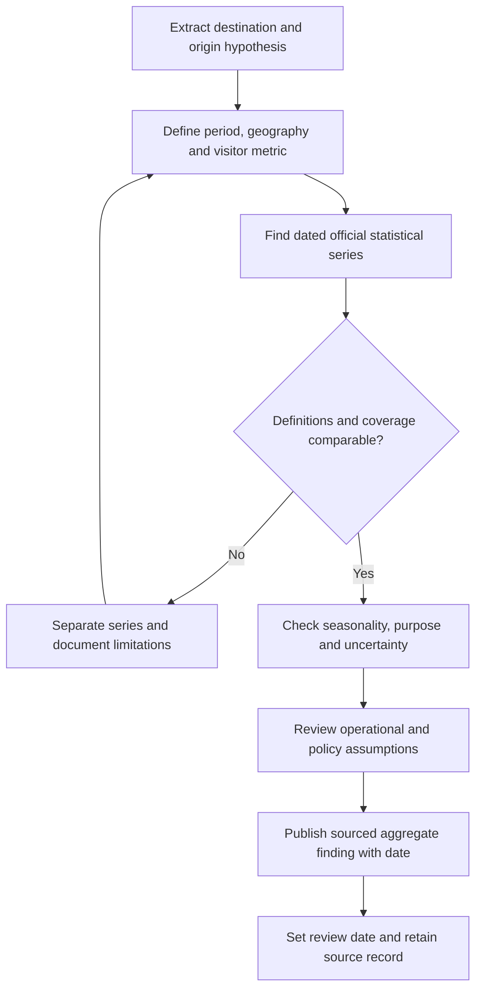

# Inbound Tourism Origin-Market Research

[Documentation index](../../README.md) · [Research index](../README.md)

## Scope and evidence status

This document consolidates three exploratory Spanish notes covering 14 destinations
in Europe, Asia, the Middle East and the Americas. It preserves their named origin
markets, locations and proposed travel drivers as a research inventory.

**The source drafts provide no dated datasets or citations.** The tables below are
summaries of those drafts, not verified current rankings, market shares, travel
advice or forecasts. Terms such as “largest,” “fastest growing” and “highest
spending” have not been carried forward as established facts. Visa rules, transport
availability, conflict effects and medical-travel claims require separate current
verification before any operational recommendation.

## Contents

- [Research and Validation Workflow](#research-and-validation-workflow)
- [Europe](#europe)
- [Asia and the Middle East](#asia-and-the-middle-east)
- [Americas](#americas)
- [Comparability and Use](#comparability-and-use)
- [Source Traceability](#source-traceability)

## Research and Validation Workflow

For each future finding, record destination, origin definition (residence or
nationality), period, arrivals/overnights/spend metric, collection method, source URL,
publication date, retrieval date and limitations. Consult national statistical or
tourism authorities and separately verify immigration/transport questions through
relevant official sources. No such dataset has been validated in this migration.

## Europe

All origin/driver pairs below are inherited research hypotheses.

### Serbia

Draft destination themes: urban culture, nightlife, nature and spa travel.

| Origin markets named | Drivers and locations described in the draft |
| --- | --- |
| Russia | Cultural connections, air access and entry-policy assumptions; Belgrade and Kopaonik |
| Türkiye | Air connectivity, commerce and urban travel to Belgrade and Novi Sad |
| Bosnia and Herzegovina, Montenegro, Romania, Hungary | Short cross-border breaks, shopping, music festivals such as EXIT and regional food |
| China | Entry-policy and emerging-demand hypotheses |
| Germany | Danube cruises and historic heritage |

### Albania

Draft destination themes: the Albanian Riviera, affordability and natural heritage.

| Origin markets named | Drivers and locations described in the draft |
| --- | --- |
| Kosovo, North Macedonia | Proximity, cultural ties and summer coastal trips to Durrës and Vlorë |
| Italy | Ferry/air access, beach trips to Sarandë and Ksamil, and cultural/linguistic proximity; Bari and Ancona named as ferry origins |
| Poland, Czechia | Charter-package and summer beach demand |
| Germany, United Kingdom | Backpacking, Valbona/Theth hiking and heritage sites at Gjirokastër and Butrint |

### Italy

Draft destination themes: art, history, food, luxury travel and Mediterranean coasts.

| Origin markets named | Drivers and locations described in the draft |
| --- | --- |
| Germany | Summer trips to Lake Garda, northern Italy, Tuscany and the Adriatic coast |
| United States | Cultural circuits through Rome, Florence and Venice; Amalfi Coast luxury-travel hypothesis |
| France, United Kingdom | Cultural visits, agritourism and city breaks |
| Switzerland, Netherlands | Nature, road trips and longer stays in northern/central regions |

### Spain

Draft destination themes: beaches, cultural cities, food and connectivity.

| Origin markets named | Drivers and locations described in the draft |
| --- | --- |
| United Kingdom | Canary/Balearic Islands, Costa del Sol and Benidorm |
| Germany | Mallorca/Balearic and Canary Island visits; family and longer-stay segments |
| France | Land access and proximity travel to Catalonia, the Basque Country and Mediterranean coasts |
| United States | Urban and food-related travel to Madrid and Barcelona |
| Nordic countries | Winter travel to southern Spain; the draft does not enumerate individual countries |

### Germany

Draft destination themes: trade fairs, business events, urban culture and scenic routes.

| Origin markets named | Drivers and locations described in the draft |
| --- | --- |
| Netherlands | Border-region trips, camping, the Black Forest and Bavaria |
| United States | Twentieth-century history, Berlin/Munich cultural circuits and castle routes |
| Switzerland, Austria | Proximity travel, urban shopping, cultural events and trade fairs |
| United Kingdom, Poland | City breaks in Berlin, Hamburg and Munich; Christmas-market visits |

### Ukraine

The draft mixes historical tourism, post-2022 conflict context, family visits,
logistics and border movements. Keep these categories separate: border crossings,
humanitarian movements and reconstruction-related travel are not interchangeable
with tourism. No current access, safety or route availability is established here.

| Origin markets named | Historical or contextual themes described in the draft |
| --- | --- |
| Poland, Hungary | Cross-border trade, family connections, logistics and western Ukraine/Lviv |
| Moldova, Romania | Short-distance travel, transit, retail and transport connections |
| Türkiye | Pre-conflict Black Sea links, commerce and entry-policy assumptions |
| Belarus, Russia | Historical visitor flows, health-related travel, Crimea/coastal travel and visiting friends/relatives; present flows cannot be inferred from the draft |

## Asia and the Middle East

All origin/driver pairs below are inherited research hypotheses.

### Türkiye

Draft destination themes: Eurasian location, historic sites and resort travel.

| Origin markets named | Drivers and locations described in the draft |
| --- | --- |
| Russia | All-inclusive resorts around Antalya and Alanya; air access, entry rules and affordability assumptions |
| Germany | Diaspora/family visits, Istanbul culture and Aegean beaches |
| United Kingdom | Package and family-resort travel to Fethiye, Bodrum and Marmaris |
| Bulgaria, Iran | Cross-border shopping, short breaks and urban leisure |

### United Arab Emirates

Draft destination themes: Dubai/Abu Dhabi air hubs, business, luxury and family entertainment.

| Origin markets named | Drivers and locations described in the draft |
| --- | --- |
| India | Connectivity, expatriate/family connections, business and destination weddings |
| United Kingdom | Northern-hemisphere winter sunshine, urban beaches and Dubai hotels |
| Russia and CIS markets | Luxury, holiday-property and commercial-travel hypotheses; CIS countries are not individually identified |
| Saudi Arabia and other GCC markets | Regional short breaks, Eid-period travel, shopping and entertainment; country-level disaggregation is needed |

### India

Draft destination themes: cultural and spiritual travel, the Golden Triangle and
health/wellness travel. Medical-service suitability is outside this research note.

| Origin markets named | Drivers and locations described in the draft |
| --- | --- |
| United States | Long-haul cultural trips, diaspora visits and corporate travel |
| Bangladesh | Cross-border family visits, shopping and medical-travel claims involving Kolkata and Chennai |
| United Kingdom | Historical/family connections and Rajasthan/Kerala cultural itineraries |
| Canada, Australia | Diaspora connections and longer stays |

### Philippines

Draft destination themes: island leisure, beaches and diving in Boracay, Palawan and Siargao.

| Origin markets named | Drivers and locations described in the draft |
| --- | --- |
| South Korea | Connectivity, English-language study, golf and leisure packages |
| United States | Filipino-American family visits, ecotourism and diving |
| Japan | Short leisure, cultural and language-study visits to Cebu and Manila |
| China, Taiwan | Island packages and coastal resorts |

### Thailand

Draft destination themes: food, cultural travel and varied coastal/urban destinations.

| Origin markets named | Drivers and locations described in the draft |
| --- | --- |
| China | Group and independent travel to Bangkok, Phuket and Chiang Mai |
| Malaysia | Southern land-border/Hat Yai trips, air access, food, shopping and short breaks |
| India | Destination weddings, honeymoons, corporate incentives and family holidays |
| Russia, United Kingdom, Germany | European-winter longer stays in Phuket, Koh Samui and Pattaya |

## Americas

All origin/driver pairs below are inherited research hypotheses.

### United States

Draft destination themes: cities, national parks, entertainment, business and education.

| Origin markets named | Drivers and locations described in the draft |
| --- | --- |
| Mexico | Border shopping, visiting friends/relatives and holidays |
| Canada | Winter travel to warmer destinations including Florida and California |
| United Kingdom | New York/Los Angeles city trips, Orlando theme parks and business |
| Germany, Japan | Cultural circuits, Route 66, western national parks and corporate travel |
| India, China | Longer stays, education-related travel and spending hypotheses |

Student stays, same-day border visitors and overnight tourists need distinct
statistical definitions rather than a combined volume ranking.

### Mexico

Draft destination themes: Cancún/Riviera Maya/Los Cabos beaches, archaeology and food.

| Origin markets named | Drivers and locations described in the draft |
| --- | --- |
| United States | Geographic and air connectivity; Caribbean and Pacific resorts |
| Canada | Warm-weather demand; the draft proposes November–April seasonality for validation |
| United Kingdom, Spain | Caribbean packages, Mexico City and colonial/cultural circuits |
| Colombia, Argentina | Family travel, shopping and Caribbean beach visits |

### Brazil

Draft destination themes: the Amazon, Pantanal, Rio de Janeiro, northeastern beaches
and Carnival-related cultural travel.

| Origin markets named | Drivers and locations described in the draft |
| --- | --- |
| Argentina | Summer visits to Santa Catarina, Rio Grande do Sul and Rio de Janeiro by land and air |
| United States | São Paulo business trips, ecotourism, culture and major events |
| Chile, Uruguay, Paraguay | Regional/proximity holidays and shopping |
| France, Germany, Portugal | Amazon nature travel, northeastern beaches and, for Portugal, historical/linguistic ties |

## Comparability and Use

- Separate arrivals, unique visitors, overnight stays, expenditure and border entries.
- Avoid mixing airport-only data with all-entry totals or nationality with residence.
- Distinguish leisure, business, study, medical, family and transit purposes.
- Record seasonality and observation year rather than assuming a route or rank persists.
- Treat diaspora, cultural and regional explanations as hypotheses requiring evidence,
  not as predictions about individual travelers.
- Use validated aggregate findings for service planning; do not infer intimate
  preferences from nationality or travel origin.

This migration does not refresh statistical claims. A later research task can
replace individual hypotheses with dated, sourced findings while preserving their
provenance and uncertainty.

## Source Traceability

The [migration register](../../ANNEX-DOCS-CONSOLIDATED.md#10-complete-migration-and-translation-register)
maps the three legacy files to this document: one covered six European destinations,
one covered five Asian/Middle Eastern destinations, and one covered three American
destinations. Original wording remains available in Git history.
