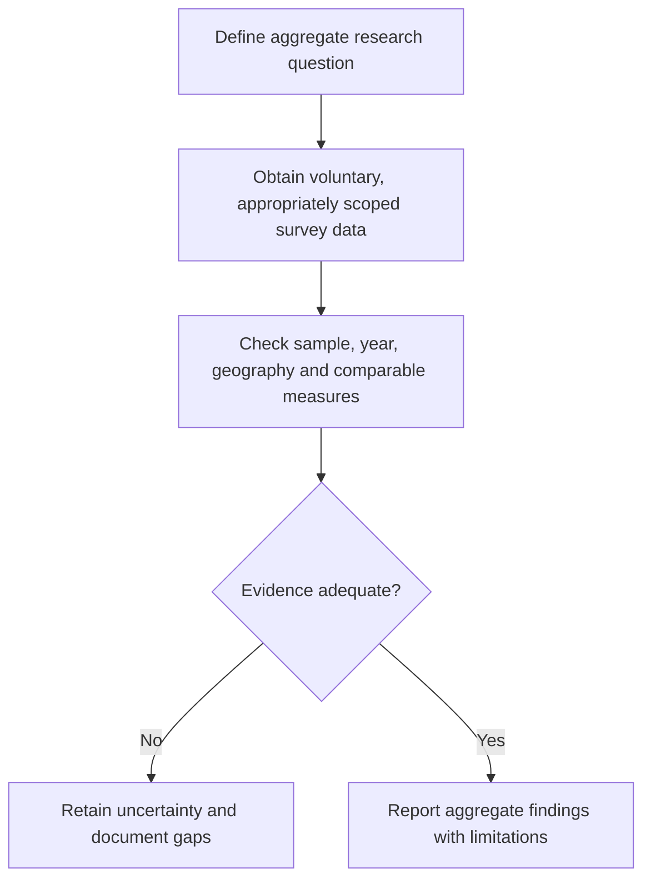

# LGBT Tourism Demographic Research

**Status:** English restructuring of an undated exploratory note. All demographic percentages, spending comparisons and behavioral patterns below are unverified source claims.

## Scope and limits

The source compares selected age bands, single versus partnered households and regional socioeconomic contexts. Although it uses “LGBT,” its detailed profiles cover single lesbians and gay men; it does not separately describe bisexual or transgender travelers. No sampling method, survey year, income controls or travel dataset is supplied. The table preserves the draft's hypotheses without establishing population-wide traits or individual preferences.

## Age and household profiles reported by the source

| Source group | Age band | Source-described preferences and economic claims |
| --- | --- | --- |
| Single lesbians | 18–29 | Higher sexual-diversity self-identification; community experiences, festivals, ecotourism, nightlife and culturally diverse destinations |
| Single lesbians | 30–49 | Greater financial independence and professional stability; nature, relaxation, wellness and lesbian-friendly or queer-welcoming retreats |
| Single lesbians | 50+ | Less frequent travel than older men, but higher spending per stay; safety and cultural tranquility |
| Gay men | 18–34 | Entertainment, large events and international festivals; group or solo travel, described as supported by disposable income and fewer family constraints |
| Gay men | 35–54 | Claimed largest economic impact within LGBT tourism; higher disposable income, high-income single households or DINK (double income, no kids) households; stays claimed longer than conventional-tourism averages |
| Gay men | 55+ | Cultural, luxury, gastronomic and specialized cruise travel; destination civil-rights protections described as a major selection criterion |

The draft's DINK association is not a definition of gay households. Orientation does not establish income, parenthood, partnership status, spending capacity or travel preferences. “Highest impact,” “higher spending” and “longer stays” have no specified comparator or denominator. Age bands differ between groups and should not be treated as directly comparable cohorts.

## Regional comparison retained from the draft

| Region and named countries | Claimed open self-identification | Claimed inbound/outbound role | Source characterization of single travelers |
| --- | --- | --- | --- |
| Western Europe: Spain, France, Netherlands | High; **5–7% of adults** | Leading receiving and sending markets | Frequent city breaks and cultural/Pride events |
| North America: United States, Canada | High; **5–8% of adults** | High per-capita expenditure | Leisure, sun-and-beach holidays and specialized cruises |
| Latin America: Brazil, Argentina, Mexico, Colombia | Medium to high in urban areas; no percentage | Growing receiving hubs: Buenos Aires, Mexico City and Rio | Entertainment-focused travel concentrated among ages **18–35** |
| Asia and Eastern Europe | Low to medium; **1–3%**, with no explicit population denominator in this row | Selective outbound markets | International destinations perceived as offering greater social freedom and inclusion |

These are broad source labels, not verified rankings, prevalence estimates or current destination-safety guidance. Open self-identification and willingness to disclose are not equivalent to underlying prevalence, and adult-population percentages are not tourism market shares. Large regions cannot be treated as uniform legal or cultural environments.

## Evidence and respectful product use

An aggregate study would need dated, voluntary self-report surveys; defined geography and population; comparable age bands; household and income variables; and consistent trip, night and expenditure measures. Report sample sizes, uncertainty and missing groups. Define whether flows concern residence, nationality, visitors or trips.

This workflow and the measurement distinctions are editorial additions. Inclusive service design can ask travelers directly about accessibility, activities, budget and welcome preferences. These notes do not support inferring an individual's orientation from professional profiles, age, spending or destination choices.

## Provenance and consolidation

Migration entry **52** in the [consolidated register](../../ANNEX-DOCS-CONSOLIDATED.md#10-complete-migration-and-translation-register) records the source preserved in Git history at commit `bb8369643328864f471f4fc1308622d1348f38f7`. The six age profiles, four region rows, country/city names and numerical ranges are retained. No external demographic or market validation was performed.

- [Inbound origin-market research](inbound-origin-market-research.md)
- [Requirements and consent](../../product/requirements-and-consent.md)
- [Research index](../README.md)
- [Documentation index](../../README.md)
