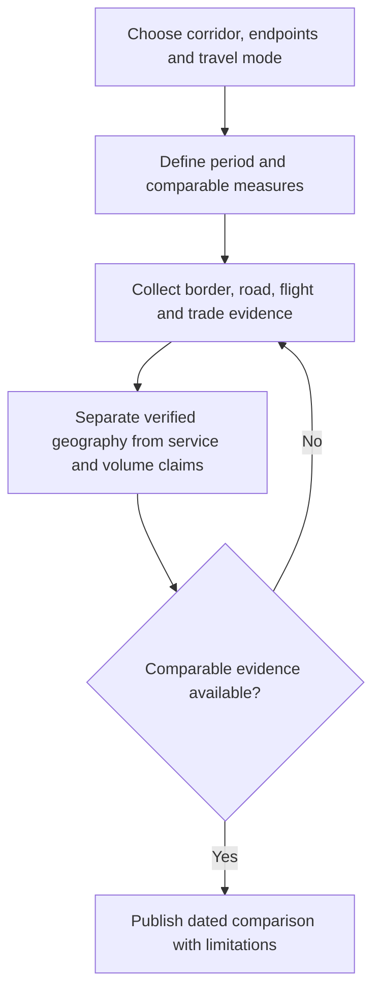

# Peru–Brazil and Brazil–Paraguay Integration Corridors

**Editorial review:** 6 October 2026 (Lima).  
**Status:** translated and consolidated exploratory comparison; selected geographic references checked.

The source contrasts two geographic, logistical and economic settings: transcontinental infrastructure and natural barriers along the Peru–Brazil axis, and intensive cross-border exchange along the Brazil–Paraguay axis. These are the draft's qualitative characterizations, not a measured ranking of South American corridors.

## Translated comparison

| Criterion | Peru–Brazil axis: source description | Brazil–Paraguay axis: source description |
| --- | --- | --- |
| Principal crossing in the draft | Iñapari, Peru – Assis Brasil, Brazil | Foz do Iguaçu, Brazil – Ciudad del Este, Paraguay |
| Land infrastructure | Southern Interoceanic Highway (IIRSA Sur); complex Andean and Amazonian terrain | International Friendship Bridge and Integration Bridge; paved, high-capacity roads |
| Road traffic | Low to moderate, attributed to long distances | Very high, associated with commerce, heavy freight and daily local crossings |
| Air connectivity | Claimed established nonstop links from Lima to São Paulo, Rio de Janeiro and Brasília | Claimed short-haul nonstop links from Asunción to São Paulo, Curitiba and Foz do Iguaçu |
| Economic profile | Pacific–Atlantic connectivity, mining, agribusiness and tourism | Cross-border commerce, maquila manufacturing, soybean/beef exports and Itaipú energy |

The table preserves all five source criteria and all six named air-city pairs. Traffic intensity, infrastructure capacity, economic importance and the stated explanations have no dated measurements in the draft. “Principal,” “established,” “high-capacity” and “very high” are source labels rather than findings of this migration.

## Geographic clarification

### Peru–Brazil

Peru's [Ministry of Foreign Affairs](https://www.gob.pe/institucion/rree/noticias/1426291-peru-y-brasil-consolidan-integracion-binacional-con-reunion-de-comite-de-frontera-sur) identifies the Iñapari–Assis Brasil crossing in its bilateral infrastructure discussions. A [Peruvian migration-authority report](https://www.gob.pe/institucion/migraciones/noticias/894853-superintendente-de-migraciones-visito-los-puestos-de-control-fronterizos-de-inapari-y-san-lorenzo) links Iñapari with the Southern Interoceanic Highway. These references support the geographic association; they do not establish current journey times, traffic totals or a through-service to Paraguay.

### Brazil–Paraguay

The two bridges must not be assigned to the same Paraguayan endpoint:

- **Friendship Bridge:** Foz do Iguaçu–Ciudad del Este, as identified in Brazil's [Ministry of Transport account](https://www.gov.br/transportes/pt-br/assuntos/noticias/ultimas-noticias/presidente-e-ministro-lancam-construcao-da-ponte-de-integracao-brasil-paraguai-no-parana/).
- **Integration Bridge:** Foz do Iguaçu–Presidente Franco, as identified by [Brazil's transport regulator, ANTT](https://www.gov.br/antt/pt-br/assuntos/ultimas-noticias/antt-habilita-ponte-da-integracao-jaime-lerner-e-abre-novo-caminho-para-o-transporte-internacional-de-cargas-e-passageiros-entre-brasil-e-paraguai).

The second bridge adds a distinct crossing to the regional comparison. Its authorization does not, by itself, verify current operating hours, permitted traffic categories or an available passenger service for a particular date.

## Air-service verification

The draft provides no airline, airport code, timetable date or service frequency. Retain its six pairs as research candidates:

| Origin | Brazilian destinations named in the draft | Evidence needed |
| --- | --- | --- |
| Lima | São Paulo; Rio de Janeiro; Brasília | Operating airline, exact airports, dated nonstop schedule, frequency and seasonal limits |
| Asunción | São Paulo; Curitiba; Foz do Iguaçu | The same checks, distinguishing nonstop service from a connecting itinerary |

No current service availability is confirmed here. A city pair offered through connections is not evidence of a nonstop route. Do not publish the draft's “established” or “short-haul direct” labels as a current flight inventory.

## Comparable evidence and project use

Separate corridor-level analysis from passenger itineraries. A future comparison should record:

- the crossing and road segments covered;
- the observation period and source authority;
- people, vehicle counts, freight tonnage and trade value as separate measures;
- domestic versus international movements and local versus long-distance traffic;
- road capacity separately from measured utilization; and
- costs and elapsed time for a specified origin, destination, mode and date.

Mining, agribusiness, tourism, maquila, soybean/beef exports and energy remain the source's economic themes. Measuring their relative contribution requires trade and sector data; the source does not supply it.

## Consolidation and provenance

This corridor comparison complements [Peru–Paraguay air and overland routes](peru-paraguay-air-and-overland-routes.md); it does not establish a continuous Peru–Brazil–Paraguay transport service. It also relates to [Uruguay, Paraguay and Bolivia tourism flows](uruguay-paraguay-bolivia-tourism-flows.md), whose aggregate tourism measures should remain distinct from freight and border traffic.

The Spanish source is preserved in Git history and mapped in [migration entry 49](../../ANNEX-DOCS-CONSOLIDATED.md#10-complete-migration-and-translation-register). Editorial changes restore the flattened table, translate its content, clarify bridge endpoints and make unsupported comparisons explicit. No transport schedules, traffic datasets or economic rankings were validated.

- [Research index](../README.md)
- [Documentation index](../../README.md)
- [Consolidated annex](../../ANNEX-DOCS-CONSOLIDATED.md#18-perubrazil-and-brazilparaguay-integration-corridors)
