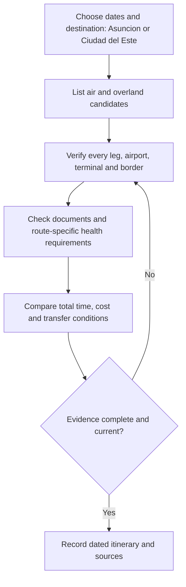

# Peru–Paraguay Air and Overland Route Research

**Editorial review:** 6 October 2026 (Lima).  
**Status:** translated and consolidated route research, with selected official-source checks.

This note preserves the additional Spanish draft's air and bus alternatives, operator names and timing estimates. Carrier availability, fares, through-ticketing and journey times have not been verified. They are research inputs rather than bookable itineraries. The original is retained in Git history and mapped in [migration entry 48](../../ANNEX-DOCS-CONSOLIDATED.md#10-complete-migration-and-translation-register).

## Air alternatives

| Alternative | Route described in the source | Source operator and timing claims | Editorial treatment |
| --- | --- | --- | --- |
| Nonstop | Lima (LIM) → Asunción (ASU) | LATAM; approximately 3 h 35 min–4 h; described as the fastest and most comfortable choice | Check dated schedules and total door-to-door time before comparison; regular nonstop operation is not verified here |
| Via Buenos Aires | LIM → Buenos Aires (AEP/EZE) → ASU | Aerolíneas Argentinas or JetSMART; the source gives 7–12 h for connecting options collectively | Verify each leg, ticket protection and whether an AEP/EZE airport transfer is required |
| Via São Paulo | LIM → São Paulo (GRU) → ASU | LATAM; included in the source's 7–12 h connecting estimate | Confirm the complete itinerary, baggage handling and connection time |
| Via Santiago | LIM → Santiago (SCL) → ASU | LATAM or SKY Airline; included in the same 7–12 h estimate | An airline named in the draft is not evidence that it operates both legs |
| Iguazú region plus land transfer | LIM → Foz do Iguaçu (IGU, Brazil) or Puerto Iguazú (IGR, Argentina), then Ciudad del Este, Paraguay | Suggested for an Iguazú Falls stop; no duration supplied | Flights may require connections. Arrival airport determines the border crossings; Ciudad del Este is not Asunción |

### Iguazú geography correction

The draft treated both arrival airports as if they led directly to the Friendship Bridge. For the bridge-based itinerary, the routes must be distinguished:

- **From IGU:** transfer to Foz do Iguaçu, then cross the Friendship Bridge to Ciudad del Este.
- **From IGR via Brazil:** transfer from Puerto Iguazú across the Tancredo Neves Bridge to Foz do Iguaçu, then across the Friendship Bridge to Ciudad del Este. This involves Argentina, Brazil and Paraguay.

Brazil's [Foz do Iguaçu customs office](https://www.gov.br/receitafederal/pt-br/assuntos/aduana-e-comercio-exterior/atendimento/alfandegas-da-receita-federal-atendimento-especifico-ou-especializado/rf09/alf-foz/alfandega) identifies the two bridges and their respective borders. This geographic check does not verify transport services or border opening hours. A further domestic leg is needed if the final destination is Asunción.

## Overland alternatives

The draft frames bus travel as a lower-cost or backpacking option and asserts that there is no single direct Peru–Asunción bus. Neither the cost advantage nor the absence of a direct operator is established here; compare dated quotes, accommodation, meals, transfers and border delays.

| Corridor | Source route sequence | Source timing and operator claims | Remaining verification |
| --- | --- | --- | --- |
| Via Bolivia | Lima → Desaguadero → La Paz/El Alto → Santa Cruz de la Sierra → Cañada Oruro / Mayor Infante Rivarola → Asunción, through the Paraguayan Chaco | 3–4 days including transfers and immigration; Stel Turismo or Trans Arenal named for the international stage; described as the shortest land route | Verify operators, each terminal and border segment, departure days, road conditions and actual total time; the shortest-route claim is unverified |
| Via northern Argentina | Southern Peru → northern Chile → Jama → Jujuy/Salta → Clorinda / Puerto Falcón → Asunción | Approximately 2 days 20 h of continuous travel; the source describes a direct onward bus from Jujuy/Salta | Verify separate services, connection waits and border formalities; the timing is not a confirmed end-to-end schedule |

**Jama correction:** the original omitted the Chilean segment. [Argentina's official Jama crossing record](https://www.argentina.gob.ar/seguridad/pasosinternacionales/detalle/ruta/19/Jama) identifies Jama as a Chile–Argentina crossing between the San Pedro de Atacama area and Jujuy. It is not a Peru–Argentina border crossing. The corrected sequence makes that transit country explicit without asserting a verified bus itinerary.

The source's 3–4-day Bolivia estimate and 2-day-20-hour Argentina estimate use different assumptions about stops. They cannot support a shortest or fastest ranking without consistent measurement.

## Entry documentation and health requirements

### Documents and permitted stay

The source states that Peruvian tourists may enter with a valid DNI or passport, without a visa, for up to 90 days. Paraguay's [migration requirements](https://migraciones.gov.py/entrada-y-salida-del-pais/requerimientos-migratorios-de-ingreso-y-salida-del-paraguay/) list valid national identity documents for eligible MERCOSUR and associated-country citizens, explicitly including Peru, and a maximum temporary stay of up to 90 days. The actual authorized period is recorded on admission. Its [visa table](https://migraciones.gov.py/informacion-sobre-visas/) lists Peru as not requiring a tourist visa.

These checks concern Paraguay. Confirm requirements for every transit country and retain the entry record for departure; do not assume that a Paraguayan entry rule resolves an airline or third-country requirement.

### Yellow fever: qualify the source's blanket statement

The draft says an international yellow-fever certificate is indispensable and vaccination must precede travel by at least ten days. The requirement must be tied to the itinerary and applicable health rules.

The Paraguayan Ministry of Health's [7 January 2026 notice](https://www.mspbs.gov.py/portal/34642/certificado-internacional-de-vacunacion-valido-en-formato-fisico-y-electronico-para-viajar-a-zonas-de-riesgo.html) specifies travelers aged 1–59 arriving from listed risk areas, accepts physical or digital certificates, and states a minimum ten-day vaccination lead time. Its Peru list names Huánuco, Junín, Madre de Dios, San Martín and Ucayali; it also lists Santa Cruz in Bolivia and São Paulo among Brazilian risk areas.

The notice explicitly says the geographic list can change. It does not support a universal requirement based solely on Peruvian nationality or a departure from Lima. Confirm the current rule for recent travel, transit and any individual exemption with the competent authority before departure.

## Route comparison and evidence workflow

For each candidate, record travel date, all countries and crossings, operating carrier for each leg, ticket conditions, total elapsed time, transfer costs, entry requirements, and the source/check date. Keep flight time separate from door-to-door time and continuous driving estimates separate from scheduled multi-day bus travel.

## Consolidation and related research

This is a route-level companion to [Uruguay, Paraguay and Bolivia tourism flows](uruguay-paraguay-bolivia-tourism-flows.md), which covers aggregate inbound/outbound research. It does not turn aggregate tourism estimates into transport schedules.

- [Peru–Brazil and Brazil–Paraguay integration corridors](peru-brazil-paraguay-integration-corridors.md)
- [Inbound origin-market research](inbound-origin-market-research.md)
- [Research index](../README.md)
- [Documentation index](../../README.md)
- [Consolidated annex](../../ANNEX-DOCS-CONSOLIDATED.md#17-peruparaguay-air-and-overland-routes)

The migration preserves all route groups, named operators, timing estimates and document/health topics from the draft. Editorial additions correct the two geographic ambiguities, distinguish unverified service claims, and cite the limited official checks performed. No fare search, booking or transport-service validation was performed.
