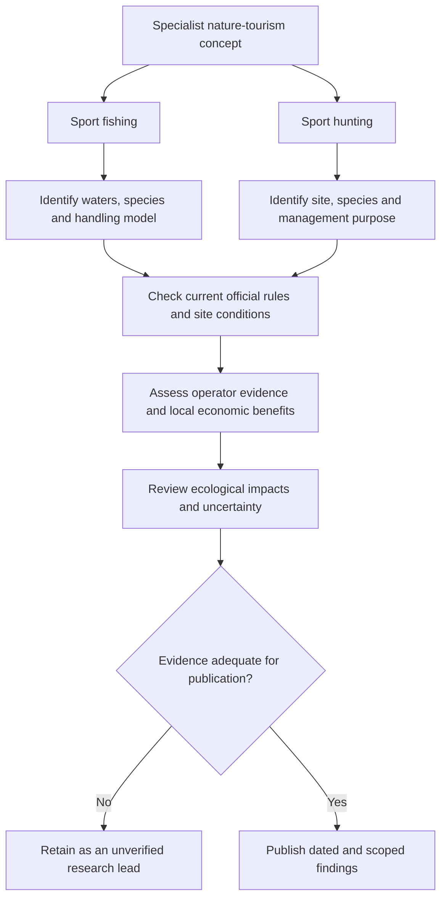

# Sport Fishing and Hunting Tourism in Latin America

**Status:** translated and consolidated exploratory research. Destination lists, species associations, seasons, economic estimates and regulatory descriptions are inherited from three source drafts and are not independently verified by this migration.

## 1. Market positioning and economic model

The drafts describe fishing and hunting as specialist segments of high-end nature and adventure tourism, aimed at international anglers and hunters. They characterize Latin America as a prominent destination; no comparative market dataset is provided.

### Spending hypothesis

One draft states that international anglers or hunters spend **three to five times more per day** than conventional leisure tourists. Another describes higher spending per stay. These are different measures, and neither claim has a cited sample, period, destination or spending definition. Retain the multiplier as an **unverified source hypothesis**, not a forecast or a validated market statistic.

### Lodges and outfitters

The proposed commercial model consists of specialist operators offering all-inclusive packages with rural accommodation, professional guides, licenses, local transport and premium food services. The drafts associate remote operations with employment for guides, local terrain specialists, boat operators, transport providers and hospitality staff.

These descriptions are business-model hypotheses rather than evidence that every operator includes those services or that spending necessarily reaches local communities. A project assessment would need supplier quotations, local procurement data, employment conditions and a transparent allocation of revenues and costs.

## 2. Sport fishing: source destination comparison

The source distinguishes inland freshwater fishing, including fly fishing, from offshore and saltwater fishing. Common names below preserve the source's intended categories; they do not establish species identification or distribution at every listed site.

| Destination group | Main activity in the draft | Species named in the draft | Tourism character and timing claimed by the draft |
| --- | --- | --- | --- |
| Patagonia, Argentina and Chile | Fly fishing | Brown trout, rainbow trout and “salmón enano” (source term; taxonomic identity unresolved) | Premium river lodges and catch-and-release; Chimehuin and Futaleufú cited; November–April claimed |
| Cabo San Lucas and Sea of Cortez, Mexico | Offshore/deep-sea fishing | Blue, black and striped marlin; sailfish; mahi-mahi; tuna | International tournaments, including Bisbee's; year-round activity with an autumn peak claimed |
| Quepos and Guanacaste, Costa Rica | Pacific fishing | Sailfish, roosterfish and marlin | Conservation-oriented luxury tourism; Marina Pez Vela and Los Sueños cited as examples |
| Pantanal and Amazon basin, with Brazil, Colombia and Peru grouped in the source | Inland river fishing | Peacock bass, freshwater dorado and surubí catfish | Adventure expeditions and boat-based trips; strong fighting fish emphasized |

### Geographic and seasonal precision

The source groups broad regions, countries, rivers, marinas and species. These are research leads, not a verified itinerary. In particular, the table does not establish that every species occurs throughout both the Pantanal and Amazon basin, or that every marina belongs to each named destination.

The Patagonia date range and Mexican peak-season claim must not be treated as current legal opening dates or guaranteed fishing conditions. Confirm individual waters, scientific species names, locality, year and management area before using this material in a destination guide.

## 3. Sport hunting: source destination comparison

The draft distinguishes bird/small-game hunting from large-game hunting and emphasizes land access and local wildlife-management arrangements.

| Destination group | Activity described | Species named in the draft | Operating model and positioning claimed |
| --- | --- | --- | --- |
| Córdoba and La Pampa, Argentina | Bird/small-game and large-game hunting | Doves, partridges, ducks; red deer and wild boar | Estancias and high-volume shooting; Córdoba described promotionally as a world dove-hunting capital |
| Coastal/littoral and inland Uruguay | Small game and wildlife management | Axis deer, wild boar, pigeons/doves and partridges | Private hunting grounds, accessible logistics and management of introduced species |
| Yucatán and Sonora, Mexico | Desert large game and birds | Mule deer, white-tailed deer and wild turkey | Ranch-based wildlife management and high-value regulated hunting, associated in the source with UMA arrangements |

The original descriptions of Argentina as an “absolute leader,” bird abundance as “inexhaustible,” and Uruguay's model as “flexible” are unsupported promotional labels. They are not evidence of population health, available quotas or permission to hunt.

The Mexican draft expands UMA as “Unidades de Manejo Ambiental.” This migration preserves the acronym without adopting that expansion as an authoritative legal definition. The applicable category, registration and authorized activities require confirmation from the relevant official documentation.

Country-level groupings do not establish local species availability or current authorization. No hunting season, quota, firearms authorization or operator approval is certified by this note.

## 4. Fishing and hunting: comparison of source assumptions

This section replaces the plaintext comparison box with structured material.

| Dimension | Fishing portrayal in the drafts | Hunting portrayal in the drafts | Editorial treatment |
| --- | --- | --- | --- |
| Operating orientation | Catch-and-release and aquatic conservation | Introduced-species control, population management or private hunting grounds | Treat as proposed models, not universal descriptions |
| Permits | Simple licenses, described inconsistently as tourism-led or environment-led | Complex coordination involving wildlife and firearms authorities | Identify the actual jurisdiction and responsible authorities for each activity |
| Equipment and travel | Limited customs burden in one draft; specialized-equipment authorization in another | Temporary firearm entry or lawful local rental mentioned | Neither passage establishes current requirements; no import or rental procedure is supplied |
| Social acceptance | High, associated with ecotourism | Contested and subject to environmental scrutiny | No public-opinion evidence supplied |
| Local economy | Lodges, guides, boat operators and hospitality | Lodges, guides, transport and hospitality | Measure actual local benefits rather than infer them from the package label |

The diagram organizes research and review. It is not an authorization workflow or a field-operating guide.

## 5. Conservation and sustainability claims

### Fishing

The drafts associate catch-and-release, barbless hooks and license revenue with aquatic conservation. They also assert mandatory release and a transition to “100% zero-impact” practices.

Those absolute claims are not established by the supplied material. Catch-and-release should not be labeled zero-impact on this evidence. A proper assessment would examine species-specific survival, handling, water conditions, effort and habitat effects, and separately establish whether release is required in the relevant fishery.

The claim that license fees fund biological studies and enforcement also needs program-specific budget evidence.

### Hunting

The drafts frame regulated hunting primarily as management of introduced species or agricultural overpopulation, citing red deer, wild boar and doves. They state that permit revenue supports habitat conservation and anti-poaching work, and describe the sector as almost exclusively focused on non-native species or overpopulation.

These are unsupported generalizations. The destination table itself contains a broader species list, so it cannot substantiate that exclusive characterization. Site-specific population evidence, management objectives, authorized activities and documented revenue allocation would be needed to assess conservation outcomes.

## 6. Evidence needed before operational use

The drafts mention annual quotas, closed seasons, permitted zones, land access, licenses and equipment transport. They provide no dated regulations or official decisions establishing those requirements at the named sites.

For a future research update, record:

1. the exact destination, water body or property and the responsible jurisdiction;
2. scientific species names and the activity being assessed;
3. dated official rules and their geographic and seasonal scope;
4. operator credentials and the precise services included;
5. separately defined daily and trip spending, with sample and comparison group;
6. employment, procurement and conservation outcomes, with evidence and limitations.

This migration supplies no current regulatory advice, booking recommendation or weapons-handling instructions.

## 7. Source-to-section migration map

All three sources are preserved in Git history at commit `742fa92200ba1b7d67bf9f4391989fff7d0944ba`.

| Original TXT | Consolidated coverage |
| --- | --- |
| `docs/El turismo de caza cinegética.txt` | Sections 1, 5 and 6: spending multiplier, lodges/outfitters, rural income, conservation and regulatory claims |
| `docs/América Latina es un referente.txt` | Sections 1 and 2: market positioning and four fishing destination groups |
| `docs/2 Caza Deportiva Cinegetica.txt` | Sections 3–6: three hunting destination groups, comparative plaintext box, logistics, local economy and sustainability assertions |

The English structure, research checks and Mermaid diagram are editorial additions. Repeated claims are consolidated; uncertain claims remain attributable rather than being promoted to verified facts.

Related: [research index](../README.md), [documentation index](../../README.md), [inbound tourism origin-market research](inbound-origin-market-research.md), and [business model and KPIs](../../business/business-model-and-kpis.md).
