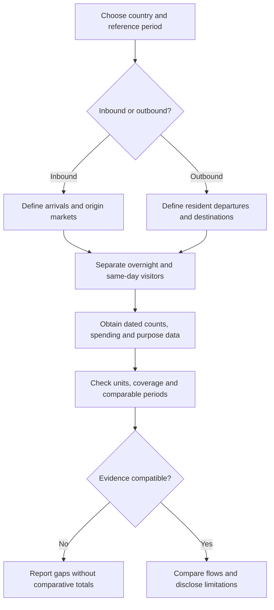

# Tourism Flows in Uruguay, Paraguay and Bolivia

**Status:** English translation and restructuring of an exploratory source. Volumes, market shares, receipts and destination patterns below are inherited claims without a reference year or cited dataset; they are not verified current statistics.

## 1. Scope and terminology

The source compares inbound and outbound travel in three countries and attributes differences to economic scale, transport infrastructure and regional geography. These are explanatory hypotheses, not demonstrated causal findings.

- **Inbound:** travel into the country being analyzed.
- **Outbound:** travel by its residents to other countries.
- **Measurement boundary:** visitor counts, overnight tourists, same-day border visits, spending and migration are different measures. The source does not consistently specify which population its figures cover.

The Bolivia outbound cell in the original table uses the contradictory phrase “turismo receptivo/familiar y comercial.” This version interprets that cell as outbound family and commercial travel because of its column and listed foreign destinations, while explicitly recording the ambiguity.

## 2. General comparison from the source

| Country | Inbound profile claimed | Outbound profile claimed | Economic or operational characterization |
| --- | --- | --- | --- |
| Uruguay | Approximately **3.6 million per year**, mainly from Argentina and Brazil; sun-and-beach trips to Punta del Este and Rocha, plus thermal and urban tourism | High spending per traveler; trips to Argentina, Brazil and the Caribbean, with Argentina linked to exchange-rate differences | Tourism described as a major economic pillar, with foreign-exchange receipts above **US$2 billion** and strong summer seasonality |
| Paraguay | Approximately **1.8 million per year**, described as moderate and growing; regional visitors from Argentina and Brazil for shopping, business and corporate travel | Primarily regional travel to southern Brazilian beaches and Argentine cities during holidays | Cross-border and river connectivity emphasized; less reliance on mass leisure tourism claimed |
| Bolivia | Approximately **1 million per year**; visitors from Europe, North America and South America attracted by cultural heritage and adventure, including Uyuni, Madidi and Titicaca | Family, commercial, health and holiday travel to Peru, Chile and Brazil; wording ambiguity noted above | Landscape and cultural appeal, alongside claimed road, airport and connectivity constraints |

The figures cannot be treated as a same-year comparison. “High,” “growing,” and “less reliant” have no defined benchmark. No GDP share, spending denominator or receipt-accounting definition is supplied.

## 3. Uruguay: exchange-rate-sensitive tourism balance

### Inbound profile

The source attributes approximately **60–70%** of inbound tourism to Argentina, followed by Brazil. It names Punta del Este, Montevideo, Colonia del Sacramento and thermal destinations along the littoral as important attractions.

The percentage is an undated source estimate, not a confidence interval or an established current market share. The relevant denominator could be visitors, tourists, trips or another measure; the draft does not say.

### Outbound profile

The draft links cross-border shopping and service trips to exchange-rate differences with Argentina and describes large fluctuations in departures. It also names Brazil and the Caribbean as outbound destinations.

No exchange-rate series, trip-purpose survey or causal analysis accompanies this explanation. Its direction and magnitude must not be assumed to remain constant over time. Shopping visits should be distinguished from overnight holidays before drawing conclusions about the tourism balance.

## 4. Paraguay: business events and border shopping

### Inbound profile

The draft focuses on Asunción and Ciudad del Este. It highlights business events, congresses and corporate meetings (MICE), shopping tourism, and sport fishing in the Paraguay and Paraná rivers.

These are source-listed segments, not a measured ranking. The note provides no segment shares, visitor expenditure or evidence linking river connectivity to a specific volume of arrivals.

### Outbound profile

The source describes travel to southern Brazil, particularly Florianópolis and Camboriú, and the Argentine Atlantic coast during summer, alongside Argentine urban destinations in the comparison table.

These destination and seasonality claims require dated travel data. The spelling “Camboriú” is retained from the source; a future destination study should resolve the exact municipality or resort intended.

## 5. Bolivia: nature, adventure and cultural travel

### Inbound profile

The source names the Salar de Uyuni, La Paz, Lake Titicaca, Sucre, Potosí and the Jesuit Missions as key destinations, with Madidi appearing in the general comparison. It describes adventure, nature and ancestral-culture circuits and identifies European, North American and South American origin markets.

No relative market sizes or site-visitor data are provided. The claims about infrastructure and connectivity are not dated and should not be interpreted as a current route or access advisory.

### Outbound profile

The draft lists northern Chile, southern Peru and Brazilian beaches for regional leisure travel, plus the United States and Europe for family and educational purposes. Its general table also mentions commerce and health.

The coexistence of these purposes does not establish their proportions. Travel for education, family visits, health or commerce should be classified explicitly rather than automatically counted as leisure holidays or migration.

## 6. Evidence workflow for a comparable update

This diagram is an editorial addition organizing the verification needed before operational use.

A future evidence table should record:

| Field | Required clarification |
| --- | --- |
| Period | Calendar year, season or month; collection and publication dates |
| Statistical unit | Person, trip, arrival, departure, overnight stay or same-day visit |
| Residence and nationality | Specify which attribute defines origin or destination groups |
| Purpose | Leisure, family visits, business, education, health or shopping |
| Spending | Currency, price year, daily/per-trip basis and covered expenditure |
| Coverage | Borders, airports, accommodation surveys or other collection channels |
| Uncertainty | Sampling error, estimation assumptions, revisions and missing observations |

Tourism receipts should not be equated with GDP contribution. A tourism balance needs compatible inbound receipts and outbound expenditure; neither an arrival count nor a qualitative exchange-rate explanation establishes it. Avoid adding the three country figures into a regional total until period, definition and coverage are reconciled.

## 7. Source and related documents

Translated from `docs/El análisis del flujo.txt` at commit `1dd1b869862ef13582c180a46e706dd3c7d4719d`. The original remains in Git history.

The country table, destinations, economic themes, figures and detailed country sections preserve the source. Terminology, the Bolivia ambiguity note, evidence requirements and the Mermaid workflow are editorial additions. No quantitative or policy claim was independently validated during this migration.

- [Research index](../README.md)
- [Documentation index](../../README.md)
- [Inbound tourism origin-market research](inbound-origin-market-research.md)
- [Colombian emigration destinations](colombian-emigration-destinations.md) — a separate migration research topic
- [Sport fishing and hunting tourism](sport-fishing-and-hunting-tourism.md)
