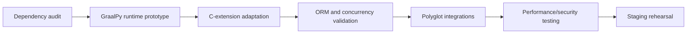

# Implementation and Investment Roadmap

## Delivery phases

| Phase | Deliverable | Exit criterion |
| --- | --- | --- |
| 0. Governance and legal inputs | Source register, data map, threat model and draft partnership terms | Qualified review of pilot jurisdictions and accountable service owners |
| 1. Local-first MVP | Modular API, domain storage, retrieval and manual concierge workflows | Synthetic-case checks for consent, authorization and domain isolation pass |
| 2. Controlled pilot | One destination with contracted accommodation, legal-service and support providers | Completed pilot cases and incident review |
| 3. Automated integrations | Approved APIs, webhooks and document workflows | Load, idempotency, recovery and audit checks pass |
| 4. Expansion | Additional markets and operating partners | Sustainable unit economics, capacity and privacy controls demonstrated |

## Architecture migration track

The Odoo/Flectra-to-GraalPy work should proceed as a separate engineering track with explicit compatibility gates rather than as a prerequisite for every product feature.

## Budgeting policy

Earlier README figures for staffing, AI subscriptions, cloud resources and contingency are planning hypotheses. A release-ready budget should be rebuilt from current supplier quotes and engineering estimates.

Budget inputs should include:

- selected ERP release and dependency inventory;
- team composition and current rates;
- infrastructure and benchmark environment;
- legal/compliance review;
- observability and security tooling;
- migration rollback requirements;
- provider integration costs; and
- contingency tied to identified technical risks.

## Infrastructure selection

Kafka, Kubernetes, Native Image and other infrastructure should be adopted only when measured requirements justify their operational cost. The default architecture should remain as simple as possible while satisfying reliability, privacy and throughput requirements.

## Related documents

- [Odoo/Flectra to GraalPy migration](../architecture/odoo-graalpy-migration.md)
- [Platform integration and AI architecture](../architecture/platform-integration-ai.md)
- [Business model and KPIs](../business/business-model-and-kpis.md)
