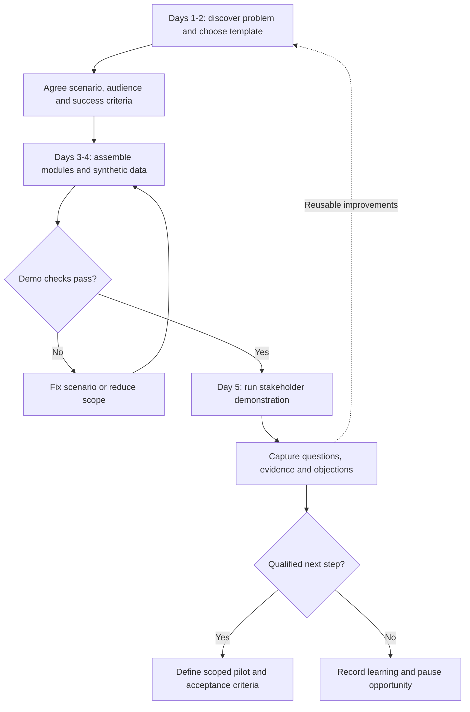
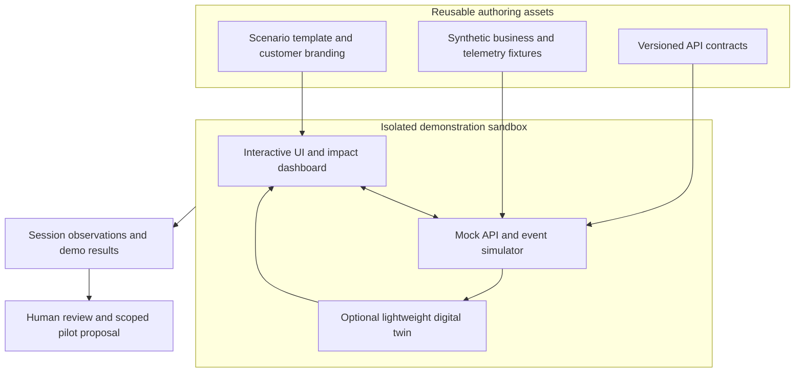

# Lean Presales Demonstrator Plan

[Documentation index](../README.md) · [Strategy index](README.md)

## Purpose and status

This proposal describes reusable, low-cost demonstrations for technology projects
in Latin America, Asia-Pacific, Eastern Europe, Africa and the Middle East.
These regions are planning contexts, not a single homogeneous market. Adapt each
demo to the customer's problem, operating environment and delivery constraints.

The aim is to communicate value to end users, IT managers and sales teams using
modular prototypes, synthetic data, simulated integrations and lightweight digital
twins. Time, conversion and savings figures below are planning targets rather than
measured results. This document does not establish an implemented demo platform.

## Contents

- [Stakeholder Value Matrix](#stakeholder-value-matrix)
- [Delivery Workflow](#delivery-workflow)
- [Demonstrator Architecture](#demonstrator-architecture)
- [Session Agenda](#session-agenda)
- [Cost Controls](#cost-controls)
- [Audience Deliverables](#audience-deliverables)
- [Evaluation and Next Step](#evaluation-and-next-step)

## Stakeholder Value Matrix

| Audience | Question to resolve | Demonstration evidence | Proposed measure |
| --- | --- | --- | --- |
| End user | Will this simplify the workflow? | Navigable interface, clear task flow and operational dashboard | Task completion, usability feedback and estimated time saved |
| IT manager | Can it integrate and operate reliably? | Architecture, API contracts, simulated events and deployment boundaries | Documented integration feasibility, risks and prototype limitations |
| Sales executive | Can the value be explained and qualified? | Five-minute story, customer-specific modules and objection notes | Qualified next steps, proposal conversion and elapsed sales-cycle time |

Perceived value is not proof of realized ROI. Baseline and pilot measurements are
needed before presenting a savings estimate as an achieved result.

## Delivery Workflow

The inherited five-day outline is an illustrative assembly cycle for an existing
component library. It is not a commitment to build a production system in five days.

| Phase | Work | Output |
| --- | --- | --- |
| Discovery and packaging, days 1–2 | Select a reusable sandbox; parameterize branding and business variables; draft an industry-specific story with reviewed AI assistance | Approved scenario, sample data and script |
| Modular assembly, days 3–4 | Assemble an interactive UI; simulate telemetry and backend responses; prepare technical/commercial objection notes | Navigable prototype, labeled mock APIs and presenter notes |
| Demonstration, day 5 | Present the business flow, integration boundaries and cost assumptions | Stakeholder feedback and an agreed next action |
| Feedback and iteration | Review authorized, minimal prototype usage data and session notes | Revised scenario and reusable components |

Candidate authoring tools from the draft include Figma/Framer prototypes and
JavaFX/React interfaces. Postman, Swagger/OpenAPI and WireMock illustrate contract
and mock-service tooling. Their availability, terms and fit require evaluation.
Docker is a sandbox candidate; Kubernetes should be considered only when a demo
actually needs orchestration.

## Demonstrator Architecture

Label simulated latency, events and data explicitly. A successful mock response
does not demonstrate production connectivity, security compliance or throughput.
Any later connection to a real backend needs a separate integration decision.

## Session Agenda

The proposed session lasts 15–20 minutes:

| Segment | Time | Content |
| --- | --- | --- |
| Problem | 2 minutes | Customer workflow, baseline and infrastructure constraints |
| Visual solution | 5 minutes | One end-to-end user task |
| Integration view | 5 minutes | Architecture, API boundaries and security questions |
| Economics | 3 minutes | Explicit subscription/licensing, hosting and deployment assumptions |
| Discussion | Up to 5 minutes | Objections, evidence gaps and next step |

A separate five-minute sales version can summarize problem, workflow, evidence,
limitations and the proposed pilot. It should not imply that mock capabilities are
already implemented.

## Cost Controls

- Use software simulation or a lightweight 3D twin when hardware is unnecessary
  for the question being demonstrated.
- Reuse widgets, charts, connectors and fixtures; the draft's “under 48 hours”
  assembly objective applies only to suitably scoped reuse and needs measurement.
- Use temporary environments with a named owner, spending cap and expiry policy.
  Free tiers or serverless hosting are possibilities, not guaranteed savings.
- Prefer suspendable environments and preserve approved evidence before cleanup.
- Track engineering time, hosting, licenses, support and preparation together.

## Audience Deliverables

| Audience | Package |
| --- | --- |
| End user | Synthetic-data prototype and a before/after workflow value matrix |
| IT manager | High-level architecture, requirements, API/data contracts and a list of regional deployment/security questions for review |
| Sales executive | Five-slide pitch, five-minute script, objection notes and a transparent TCO/ROI worksheet |

The worksheet should separate development effort, hosting, maintenance, integration
and support costs. Compare options over the same period and workload; identify
which values are quotes, estimates or measured pilot results.

## Evaluation and Next Step

Record the scenario version, audience, task outcomes, objections, cost assumptions
and follow-up owner. Obtain agreement before collecting identifiable telemetry.
Promote reusable assets only after review and define a pilot independently of the
presales mockup.

Related planning: [portfolio prioritization and delivery](portfolio-prioritization-and-delivery-plan.md)
and [business metrics](../business/business-model-and-kpis.md).

Source mapping is recorded in the [migration register](../ANNEX-DOCS-CONSOLIDATED.md#10-complete-migration-and-translation-register).
