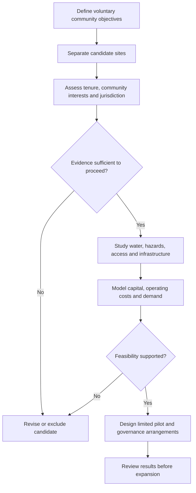

# Modern Cooperative Settlement: Exploratory Evaluation

**Status:** structured English research note adapted from an exploratory source. Historical interpretations, geographic advantages and feasibility ratings below are attributed to that source and have not been independently validated in this migration.

## 1. Scope and historical analogy

The source examines a modern pioneer settlement model inspired by Joseph Smith and Brigham Young. It invokes nineteenth-century migration associated with Deseret and the Great Salt Lake Basin as an analogy for coordinated resource planning, agricultural independence, rapid community building and cultural/governance cohesion.

This analogy is not a complete historical assessment or a justification for territorial displacement. Here, "settlement" means a proposed voluntary community whose site, governance and relationship with existing residents would need independent evaluation.

The source announces four pillars but develops three operational groups. The table preserves those three and makes its separately discussed social-cohesion theme explicit as the fourth.

## 2. Organizational framework

| Theme | Historical examples cited by the source | Proposed contemporary adaptation |
| --- | --- | --- |
| Coordinated land and resources | Plat of the City of Zion grid; collectively managed water rights | Modular urban design, smart grids, shared desalination or water collection, and land trusts |
| Local production and external trade | Agriculture followed by trade along transit corridors, including supplies for California-bound travelers | Hydroponics and precision agriculture, combined with specialized crops, proposed carbon-credit income or digital-service exports |
| Pooled capital and cooperative labor | Perpetual Emigrating Fund, tithing and ZCMI cooperative stores | Cooperative venture funding, pooled infrastructure investment and possible DAO-based asset administration |
| Social cohesion and governance | Shared cultural and organizational identity | Voluntary mission alignment, conflict resolution and transparent shared-equity arrangements |

These are source analogies and design options. The text does not establish the performance of any historical institution or the suitability of a DAO, land trust or carbon-credit model for a particular jurisdiction.

## 3. Candidate-region comparison

The source groups several distinct geographies together. They remain visible below for traceability, but each would require a separate site study.

| Candidate group | Advantages proposed in the source | Dependencies and unresolved questions | Original qualitative rating |
| --- | --- | --- | --- |
| Ceja de Selva / Paraná Plateau, South America | Fertility, freshwater and potential production of soy, timber, coffee or fruit; inland trade opportunities | The source references the Paraná–Paraguay waterway, MERCOSUR and export markets such as China and the EU. These references must not be generalized to all Ceja de Selva sites. Land access, ecosystems, existing communities and actual transport routes remain unassessed. | High for conventional land-based settlement |
| Arequipa valleys and Peruvian high desert | Climate predictability, irrigated agriculture and Pacific-port access; possible links to mineral trade corridors | The source cites Majes-Siguas, Matarani, Chancay, CPTPP and APEC. Their relevance, available capacity and actual site connections are not demonstrated. Irrigation or desalination would require substantial upfront assessment and capital. | Medium–high |
| Floating architecture off Ica, Central America or the Philippines | Spatial flexibility and access to maritime routes | High construction and maintenance costs, imported-material dependence, Pacific swell or typhoon exposure, and unresolved maritime jurisdiction. Each coastal location has a distinct hazard and logistics profile. | Low–medium |

The ratings are inherited opinions, not calculated scores, investment advice or a recommendation to acquire land. The source supplies no comparable cost model, water balance, hazard study or demand assessment.

### Claims requiring separate verification

The original text presents private land acquisition as straightforward and associates floating development or special economic zones with avoiding sovereignty disputes. This migration retains those topics as **unresolved diligence questions**, rather than verified conclusions.

Before further design, establish a documented basis for land or maritime tenure, host-jurisdiction requirements, existing community interests, environmental constraints, infrastructure access and governance options. Charter-city status, special economic zones and land trusts are source proposals, not approvals or established pathways for this project.

## 4. Challenges and proposed mitigations

| Dimension | Source concern | Proposed response to evaluate |
| --- | --- | --- |
| Governance and jurisdiction | Conflict with host authorities or regulatory intervention | Examine jurisdiction-compatible structures; assess the source's charter-city, special-economic-zone or private-land-trust suggestions individually |
| Economic viability | Capital expenditure before agricultural self-sufficiency | Explore a mixed economy combining agriculture or manufacturing with remote digital services from the outset |
| Infrastructure and logistics | Limited energy, roads and connectivity in remote locations | Evaluate solar or micro-hydro microgrids, LEO satellite connectivity such as Starlink, and modular prefabricated construction |
| Social cohesion | Resident burnout or internal fragmentation | Voluntary shared objectives, clear conflict resolution and transparent equity arrangements |

Availability, cost and viability of these responses remain unverified. Infrastructure choices should follow site conditions rather than the historical analogy.

## 5. Evaluation workflow

This diagram is an editorial organization of the source's open questions. It adds explicit decision gates rather than implying that the original ratings approve a project.

## 6. Source and related documents

Refactored from `docs/Evaluating a modern pioneer.txt` at source commit `1514dc2d52187c79432d6850e2248226941a7e7b`. The source was already in English; this work restores headings and tables, distinguishes assumptions from findings, and adds the evaluation diagram. The original remains in Git history.

- [Valles de Alborada hybrid residence concept](../product/valles-de-alborada-hybrid-residence.md)
- [OpenTwin modular habitat](../mbse/opentwin-modular-habitat.md)
- [Strategy index](./README.md)
- [Documentation index](../README.md)
