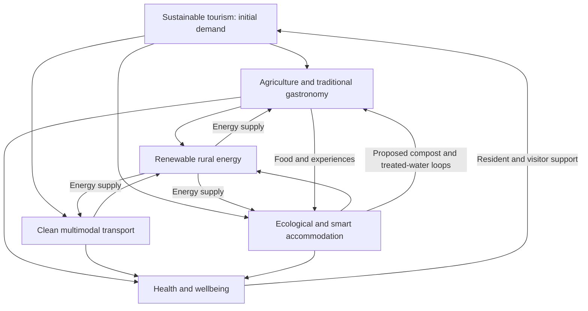

# Multisector Territorial Tourism Development Flow

**Editorial revision:** 7 October 2026.  
**Status:** translated and consolidated development concept; no implementation or measured impact is established by the source.

## Purpose and economic logic

The source proposes sustainable tourism as an initial demand driver connecting five strategic sectors: agriculture and gastronomy, transport, accommodation, energy, and health and wellbeing. Tourism would attract visitors and resources, while complementary innovation and circular resource flows would connect local producers and service providers.

The intended economic flow is visitor spending → accommodation, food, mobility and wellbeing services → local procurement, labor and infrastructure → territorial benefits and reinvestment. This is a conceptual model, not an input–output study, a financing plan or evidence of an economic multiplier. Tourism demand, local supply capacity and community priorities require evaluation for a defined territory.

## Integrated flow map

The original plaintext diagram is replaced by the following conceptual map. Arrows represent proposed relationships, not existing facilities or quantified flows.

## Four development phases

### Phase 1 — Inputs and production: agriculture and energy

**Precision agroecology and gastronomic tourism.** The proposal combines organic farming approaches and hydroponics to supply local hotels and restaurants through a farm-to-table network. These are proposed production options; hydroponics and organic certification are not treated as equivalent labels.

**Community added value.** Coffee routes, cacao routes and agritourism would turn traditional agricultural production into visitor experiences. The source envisages direct sales without intermediaries. Actual distribution arrangements, producer compensation and any intermediary costs remain to be defined.

**Decentralized renewable energy.** Agricultural and livestock organic residues would feed biogas facilities. Solar installations and micro-hydropower would supply farms and tourism establishments. The source supplies no resource assessments, designs, generation capacities or operating costs.

### Phase 2 — Connectivity and access: clean transport

**Electromobility and green infrastructure.** Electric vehicle fleets, pedal-assist bicycles and community buses powered by local clean energy would connect airports and terminals with accommodation and agritourism circuits.

**Multimodal logistics.** Integrated small-scale transport networks would move visitors and fresh agricultural supplies to hotels and local markets. Combined service planning is a proposal, not evidence that passengers and food can use the same vehicles or schedules without additional design.

The intended benefits are lower-emission access and improved community connectivity. Route demand, charging, vehicle availability, logistics requirements and operating costs remain open.

### Phase 3 — Hospitality and infrastructure: smart accommodation

**Bioclimatic architecture.** Lodges and hotels would use local materials selected for low impact and passive climate-control systems. Local origin alone does not demonstrate low environmental impact.

**Circular resource management.** Accommodation would use locally supplied clean energy, collect and treat greywater for a proposed agricultural-irrigation loop, and compost organic waste for local farmers. These loops require site-specific technical assessment before implementation; the source contains no water-quality, treatment or compost specifications.

**Home/building automation and IoT.** Real-time water and energy monitoring would support resource management and assessment of guest-related environmental impacts. Monitoring is an enabling capability, not proof that consumption or emissions have decreased.

### Phase 4 — Integrated experience and resilience: health and wellbeing

**Wellbeing tourism and holistic health.** The source proposes local medicinal-plant traditions, thermal spas, agroecological nutrition programs, and mental or spiritual wellbeing retreats. These are translated experience concepts, not substantiated medical treatments or clinical-benefit claims.

**Telemedicine and a medical support network.** Rural health centers would be strengthened through satellite connectivity and telemedicine to serve residents and visitors. The source's aspiration to high-quality coverage remains a goal requiring appropriate clinical providers, capacity and service evaluation. Leisure/wellbeing offers and clinical care need distinct responsibilities.

## Cross-sector innovation matrix

The innovations and returns below reproduce the source's proposed relationships. None of the stated benefits is a measured result.

| Sector | Proposed input or innovation | Tourism interaction | Intended territorial return |
| --- | --- | --- | --- |
| Agriculture | Agrotech, organic certification and interactive gardens | Food supply and experiential workshops | Local food security and recognition of agricultural work |
| Transport | Electromobility, scenic non-motorized routes and mobility apps | Convenient, lower-emission connections between tourism nodes | Less pollution and better community connectivity |
| Accommodation | Ecological construction, natural-building approaches and a zero-waste ambition | Comfortable, lower-impact lodging | Heritage enhancement and durable community infrastructure |
| Energy | Solar microgrids, biodigesters and local geothermal options | Intended operating-cost reductions and a carbon-neutrality ambition | Rural energy independence and electrification of isolated areas |
| Health | Preventive care, local herbal traditions and telemedicine | Wellbeing offers and supported travel environments | Intended improvements in local public-health services |

The energy matrix's geothermal option complements the solar, biogas and micro-hydropower proposals in phase 1. “Zero waste,” “carbon neutral,” energy independence and substantial health-service improvement are source ambitions, not certifications or demonstrated outcomes.

## Four proposed success indicators

The source names four KPIs without baselines, targets, calculation protocols or results. The definitions below are editorial operationalizations for a future pilot.

| Source KPI | Proposed measurement | Boundary and evidence needed |
| --- | --- | --- |
| Local input share | Regional food purchases / total tourism-related food purchases × 100 | Define the region, period and participating establishments. Use one consistent basis—expenditure or physical quantity—and disclose it; distinguish producer origin from supplier address |
| Renewable energy autonomy | Locally generated renewable energy serving accommodation and transport / their total energy demand × 100 | Use a consistent energy unit and period, include relevant fuels and electricity, and account for imports, storage and losses. An annual share alone does not establish off-grid autonomy |
| Tourist spending retention | Direct visitor expenditure retained by local workers, owners and suppliers, net of identified out-of-territory leakage / total visitor expenditure within the study scope × 100 | Define territorial ownership and procurement rules. Reconcile receipts and payments, avoid counting the same spending at every supply-chain transfer, and report indirect or induced effects separately |
| Territorial carbon-footprint reduction | Comparable baseline emissions minus measured scenario emissions, reported as tonnes of CO₂e per period | Set the same activity boundary and service level for both cases, disclose factors and uncertainty, and avoid double counting mobility, energy and waste reductions |

A negative carbon difference indicates an increase, not avoided emissions. No reduction percentage, financial return or emissions-saving estimate is supplied by this migration.

## Consolidation with JFXAI4MAD

This territorial model complements the project's [business model and KPIs](../business/business-model-and-kpis.md). It adds community procurement, energy, spending-retention and emissions questions; it does not replace service conversion, satisfaction or contribution-margin measures.

Related planning material:

- [Valles de Alborada hybrid residence](../product/valles-de-alborada-hybrid-residence.md)
- [Modern cooperative settlement evaluation](modern-cooperative-settlement-evaluation.md)
- [Inter-university rural-development collaboration](../interuniversity-rural-development-collaboration-framework.md)
- [Peru–Brazil and Brazil–Paraguay integration corridors](../research/tourism/peru-brazil-paraguay-integration-corridors.md)
- [Implementation and investment roadmap](../roadmap/implementation-and-investment.md)

A future pilot would select a territory and participating organizations, document demand and existing services, assign owners to each proposed flow, establish KPI baselines, and assess a bounded intervention before expansion. These steps are editorial planning suggestions, not completed work.

## Provenance and editorial scope

[Migration entry 50](../ANNEX-DOCS-CONSOLIDATED.md#10-complete-migration-and-translation-register) maps the Spanish source retained in Git history. This document preserves the demand-driver premise, five sectors, four phases, all five matrix rows and four original KPIs. The broken plaintext map is replaced with Mermaid; flattened prose and matrix content are normalized into English Markdown.

The KPI formulas and measurement boundaries are editorial additions. No external market study, clinical evidence review, engineering feasibility study, certification assessment or impact evaluation was performed in this documentation migration.

- [Strategy index](README.md)
- [Documentation index](../README.md)
- [Consolidated annex](../ANNEX-DOCS-CONSOLIDATED.md#19-multisector-territorial-tourism-development-flow)
