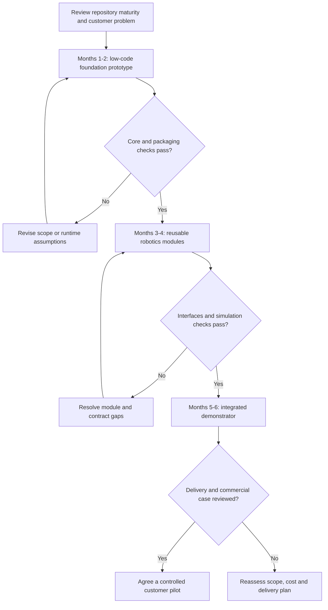
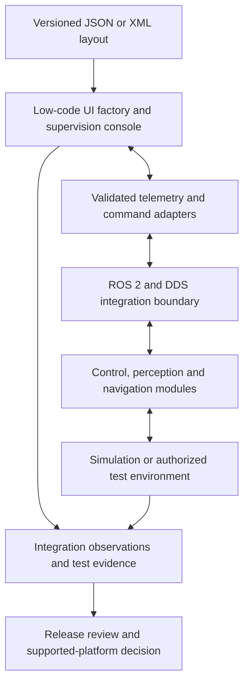

# Portfolio Prioritization and Delivery Plan

[Documentation index](../README.md) · [Strategy index](README.md)

## Purpose and status

This proposal coordinates reusable low-code and robotics work across the personal
`sdk2035` portfolio and the `robotics-intelligent-systems` organization. It is a
portfolio planning scenario, separate from JFXAI4MAD's product-delivery and
Odoo/Flectra migration tracks. Priorities, staffing and economic impacts require
review against actual repository maturity and customer evidence.

## Contents

- [Initial Prioritization Matrix](#initial-prioritization-matrix)
- [Six-Month Planning Scenario](#six-month-planning-scenario)
- [Integration Architecture](#integration-architecture)
- [Resource and Economic Assumptions](#resource-and-economic-assumptions)
- [Decision Gates](#decision-gates)

## Initial Prioritization Matrix

| Priority | Focus | Draft complexity | Reuse hypothesis | Economic hypothesis |
| --- | --- | --- | --- | --- |
| P1: foundation | [JFXLCDP](https://github.com/sdk2035/jfxlcdp) low-code platform and core SDK | Medium–high | Dynamic UI and B2B application generation across projects | Shorter delivery effort after the core is validated |
| P2: strategic integration | Robotics and intelligent-systems modules | High | Control, perception, navigation, inspection and ROS 2 integration | Industrial integration and software-service opportunities |
| P3: sustaining tools | Supporting libraries and specialized modules | Low–medium | Shared utilities and delivery support | Internal operational efficiency |

Reassess priority using customer value, implementation evidence, dependencies,
engineering effort and maintenance cost. A label such as “high return” in the
source draft is not a financial forecast or a reason to bypass technical gates.

## Six-Month Planning Scenario

| Phase | Indicative window | Work | Reviewable deliverable |
| --- | --- | --- | --- |
| 1. Low-code foundation | Months 1–2 | Evaluate JSON/XML metadata and dynamic UI generation; prototype REST/GraphQL/gRPC adapters; assess `jpackage` and Native Image packaging | Reproducible sample UI, contract tests and packaging feasibility report |
| 2. Robotics modules | Months 3–4 | Isolate reusable control, perception and navigation modules; define ROS 2/DDS interfaces; prototype sensor-processing flows for inspection or logistics | Versioned module contracts and simulation-based integration evidence |
| 3. Convergence and delivery | Months 5–6 | Combine telemetry/control adapters with low-code HMI/SCADA-style templates; assess CI/CD for Windows, Linux and selected embedded targets | End-to-end demonstrator, supported-platform matrix and a reviewed commercial proposal |

The windows are an inherited planning scenario. Failed gates change the schedule;
no existing production implementation or six-month commitment is implied.

## Integration Architecture

Presentation components should depend on documented interfaces instead of robotics
implementation details. Validate authorization, units, timing and command limits
before any physical-system integration. The diagram is a target architecture, not
a claim that these connections already exist.

## Resource and Economic Assumptions

The draft proposes a six-month team of two software/JavaFX engineers, two
robotics/ROS engineers and one DevOps/cloud engineer. Treat this as a staffing
scenario; availability, rates, support obligations and required specialists are
not established.

| Inherited figure or proposal | Status | Evidence needed |
| --- | --- | --- |
| 40–60% reduction in development time | Unverified low-code hypothesis | Comparable tasks, baseline hours, quality/rework and sample size |
| Approximately 50% reduction in client-project development cost | Unverified economic hypothesis | Consistent costing of engineering, hosting, integration and maintenance |
| SaaS/enterprise automation and advanced-education offerings | Potential revenue lines | Customer interviews, scoped pilots and unit economics |
| Open-core/enterprise or dual licensing | Commercial options, not approved terms | License inventory, ownership/rights review and support model |

Measure reusable-component setup costs separately from per-project savings.
Report unsuccessful integrations and maintenance effort alongside improvements.
Do not treat development-time savings as equivalent to revenue, margin or ROI.

## Decision Gates

1. **Foundation:** choose a small reproducible use case and document runtime limits.
2. **Integration:** prove contract compatibility through fixtures and simulation.
3. **Deployment:** list supported platforms and exercise packaging and rollback.
4. **Commercial:** validate delivery capacity, costs, licensing and customer demand.

Use the [presales demonstrator plan](lean-presales-demonstrator-plan.md) to communicate
validated scope. JFXAI4MAD's [implementation roadmap](../roadmap/implementation-and-investment.md)
remains the source for its own product phases and migration decisions.

Source mapping is recorded in the [migration register](../ANNEX-DOCS-CONSOLIDATED.md#10-complete-migration-and-translation-register).
