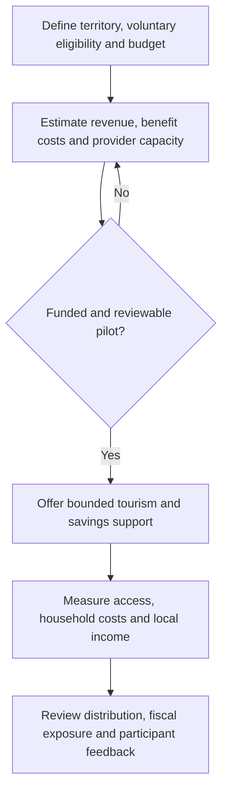

# Tourism and Young-Household Incentives

**Status:** translated policy concept; no enacted benefit, funded program or demonstrated demographic effect is established.

## Premise and scope

The draft proposes a Sovereign Tourism and Family Development incentive program (TDF), named “Routes of Integration and Family Futures.” It frames structural poverty associated with colonial legacies as a contributor to population decline and proposes tourism in BRICS-related and Global South economies as a means of supporting young households, housing access and family capital. This causal framing is the source's premise, not a demographic finding. The proposed bloc is not a defined administrative or eligibility area.

## Operating and financing instruments

| Source instrument | Proposed design | Unspecified implementation questions |
| --- | --- | --- |
| Community honeymoon voucher | A government demographic-promotion fund covers **40% of trip cost** for domestic or participating-country packages | Eligible cost, household cap, budget, additional demand and distribution of benefits |
| “Tourism That Builds” housing savings | For each qualifying couple's trip, the state contributes a percentage to first-home down-payment savings or family-enterprise microcredit | Matching percentage, contribution base, account ownership, withdrawal rules and credit risk |
| Young-household tax exemption | Tourism taxes and airport or overland transport charges waived for newly married couples **under 35**, during the **first two years of marriage** | Authority to waive each charge, treatment of partners of different ages and eligibility verification |

The figures are proposed parameters, not existing entitlements or evaluated optimal rates. The draft identifies lack of initial capital and housing as central obstacles; it supplies no household survey or affordability model.

## Infrastructure and social capital

| Action | Proposed mechanism | Intended outcome |
| --- | --- | --- |
| Family tourism circuits | Priority concessions for local young married couples operating guiding, gastronomy and lodging enterprises | Stable income and reduced employment insecurity |
| Social residences and eco-lodges | State hotel capacity used off-season for family stays and workshops on household economics, entrepreneurship and reproductive health | Affordable recreation without excessive household costs |
| Sovereign bloc travel pass | Bilateral arrangements offering reduced transport and accommodation prices | Regional identity and affordable international mobility |

These are objectives, not proven results. The travel-pass name does not establish a passport, visa exemption or border right.

## Three progressive stages

1. **Young marriage:** honeymoon voucher and participating-region transport discounts.
2. **Economic consolidation:** preferential **zero-interest** loans for couple-operated rural-tourism or craft enterprises.
3. **Family growth:** expanded transport and holiday subsidies, described as “Integrated Family Tourism,” as the household grows.

Editorial design questions include voluntary participation, access across household types, transparent eligibility, and evaluation of whether staged benefits create unwanted pressure on marriage or reproductive decisions. These additions do not alter the source's proposed marriage-based sequence.

## Funding hypothesis and evaluation

The source proposes redirecting part of taxes on high-spending international luxury tourism into local young-household subsidies. Public–private agreements with regional airlines and hotel chains would use spare shoulder- and low-season capacity.

The draft claims this can avoid a fiscal deficit, but supplies no revenue forecast, expenditure ceiling or contingent-liability estimate. Zero-interest credit has a funding cost; discount agreements do not establish public savings. A pilot budget should separately account for vouchers, tax expenditure, savings matches, credit subsidies, administration and partner contributions.

The workflow is an editorial addition. Measure participation, net household cost, savings retained, enterprise survival and local supplier revenue against a defined baseline; do not infer demographic causation from package sales.

## Provenance and related documents

Migration entry **51** in the [consolidated register](../ANNEX-DOCS-CONSOLIDATED.md#10-complete-migration-and-translation-register) records the original preserved in Git history at commit `bb8369643328864f471f4fc1308622d1348f38f7`. All instruments, percentages, age/time thresholds, infrastructure rows, stages and funding channels are retained. Evaluation questions are editorial additions; no legal, fiscal or demographic validation was performed.

- [Territorial tourism development](multisector-territorial-tourism-development-flow.md)
- [Business model and KPIs](../business/business-model-and-kpis.md)
- [Requirements and consent](../product/requirements-and-consent.md)
- [Strategy index](README.md)
- [Documentation index](../README.md)
