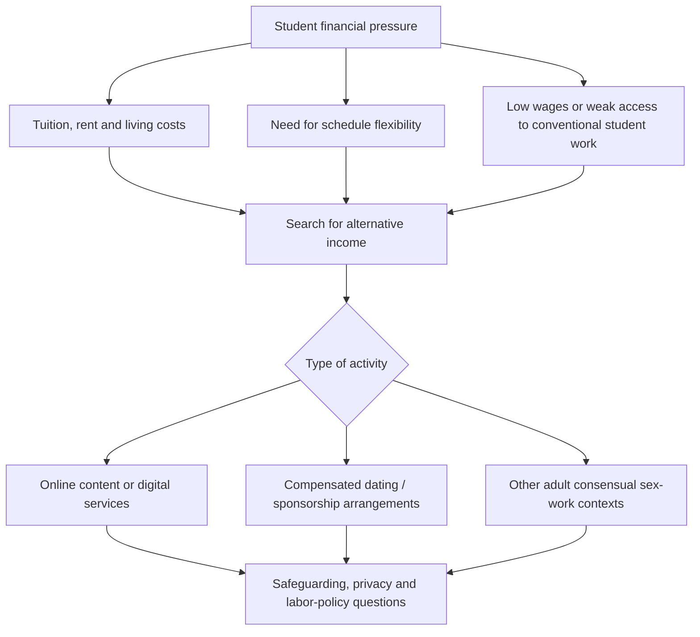

# Student Sex Work and Sugar Dating: Regional Socioeconomic Analysis

> **Editorial status:** translated and refactored from an additional Spanish plaintext research note. The percentages and prevalence claims inherited from the source are not independently verified here and must be checked against current peer-reviewed or official evidence before publication or policy use.

## 1. Scope

This note examines reported forms of **adult student sex work**, monetized sexual content and compensated dating or sponsorship arrangements in university contexts across North America, Europe and Latin America.

The subject should be approached as a socioeconomic, public-health, safeguarding and student-welfare issue. It must not be used to identify, recruit, solicit or target individual students, and it should not conflate consensual adult activity with trafficking, coercion, exploitation or sexual violence.

## 2. Regional contexts described in the legacy source

### 2.1 North America

The source associates participation primarily with:

- high tuition and student-debt burdens;
- metropolitan housing and living costs;
- demand for flexible income compatible with class schedules;
- migration toward online or indoor channels, including subscription content and compensated-dating platforms.

The original note cites a **3–5%** range for university students who may have participated in some form of monetized sexual content or service. This figure requires source-level verification because studies use different populations, definitions and sampling methods.

### 2.2 Europe

The source emphasizes:

- high housing costs in university cities;
- precarious or low-paid part-time employment;
- online forms of monetized content or compensated companionship;
- student-union and NGO harm-reduction responses in some jurisdictions.

The legacy note refers to research in the United Kingdom and a figure near **5%** for students who had considered or participated in sex-industry or compensated-arrangement activity. This must not be generalized across Europe without validating the study population and definition used.

### 2.3 Latin America

The source highlights:

- socioeconomic inequality;
- labor informality;
- limited scholarship, transport or housing support in some settings;
- a mixture of digital channels and informal financial-support relationships;
- potentially greater exposure to stigma, extortion, coercion and trafficking risks where institutional support is weak.

No regional prevalence estimate should be inferred from this narrative without robust country-level evidence.

## 3. Common socioeconomic drivers

The legacy source treats three recurring pressures as important: debt and cost of living, schedule flexibility, and barriers in conventional student employment.

## 4. Digital normalization and risk perception

Online intermediation can lower the perceived barrier to entry because it reduces some forms of immediate in-person exposure and may offer flexible hours. It does **not** eliminate risks. Relevant concerns include:

- privacy and doxxing;
- image or content redistribution;
- financial fraud;
- coercion and blackmail;
- unsafe offline transitions;
- platform-policy violations;
- academic or workplace stigma.

## 5. Institutional response framework

Universities and student-support organizations can address the issue without moralizing or attempting to identify participants individually.

Recommended areas include:

1. confidential financial-aid and hardship support;
2. housing, food and transport assistance;
3. digital-privacy and cybersecurity education;
4. sexual-health and violence-prevention services;
5. trafficking and coercion referral pathways;
6. non-discriminatory counseling and academic support;
7. transparent campus policies that distinguish consensual adult conduct from exploitation and criminal abuse.

## 6. Evidence and safeguarding requirements

Any future publication should:

- state the exact survey population, date and definition of sex work or compensated dating;
- avoid extrapolating single-campus studies to a country or region;
- distinguish participation from merely considering participation;
- separate consensual adult activity from trafficking and coercion;
- avoid inferring participation from age, income, university, appearance, nationality or online profile;
- use current legal and institutional sources for each jurisdiction.
